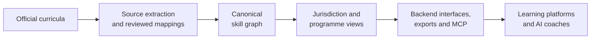

# SkillPilot — Open curriculum infrastructure for AI-supported learning

SkillPilot provides an open pipeline for transforming officially published curricula into dependency-aware, machine-readable skill graphs, with provenance and mapping evidence kept alongside them. Learning platforms and AI systems can use those graphs for curriculum-aligned learning paths, mastery tracking, and learning support.

The curriculum-processing pipeline and skill-graph model form the infrastructure. The SkillPilot web application and its MCP-based learning coach are reference implementations: platform operators can build their own interfaces, learning workflows, and AI integrations on the same curriculum-aware foundation.

SkillPilot is open source. Its core architecture is intended to remain independent of any single model provider or chat host.

## Who is SkillPilot for?

### Learning-platform builders

Developers and operators can evaluate or reuse the curriculum data, graph semantics, projections, validation and export tooling, and documented integration contracts in their own systems. They do not have to adopt the SkillPilot user interface or reference coach.

### Curriculum authorities and public institutions

Public-sector teams can inspect official-source references, retained source extractions, source-to-goal mappings, jurisdiction-specific views, review decisions, and generated quality evidence. These artifacts support technical and subject-matter review; they do not represent approval by a public authority.

### Curriculum experts and open-source contributors

Curriculum Champions, subject experts, developers, designers, and reviewers can improve mappings, learning routes, review evidence, tooling, and the reference experiences through the repository's documented contribution and QA processes.

### Learners and teachers using the reference application

Learners and teachers can use the hosted reference application to explore skill graphs, record learning state, and work from the next eligible goals. The [Reference learner experience](#reference-learner-experience) also documents the MCP-based coach and its current release boundary.

## What this repository provides

### Core infrastructure

- **Canonical curriculum-backed skill graphs:** machine-readable goals connected by `contains` and `requires` relationships.
- **Source provenance and mappings:** source-extraction snapshots, official-source references, source-to-goal mappings, and review artifacts.
- **Jurisdiction and programme projections:** composition views that define learner-facing scopes without duplicating the canonical goals.
- **Dependency and learning-route modeling:** graph semantics for prerequisites, mastery-aware frontiers, and routes towards terminal application or assessment.
- **Curriculum packages and export pipelines:** validation and tooling for publication, interchange, and package workflows whose readiness limits are documented explicitly.
- **Machine-enforced QA and CI:** graph, mapping, projection, route, review, package, and release checks, together with generated audit artifacts.
- **Backend and integration interfaces:** backend-owned learning-state workflows and documented contracts, including MCP-based access for AI applications.

### Reference implementations

- **SkillPilot web application:** a first-party cockpit for curriculum selection, graph navigation, mastery state, and learning workflows.
- **AI learning coach:** an MCP-based reference coach that connects a learner's curriculum position and learning state to an AI conversation.

These parts have different assurance and release boundaries. Follow the linked architecture, package, QA, and deployment documentation for the exact guarantees of each part.

## How it works

1. **Capture source evidence.** Official curriculum documents are referenced and processed into retained source structures.
2. **Build and review the canonical graph.** Source goals are mapped to stable goals; `contains` expresses composition and `requires` expresses prerequisite direction.
3. **Project a programme view.** Composition views select the goals applicable to a jurisdiction, school stage, duration model, or course profile.
4. **Serve platform workflows.** Export tooling, backend workflows, and MCP make the model available to learning applications and AI coaches under their respective readiness and release gates.

The detailed processing view below shows the conversion from source curricula to a canonical JSON skill graph:

## Current scope and maturity

The repository currently focuses on German Gymnasium curricula. Subject coverage, jurisdiction views, warnings, and maturity can change independently, so the source of truth is the [generated curriculum quality status](docs/qa-ci/status/curriculum-quality-status.md); this README does not duplicate those changing values. Incomplete source or mapping coverage remains visible in generated QA instead of being presented as complete.

**Quality assurance is checked, not claimed.** The cumulative M0–M7 maturity levels describe defined technical and review gates within SkillPilot. In brief, M5 covers the configured core QA gates, M6 additionally checks the optional memory layer, and M7 additionally checks the optional learning-goal visualization layer and its human approvals. Read the [full maturity definitions and limits](docs/qa-ci/curriculum-quality-maturity-and-routes.md). These levels do not constitute approval or certification by a curriculum authority.

> SkillPilot is an independent open-source mapping of officially published curricula. It is not an official curriculum publication; the original documents remain authoritative. See [LEGAL.md](LEGAL.md).

## Explore SkillPilot

- [Architecture and concepts](docs/concept/index.md)
- [Curriculum model](docs/concept/skill-graph/graph-definition.md) and [processing pipeline](docs/production-pipelines/skill-graph.md)
- [Source provenance and mappings](docs/qa-ci/curriculum-mapping-workbench.md)
- [Jurisdiction and programme projections](docs/concept/skill-graph/view-projection-and-goal-placement.md)
- [Curriculum packages and export pipelines](docs/production-pipelines/index.md)
- [Current curriculum quality](docs/qa-ci/status/curriculum-quality-status.md)
- [Integration and runtime workflows](docs/concept/runtime-workflows/learning-workflow.md)
- [Provider-neutral coach boundary](docs/concept/runtime-workflows/provider-neutral-coach-boundary.md)
- [Deployment](docs/deploy/deployment.md)
- [Security and privacy](docs/security/data-privacy.md)
- [Legal and AI transparency](docs/legal/index.md)
- [Contributing](CONTRIBUTING.md)
- [Whitepaper](https://skillpilot.com/whitepaper/en)
- [Reference learner experience](#reference-learner-experience)

## Reference learner experience

### Reference web application

The hosted application demonstrates how the infrastructure can support a learner-facing cockpit and curriculum-aware workflows.

- [Open the live application](https://skillpilot.com)
- [Schnellstart (Deutsch)](https://skillpilot.com/quickstart/de)
- [Quickstart (English)](https://skillpilot.com/quickstart/en)

The learner comic introduces the reference experience in story form:

### MCP-based SkillPilot Coach

The reference coach uses MCP to connect the learner's current curriculum scope and backend-owned learning state to an AI conversation. The current adapter targets ChatGPT and has been submitted for review; it is not yet approved or published. ChatGPT is the reference host, not the boundary of SkillPilot Core.

The documented architecture separates Core, chat host, and model provider. Support for another host depends on that host's MCP, authentication, tool, UI, and privacy capabilities and on completing the corresponding integration and release gates; no additional production integration is implied. See the [provider-neutral boundary](docs/concept/runtime-workflows/provider-neutral-coach-boundary.md), the [OpenAI MCP reference documentation](docs/deploy/openai-mcp-coach-v1.md), and the [current review status](docs/deploy/openai-plugin-v1-review-freeze.md).

## Contribute

### Curriculum experts and Champions

Choose a curriculum, inspect it as a learner or subject expert, and improve goals, mappings, routes, and review evidence. Start with the [Curriculum Champions page](https://skillpilot.com/curricula) and the [Champion Guide](docs/qa-ci/champion-guide.md).

### Developers and designers

[CONTRIBUTING.md](CONTRIBUTING.md) covers the toolchain, local setup, large-asset handling, and validation expected before a pull request. Use the [issue tracker](https://github.com/enpasos/skillpilot/issues) for bugs and proposals.

## Legal, security and AI transparency

- [Legal notice and curriculum-source boundary](LEGAL.md)
- [Security and privacy documentation](docs/security/index.md)
- [Legal and AI transparency documentation](docs/legal/index.md)
- [Machine-readable AI transparency inventory](docs/legal/ai-transparency-inventory.json)

## Project background

SkillPilot is the open-source technical reference implementation associated with Aifyer's German-language concept of [AI-supported learning guidance](https://aifyer.com/ki-lernbegleitung/). The concept provides background and motivation; the repository documentation and generated QA artifacts define the implemented architecture and its current limits.

For a longer project introduction, read the [English whitepaper](https://skillpilot.com/whitepaper/en) or the [German whitepaper](https://skillpilot.com/whitepaper/de).

## License

The SkillPilot software is licensed under the [Apache License 2.0](LICENSE). Curriculum sources and mapped content have separate legal considerations described in [LEGAL.md](LEGAL.md).
