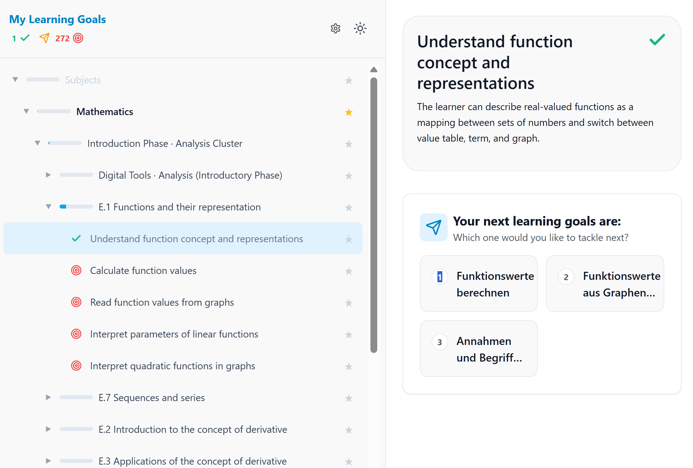

# SkillPilot – Your Personal Learning Navigator

Turn an official curriculum into a dependency graph of skills, then let learners walk it with an AI coach that always knows the next sensible step.

- **Skill graphs built from official curricula.** Every learning goal traces back to the published source it came from.
- **An AI learning coach** that runs inside ChatGPT through MCP and works from the learner's real position in the graph.
- **Quality assurance that is checked, not claimed.** Sources, mappings, state views, graph invariants, and reviews are enforced in CI.

**Coverage today:** German Gymnasium — Mathematik, Physik, Chemie, Biologie, Informatik, Deutsch, Geschichte, Latein, Politik und Wirtschaft, and Wirtschaftswissenschaften, quality-assured nationwide up to level M6. Other regions and school types are not covered yet. The [generated quality status](https://enpasos.github.io/skillpilot/qa-ci/status/curriculum-quality-status/) shows the current level per subject.

This project is an invitation to the community to jointly build and bring to life a secure platform for skill landscapes—a shared home where learners, educators, curriculum institutions, and supporting AIs alike can thrive.

## Who is this for?

- **Learners & teachers:** Start with the Schnellstart/Quickstart and the live app.
- **Curriculum champions:** Keep curricula practical and up to date via the Champions program.
- **High-level overview (institutions, ministries, etc.):** Get the big picture via the Whitepaper.
- **Developers & designers of SkillPilot:** Dive into the technical docs and UI/UX.

Quick links:
*   [Schnellstart (DE)](https://skillpilot.com/quickstart/de)
*   [Quickstart (EN)](https://skillpilot.com/quickstart/en)
*   [Curricula / Champions](https://skillpilot.com/curricula)
*   [Whitepaper](https://skillpilot.com/whitepaper/en)

## How it works

SkillGraph Processing structures curricula and competence models into dependency-aware skill landscapes that can be validated, explored, and used by humans or AI agents.

SkillPilot Learning Coach guides learners through those landscapes with frontier-based next steps, mastery tracking, and contextual learning-coach support.

## Contribute as a Curriculum Champion

The primary way to contribute is to become a **Curriculum Champion**:
*   Pick a curriculum and make it work in practice.
*   Work through the goals as a learner.
*   Improve content and tooling via issues and pull requests.

Start here: [skillpilot.com/curricula](https://skillpilot.com/curricula)

More details: [Champion Guide](https://enpasos.github.io/skillpilot/qa-ci/champion-guide/)

## Contribute as a Developer or Designer

[CONTRIBUTING.md](CONTRIBUTING.md) covers the toolchain, how to clone without pulling gigabytes, how to run the app locally, and the checks to run before opening a pull request.

Report issues and submit PRs at [github.com/enpasos/skillpilot/issues](https://github.com/enpasos/skillpilot/issues).

## 📚 Documentation

Docs are organized by intent: concept foundations, runtime workflows, pipelines, QA/CI, deployment, dev references, and security.

The full documentation is available here:

*   [**SkillPilot Documentation**](https://enpasos.github.io/skillpilot/)

## 📚 Whitepaper

For a detailed introduction and the vision behind SkillPilot, please refer to the Whitepaper:

*   [**Read Whitepaper (English)**](https://skillpilot.com/whitepaper/en)
*   [**Whitepaper lesen (Deutsch)**](https://skillpilot.com/whitepaper/de)

## Legal and AI transparency

SkillPilot models the structure of officially published curricula; it does not reproduce teaching materials. See [LEGAL.md](LEGAL.md) for the licensing and copyright position, and [Legal and AI transparency](https://enpasos.github.io/skillpilot/legal/) for the EU AI Act compliance record and the machine-readable AI transparency inventory.

## Hintergrund: das Aifyer-Konzept „KI-Lernbegleitung“

> **Hinweis für Leser:innen des Aifyer-Konzepts [„KI-Lernbegleitung“](https://aifyer.com/ki-lernbegleitung/):**
> SkillPilot ist die technische Referenzimplementierung zu diesem Konzept: eine offene Implementierung curriculumsgestützter KI-Lernbegleitung entlang schulischer Lehrpläne. Für das deutsche Gymnasium sind Mathematik, Physik, Chemie, Biologie, Informatik, Deutsch, Geschichte, Latein, Politik und Wirtschaft sowie Wirtschaftswissenschaften bundesweit bis M6 qualitätsgesichert.
>
> **M5** steht für eine automatisiert geprüfte Phase-1-Qualitätssicherung von Quellen, Mapping, Bundesland-Sichten, SkillPilot-Zielen, Graph-Invarianten, Composition Views und technischer QA, ohne offene Fehler. **M6** ergänzt den geprüften Memory-Layer: Für jedes atomare Lernziel ist die Karten-Entscheidung fachlich zurückverfolgbar. Nun folgt die fachliche Prüfung durch SkillPilot Champions. Die Skill-Landschaften sind bereits mit dem SkillPilot Lerncoach nutzbar; weitere Fächer werden schrittweise ergänzt.
>
> Den jeweils aktuellen Stand je Fach zeigt der [generierte Qualitätsstatus](https://enpasos.github.io/skillpilot/qa-ci/status/curriculum-quality-status/).

## 🌐 Live

Visit us at **[skillpilot.com](https://skillpilot.com)**.
