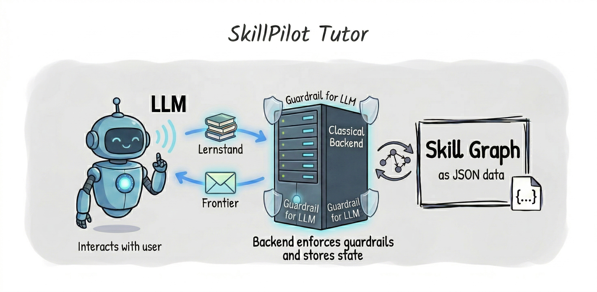

# SkillPilot – Your Personal Learning Navigator

> **Hinweis für Leser:innen von [Aifyer](https://aifyer.com/ki-lernbegleitung/):**
> SkillPilot ist die Referenzimplementierung zum Konzept einer schulisch verantworteten KI-Lernbegleitung entlang der Lehrpläne.
> Für Mathematik am deutschen Gymnasium bildet SkillPilot die Lehrpläne aller 16 Bundesländer als Source-Extraction und bundeslandspezifische Sichten auf ein gemeinsames kanonisches Curriculum ab; aktuell arbeiten wir an der Qualitätssicherung.
> Physik ist der nächste fachliche Schwerpunkt.

SkillGraph Processing structures curricula and competence models into dependency-aware learning landscapes that can be validated, explored, and used by humans or AI agents.

 

SkillPilot Tutor guides learners through those landscapes with frontier-based next steps, mastery tracking, and contextual tutoring support.

SkillPilot navigates you through complex learning landscapes, modeling curricula as a dependency graph to provide personalized learning paths and track your mastery.

This project is an invitation to the community to jointly build and bring to life a secure platform for learning landscapes—a shared home where learners, educators, curriculum institutions, and supporting AIs alike can thrive.

 

## Who is this for?

- **Learners & teachers:** Start with the Schnellstart/Quickstart and the live app.
- **Curriculum champions:** Keep curricula practical and up to date via the Champions program.
- **High-level overview (institutions, ministries, etc.):** Get the big picture via the Whitepaper.
- **Developers & designers of SkillPilot:** Dive into the technical docs and UI/UX.

Quick links:
*   [Schnellstart (DE)](https://skillpilot.com/quickstart/de)
*   [Quickstart (EN)](https://skillpilot.com/quickstart/en)
*   [Curricula / Champions](https://skillpilot.com/curricula)
*   [Whitepaper](https://skillpilot.com/whitepaper/en)

## Contribute as a Curriculum Champion

The primary way to contribute is to become a **Curriculum Champion**:
*   Pick a curriculum and make it work in practice.
*   Work through the goals as a learner.
*   Improve content and tooling via issues and pull requests.

Start here: [skillpilot.com/curricula](https://skillpilot.com/curricula)  
More details: [Champion Guide](https://enpasos.github.io/skillpilot/qa-ci/champion-guide/)

## Contribute as a Developer or Designer
Report issues and submit PRs at [github.com/enpasos/skillpilot/issues](https://github.com/enpasos/skillpilot/issues).

## 📚 Documentation

Docs are organized by intent: concept foundations, runtime workflows, pipelines, QA/CI, deployment, dev references, and security.

The full documentation is available here:

*   [**SkillPilot Documentation**](https://enpasos.github.io/skillpilot/)

## 📚 Whitepaper

For a detailed introduction and the vision behind SkillPilot, please refer to the Whitepaper:

*   [**Read Whitepaper (English)**](https://skillpilot.com/whitepaper/en)
*   [**Whitepaper lesen (Deutsch)**](https://skillpilot.com/whitepaper/de)

## 🌐 Live 

Visit us at **[skillpilot.com](https://skillpilot.com)**.
