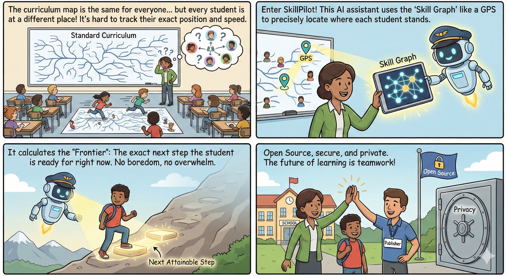
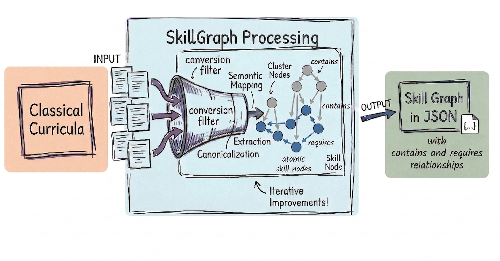
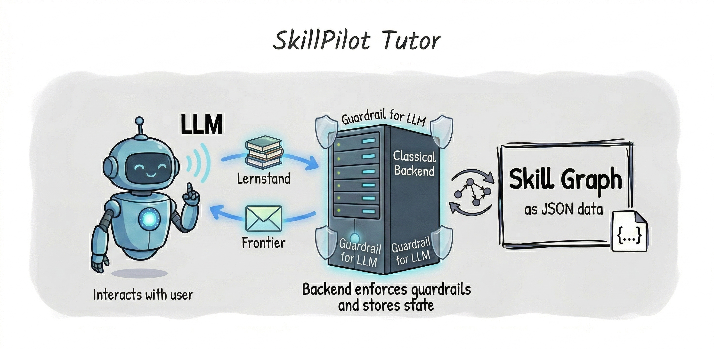
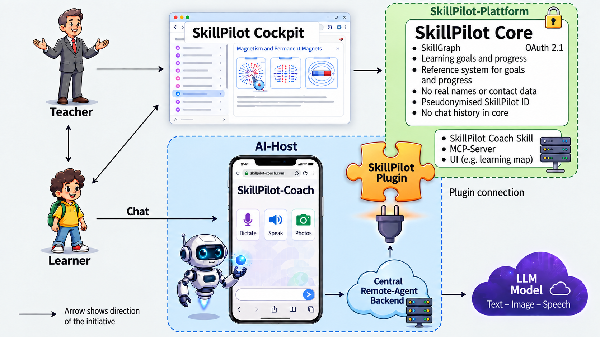

# SkillPilot

### Every learner has a next step. Make it visible.

Open-source curriculum infrastructure for learning platforms and AI coaches.

[Explore SkillPilot](https://skillpilot.com) · [Documentation](https://enpasos.github.io/skillpilot/) · [Contribute](https://enpasos.github.io/skillpilot/#contribute)

Software: [Apache-2.0](LICENSE) · Own learning content: [CC BY 4.0](LICENSES/CC-BY-4.0.txt) · [Licensing scope](LICENSING.md)

## Learn with an AI coach

The ordinary learning start offers **Claude**, **ChatGPT Desktop (Beta)** and **Gemini (Beta)** with separate provider sessions and the same saved learning record. Follow the [quickstart](https://enpasos.github.io/skillpilot/quickstart/story.en/) and [coach setup guides](https://skillpilot.com/plugins).

Gemini currently has a controlled integration route for a privately configured operator account in Gemini Web. Native Skill import, learning-context tools, saved progress and continuation in a new chat were tested; public onboarding, additional accounts, mobile and voice remain unconfirmed. Learning-goal images work through a direct link; embedded display has not been observed. See the [Gemini guide](https://skillpilot.com/plugins#gemini) and [integration runbook](docs/deploy/gemini-integration.md) for setup and the limits of the evidence. A backend deployment alone does not activate Gemini.

## From published curricula to connected learning goals

How it works

### AI learning coach

### System architecture

---

Our software and technical infrastructure are available under [Apache 2.0](LICENSE). Our own skill-landscape content—including curriculum data, tasks, learning cards, curated annotations, educational images, and whitepapers—is available under [CC BY 4.0](LICENSES/CC-BY-4.0.txt), to the extent we can grant the necessary rights. Third-party materials and private user data are not covered by these grants; see the [licensing scope](LICENSING.md).

[Apache 2.0](LICENSE) · [CC BY 4.0](LICENSES/CC-BY-4.0.txt) · [Licensing scope](LICENSING.md) · [Legal](LEGAL.md) · [Security](docs/security/index.md)
