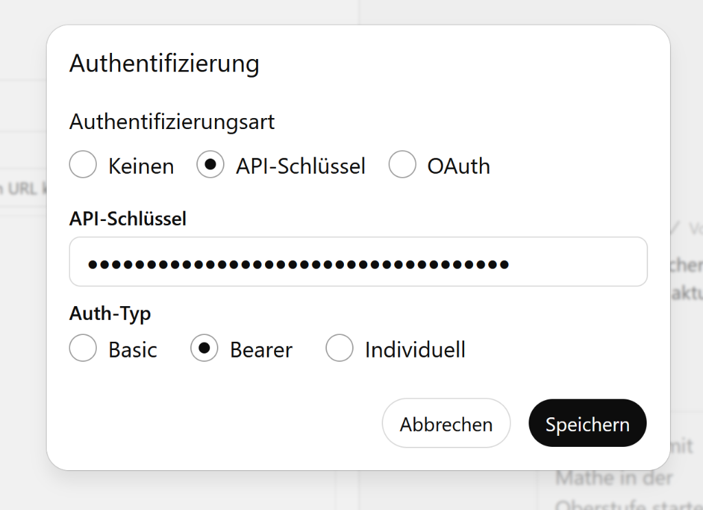

# GPT API Configuration

To enable GPT integration, you need to configure the API Key security settings in the interface.

## Configuration Steps

1.  **Authentifizierung (Authentication)**: Select **API-Schlüssel** (API Key).
2.  **API-Schlüssel (API Key)**: Enter your configured secure API Key.
3.  **Auth-Typ (Auth Type)**: Select **Bearer**.

