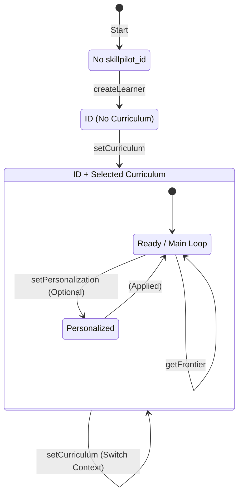

# Learner State Machine

## Reflection on Implementation Alignment

This document compares the visual state machine diagram with the current backend implementation in `LearnerService.java`.

### ✅ Alignment

The implementation largely matches the flow depicted in the diagram:

1.  **Initialization**:
    - `createLearner` transitions the state from **"no skillpilot_id"** to **"ID but no selected_curriculum"**.

2.  **Mandatory Curriculum**:
    - If no curriculum is selected, the `nextAllowedActions` field in the API response strictly returns `['updateCurriculum']`.
    - This enforces the transition from **State 2** to **State 3** ("ID + selected_curriculum").

3.  **The Core Loop**:
    - Once a curriculum is selected, the core actions (`setScope`, `upsertMastery`, `getLearnerState`) become available, matching the loop at the bottom of the diagram.

### 💡 Observation: Personalization Flexibility

The diagram depicts a linear path:
`Select Curriculum` → `Personalize` → `Main Loop`

The current code implementation is **more flexible**:

-   **Optional Personalization**: Once a curriculum is selected, `nextAllowedActions` includes `['personalize', 'setScope', 'getFrontier', ...]`.
-   This means the AI Agent *can* choose to personalize (State 3 → 4), but it is not forced to. It can skip directly to setting a scope or starting the teaching loop (State 3 → Loop).
-   **Context Switching**: The `updateCurriculum` action can be called at any time (from State 3 or 4) to switch context. The code supports this, effectively resetting the "active" personalization context (since personalization is stored per-landscape).

### Conclusion

The implementation supports the strict flow shown in the diagram but allows for an optimized path where personalization is optional, providing greater flexibility for the AI Agent.
