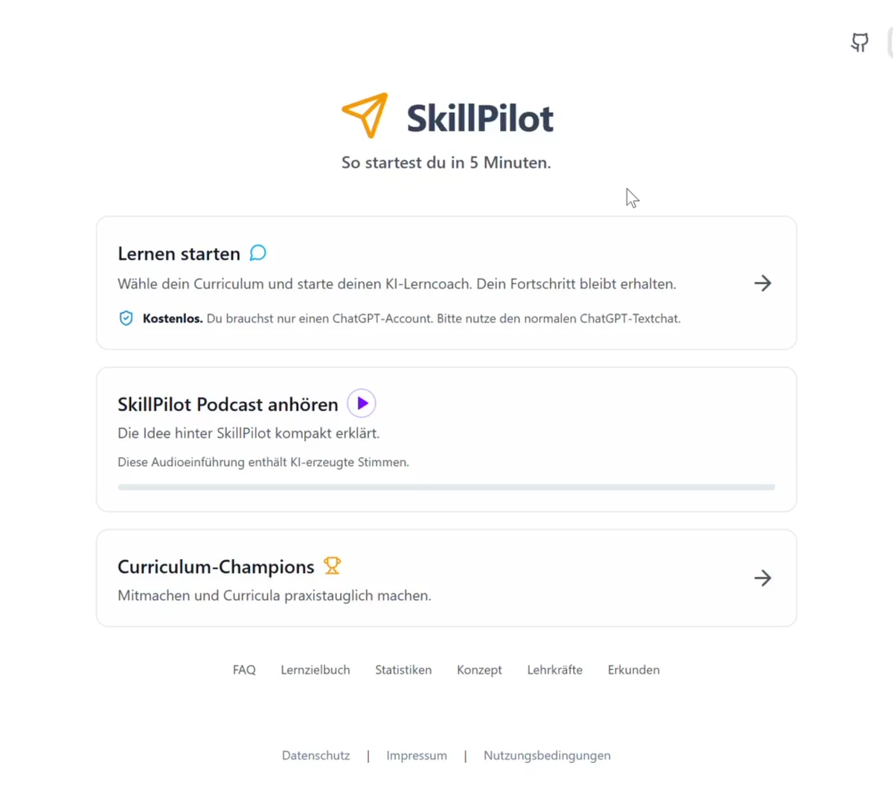
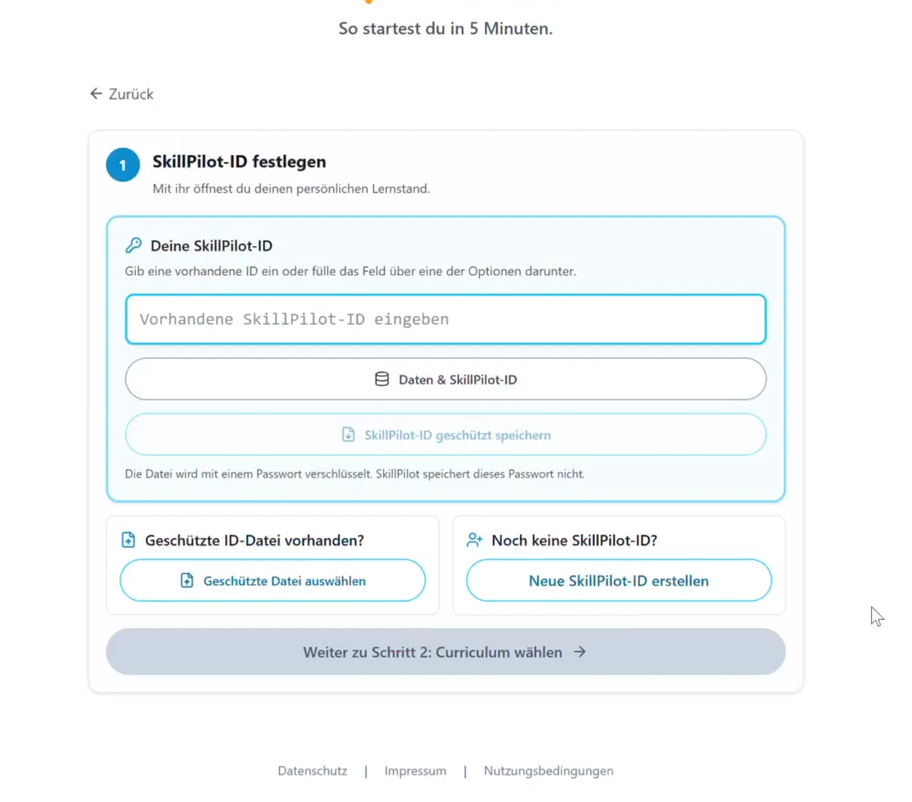
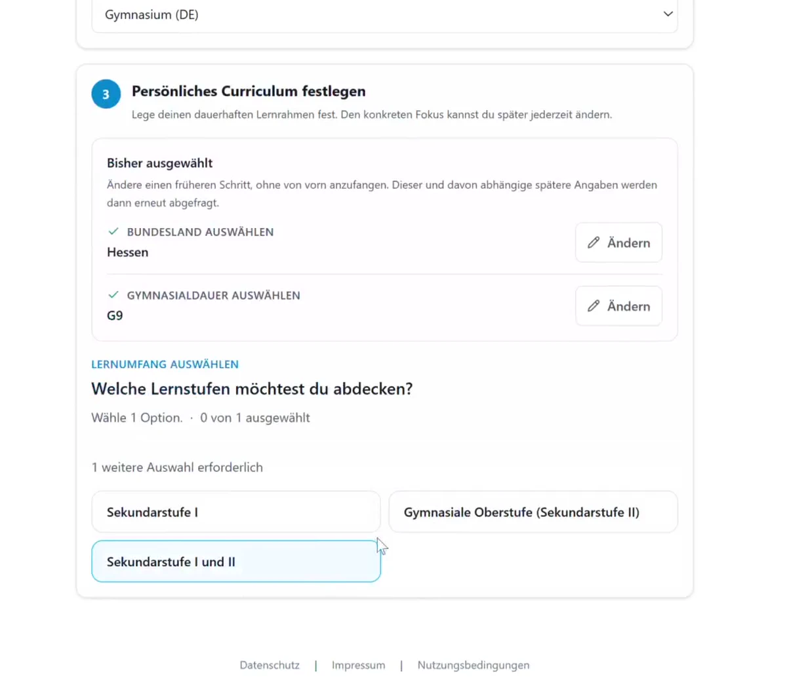
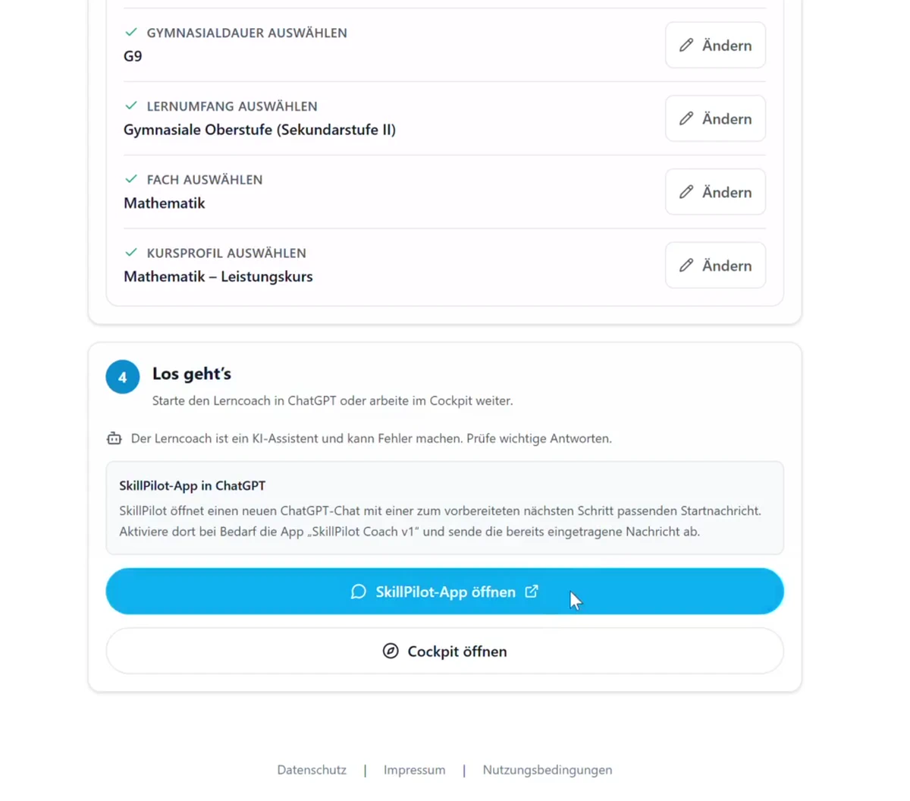
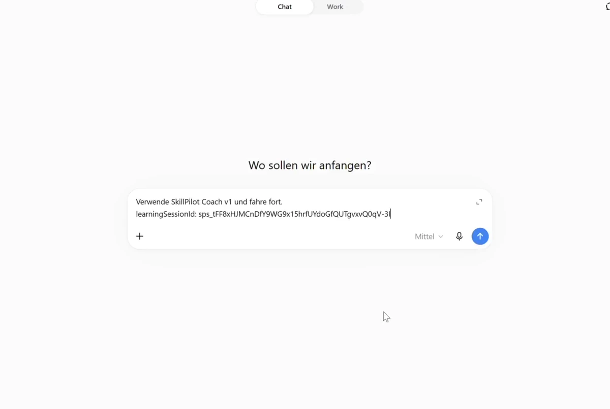
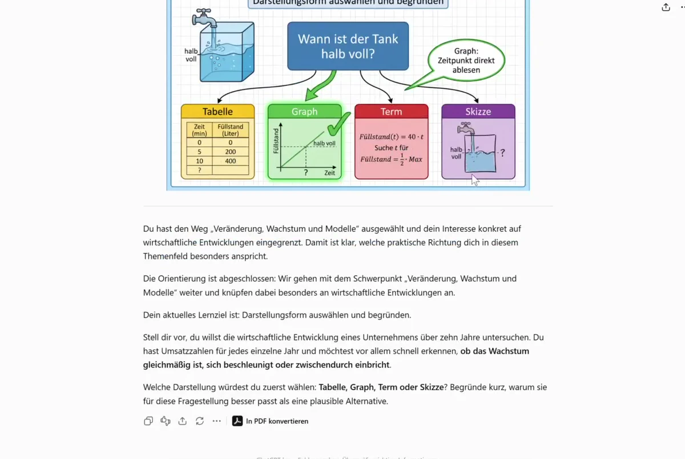
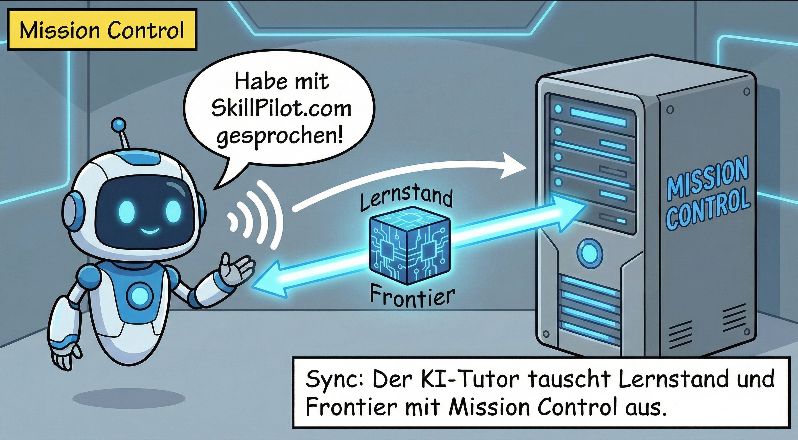
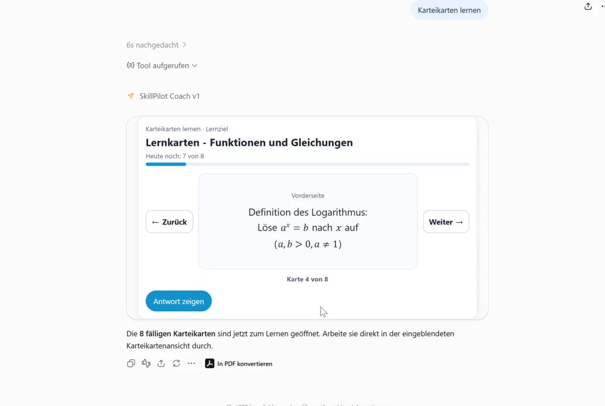
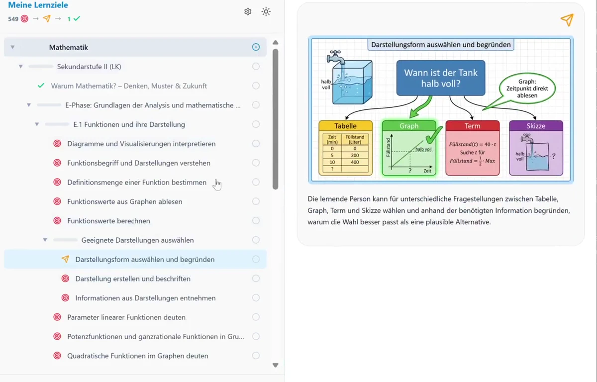
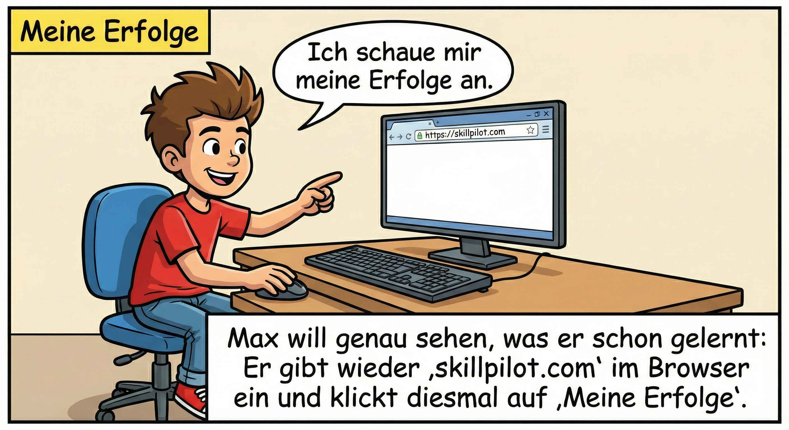

# SkillPilot: In 5 Schritten starten

**Stand:** 15. August 2026

> **Veröffentlichungsstatus:** Der hier beschriebene SkillPilot Coach v1 befindet sich derzeit im Veröffentlichungsreview.

SkillPilot verbindet den Lernkontext, den du auf [skillpilot.com](https://skillpilot.com) einstellst, mit deinem Lerncoach in ChatGPT. Du verwendest dafür **ChatGPT im Browser**.

Für Schüler:innen eignet sich besonders die browserbasierte Web-App auf dem Smartphone: Du kannst Antworten per Spracheingabe als Text erfassen, Aufgaben auf Papier bearbeiten und anschließend ein Foto deiner Lösung hochladen. Die native ChatGPT-App gehört derzeit nicht zum unterstützten SkillPilot-Ablauf.

> Nutze den normalen Textchat. Diktier- und Spracheingabe im Textfeld kannst du verwenden. Den fortlaufenden ChatGPT Voice Mode solltest du während einer SkillPilot-Lernsession nicht starten.

## Das brauchst du

- einen Browser auf Computer, Tablet oder Smartphone
- einen ChatGPT-Account, in dessen Tarif oder Workspace Apps verfügbar sind
- keine SkillPilot-Registrierung mit Name oder E-Mail-Adresse

## Start in 5 Schritten

### 1. SkillPilot öffnen

Öffne [skillpilot.com](https://skillpilot.com) und wähle **Lernen starten**.

### 2. SkillPilot-ID festlegen

Erstelle eine neue SkillPilot-ID, lade deine geschützte ID-Datei oder gib eine vorhandene SkillPilot-ID ein. Speichere eine neue ID möglichst sofort als geschützte Datei.

### 3. Persönliches Curriculum festlegen

Lege dein persönliches Curriculum und deinen aktuellen Lernkontext fest. Dazu gehören zum Beispiel Schulform, Lernstufe, Fach und Kursprofil.

### 4. SkillPilot Coach v1 öffnen

Wähle **SkillPilot-App öffnen**. SkillPilot öffnet einen neuen ChatGPT-Chat im Browser mit einer vorbereiteten Nachricht. Beim ersten App-Aufruf kann ChatGPT einmalig um die Verbindung mit **SkillPilot Coach v1** bitten.

Die vorbereitete Nachricht enthält bereits die neue, 24 Stunden gültige Lernsession. Du musst sie nicht ergänzen.

### 5. Vorbereitete Nachricht senden

Sende die vorbereitete Nachricht unverändert ab. Der Coach lädt deinen Lernstand und führt dich durch das aktuelle Lernziel.

Du musst keine Session-ID kopieren, bearbeiten oder selbst in ChatGPT eintragen.

## Lernen auf dem Smartphone

Öffne ChatGPT im Smartphone-Browser oder speichere die Browserseite als Web-App auf dem Startbildschirm. So kannst du:

- Antworten in das normale Textfeld diktieren, den erkannten Text prüfen und absenden,
- Rechnungen, Skizzen und längere Lösungen auf Papier bearbeiten,
- deine Arbeit fotografieren und im selben Chat hochladen.

Je nach Lernziel kann der Coach außerdem eine passende interaktive Lernansicht öffnen, zum Beispiel für fällige Karteikarten.

## SkillPilot-ID und Lernsession

Deine dauerhafte SkillPilot-ID ist der Schlüssel zu deinem Lernfortschritt. Sie bleibt bei SkillPilot und wird nicht in den Chat übernommen.

Bei jedem Klick auf **Lernen starten** erzeugt SkillPilot eine neue, zufällige Lernsession. Sie ist exakt 24 Stunden gültig und wird automatisch in die vorbereitete Nachricht eingesetzt.

## Fortschritt im Cockpit

*Cockpit und Lerncoach verwenden denselben Lernstand. Im Cockpit siehst du deinen Fortschritt und sinnvolle nächste Ziele.*

## Wenn etwas nicht funktioniert

### Was mache ich, wenn die Lernsession abläuft?

Eine Lernsession ist exakt 24 Stunden gültig und wird durch Nutzung nicht verlängert. Sobald weniger als eine Stunde übrig ist, beginnt der Coach keine neue Lernaktion mehr.

Kehre zu [skillpilot.com](https://skillpilot.com) zurück, lade deine geschützte ID-Datei oder gib dort deine SkillPilot-ID ein, prüfe deinen Lernkontext und wähle erneut **Lernen starten**. Sende die neue vorbereitete Nachricht in dem neu geöffneten Chat ab. Gib deine dauerhafte SkillPilot-ID niemals direkt im Chat ein.

### Was mache ich, wenn ich versehentlich Voice Mode gestartet habe?

Beende Voice Mode und starte über SkillPilot einen neuen Chat mit einer neuen Lernsession. Arbeite nicht einfach im bisherigen Chat weiter.

### Was mache ich, wenn sich das ChatGPT-Fenster nicht öffnet?

Erlaube Pop-ups für skillpilot.com und wähle erneut **SkillPilot-App öffnen**.

### Was mache ich, wenn ich meine SkillPilot-ID verloren habe?

Lade deine zuvor gespeicherte geschützte ID-Datei. Ohne die SkillPilot-ID oder diese Datei kann dein bisheriger Lernstand nicht wieder geöffnet werden.
