# SkillPilot: How I Learn.

**Status:** January 11, 2026

> 💡 **Tip:** If something does not work in the ChatGPT app, use the **web browser**.  
> 🔑 **Important:** Your **SkillPilot ID** is your key to your learning progress.  

---

## Quick start in 5 steps

1. Open `https://skillpilot.com` (best in the browser).
2. Click **Start SkillPilot GPT**.
3. Choose **Start new** or **Continue with ID**.
4. **Save your ID** (notes/password manager).
5. Learn -> goals are **mastered** -> see progress in **My Achievements** in the cockpit.

---

## 1) Start on SkillPilot.com

| 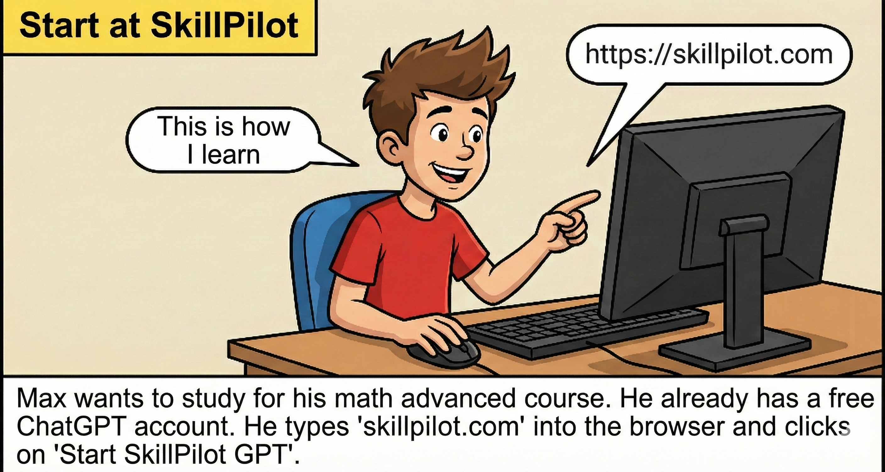 |
| --- |

| 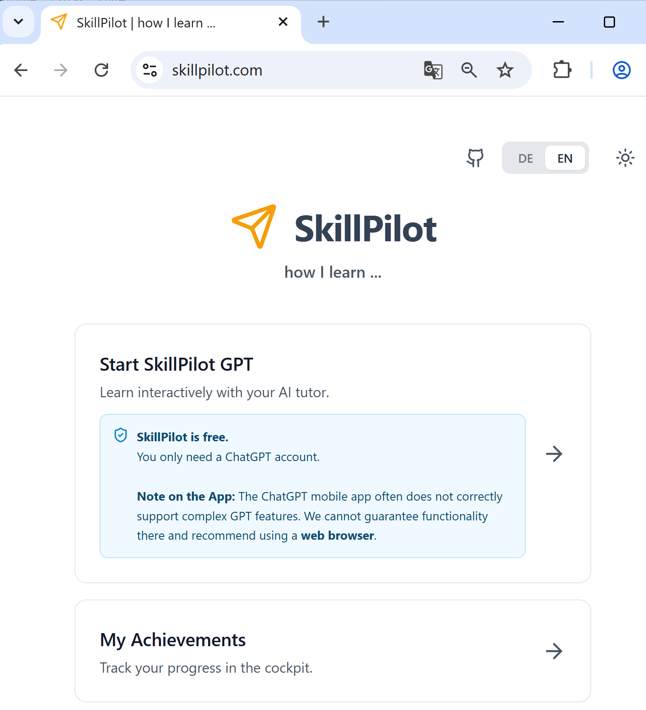 |
| --- |
| *On the homepage you will find "Start SkillPilot GPT" and "My Achievements".* |

---

## 2) Open SkillPilot GPT (start the tutor)

| 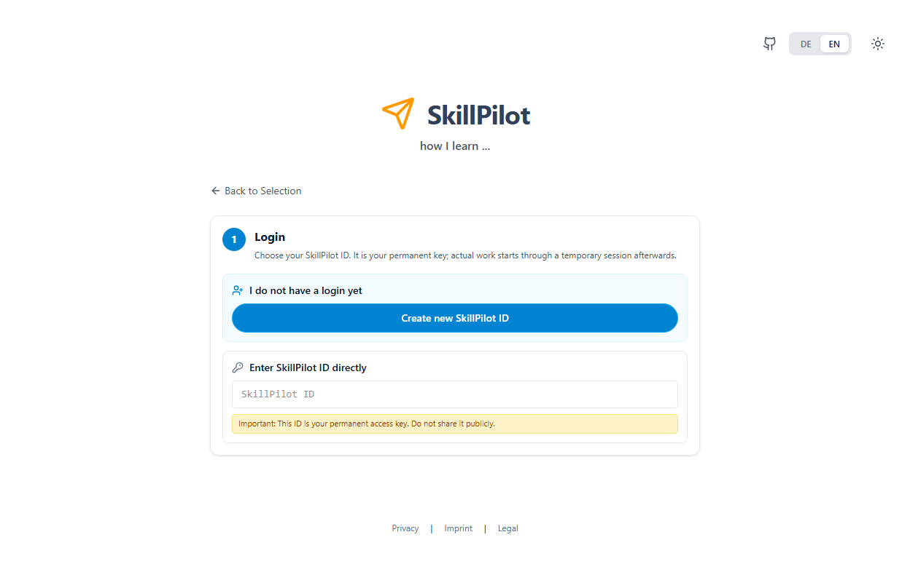 |
| --- |
| *In SkillPilot GPT you can start new or continue with your ID.* |

| 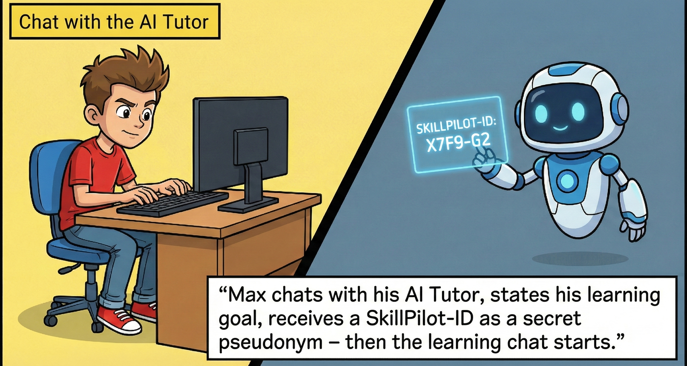 |
| --- |

---

## 3) Get and save your ID

| 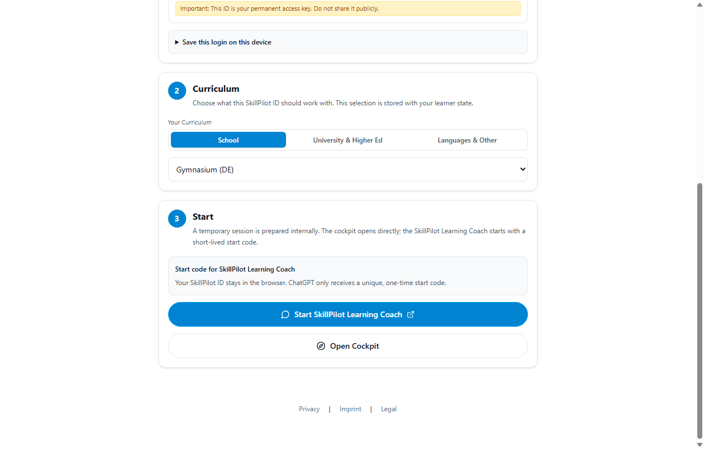 |
| --- |
| *If you start new, SkillPilot creates a profile and shows your SkillPilot ID.* |

**Remember:** Without the ID you cannot reopen your progress later.

---

## 4) Choose a learning path and get started

|  |
| --- |
| *SkillPilot sets up your learning path and suggests suitable starter topics.* |

|  |
| --- |

| 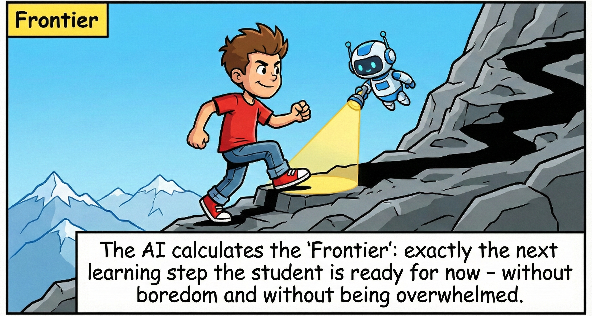 |
| --- |

---

## 5) How a learning session works (example)

| 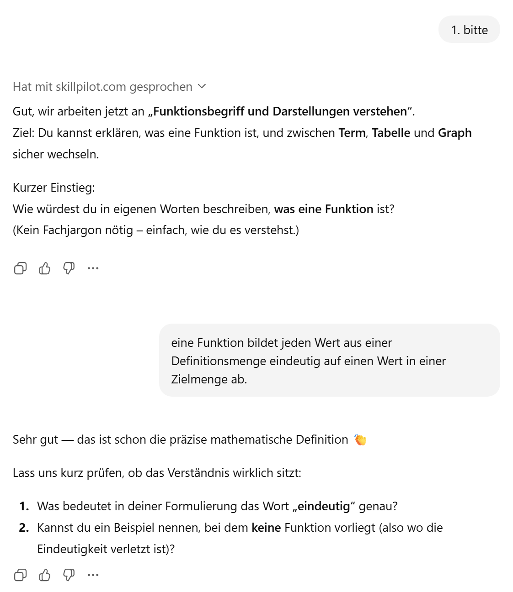 |
| --- |
| *You start with a learning goal and answer short questions.* |

| 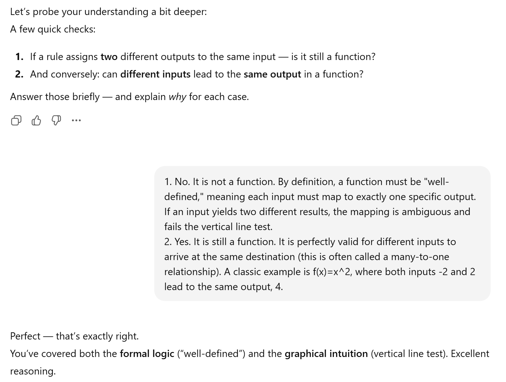 |
| --- |
| *SkillPilot checks understanding: definitions plus application/transfer.* |

| 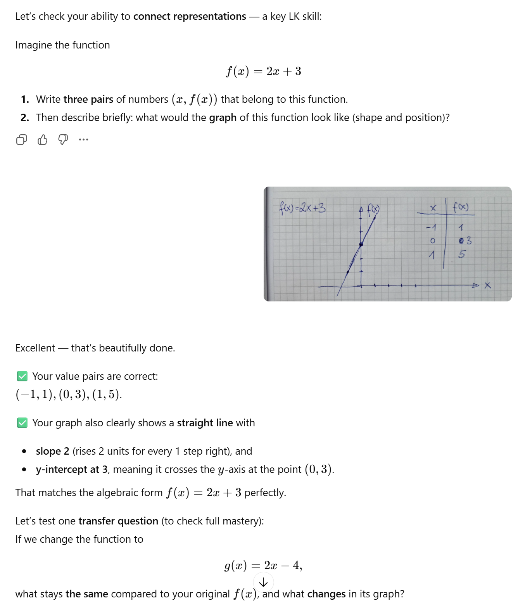 |
| --- |
| *You can also upload sketches/photos - SkillPilot uses them in the feedback.* |

| 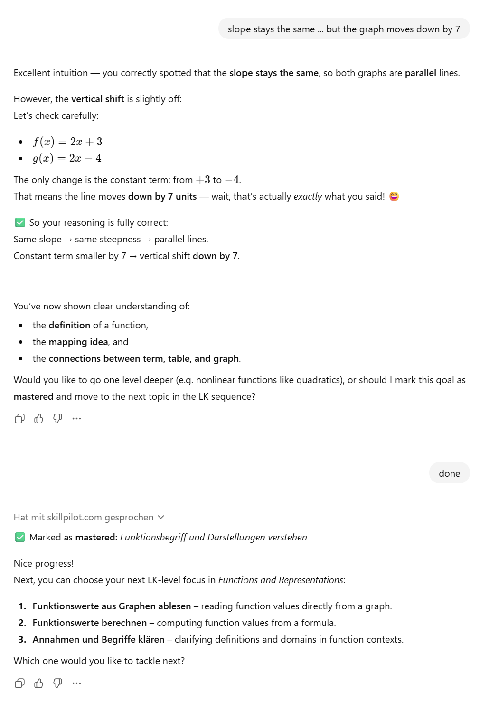 |
| --- |
| *When it sticks, the goal is marked "mastered" and you get sensible next steps.* |

---

## 6) View progress: "My Achievements" (cockpit)

|  |
| --- |

| 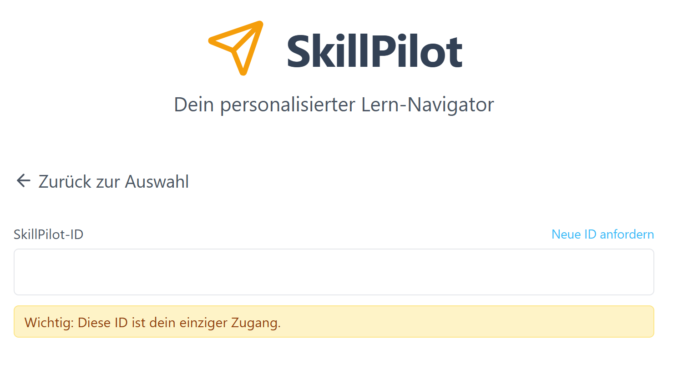 |
| --- |
| *Under "My Achievements" you enter your SkillPilot ID.* |

| 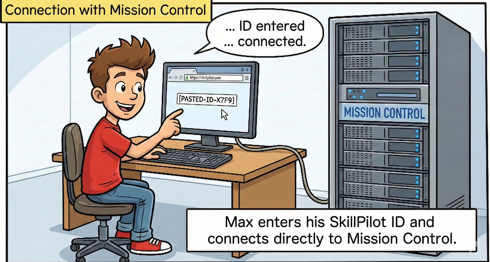 |
| --- |

| 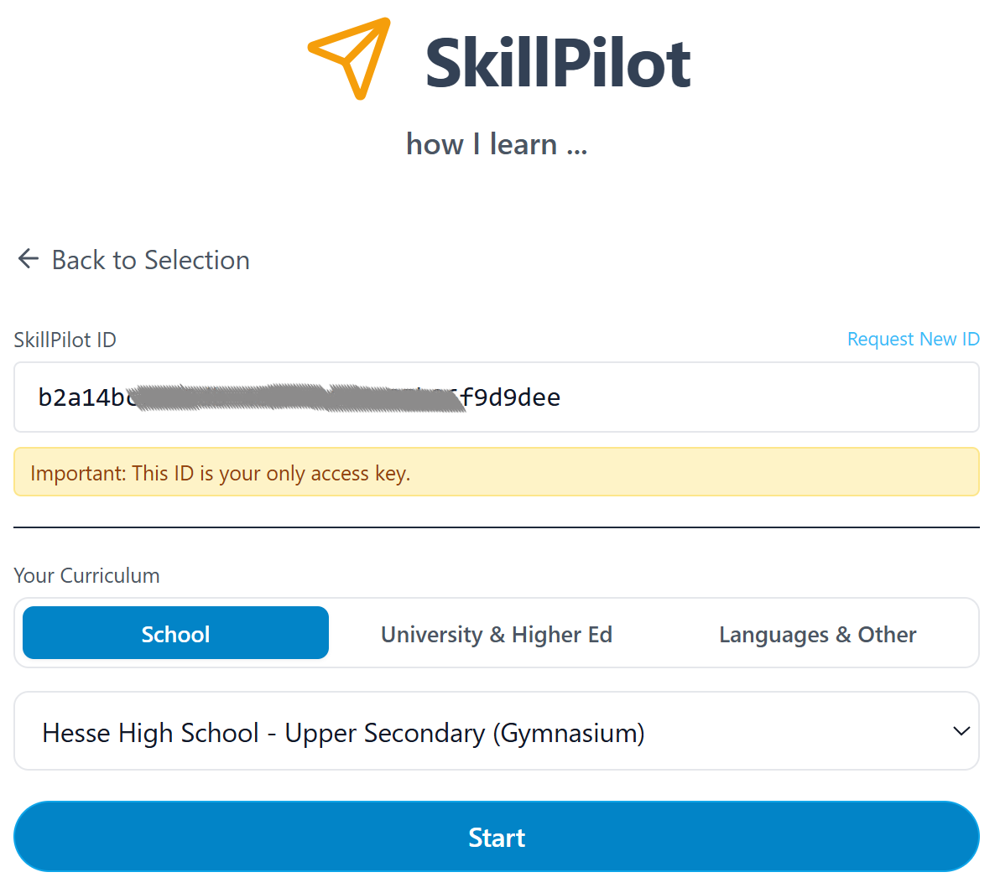 |
| --- |
| *Select curriculum -> "Start" -> you land in the cockpit.* |

---

## 7) Keep the overview and continue

|  |
| --- |
| *In the cockpit you see what you have mastered and what comes next.* |

| 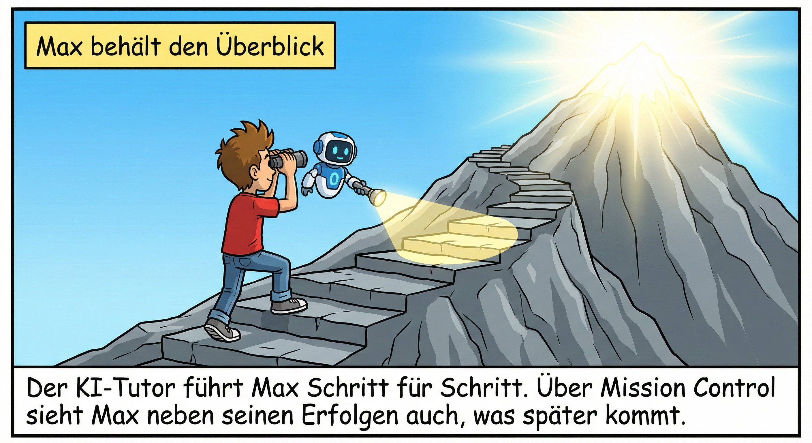 |
| --- |

| 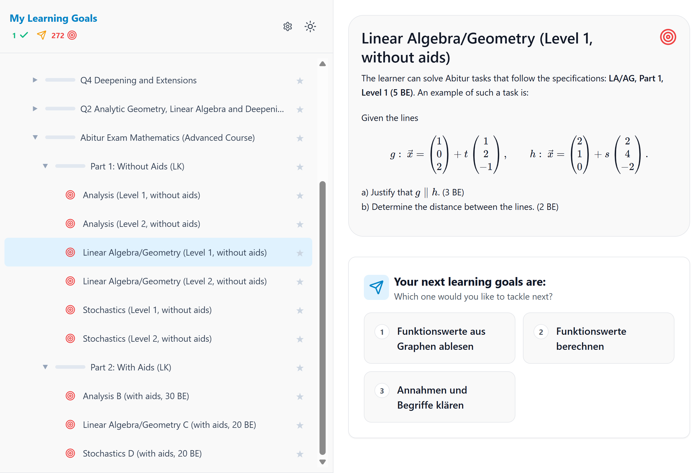 |
| --- |
| *You can also select other learning goals and view their contents.* |
