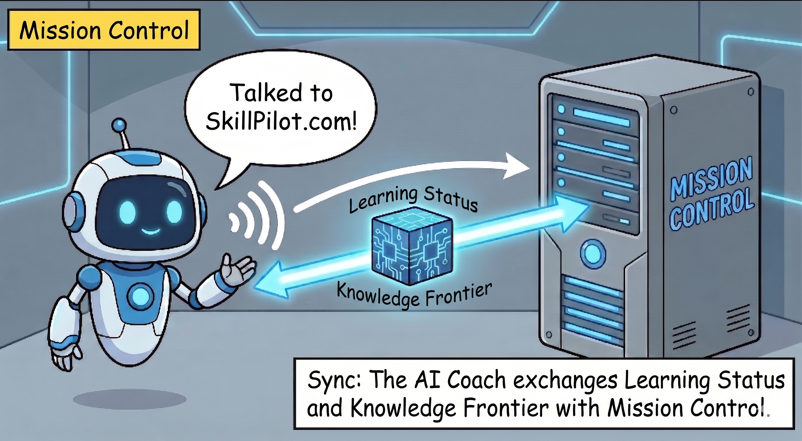
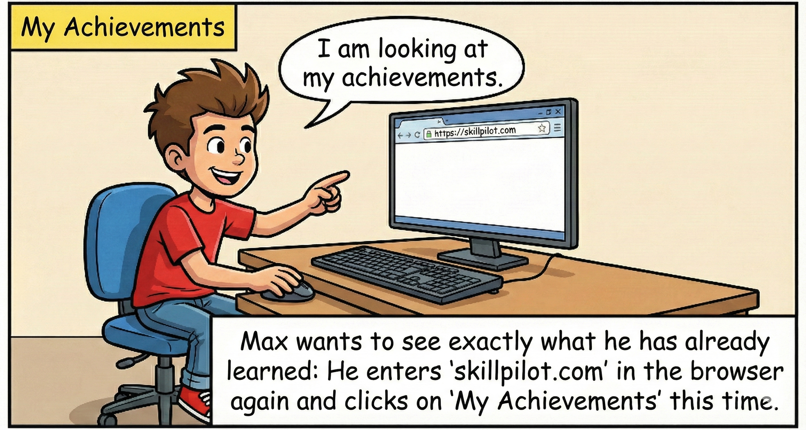

# SkillPilot: Start in 5 Steps

**Status:** August 15, 2026

> **Publication status:** SkillPilot Coach v1, as described here, is currently undergoing publication review.

SkillPilot connects the learning context you configure on [skillpilot.com](https://skillpilot.com) with your learning coach in ChatGPT. You use **ChatGPT in a browser**.

For students, the browser-based web app on a smartphone is particularly useful: you can enter answers as text by voice, work on paper, and then upload a photo of your solution. The native ChatGPT app is currently not part of the supported SkillPilot workflow.

> Use normal text chat. You may use dictation or voice input in the text field. Do not start continuous ChatGPT voice mode during a SkillPilot learning session.

## Watch the Workflow

The video shows the current browser workflow. The narration was generated with AI.

[Watch the video](https://skillpilot.com/api/public/openai/review/skillpilot-coach-v1/1.0.0/sha256-20f5327535513df8b1c088b553195baf6ae339d57fc417b303488ae597644deb.mp4)

## What You Need

- a browser on a computer, tablet, or smartphone
- a ChatGPT account whose plan or workspace provides access to apps
- no SkillPilot registration with a name or email address

## Start in 5 Steps

### 1. Open SkillPilot

Open [skillpilot.com](https://skillpilot.com) and select **Start Learning**.

### 2. Set Your SkillPilot ID

Create a new SkillPilot ID, load your protected ID file, or enter an existing SkillPilot ID. If you create a new ID, save it as a protected file as soon as possible.

### 3. Configure Your Personal Curriculum

Configure your personal curriculum and current learning context. This includes items such as school type, learning stage, subject, and course profile.

### 4. Open SkillPilot Coach v1

Select **Open SkillPilot app**. SkillPilot opens a new ChatGPT browser chat with a prepared message. On the first app call, ChatGPT may ask you once to connect **SkillPilot Coach v1**.

The prepared message already contains the new learning session, which is valid for 24 hours. You do not need to add anything.

### 5. Send the Prepared Message

Send the prepared message unchanged. The coach loads your learning state and guides you through the current learning goal.

You do not need to copy, edit, or manually enter a session ID in ChatGPT.

## Learning on a Smartphone

Open ChatGPT in your smartphone browser, or save the browser page as a home-screen web app. You can then:

- dictate into the normal text field, review the recognized text, and send it,
- work through calculations, sketches, and longer solutions on paper,
- photograph your work and upload it in the same chat.

Depending on the learning goal, the coach may also open an appropriate interactive learning view, such as due flashcards.

## SkillPilot ID and Learning Session

Your permanent SkillPilot ID is the key to your learning progress. It stays with SkillPilot and is not copied into the chat.

Every time you select **Start Learning**, SkillPilot creates a new random learning session. It is valid for exactly 24 hours and is inserted into the prepared message automatically.

## Progress in the Cockpit

*The Cockpit and learning coach use the same learning state. The Cockpit shows your progress and useful next goals.*

## If Something Does Not Work

### What should I do when the learning session expires?

A learning session is valid for exactly 24 hours and is not extended by use. Once less than one hour remains, the coach will not begin another learning action.

Return to [skillpilot.com](https://skillpilot.com), load your protected ID file or enter your SkillPilot ID there, review your learning context, and select **Start Learning** again. Send the new prepared message in the newly opened chat. Never enter your permanent SkillPilot ID directly in chat.

### What should I do if I accidentally started voice mode?

End voice mode and use SkillPilot to start a new chat with a new learning session. Do not simply continue in the previous chat.

### What should I do if the ChatGPT window does not open?

Allow pop-ups for skillpilot.com and select **Open SkillPilot app** again.

### What should I do if I lost my SkillPilot ID?

Load your previously saved protected ID file. Without the SkillPilot ID or that file, your previous learning state cannot be reopened.
