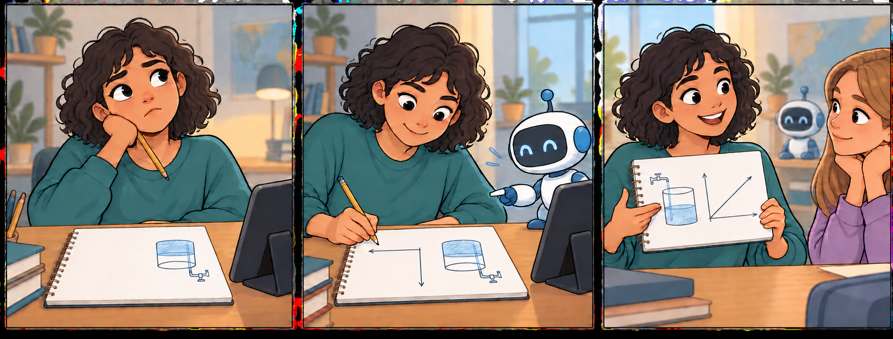
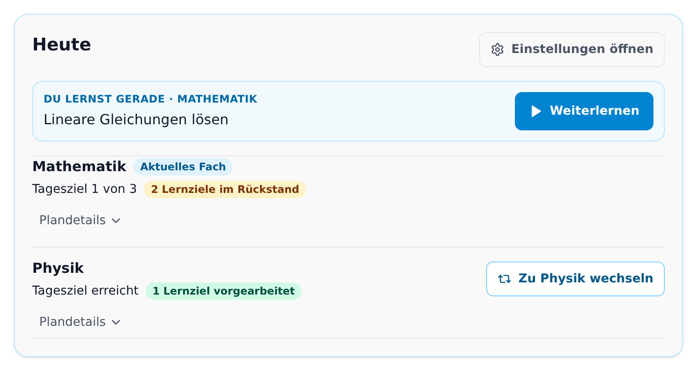

# SkillPilot Whitepaper (DE)

**Version:** 1.0.23 · **Projekt:** SkillPilot · *Ein Teil der Illustrationen ist KI-generiert.*

---

**Wissen, das trägt. Lernziel für Lernziel.**

Mathematik und Physik für die gesamte gymnasiale Oberstufe – schon heute geführt lernen mit dem Claude-basierten SkillPilot-Coach, auch auf dem Handy. Nach der Einrichtung führt SkillPilot automatisch durch das persönliche Curriculum auf Grundlage des gewählten offiziellen Lehrplans. Dabei bauen die Lernziele auf den jeweils benötigten Grundlagen auf.

Wie bei einem soliden Haus: Jeder verstandene Baustein trägt das Weitere. Der Coach begleitet – die Lernerfolge erarbeiten Sie selbst.

## Zusammenfassung

**Anspruchsvolle Bildung und individuelle Unterstützung gehören zusammen.** SkillPilot soll helfen, curriculare Ziele tatsächlich zu erreichen: mit tragfähigen Grundlagen, verstandenen Zusammenhängen und selbstständiger Anwendung. Dafür macht es aus bestehenden Lehrplänen eine persönliche Lernlandkarte. Ein KI-Lerncoach erklärt, übt mit den Lernenden und bespricht ihre Lösungen; SkillPilot verwaltet den Lernstand und prüft, welche Zustandsänderungen zulässig sind.

Grundlage bleiben die **geltenden Curricula**, etwa staatliche Lehrpläne, Modulhandbücher oder Sprachstandards. Sie werden in einen versionierten **Skill-Graph** übersetzt: konkrete Lernziele mit fachlichen Voraussetzungen. Fortschritt wird an einzelnen Zielen gespeichert und für größere Themen zusammengefasst. Der aktuelle Schwerpunkt liegt auf dem **Gymnasium in Deutschland**.

**Lernpläne ergänzen diese Navigation um den zeitlichen Rahmen:** Welche Teile des persönlichen Curriculums sollen bis wann erreicht werden? SkillPilot zeigt für alle geplanten Fächer das **Tages- oder Wochenpensum** sowie Rückstand oder Vorarbeit. Jedes Fach wird dabei einzeln ausgewertet. Der Coach zeigt den Stand im Chat und führt zum nächsten lernbaren Ziel, ohne dass Lernende selbst Planabschnitte oder Lernziele verwalten müssen (siehe Abschnitt 3.4).

**Das passende Material zum nächsten Lernschritt finden:** Wir arbeiten daran, Bücher, YouTube-Videos und andere Lernmaterialien an Lernziele und Lernpläne anzubinden. Lehrkräfte und Lernende sollen die passenden Angebote selbst auswählen können. Wir beginnen gerade mit Physik Libre (Abschnitt 5.2).

Die Qualitätssicherung verbindet nachvollziehbare **maschinelle Prüfungen** mit einer **separat ausgewiesenen menschlichen Erprobung** durch Curriculum Champions. Änderungen und Befunde werden über den **Open-Source-Workflow** (Issues/Pull Requests) bearbeitet.

### Vom Curriculum zur persönlichen Lernlandkarte

In der Weboberfläche wählen Lernende ihren Bildungskontext und die passenden Fächer. Daraus entsteht ihr persönliches Curriculum. Der aktuelle Lernfokus kann später wechseln, ohne bereits gespeicherten Fortschritt zu verlieren.

### Jetzt mitmachen: kostenloser SkillPilot-Beta-Test mit Claude

**Die Beta steht allen Interessierten ab 18 Jahren offen. SkillPilot selbst ist kostenlos; für den KI-Lerncoach wird ein eigener Claude-Pro-Account benötigt.** Dessen Abonnement wird separat bei Anthropic abgeschlossen. Die Altersgrenze ergibt sich aus den [Voraussetzungen für persönliche Claude-Konten](https://support.claude.com/en/articles/8114491-get-started-with-claude).

**Schon heute funktioniert das Lernen im Claude-Chat auch auf dem Handy – einschließlich Voice Mode.** Wer eine Aufgabe selbst mit Papier und Stift bearbeitet, kann den Lösungsweg mit der Handykamera fotografieren, im Chat mit dem SkillPilot-Coach teilen und besprechen. Tippen, sprechen und eigene Arbeit zeigen ergänzen sich dabei.

Der Einstieg erfolgt über den SkillPilot-Marketplace; die Einrichtung zeigt der [5-Minuten-Kurzstart](https://skillpilot.com/quickstart/de). In der responsiven SkillPilot-Weboberfläche wählen Sie Ihr persönliches Curriculum, sehen den Fortschritt und starten die Lernsession. **[Jetzt ausprobieren](https://skillpilot.com/quickstart/de)** und den Beta-Test mitgestalten.

**SkillPilot ist nicht auf eine bestimmte KI festgelegt.** Plugins und eigene Provideradapter verbinden den unabhängigen fachlichen Kern mit dem jeweiligen KI-Chat. An der ChatGPT-Anbindung wird gearbeitet; sie ist noch kein öffentlich verfügbarer Lernzugang. Weitere Anbindungen setzen geeignete Schnittstellen und zuverlässig unterstützte Funktionen beim jeweiligen Anbieter voraus. Vorrang hat die Stabilisierung des laufenden Claude-Betriebs.

---

## 1. Die Herausforderung: Vom gemeinsamen Lehrplan zum individuellen Lernweg

Bildung folgt Curricula, die staatlich vorgegeben oder durch **Akkreditierung** definiert sind. In der Praxis klafft jedoch eine Lücke zwischen Curriculum und Lernrealität:

- Lernende starten **nicht am selben Punkt** (Vorwissen, Tempo, Lücken).
- Lehrende müssen trotzdem **viele Personen parallel** steuern – oft in großen Kohorten.
- Lernziele liegen meist **als Text** vor, aber nicht als **navigierbare Struktur** mit Abhängigkeiten und sinnvollen nächsten Schritten.

Das führt zu Überforderung bei einigen, Langeweile bei anderen – und zu hohem Aufwand, Lernstände und nächste Schritte sauber zu erfassen.

**Ein gemeinsamer Lehrplan. Dein eigener Lernweg.**

Die Ziele bleiben anspruchsvoll; die Unterstützung passt sich dem Ausgangspunkt an.

**Bei Schwierigkeiten ist der Leitgedanke nicht, die Anforderungen vorschnell zu senken, sondern die Unterstützung zu verbessern.** SkillPilot verbindet den gemeinsamen Lehrplan mit dem individuellen Lernstand: Statt „Analysis fällt noch schwer“ wird erkennbar, welche konkreten Fähigkeiten dokumentiert sind, welche Grundlagen fehlen und welcher Schritt als Nächstes möglich ist. Lehrkräfte behalten die Verantwortung für Unterricht und Bewertung.

---

## 2. Die Arbeitsteilung: KI erklärt, SkillPilot führt den Lernstand

Sprachbasierte KI kann Begriffe erklären, Aufgaben formulieren, Lösungswege besprechen und auf Fragen in natürlicher Sprache eingehen. Im Lerndialog macht sie unterschiedliche Zugänge zu einem Thema möglich und passt Erklärungen an die Antworten der lernenden Person an.

Für verlässliche Lernführung braucht es daneben eine eindeutige Grundlage: Welche Ziele gehören zum Curriculum, welche Voraussetzungen sind erfüllt und welcher Fortschritt ist gespeichert? SkillPilot verwaltet diese Informationen und Regeln im Backend.

Über definierte Werkzeuge greift der Lerncoach auf diese **verbindlichen Backendregeln** zu. SkillPilot berechnet erreichbare Lernziele und den Planstand, prüft zulässige Zustandsänderungen und speichert bestätigten Fortschritt. Die fachliche Beurteilung im Dialog bleibt eine KI-Leistung und kann Fehler enthalten; die technische Zustandsprüfung ist kein unabhängiger Beweis für die Richtigkeit einer Lösung.

Die **Plugin- und Adapterarchitektur entkoppelt den fachlichen Kern vom konkreten KI-Anbieter**. Die Provideradapter stellen die Werkzeuge über das **Model Context Protocol (MCP)** bereit. Eine neue KI-Anbindung muss unter anderem Coach-Anweisungen laden, Werkzeuge zuverlässig aufrufen, Authentisierung und Lernsession sicher handhaben sowie die benötigten Bilder und Lernkarten darstellen können. MCP standardisiert den Werkzeugzugriff, garantiert diese Fähigkeiten aber nicht. Verbindliche Entscheidungen über Lernzustand, Berechtigungen und Navigation bleiben im gemeinsamen SkillPilot-Kern; jede konkrete Anbindung wird gesondert geprüft.

**SkillPilot ist damit eine hybride Anwendung:** Der KI-Lerncoach übernimmt das sprachliche Verstehen, Erklären und fachliche Feedback. Die klassische Software verantwortet Lernzustand, Berechtigungen, Navigation und Fortschrittsverwaltung.

---

## 3. Das Produkt: Wie SkillPilot funktioniert

Die Lernlandkarte wird konkret, wenn jemand ein Ziel bearbeitet, eine eigene Lösung versucht und darüber spricht. SkillPilot hält dabei fest, welcher Fortschritt bestätigt ist und welche nächsten Schritte möglich sind. So greifen Graph, Coach und Lernplan ineinander.

### 3.1 Vom Curriculum zum nächsten Lernziel

SkillPilot ersetzt lineare Listen durch einen vernetzten Graphen.

Wichtig ist dabei die Trennung der Ebenen: Das offizielle Curriculum bleibt die **normative Quelle**. Der versionierte **Skill-Graph** ist das daraus abgeleitete **operative Modell**. Im Laufzeitbetrieb ist der **Backend-State** die maßgebliche Instanz für aktuellen Lernstand, Persönliches Curriculum, aktuellen Fokus, aktives Ziel und erlaubte Übergänge.

*Aus der Anwendung: Im Cockpit stehen Lernlandkarte und aktuelles Ziel nebeneinander. Eine große Aufgabe wird zu einem konkreten nächsten Schritt.*

#### Vier Ebenen der Personalisierung

SkillPilot trennt den dauerhaften Lernumfang vom aktuellen Arbeitsschritt:

1. **Basis-Curriculum (Level 1):** Das gewählte Grundcurriculum, etwa „Gymnasium (DE)“, stellt den verfügbaren Zielraum bereit.
2. **Persönliches Curriculum (Level 2):** Bundesland, Schulstufe, Fächer und gegebenenfalls Dauer- und Kursmodell bestimmen den persönlichen Lernumfang. Diese Auswahl wird in der SkillPilot-Weboberfläche festgelegt, nicht im Coach-Chat.
3. **Lernfokus und aktives Ziel (Level 3):** Ein vorübergehend gewählter Ausschnitt und genau ein aktuelles Lernziel steuern die laufende Arbeit. Der Coach nutzt dafür die vom Backend angebotenen Optionen. Eine Fokusausweitung benötigt Zustimmung; innerhalb einer bestätigten Plan- oder Autopilotführung kann das nächste zulässige Ziel automatisch gewählt werden.
4. **Lernstand / Mastery (Level 4):** Fortschritt wird an stabilen Lernziel-IDs gespeichert und bleibt bei einem Wechsel von Ansicht oder Fokus erhalten.

Eine fachlich definierte **Kompositionssicht** ordnet die kanonischen Ziele für den gewählten Bildungskontext an. Dabei unterscheidet sie **Lernziele im persönlichen Umfang (`target`)** von **reinen Voraussetzungen (`prerequisiteOnly`)**. Nur die ersten zählen zu sichtbarem Lernbaum, Zielauswahl, Fortschritt und Abschluss. Reine Voraussetzungen behalten ihre globale Mastery für die Voraussetzungsprüfung, ohne dadurch zusätzliche Lernziele dieses Umfangs zu werden. So können etwa Sek-I-Grundlagen in einer Sek-II-Sicht als Voraussetzungen berücksichtigt werden, wenn diese Rolle dort ausdrücklich modelliert ist. Ein Stufenwechsel bescheinigt diese Grundlagen nicht automatisch; ihre Aufnahme als eigene Lernziele erfordert einen entsprechend gewählten persönlichen Umfang.

#### Andocken an bestehende Curricula (Rohinput & Traceability)

SkillPilot „erfindet“ keine Curricula: Lehrpläne, Modulhandbücher oder Standards dienen als **Rohinput** und werden in einen Skill-Graph übersetzt.

Eine formale mathematische Spezifikation und zugehörige Prüfungen sichern die Struktur ab, etwa gegen Zirkelbezüge und widersprüchliche Abhängigkeiten. Ob ein Lernziel fachlich richtig und eine Voraussetzung didaktisch sinnvoll ist, benötigt darüber hinaus inhaltliche QS (Abschnitt 5.1).

Dabei geht es um:

- **Operationalisierung:** Curriculare Anforderungen werden in fachlich umrissene Lernziele übersetzt. Maßstab bleibt der Lehrplan, nicht eine automatische Absenkung auf den bisherigen Lernstand.
- **Quellenbezug:** Curriculare Ziele werden ihren Quellen, Abschnitten und Versionen zugeordnet; die erreichte Abdeckung wird im Qualitätsstatus ausgewiesen.
- **Navigierbarkeit:** Voraussetzungen und Hierarchien werden explizit modelliert, damit Pfade planbar werden. Der **Gesamtgraph** erlaubt mehrere didaktisch sinnvolle Wege. Innerhalb eines **gewählten Umfangs** oder einer **modellierten Ziel-Route** schränkt SkillPilot die nächsten Schritte auf die passende Teilmenge ein. Dabei bleiben ausdrücklich modellierte `prerequisiteOnly`-Grundlagen auch außerhalb des Lernfokus wirksam. Der optionale **Strict Mode** prüft Voraussetzungen darüber hinaus global.
- **Governance:** Änderungen laufen aktuell über GitHub (Issues/PRs), Versionierung über die GitHub-Historie (siehe Abschnitt 6).

#### Landkarte: Knoten & Kanten

- **Knoten:** atomare Skills („kann X erklären/anwenden“) und Cluster (Themen/Module).
- **Kanten:**
  - **Prerequisites:** „A vor B“
  - **Contains/Part-of:** „X umfasst Y und Z“

#### Lernmodi: Was an einem Knoten gelernt wird

Inhaltliche Lernziele, Memorierknoten und Übungs- bzw. Prüfungsknoten stellen unterschiedliche Anforderungen:

- **Verstehen:** Gewöhnliche inhaltliche Lernziele werden vom KI-Lerncoach erklärt und eingeübt.
- **Sich merken:** Einzelne Fakten werden gezielt memoriert (modernes Karteikastenprinzip).
- **Selbstständig Probleme lösen:** Übungs- und Prüfungsaufgaben verlangen eine eigenständige Bearbeitung, etwa auf Papier mit anschließendem Foto-Upload. In Mathematik Sek I sind Jahrgangsprüfungen unter „Prüfungen Jahrgangsstufe …“ eingeordnet; in Sek II kommen passende Klausur- und Abituraufgaben hinzu. Der Lerncoach bespricht Lösungen und bewertet sie nach den jeweiligen Aufgabenvorgaben.

Ergänzend können **Orientierungsknoten zur Motivation und Sinnstiftung** modelliert sein. Sie zeigen konkrete Möglichkeiten des folgenden Themas und laden zur persönlichen Auseinandersetzung ein; sie prüfen kein Fachwissen. Ihr Abschlussmarker steht für eine bearbeitete Orientierung oder den ausdrücklichen Wunsch weiterzugehen, nicht für fachliche Beherrschung. Die bloße Auswahl eines vorgeschlagenen Interesses startet zunächst die dazu passende Vertiefung.

Die **didaktische Route** in Abschnitt 3.3 verbindet diese Knoten zu einem Lernweg. Sie beschreibt deren Zusammenspiel, nicht einen zusätzlichen Knotentyp.

**Formale Spezifikation:** Die mathematische Definition des Graphen (u.a. Acyclicity, Effective Requires) ist öffentlich dokumentiert:
[Graph-Definition](https://enpasos.github.io/skillpilot/concept/skill-graph/graph-definition/)

#### Frontier: Nächste erreichbare Schritte

Die **Frontier** wird vom Backend berechnet, nicht von der KI vorgeschlagen: Sie umfasst noch nicht beherrschte Ziele im aktiven Lernumfang, deren wirksame Voraussetzungen erfüllt sind. Bei der Voraussetzungsprüfung zählen auch ausdrücklich als `prerequisiteOnly` modellierte Grundlagen außerhalb des sichtbaren Lernumfangs. Diese rechnerische Freischaltung ist keine psychologische Diagnose des individuellen Lernpotenzials.

### 3.2 Im Dialog lernen und Fortschritt festhalten

**Selbst denken. Hilfe bekommen. Selbst erklären.**

Der Aha-Moment gehört der lernenden Person.

Der **SkillPilot-Lerncoach** macht aus dem gewählten Ziel eine konkrete Lernaufgabe. Er erklärt, gibt Hinweise, fragt nach und bespricht Lösungswege. Dabei erhält er den aktuellen Lernumfang, die Frontier und die erlaubten Übergänge vom Backend. Die **eigene Denkarbeit bleibt bei den Lernenden**: etwa eine Aufgabe mit Papier und Stift lösen, den Lösungsweg fotografieren und anschließend die Rückmeldung besprechen. Die KI soll notwendige Anstrengung wirksam unterstützen, nicht ersetzen.

#### Verstehen sichtbar machen

Bei fachlichen Verständniszielen fragt der Coach nach Begründungen und Erklärungen in eigenen Worten, statt nur richtige Endergebnisse abzufragen. Diese Anlehnung an sokratische Gesprächsführung und die **Feynman-Technik** soll Lücken im Verständnis erkennbar machen und gezieltes Weiterüben ermöglichen. Sie ist ein didaktischer Ansatz, kein Wirksamkeitsnachweis für das Gesamtsystem. Für Orientierungsknoten gilt diese Wissensprüfung ausdrücklich nicht.

#### Mastery: Fortschritt als Evidenzmodell

Die aktuelle Cockpit-Ansicht trennt gewöhnliches Karteikartenüben vom evidenzwirksamen **Verified Recall**. Die Aufnahme dazu steht im Anhang, Detail A.

**Mastery** ist der backendseitige Lernzustand auf atomaren Zielen, kein Chatprotokoll. Bei gewöhnlichen Lernzielen meldet der Coach nach den geltenden Evidenzregeln eine Abschlussentscheidung; das Backend prüft und speichert die zulässige Zustandsänderung. Das Cockpit zeigt den gespeicherten Stand. Orientierungsknoten verwenden nur einen Abschlussmarker und bescheinigen keine fachliche Beherrschung. Bei Memorierknoten wird Mastery aus dem serverseitigen Kartenstatus und dem **Verified Recall** abgeleitet; gewöhnliches Karteikartenüben verändert nur den Wiederholungsplan. Clusterfortschritt wird gewichtet aus den enthaltenen Zielen aggregiert.

Der zentrale Zustand bleibt von vollständigen Dialogen und zusätzlichen Artefakten getrennt. Weitergehende Nachweise können institutionell über Artefakte oder Referenzen ergänzt werden.

> SkillPilot macht Fortschritt sichtbar – die Institution entscheidet, welche Evidenz welche Konsequenz hat.

#### Kurze Wege für Feedback

Eine Erklärung passt nicht, eine Aufgabe ist unklar oder der Coach verhält sich anders als erwartet? **Bei unterstützten fachlichen Lernzielen lässt sich direkt im Cockpit Feedback geben; das aktuelle Ziel ist dort bereits zugeordnet.** Die Rückmeldung wird bei der nächsten Überarbeitung kritisch geprüft und für passende Korrekturen berücksichtigt. So gelangen Erfahrungen aus dem Lernen unmittelbar an die Stelle, an der Inhalte und Lernbegleitung verbessert werden. Dafür muss niemand Curriculum Champion sein. Bitte das konkrete Problem beschreiben, ohne private Angaben oder den vollständigen Lernchat mitzuschicken.

#### Lerngeschwindigkeit (Learning Velocity)

Learning Velocity zeigt, wie viele **atomare Ziele** pro Woche neu als gemeistert gelten. Das ist ein Verlaufsindikator, kein Intelligenzmaß und keine feste Eigenschaft eines Kindes; Lernziele können zudem unterschiedlich aufwendig sein. Wenn nach einer längeren Anlaufphase neue Fähigkeiten sichtbar werden, können weitere Schritte freigeschaltet werden. **Der dokumentierte Lernstand bestimmt den nächsten Schritt – er ist kein Urteil über das Potenzial eines Kindes.** Eine frühere Geschwindigkeit begrenzt das weitere Lernen nicht.

### 3.3 Der hybride Lernkreislauf: Verstehen + Memorieren + Üben

Nicht jedes Lernziel lernt man gleich: Konzepte brauchen Verständnis und Anwendung, Fakten brauchen Wiederholung, und viele Skills brauchen **aktives Tun** (z.B. Programmieren, Rechnen, Schreiben). In Prüfungen wird genau dieses selbstständige Problemlösen verlangt.

In einem Kontext wie „Mathematik, Jahrgangsstufe 7“ oder „Leistungskurs Physik, Hessen, Abiturvorbereitung“ verbinden **modellierte Lernrouten** die Grundlagen mit zunehmend selbstständiger Anwendung. Sie sind Teilwege im größeren Graphen, nicht dessen einzig möglicher Pfad.

Eine mögliche Route führt von einer **Orientierung** über **angeleitetes Verstehen** zum **selbstständigen Anwenden**. Notwendiges Memorieren kann parallel laufen; nicht jedes Thema benötigt Karteikarten oder einen eigenen Orientierungsknoten. Die Voraussetzungen im Graphen und der aktuelle Lernstand bestimmen den nächsten zulässigen Schritt, nicht ein starrer Vier-Schritte-Ablauf.

Ein schematisches Beispiel im Anhang, Detail B, zeigt eine solche Route aus Orientierung, Verstehen und Anwenden mit parallelem Memorieren, wie sie in SkillPilot modelliert und als PDF exportiert werden kann.

Für Inhalte, die zuverlässig abrufbar sein sollen – etwa Vokabeln, Notation oder ausgewählte Formeln –, ergänzt **Spaced Repetition** die Arbeit mit Erklärungen und Aufgaben. Es ersetzt weder fachliches Verständnis noch die selbstständige Anwendung.

SkillPilot integriert dafür eine **Flashcard Drill Engine** (SRS):

- **Kompetenz-Loop:** Der Skill-Graph definiert, *was* als Nächstes dran ist.
- **Memorisier-Loop:** Die Drill Engine steuert, *wann* Karten wiederholt werden (Intervalle, Priorisierung; z.B. SuperMemo-2).

SkillPilot enthält bereits Übungs- und Prüfungsknoten für passende Umfänge. Ihr Prüfstand gehört zur jeweiligen Curriculum-QS. Weitere Aufgabenformate, etwa für Programmieren, Schreiben oder Sprechen, bleiben ausbaubar.

### 3.4 Vom Lehrplan zum Lernalltag: Lernplan und geführter Coach

**Dein Fortschritt bleibt zusammen.**

Der Coach erklärt im Gespräch; SkillPilot hält Curriculum, bestätigten Lernfortschritt und Planung zusammen. Gespeichert wird der Lernzustand, nicht das Gespräch.

Ein navigierbarer Lehrplan beantwortet noch nicht die Alltagsfrage: **„Was muss ich heute oder diese Woche lernen, und wie weit bin ich schon?“** Ein Lernplan verbindet erreichten Lernstand, noch offene Ziele und verbleibende Zeit. Er macht Abweichungen vom vorgesehenen Tempo sichtbar und bietet Anlass, mehr Lernzeit, zusätzliche Unterstützung oder einen anderen Rhythmus zu vereinbaren. Individuelles Lernen bedeutet damit nicht Lernen ohne zeitliche Verbindlichkeit. **Der Plan leitet, aber er darf Lernen nicht verhindern.**

*Aus der Anwendung: Die Planungsoberfläche hält beide Fächer im Blick – was ist schon geschafft, was steht noch an? Aufnahme mit Beispieldaten.*

#### Die Lehrkraft plant den Rahmen

Das **Persönliche Curriculum** bestimmt, welche Kompetenzen zum gewählten Bildungskontext gehören. Der **Lernplan** legt fest, welche Themen oder Lernzielgruppen in welchen Zeiträumen bearbeitet werden sollen. Er ergänzt den Skill-Graphen, ersetzt aber weder seine Lernziele noch deren Voraussetzungen. Soll der gesamte Lehrplan durchlaufen werden, muss die Planung dessen vorgesehenen Umfang abdecken; ein abgeschlossener Teilplan ist nicht automatisch ein abgeschlossener Lehrplan.

Unter **„Kurse planen“** werden Lernabschnitte, Zeiträume, Puffer und Termine vorbereitet. Fachpläne, etwa für Mathematik und Physik, gelten **gemeinsam**, werden aber **je Fach** ausgewertet: Jedes Fach hat sein eigenes Tages- oder Wochenziel, und Vorarbeit in einem Fach gleicht keinen Rückstand in einem anderen aus. Der Wechsel des aktuellen Fachs schaltet keinen anderen Fachplan ab und schreibt keine Reihenfolge „erst Mathe vollständig, dann Physik“ vor. Mehrere Pläne desselben Fachs werden zusammengeführt; überschneidende Abschnitte zählen dasselbe Lernziel nicht doppelt. Die zeitliche Auflösung wählt die lernende Person in der Lernkonfiguration des persönlichen Curriculums im Cockpit.

Die **Schülervorschau** zeigt vor der Übernahme das Tages- oder Wochenziel je Fach und einen Ausblick auf die nächsten sieben Kalendertage; im Wochenmodus werden die Angaben nach Kalenderwochen zusammengefasst. Sie verwendet dieselbe Berechnung wie Cockpit und Chat. Grundlage der Terminverteilung ist eine Werktagsplanung von Montag bis Freitag. Lernzielzahlen bezeichnen den Umfang des Pensums, keine Lernminuten. Die Lehrkraft prüft Umfang und Belastung und passt bei Bedarf die Planung an.

Entwürfe bleiben zunächst auf dem Planungsgerät. Erst die ausdrückliche gemeinsame Bestätigung macht sie beim Schüler wirksam; spätere Entwurfsänderungen wirken nicht ungeprüft in laufendes Lernen hinein. **Unterrichtsabdeckung ist nicht Schüler-Mastery:** Die Dokumentation „im Unterricht behandelt“ bescheinigt noch keine individuelle Beherrschung.

#### Tages- und Wochenauflösung

Lernende wählen zwischen **1 Tag** und **1 Woche**. Diese Einstellung gilt gemeinsam für Cockpit, Chat, lernendenbezogene Planung und die Auswahl des nächsten Planziels:

- **Tagesauflösung:** Das Pensum bezieht sich auf den aktuellen Kalendertag.
- **Wochenauflösung:** Das Pensum umfasst die laufende Kalenderwoche von Montag bis Sonntag. Lernende können es zu Wochenbeginn, am Wochenende oder verteilt erfüllen. Vergangene Tage innerhalb derselben Woche erzeugen keinen zusätzlichen Rückstand.

Die Auswahl wird für die SkillPilot-ID gespeichert; ohne eigene Auswahl gilt die Tagesauflösung. Ein Wechsel verändert den zeitlichen Bezug der Auswertung, während Plantermine und erreichter Lernfortschritt erhalten bleiben. **Periodenpensum und Rückstand sind getrennte Aussagen:** Ein Tages- oder Wochenziel kann erreicht sein, obwohl noch Rückstand besteht. Vorarbeit wird innerhalb desselben Fachs berücksichtigt.

#### Der Schüler lernt im Chat

Bei aktivem Planmodus und gültiger Lernsession hält SkillPilot die Organisation im Hintergrund:

1. **Orientieren:** Der Coach übernimmt den von SkillPilot formulierten Planstand wörtlich: je Fach das Tages- oder Wochenziel und gegebenenfalls Rückstand oder Vorarbeit. Dieselben Sätze stehen im Cockpit; der Coach rechnet nicht selbst. Das aktive Lernziel kündigt er getrennt davon einmal zu Beginn der Lernaufgabe an.
2. **Automatisch anknüpfen:** Ein gültiges laufendes Ziel wird fortgesetzt; andernfalls wird bei noch offenem Tages- oder Wochenpensum ein fälliges, nach den Voraussetzungen lernbares Ziel gewählt, sofern eines verfügbar ist. Die gemeinsame Aktivierung kann dieses erste Ziel bereits auswählen. Es ist kein zusätzlicher Klick auf „Weiterlernen“ oder eine manuelle Zielsuche nötig.
3. **Lernen und Fortschritt prüfen:** Der Coach erklärt, stellt Aufgaben und begleitet die Bearbeitung. Erst nach den geltenden Evidenzregeln gespeicherter Fortschritt verändert den Lernstand und damit den Planstand. Danach führt der plan-geführte Ablauf zum nächsten zulässigen Schritt.
4. **Fach wechseln oder abschließen:** Ein Wunsch wie „Jetzt Physik“ wechselt innerhalb der verfügbaren Fachoptionen; die übrigen Anforderungen bleiben bestehen. Sind die Periodenziele erreicht, würdigt der Coach das und startet kein weiteres Ziel von sich aus. Ein erreichtes Tages- oder Wochenziel heißt nicht, dass kein Rückstand mehr besteht: Dann lädt der Coach ohne Druck zum Aufholen ein. Weiterlernen bleibt auf Wunsch jederzeit möglich; künftige Ziele werden nicht automatisch zu zusätzlicher Pflicht für die laufende Periode. Nicht auswertbare Pläne nennt der Planstand ausdrücklich, statt sie als erledigt darzustellen.

Eine reine Statusfrage startet keine neue Aufgabe; eine gewünschte Pause bleibt eine Pause. Sind offene Ziele wegen Voraussetzungen oder ungültiger Planung nicht erreichbar, meldet der Coach die Blockade statt ein erfülltes Tages- oder Wochenpensum oder eine Ersatzpflicht zu erfinden. Planungskorrekturen bleiben auf der Planungsseite. Nach Ablauf der Lernsession ist weiterhin ein neuer Start über SkillPilot erforderlich; die Chatführung verlängert die Session nicht.

#### Beispiel: Mathematik und Physik an einem Tag

Ein **illustratives Tagesbeispiel**, keine Live-Daten: In Mathematik sind bis heute 13 Ziele vorgesehen und insgesamt 9 beherrscht, in Physik 10 vorgesehen und 11 beherrscht. Gezählt werden die fortschrittswirksamen Planziele einschließlich später vorgesehener Ziele; bei Planerstellung bereits beherrschte Ziele gehören nicht dazu.

| Fach | Heute geschafft / Pensum | Zusätzlicher Planstand |
|---|---|---|
| Mathematik | 1 von 3 | 2 Lernziele im Rückstand |
| Physik | 2 von 2 – Tagesziel erreicht | 1 Lernziel vorgearbeitet |

Die zwei heute noch offenen Mathe-Ziele und der zusätzliche Rückstand werden getrennt ausgewiesen. Physik-Vorarbeit gleicht den Mathe-Rückstand **nicht** aus. „Vorgearbeitet“ beschreibt den Umfang des Fortschritts, nicht die Beherrschung aller früher eingeplanten Inhalte; offene frühere Ziele bleiben für die Zielauswahl bestehen.

Auf Wochenbasis wird dieselbe Regel für das Soll bis zum Ende der laufenden Woche, das Wochenpensum und die Abschlüsse dieser Woche angewendet; die Zahlen können deshalb anders ausfallen. Das aktive Ziel nennt der Coach unabhängig vom Planstand: **„Dein aktives Lernziel: …“**. Ein erfülltes Tages- oder Wochenpensum verhindert das Weiterlernen nicht.

Damit wird der Lehrplan zu einem begleiteten Lernweg: **Die Lehrkraft verantwortet Umfang und Zeitrahmen, SkillPilot berechnet die nächsten zulässigen Schritte, der Coach führt den Dialog und der Schüler konzentriert sich auf das Lernen.**

---

## 4. Vertrauensarchitektur: Security & Integrity

Wer seinen Lernweg einem digitalen System anvertraut, sollte wissen, welche Daten wohin gelangen — und was die gespeicherten Nachweise tatsächlich aussagen.

### 4.1 Datenansatz: Sicherheit, Datenschutz & Souveränität by Design

Die im Lernablauf verwendeten Daten haben unterschiedliche Aufgaben und Schutzbedarfe. SkillPilot trennt die **dauerhafte pseudonyme Identität**, die **kurzlebige Lernsession**, die **Autorisierung der KI-Anbindung** und den **verbindlichen Lernzustand**. Der Chatdienst erhält den benötigten Lernkontext, nicht die dauerhafte SkillPilot-ID.

#### Pseudonym statt Identität

Lernstände werden unter einer dauerhaften **pseudonymen SkillPilot-ID** geführt. Dafür ist bei SkillPilot keine Registrierung mit Name oder E-Mail-Adresse erforderlich. Die ID ist zugleich ein geheimer Zugriffsschlüssel zum Lernprofil: Sie sollte als geschützte ID-Datei gesichert werden und gehört weder in Chats noch in öffentliche Rückmeldungen. Die Coach-Anbindung übermittelt sie nicht an den KI-Anbieter. Für den Chatdienst wird dessen eigenes Konto benötigt; seine Zugangsbedingungen gelten zusätzlich.

#### Session-Abschirmung gegenüber dem KI-Frontend

Beim Start des **SkillPilot-Lerncoachs** aus der SkillPilot-Weboberfläche wird eine neue zufällige `learningSessionId` mit einer absoluten Gültigkeit von 24 Stunden erzeugt. Sie verbindet den vorbereiteten Chat mit dem bestätigten Lernkontext, ohne die dauerhafte SkillPilot-ID offenzulegen. Die lernende Person muss keinen technischen Wert kopieren oder verwalten. Die Gültigkeit wird weder durch Nutzung noch durch eine OAuth-Aktualisierung verlängert. Die Session übernimmt die im bestätigten Kontext festgelegte Kommunikationssprache Deutsch oder Englisch. OAuth autorisiert die jeweilige Anbindung; die Lernsession bestimmt den Lernkontext.

Lernendenbezogene Zugriffe **über die Coach-Anbindung** erfordern sowohl die zugelassene und authentisierte Integration als auch eine gültige Lernsession. Die App-Autorisierung allein eröffnet keinen Lernstand; eine Lernsession allein berechtigt die App nicht zum Zugriff. Die SkillPilot-Weboberfläche besitzt davon getrennte Zugriffswege für Konfiguration, Navigation und Datenverwaltung.

#### Dialoginhalt ist entkoppelt

Der Lerncoach-Dialog bleibt beim jeweiligen KI-Anbieter. Antworten, Lösungswege und freie Bewertungsbegründungen werden über die Coach-Werkzeuge nicht an das SkillPilot-Backend übertragen. Für den Lernfortschritt verarbeitet SkillPilot strukturierte Abschlussentscheidungen und gegebenenfalls autorisierte Punktzahlen aus Prüfungen.

Umgekehrt erhält der Anbieter den benötigten Lernkontext, etwa das aktuelle Ziel, relevante Lernstände und Toolergebnisse. **Die Trennung der ID bedeutet nicht, dass keine Lerndaten zum KI-Anbieter gelangen.** Chat und Kontextverarbeitung unterliegen seinen Bedingungen. Ausdrücklich eingereichtes Lernziel-Feedback ist ein eigener Vorgang und kein automatischer Chat-Import.

**Empfehlung für Bildungsinstitutionen:**
Klare Guidelines, welche Daten im Lerncoach-Chat nicht hineingehören (sensibles Privates) und wie Lernende sicher unterstützt werden.

#### Zuordnung in der Institution (lokal)

Die Zuordnung „Wer ist welches Pseudonym?“ liegt bei der Institution/Lehrkraft und wird **lokal** gespeichert (z.B. in geschützter Ablage) – nicht zentral.

#### KI-Frontend / Providergrenze

Claude und ChatGPT haben getrennte Adapter mit eigenen Authentisierungs- und Sessiongrenzen. Der jeweilige Anbieter verantwortet den Chatbetrieb und die Verarbeitung des Dialogs. Der gemeinsame SkillPilot-Kern bleibt für Curriculum, Lernstand und Lernregeln zuständig.

Die Trennung von fachlichem Kern und Provideranbindung hält Lernzustand und Lernregeln unabhängig vom Chat-Anbieter. Weitere Hosts können auf diesem Kern aufbauen, benötigen aber eine eigene geprüfte Anbindung. MCP allein garantiert weder kompatibles Verhalten noch eine datenschutzrechtliche oder institutionelle Eignung. Jede Anbindung muss die Anforderungen an Tool-Nutzung, Datenschutz, Sessiontrennung und zuverlässige Lernführung erfüllen.

### 4.2 Lernstände sichern: Integrität und Herkunftshinweise

Lernende können ihr Profil einschließlich Lernstand und Lernplanung exportieren. Der Server schützt den Export mit **HMAC-SHA256** gegen Veränderungen und prüft diesen Schutz beim Import. Das ist ein serverseitig prüfbarer Integritätsschutz, keine mit einem öffentlichen Schlüssel unabhängig prüfbare Signatur.

Beim Import können vorhandene Quellenprofile und Übernahmezeitpunkte als **Hinweise auf die Herkunft** weitergeführt werden. Diese Informationen sind keine lückenlose Historie sämtlicher Bewertungen oder Zustandsänderungen und enthalten nicht die zugrunde liegenden Lerndialoge.

**Ein unveränderter Export beweist nicht, dass jede gespeicherte Bewertung fachlich richtig ist.** Er unterstützt Sicherung, Übernahme und Nachvollziehbarkeit; institutionelle Anerkennung benötigt eigene Regeln und gegebenenfalls zusätzliche Nachweise.

---

## 5. Das Ökosystem: Inhalte & Standards

### 5.1 Aktueller Schwerpunkt: Gymnasium Deutschland

Der aktuelle Entwicklungs- und Inhaltsschwerpunkt von SkillPilot liegt auf dem **Gymnasium in Deutschland – für alle 16 Bundesländer**. Der gemeinsame Einstieg „Gymnasium (DE)“ erschließt fachliche Skill-Graphen über länderspezifische Zuordnungen und Ansichten. Gemeinsame Kompetenzen werden dabei fachlich gebündelt; Unterschiede der Landeslehrpläne, Schulstufen und Kursprofile bleiben berücksichtigt.

Der Ausbau ist je Fach unterschiedlich weit fortgeschritten:

- **Mathematik und Physik** sind am weitesten entwickelt. Sie bilden den Schwerpunkt des Ausbaus über Sekundarstufe I und II hinweg.
- **Chemie und Biologie** folgen als nächste Schwerpunkte. Auch für sie bestehen gemeinsame Fachcurricula mit Bundesland-Zuordnungen; ihr Ausbau ist noch weniger breit.
- **Weitere Gymnasialfächer** sind mit unterschiedlichen Ausbauständen angelegt und werden schrittweise weiterentwickelt.

Umfang und Qualität werden je Fach, Jahrgangsstufe und Bundesland ausgewiesen. Der jeweils aktuelle fachliche Umfang und die Qualitätsnachweise des konkret gewählten Bereichs sind im [Curriculum-Verzeichnis](https://skillpilot.com/curricula) und im generierten Qualitätsstatus ausgewiesen.

Die maschinenlesbaren Reifegrade **M0 bis M7** bewerten unter anderem Graphintegrität, Bundesland-Abdeckung, Routendeckung, prüfungsfähige Aufgaben und Memory-Card-Traceability. Ein Reifegrad gilt immer nur für den exakt benannten Umfang und Inhaltsstand. Gleiche Reifegrade können deshalb mit unterschiedlich breitem fachlichem Ausbau einhergehen.

**M7 ist der vollständig abgeschlossene maschinelle QS-Stand, keine menschliche Freigabe.** Zusätzlich zum weiterhin erfüllten M6 muss jedes aktuelle fachliche Einzelziel (`curricularAtomic`) alle fünf Prüfgates erfüllen:

- **D – Beschreibungen:** Zwei unabhängige Reviews mit geklärten Entscheidungen.
- **P – Verständnisprofile:** Geprüfte Anforderungen daran, woran Verständnis eines Ziels erkennbar ist. Dies ist Curriculum-QS, keine nachträgliche Prüfung einzelner Chatantworten.
- **A – Atomizität:** Eine fachlich begründete Abgrenzung als einzelnes Lernziel.
- **M – Memory:** Eine begründete Entscheidung, ob und welche Merkinhalte nötig sind.
- **V – Visualisierungen:** Eine fachliche KI-Bildprüfung am aktuellen Bild mit gültigen Inhaltsbindungen oder eine ausdrücklich zulässige fachliche Ausnahme.

Maßgeblich ist die **Schnittmenge aller fünf Gates für die aktuelle Zielmenge**, zusammen mit bestandenen Abschlussprüfungen und ohne offene M7-Blocker. Nachweise sind an den geprüften Inhalt und Kontext gebunden; Änderungen können eine gezielte Nachprüfung erforderlich machen. **Physik (Gymnasium, DE) hat M7 erreicht.** Der jeweils gültige Stand bleibt im [Qualitätsbericht](https://enpasos.github.io/skillpilot/qa-ci/status/curriculum-quality-status/) nachprüfbar.

100 % steht für die vollständige Abdeckung dieses QS-Verfahrens, nicht für garantierte Fehlerfreiheit oder nachgewiesene Unterrichtswirksamkeit. Die verbindlichen Regeln erläutert das [Qualitäts- und Erprobungskonzept](https://enpasos.github.io/skillpilot/concept/curriculum-quality-and-human-trial/).

Ergänzend enthält das Repository bereits Inhalte für weitere Schulformen, Hochschulcurricula und Sprachlernen nach CEFR. Sie zeigen die Übertragbarkeit des Ansatzes, stehen derzeit aber nicht im Zentrum der Entwicklung.

**Curriculum Champions (Praxisanker):**

- Champions übernehmen Verantwortung für ein Curriculum oder einen **klaren Themen-Scope**.
- Sie **lernen Ziele selbst durch** und melden Fehler oder Unklarheiten direkt am betreffenden Lernziel, sofern ein Feedbackeinstieg verfügbar ist.
- Größere, übergreifende oder technische Themen sowie Rückmeldungen zu weiteren Curricula werden auf GitHub gebündelt.
- Die Champion-Rolle ist freiwillig. Öffentliches Lernziel-Feedback ist auch ohne Champion-Registrierung und GitHub-Konto möglich.
- Champion-Profile zeigen Lernfortschritt und verfügbare Qualitätsstände, keine Rangliste nach Feedbackmenge oder Issues/PRs.

**Menschliche Erprobung ist ein eigenes Merkmal, kein M8.** Sie kann ab dem Kern-QS-Stand M5 beginnen und muss nicht auf M7 warten. Vorhandener Lernfortschritt einer aktiven Champion-Rolle im zugeordneten Umfang oder ein ausdrücklich bestätigter Beginn zählt als „Menschliche QS läuft“, sofern die Erprobung nicht pausiert ist; das Registrierungsdatum ist dafür unerheblich. „Menschlich erprobt“ setzt dagegen einen belegten vollständigen Durchlauf, keine offenen blockierenden Befunde und eine ausdrückliche Abschlussbestätigung voraus. M7 allein erfüllt diese Bedingungen nicht.

Der QS-Prozess bezieht sich nicht nur auf Curricula: Der SkillPilot KI-Lerncoach wird im laufenden Betrieb kontinuierlich qualifiziert, damit die Nutzung über reale Curricula hinweg zuverlässig und didaktisch sinnvoll bleibt.

> Eine verständlichere Lernroute kann mit Ihrer Rückmeldung beginnen. Wählen Sie einen überschaubaren Themenbereich, bearbeiten Sie die Ziele selbst und melden Sie, wo Fragen offenbleiben. **[Werden Sie Curriculum Champion](https://skillpilot.com/curricula)** und bringen Sie Ihre fachliche Erfahrung in die gemeinsame Weiterentwicklung ein.

### 5.2 Ein Lernziel, verschiedene Zugänge: passende Materialien finden

**Ein Lernziel. Verschiedene Wege zum Verstehen.**

*Zielbild · in Entwicklung*

Wir arbeiten daran, **passende Lernmaterialien an SkillPilot anzubinden** – vom Buch über YouTube-Videos bis zu Übungen. **Lehrkräfte und Lernende sollen selbst auswählen können**, welche Angebote ihren Lernweg begleiten.

Für Content-Provider eröffnet das einen Weg, ihre Inhalte **an Lernziele und damit an Lernpläne anzukoppeln**. So können Verlage, Bildungsportale und andere Anbieter ihre Materialien dort zugänglich machen, wo sie beim Lernen helfen.

Wir beginnen gerade mit [**Physik Libre**](https://physikbuch.schule/). Von diesem Einstieg aus entwickeln wir die Anbindung weiterer Inhalte schrittweise weiter. Curriculum und Lernfortschritt bleiben dabei unabhängig vom gewählten Content-Anbieter.

### 5.3 SkillPilot im Kontext Bologna/EHEA (Kurzüberblick)

Über den aktuellen Gymnasium-Schwerpunkt hinaus ist das Modell auch auf Hochschulen übertragbar. Bologna/EHEA setzt im Hochschulraum den Rahmen für **Outcomes, Transparenz, Anerkennung und Qualität**. SkillPilot kann diese Ziele unterstützen – ersetzt aber keine institutionellen Entscheidungen.

- **Learning Outcomes / Kompetenzen:** Beitrag: Outcomes als Skill-Graph navigierbar machen; Fortschritt sichtbar. Dafür nötig: saubere Modellierung, Quellenbezug, Versionierung.
- **Credits/Workload (ECTS-Logik):** Beitrag: Pfade/Prereqs und Workload-Transparenz unterstützen. Grenze: **Keine Credit-Vergabe**; Regeln bleiben institutionell.
- **Anerkennung/Mobilität:** Integritätsgeschützte Exporte unterstützen die Übernahme dokumentierter Lernstände. Sie sind keine öffentlich verifizierbaren Leistungszertifikate; Anerkennung bleibt ein institutioneller Prozess mit eigenen Nachweisen (Abschnitt 4.2).
- **Qualitätssicherung:** Beitrag: Signale über Hürden/Pfade für Lehrentwicklung. Dafür nötig: QA-Prozesse und transparente KI-Regeln.

## 6. Governance & Community: Open Source & Einladung

**Gemeinsam wird es besser. Mach mit.**

Selbst ausprobieren, Stolperstellen finden, gemeinsam verbessern: Feedback im Cockpit wird dem Lernziel zugeordnet und bei der nächsten Überarbeitung geprüft. Lernende und Curriculum Champions bringen die Lernlandkarte so in die Praxis.

Die SkillPilot-Software wird als **Open Source** unter der **Apache-2.0-Lizenz** veröffentlicht. Ziel ist eine offen überprüfbare und gemeinsam weiterentwickelbare Bildungsinfrastruktur, auf der Schulen, Fachleute und öffentliche Institutionen aufbauen können. Rechte an externen Materialien bleiben davon unberührt.

- Institutionen behalten **Souveränität** über Curricula und Inhalte.
- Geprüfte Visualisierungen, Aufgaben und Memory-Decks können bereits direkt an Lernziele gebunden werden; weitere Content-Formate bleiben ausbaubar.
- Offene Schnittstellen ermöglichen Beiträge und Integration.

Änderungen an Curricula und Software werden über **GitHub und Pull Requests** versioniert und geprüft. Die in Abschnitt 5.1 beschriebenen Qualitätsnachweise und Praxisrückmeldungen geben dafür die Grundlage; zusätzliche institutionelle Fachreviews können darauf aufbauen.

Gute individuelle Lernbegleitung soll nicht davon abhängen, wie viel Unterstützung Eltern selbst leisten oder privat finanzieren können. **SkillPilot selbst ist kostenlos.** Für den derzeitigen KI-Lerncoach-Zugang ist ein separat bezahltes Claude-Pro-Abonnement erforderlich; gegebenenfalls kommen Kosten für gewählte externe Materialien hinzu. Breite Zugänglichkeit bleibt deshalb auch eine Aufgabe für den weiteren institutionellen Ausbau.

**Der nächste Schritt ist ein schulisch verantworteter, wissenschaftlich begleiteter Praxiseinsatz.** Zu prüfen ist, ob die Begleitung Verständnis, selbstständiges Problemlösen und nachhaltiges Lernen verbessert – und ob sie auch bislang unterschätzte Lernende wirksam unterstützt. Technische Funktionsfähigkeit und abgeschlossene Curriculum-QS nehmen diesen Nachweis nicht vorweg.

**Initiator:**
Träger ist die **enpasos GmbH**. Wir laden Partner ein, SkillPilot gemeinsam weiterzuentwickeln – fachlich, didaktisch und technisch.

**Probieren Sie es aus und gestalten Sie mit:** Der [Kurzstart](https://skillpilot.com/quickstart/de) führt durch den offenen Claude-Beta-Test. Sie erstellen oder laden Ihre SkillPilot-ID, sichern sie als geschützte ID-Datei und wählen Ihr Persönliches Curriculum. Dafür ist keine zusätzliche Registrierung mit Name oder E-Mail bei SkillPilot nötig.

**Bewahren Sie Ihre ID-Datei sicher auf:** Die ID gewährt Zugriff auf das Lernprofil und darf nicht öffentlich geteilt werden.

**Mehr Transparenz:**
[GitHub](https://github.com/enpasos/skillpilot)
[Dokumentation](https://enpasos.github.io/skillpilot/)
[Graph-Definition](https://enpasos.github.io/skillpilot/concept/skill-graph/graph-definition/)

---

## Anhang: Zwei Detailansichten

Die folgenden Ansichten vertiefen die Fortschritts- und Lernroutenmodelle aus Abschnitt 3.

### Detail A: Memorieren und Verified Recall

*Aus der Anwendung: Fortschritts- und Prüfstatus eines Memorierlernziels. Die Trennung von gewöhnlichem Karteikartenüben und evidenzwirksamem Verified Recall erläutert Abschnitt 3.2.*

### Detail B: Eine modellierte Lernroute

*Schematische Vertiefung zu Abschnitt 3.3: Orientierung, Verstehen und selbstständige Anwendung sind über Voraussetzungen verbunden; notwendiges Memorieren läuft parallel. Der Graph und der aktuelle Lernstand bestimmen den nächsten zulässigen Schritt, nicht ein starrer Ablauf.*
