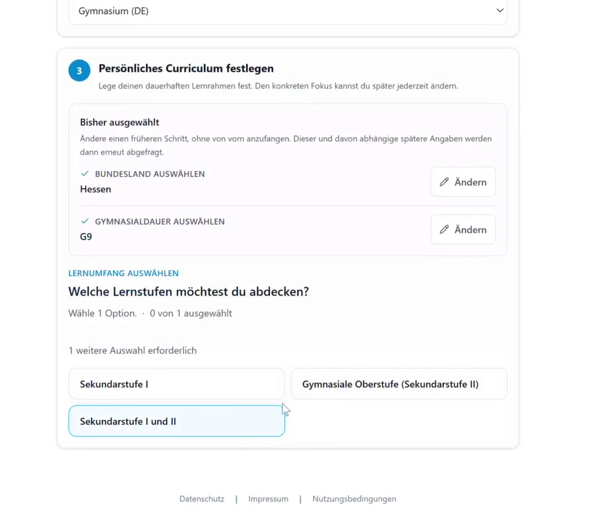
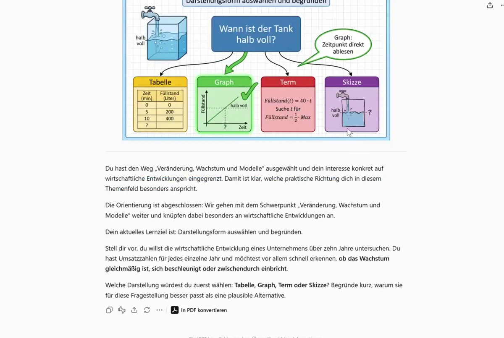
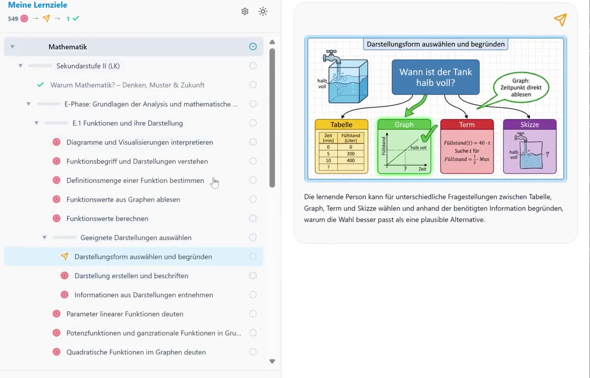
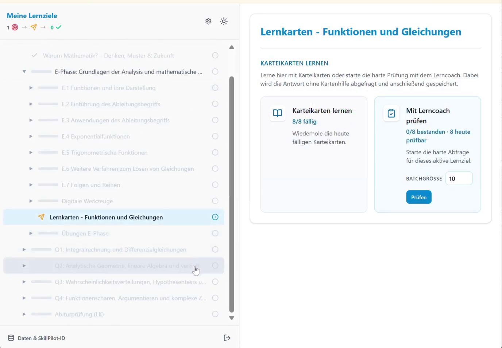
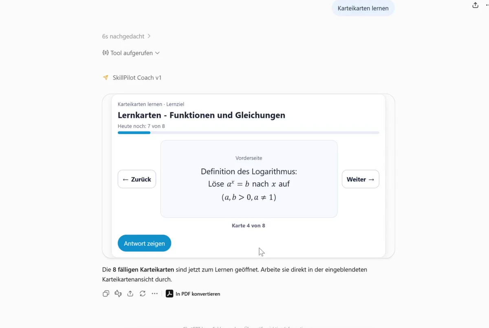
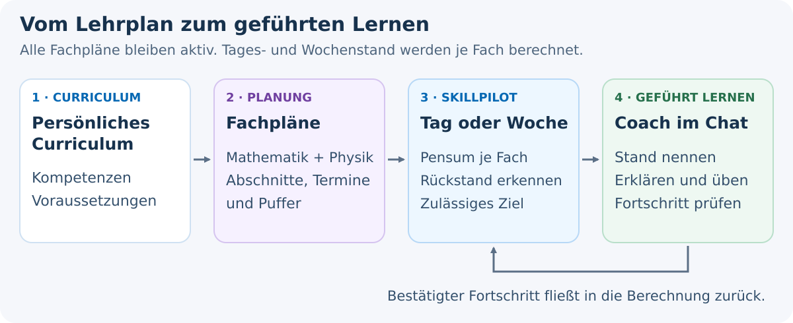
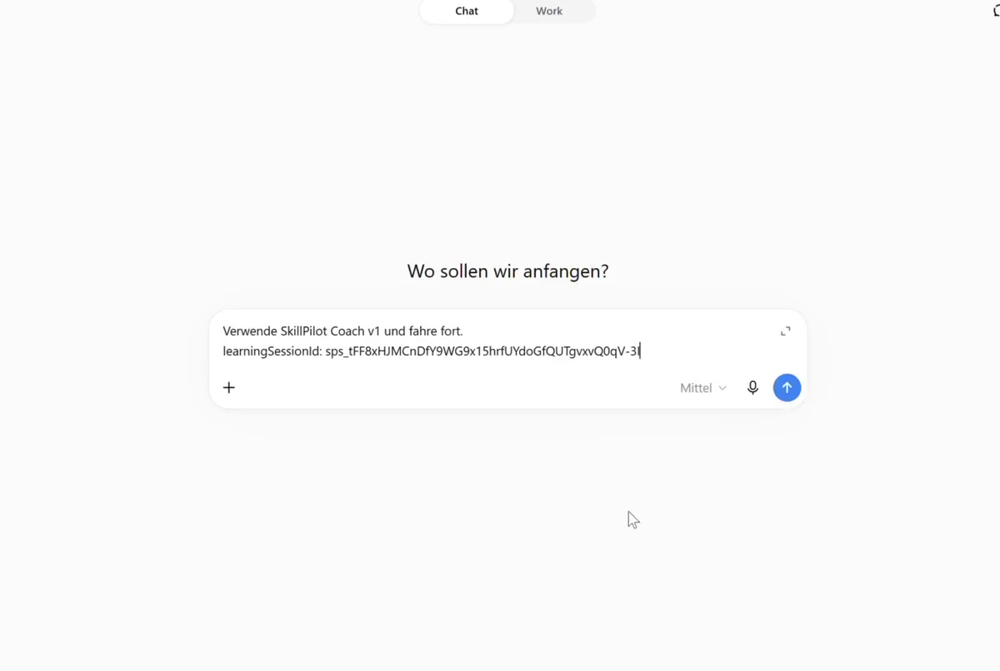

# SkillPilot Whitepaper (DE)

**Version:** 1.0.21
**Datum:** September 2026
**Projekt:** SkillPilot

---

## Zusammenfassung

SkillPilot dockt an **bestehende Curricula** an und nutzt sie als **normative Source of Truth** (z.B. staatliche Lehrpläne, Modulhandbücher, Standards wie CEFR). SkillPilot ersetzt diese Standards nicht, sondern übersetzt sie in einen versionierten, maschinenlesbaren **Skill-Graph** als operatives Modell. Lernende, Lehrkräfte und ein KI-Lerncoach nutzen diesen Graphen als maschinenlesbare Landkarte. So kann der Lernende von seinem aktuellen **Skill-Stand** sicher zu seinen **Skill-Zielen** navigieren. Die laufzeitliche Autorität für Lernstand, Persönliches Curriculum, aktuellen Fokus, aktives Ziel, Regeln und nächste Schritte liegt im Backend-State; der KI-Lerncoach führt dabei dialogisch auf Basis dieser **exakten Backend-Logik**.

Dazu erfasst das System Lernerfolge auf atomaren Skill-Zielen und leitet daraus den **Beherrschungsgrad** für übergeordnete Themen ab. Auf dieser Basis führt der Weg über die **nächsten erreichbaren Skill-Ziele** systematisch hin zu den individuellen Bildungszielen.

**Lernpläne ergänzen diese Navigation um den zeitlichen Rahmen:** Welche Teile des persönlichen Curriculums sollen bis wann erreicht werden? In der lokal implementierten Erweiterung für plan-geführtes Lernen werden die Tagesanforderungen aller geplanten Fächer zusammengeführt. Der Coach zeigt den Stand im Chat und führt zum nächsten lernbaren Ziel, ohne dass Lernende selbst Planabschnitte oder Lernziele verwalten müssen (siehe Abschnitt 3.4).

Die Qualitätssicherung erfolgt offen: über ein **Champion-Programm** aus der Praxis sowie über den **Open-Source-Workflow** (Issues/Pull Requests).

### SkillGraph Processing

SkillGraph Processing strukturiert Curricula und Kompetenzmodelle zu abhängigkeitsbasierten Skill-Landschaften, die von Menschen und KI-Agenten validiert, erkundet und genutzt werden können. In der Weboberfläche entsteht daraus ein persönliches Curriculum mit klar ausgewiesenem Bildungskontext.

### SkillPilot Lerncoach

SkillPilot Lerncoach begleitet Lernende durch diese Landschaften mit frontier-basierten nächsten Schritten, Mastery-Tracking und kontextbezogener Lerncoach-Unterstützung.

**SkillPilot Coach v1** befindet sich derzeit im OpenAI-Veröffentlichungsreview und ist noch nicht öffentlich gelistet. Die unterstützte Coach-Oberfläche ist **ChatGPT im Browser**. Die responsive First-Party-SkillPilot-Weboberfläche kann auch im mobilen Browser genutzt werden, etwa für Spracheingabe und das Hochladen fotografierter Arbeiten. Native ChatGPT-Apps gehören derzeit nicht zum unterstützten SkillPilot-Ablauf.

**Lesart dieses Whitepapers:** Wenn nicht anders markiert, beschreibt der Text den aktuellen Stand. Formulierungen wie *geplant*, *vorgesehen* oder *in weiteren Ausbaustufen* kennzeichnen Roadmap-Punkte.

---

## 1. Die Herausforderung: Individuelle Skill-Navigation skaliert nicht

Bildung folgt Curricula, die staatlich vorgegeben oder durch **Akkreditierung** definiert sind. In der Praxis klafft jedoch eine Lücke zwischen Curriculum und Lernrealität:

- Lernende starten **nicht am selben Punkt** (Vorwissen, Tempo, Lücken).
- Lehrende müssen trotzdem **viele Personen parallel** steuern – oft in großen Kohorten.
- Lernziele liegen meist **als Text** vor, aber nicht als **navigierbare Struktur** mit Abhängigkeiten und sinnvollen nächsten Schritten.

Das führt zu Überforderung bei einigen, Langeweile bei anderen – und zu hohem Aufwand, Lernstände und nächste Schritte sauber zu erfassen.

SkillPilot schließt diese **Tool-Lücke**: outcome-orientierte Navigation im Curriculum, ohne dass Lehrende zu „Buchhalter:innen“ werden. SkillPilot setzt dabei **auf dem geltenden Curriculum auf** – es schafft keine neuen Standards, sondern macht bestehende Standards operational und navigierbar.

---

## 2. Der Umbruch: Möglichkeiten moderner KI-Agenten nutzen

Seit Ende 2022 hat sich die Welt der sprachbasierten KI rasant entwickelt. Ein Gefühl für dieses Tempo vermittelt der Blick auf *Humanity's Last Exam*, den bisher härtesten KI-Benchmark. Dieser wurde Anfang 2025 eingeführt, um KIs mit tausenden extremen Expertenfragen auf echtes logisches Denken statt bloßes Wissen zu prüfen. Während Spitzenmodelle zu Jahresbeginn noch fast völlig versagten (unter 10 % Erfolg), konnten führende KIs diese Leistung bis zum Jahresende auf etwa 50 % verfünffachen.

Stand **Dezember 2025** sind KIs damit fachlich und sprachlich vielen Themen gewachsen, die an Schulen und Universitäten gelehrt werden. Doch sie haben Grenzen: Sie sind keine ausgebildeten Pädagogen und arbeiten nicht wie algorithmisch exakte Buchhaltungsprogramme, die fehlerfrei rechnen und verwalten.

Um die für **SkillPilot** benötigte algorithmische **Präzision** bei der Navigation auf den Lernzielen zu sichern, kommt uns ein weiterer Trend zugute: Die Kopplung von Sprach-KIs an klassische Software. Es etablieren sich Standards, die es KIs wie ChatGPT ermöglichen, gezielt Schnittstellen (APIs) klassischer Programme aufzurufen.

Daraus ergibt sich der Ansatz für **SkillPilot** fast von selbst: Es entsteht als hybride Anwendung. Eine klassische, exakte Software übernimmt im Hintergrund die präzise „Buchführung“ und Navigation der Skill-Ziele. Führende Sprach-KIs werden so instruiert (als SkillPilot Lerncoach), dass sie als einfühlsame Lerncoaches mit den Lernenden sprechen, für den Lernfortschritt aber die exakte Logik der Software im Hintergrund nutzen.

---

## 3. Das Produkt: Wie SkillPilot funktioniert

### 3.1 Die Technologie: Der Skill-Graph (operatives Modell & Frontier)

SkillPilot ersetzt lineare Listen durch einen vernetzten Graphen.

Wichtig ist dabei die Trennung der Ebenen: Das offizielle Curriculum bleibt die **normative Quelle**. Der versionierte **Skill-Graph** ist das daraus abgeleitete **operative Modell**. Im Laufzeitbetrieb ist der **Backend-State** die maßgebliche Instanz für aktuellen Lernstand, Persönliches Curriculum, aktuellen Fokus, aktives Ziel und erlaubte Übergänge.

#### Andocken an bestehende Curricula (Rohinput & Traceability)

SkillPilot „erfindet“ keine Curricula: Lehrpläne, Modulhandbücher oder Standards dienen als **Rohinput** und werden in einen Skill-Graph übersetzt.

Die Integrität des Graphen wird durch eine formale mathematische Spezifikation sichergestellt (Acyclicity, Effective Requires, Transitive Minimality), die Zirkelbezüge verhindert und Abhängigkeiten logisch validiert.

Dabei geht es um:

- **Operationalisierung:** Learning Outcomes werden in atomare Skill-Ziele zerlegt (ohne den Standard zu verändern).
- **Traceability:** Jeder Skill bleibt auf Quelle/Abschnitt/Version zurückführbar.
- **Navigierbarkeit:** Prereqs und Hierarchien werden explizit modelliert, damit Pfade planbar werden (didaktische Prereqs ggf. als **Overlay**). Der **Gesamtgraph** erzwingt keinen einzelnen Lehrpfad, sondern erlaubt mehrere didaktisch sinnvolle Wege. Innerhalb eines **gewählten Scopes** oder einer **explizit modellierten Ziel-Route** schränkt SkillPilot die nächsten Schritte dann bewusst auf die passende Teilmenge ein. Im Standardmodus werden Voraussetzungen innerhalb des gewählten Fokus geprüft. Der optional aktivierbare **Strict Mode** prüft Voraussetzungen zusätzlich global und kann dadurch fehlende Grundlagen außerhalb des Fokus sichtbar machen.
- **Governance:** Änderungen laufen aktuell über GitHub (Issues/PRs), Versionierung über die GitHub-Historie (siehe Abschnitt 6).

#### Landkarte: Knoten & Kanten

- **Knoten:** atomare Skills („kann X erklären/anwenden“) und Cluster (Themen/Module).
- **Kanten:**
  - **Prerequisites:** „A vor B“
  - **Contains/Part-of:** „X umfasst Y und Z“

#### Drei Lernmodi bzw. Knotentypen in der Praxis

SkillPilot unterscheidet drei **Knotentypen**, die verschiedene Lernmodi abbilden:

- **Verstehen:** Gewöhnliche inhaltliche Lernziele werden vom KI-Lerncoach erklärt und eingeübt.
- **Sich merken:** Einzelne Fakten werden gezielt memoriert (modernes Karteikastenprinzip).
- **Selbstständig Probleme lösen:** Abitur‑Aufgaben werden selbstständig gelöst (z. B. auf einem Zettel, mit Handy fotografiert und hochgeladen), sofort bewertet (Punkte, bestanden/nicht bestanden, Fehler) und anschließend erklärt.

Diese drei Typen beschreiben **Lernmodi**. Die in Abschnitt 3.3 beschriebene didaktische Route ist eine separate Ebene: Sie ordnet Schritte wie Motivation, Verstehen, Memorieren und Anwenden entlang eines Pfads. **Motivation** ist damit eine didaktische Phase; wenn sie im Curriculum explizit modelliert wird, erscheint sie als vorgeschalteter Routen-Knoten, nicht als vierter Basistyp.

Im Fach **Mathematik** innerhalb der Gymnasium-Landschaften werden beispielsweise **alle drei Knotentypen** eingesetzt.

**Formale Spezifikation:** Die mathematische Definition des Graphen (u.a. Acyclicity, Effective Requires) ist öffentlich dokumentiert:
[Graph-Definition](https://enpasos.github.io/skillpilot/concept/skill-graph/graph-definition/)

#### Frontier: Nächste erreichbare Schritte

SkillPilot berechnet die **Frontier** relativ zum **aktiven Scope bzw. Filter**: Skills, deren Voraussetzungen in diesem aktiven Graph-Ausschnitt erfüllt sind, die aber noch nicht beherrscht werden.
So werden Sprünge vermieden und Lernen bleibt im Bereich sinnvoller nächster Schritte. Diese Grenze des aktuellen Wissens nennen wir die **Frontier** (didaktisch: Zone der nächsten Entwicklung nach Wygotski). Sie markiert exakt die Skills, die **innerhalb des aktuellen Filters** als Nächstes lernbar sind.
Die **Frontier ist keine KI-Empfehlung**, sondern die mathematisch berechnete Menge der im aktiven Graph-Ausschnitt logisch freigeschalteten Lernziele. Der optional aktivierbare **Strict Mode** berücksichtigt Voraussetzungen zusätzlich global und kann so fehlende Grundlagen außerhalb des aktuellen Fokus sichtbar machen.

### 3.2 Der Interaktions-Layer: Der KI-Lerncoach

Der Skill-Graph liefert die Route, doch Lernende interagieren nicht mit Datensätzen, sondern brauchen einen Reiseleiter. Diese Rolle übernimmt der **SkillPilot Lerncoach** als KI-Lerncoach. Er dient als intuitive Schnittstelle, die die abstrakten Instruktionen des Graphen in natürliche, motivierende Sprache übersetzt.

Der Lerncoach ist dabei keine „Black Box“, sondern agiert strikt auf Basis der Backend-Logik: Er empfängt vom Backend den aktiven Scope, die Frontier, das nächste Ziel und die erlaubten Übergänge, verpackt diese aber in einen didaktisch sinnvollen Dialog. So wird aus der „exakten Buchhaltung“ ein persönliches Lernerlebnis.

#### Fokus statt Ablenkung

Die in Kapitel 3.1 für den **aktiven Scope** berechnete **Frontier** dient dem Lerncoach als **Fokus-Filter**: Aus der Gesamtmenge werden nur die Inhalte gezeigt, die zum Ziel und zum aktuellen Stand passen – der **nächste machbare Schritt** statt „alles auf einmal“.

#### Mastery: Fortschritt als Evidenzmodell

Die aktuelle Cockpit-Ansicht trennt gewöhnliches Karteikartenüben vom evidenzwirksamen **Verified Recall**.

**Mastery** ist der backendseitige Lernzustand auf atomaren Zielen, kein Chatprotokoll. Bei gewöhnlichen atomaren Zielen kann er im Cockpit angepasst oder vom Lerncoach erst nach ausreichender Evidenz gespeichert werden. Orientierungsknoten verwenden nur einen Abschlussmarker und bescheinigen keine fachliche Beherrschung. Bei Memorierknoten wird Mastery aus dem serverseitigen Kartenstatus und dem strengen **Verified Recall** abgeleitet; gewöhnliches Karteikartenüben verändert nur den Wiederholungsplan. Clusterfortschritt wird gewichtet aus den enthaltenen Zielen aggregiert.

Der zentrale Zustand bleibt von vollständigen Dialogen und zusätzlichen Artefakten getrennt. Weitergehende Nachweise können institutionell über Artefakte oder Referenzen ergänzt werden.

> SkillPilot macht Fortschritt sichtbar – die Institution entscheidet, welche Evidenz welche Konsequenz hat.

#### Lerngeschwindigkeit (Learning Velocity)

Learning Velocity zeigt, wie viele **atomare Ziele** pro Woche neu als gemeistert gelten – als einfacher Rhythmus- und Kontinuitätsindikator.

### 3.3 Der hybride Lernkreislauf: Verstehen + Memorieren + Üben

Nicht jedes Lernziel lernt man gleich: Konzepte brauchen Verständnis und Anwendung, Fakten brauchen Wiederholung, und viele Skills brauchen **aktives Tun** (z.B. Programmieren, Rechnen, Schreiben). In Prüfungen wird genau dieses selbstständige Problemlösen verlangt.

**Der Weg zur Prüfungsreife ("Mach mich fit fürs Abi")**
In der Praxis lernen Schüler:innen selten isolierte Einzelthemen, sondern verfolgen ein übergreifendes Endziel. Die typische Herangehensweise ist das Abstecken eines festen Kontextes – beispielsweise „Leistungskurs Physik, Hessen, Abiturvorbereitung“.
Sobald dieser Kontext in SkillPilot definiert ist, bündelt das System aus der Gesamt-Landkarte alle relevanten Lernrouten, die zu den verlangten Klausurfähigkeiten führen. Lernende werden vom Lerncoach systematisch entlang dieser Routen dorthin geführt.
Diese Ziel-Route ist dabei eine Auswahl **innerhalb des größeren Graphen**, nicht dessen einzig möglicher Pfad.

**Die Systematik der Lernpfade (die didaktische Route)**
Innerhalb dieses Curriculums ist der Weg nicht dem Zufall überlassen. Abhängig vom Curriculum und Zieltyp kann eine Themen-Route mehrere didaktische Rollen verbinden und auf selbstständiges Anwenden oder einen passenden Übungs- bzw. Prüfungsknoten hinführen.

Eine typische fachliche Route kann folgende Rollen verbinden:
1. **Motivation ("Warum lernen wir das?")**: Wenn ein Orientierungsknoten modelliert ist, ordnet er ein, wozu das folgende Thema relevant sein kann.
2. **Verstehen (Guided Learning)**: Im sokratischen Dialog mit dem KI-Lerncoach wird ein neues Konzept geführt kennengelernt und das Verständnis Schritt für Schritt aufgebaut.
3. **Memorieren (Drill)**: Wo kompakte Fakten oder Formeln zuverlässig abrufbar sein müssen, werden sie über das integrierte Flashcard-System gefestigt.
4. **Anwenden:** Passende Übungs-, Autonomie- oder Prüfungsknoten führen zur selbstständigen Bearbeitung von Problemstellungen; der Lerncoach kann anschließend bewerten und Feedback geben.

Diese Rollen sind kein starrer Vier-Schritte-Ablauf. Sie ersetzen nicht die oben eingeführten drei Lernmodi, sondern können sie zusammen mit optionalen Orientierungsknoten zu einer passenden Route verbinden.

Hier ein schematisches Beispiel für eine einfache Route aus Motivation/Verstehen/Anwenden (Memorisieren läuft parallel), wie sie in SkillPilot modelliert und als PDF exportiert werden kann.

Während beim Verstehen sowie beim Bewerten und Erklären von Prüfungsleistungen die Interaktion mit einem Lerncoach hilft, funktioniert reines Auswendiglernen (Vokabeln, Formeln, Fakten) per modernem Karteikasten a la **Spaced Repetition** effizienter.

SkillPilot integriert dafür eine **Flashcard Drill Engine** (SRS):

- **Kompetenz-Loop:** Der Skill-Graph definiert, *was* als Nächstes dran ist.
- **Memorisier-Loop:** Die Drill Engine optimiert *wie* wiederholt wird (Intervalle, Priorisierung; z.B. SuperMemo-2).

SkillPilot nutzt bereits freigegebene Übungs- und Prüfungsknoten für passende Scopes. Weitere **Practice- und Assessment-Formate** für „Doing“-Skills (z.B. Aufgabenserien, Programmieraufgaben, Schreib-/Sprechübungen) bleiben ausbaubar.

#### Technische Ableitungen: Ziel-Route in Backend, UI und Lerncoach

- **Backend (didaktische Routenlogik):** Die Ziel-Route ist keine freie KI-Berechnung, sondern eine im Curriculum modellierte **Teilroute im größeren Graphen** unter DAG-Constraints. Das bedeutet: Die menschlichen Lehrplan-Autor:innen (Champions) behalten die pädagogische Kontrolle. Das **Persönliche Curriculum (Level 2)** wird ausschließlich in der First-Party-SkillPilot-Weboberfläche konfiguriert. SkillPilot Coach v1 fragt diese Konfiguration nicht ab und verändert sie nicht. Im Chat kann der Lerncoach nur den aktuellen Fokus und das aktive Ziel (**Level 3**) über vom Backend freigegebene Optionen und nach Zustimmung der lernenden Person ändern.
- **UI/UX (Routen-Visualisierung):** In der First-Party-Weboberfläche konfigurieren Lernende ihr Persönliches Curriculum. Im Cockpit sehen und ändern sie den aktuellen Fokus und das aktive Ziel; die Oberfläche zeigt Fortschritt und nächste erreichbare Ziele innerhalb dieses Kontexts.
- **KI-Lerncoach (Didaktischer Kontext):** Der Lerncoach arbeitet strikt auf Basis des bestätigten Kontexts, des aktuellen Fokus und der vom Backend erlaubten Übergänge und erklärt transparent, warum der aktuelle Schritt sinnvoll ist.

### 3.4 Vom Lehrplan zum Lernalltag: Lernplan und geführter Coach

Ein navigierbarer Lehrplan beantwortet noch nicht die Alltagsfrage: **„Was muss ich heute lernen, und wie weit bin ich schon?“** Dafür verbindet SkillPilot das persönliche Curriculum mit einer zeitlichen Lernplanung und der Führung durch den Coach.

**Umsetzungsstand dieser Erweiterung (4. September 2026):** Fachübergreifende Planung und Schülervorschau sind lokal implementiert; die plan-geführte Chatführung ist im Claude-Coach-1.1.1-Kandidaten vorbereitet. Der lokale OpenAI-1.1-Kandidat bleibt deaktiviert. Dieser Abschnitt erweitert nicht den eingereichten OpenAI-Coach-1.0.0-Reviewvertrag und behauptet weder Produktionsverfügbarkeit noch abgeschlossene Client-Abnahmen.

#### Die Lehrkraft plant den Rahmen

Das **Persönliche Curriculum** bestimmt, welche Kompetenzen zum gewählten Bildungskontext gehören. Der **Lernplan** legt fest, welche Themen oder Lernzielgruppen in welchen Zeiträumen bearbeitet werden sollen. Er ergänzt den Skill-Graphen, ersetzt aber weder seine Lernziele noch deren Voraussetzungen. Soll der gesamte Lehrplan durchlaufen werden, muss die Planung dessen vorgesehenen Umfang abdecken; ein abgeschlossener Teilplan ist nicht automatisch ein abgeschlossener Lehrplan.

Unter **„Kurse planen“** werden Lernabschnitte, Zeiträume, Puffer und Termine vorbereitet. Fachpläne, etwa für Mathematik und Physik, gelten **gemeinsam**: Die Anforderungen eines Tages addieren sich über alle Fächer. Der Wechsel des aktuellen Fachs schaltet keinen anderen Fachplan ab und schreibt keine Reihenfolge „erst Mathe vollständig, dann Physik“ vor. Überschneidende Abschnitte innerhalb eines Fachplans zählen dasselbe Lernziel nicht doppelt.

Die **Schülervorschau** zeigt vor der Übernahme die heutigen Anforderungen und die nächsten sieben Kalendertage. Sie verwendet dieselbe Berechnung wie der Chat. Grundlage ist eine Werktagsplanung von Montag bis Freitag, keine automatische Optimierung nach Stundenplan oder Ferien. Lernzielzahlen sind keine Lernminuten und keine Garantie, einen Termin zu erreichen. Die Lehrkraft prüft Umfang und Belastung und passt bei Bedarf die Planung an.

Entwürfe bleiben zunächst auf dem Planungsgerät. Erst die ausdrückliche gemeinsame Bestätigung macht sie beim Schüler wirksam; spätere Entwurfsänderungen wirken nicht ungeprüft in laufendes Lernen hinein. **Unterrichtsabdeckung ist nicht Schüler-Mastery:** Die Dokumentation „im Unterricht behandelt“ bescheinigt noch keine individuelle Beherrschung.

#### Der Schüler lernt im Chat

Bei aktivem Planmodus und gültiger Lernsession hält SkillPilot die Organisation im Hintergrund:

1. **Orientieren:** Der Coach nennt für jedes Fach die heute neu fälligen Ziele, wie viele davon bereits beherrscht sind, wie viele noch offen sind und welche Rückstände hinzukommen.
2. **Automatisch anknüpfen:** Ein gültiges laufendes Ziel wird fortgesetzt; andernfalls wird ein fälliges, nach den Voraussetzungen lernbares Ziel gewählt, sofern eines verfügbar ist. Die gemeinsame Aktivierung kann dieses erste Ziel bereits auswählen. Es ist kein zusätzlicher Klick auf „Weiterlernen“ oder eine manuelle Zielsuche nötig.
3. **Lernen und Fortschritt prüfen:** Der Coach erklärt, stellt Aufgaben und begleitet die Bearbeitung. Erst nach den geltenden Evidenzregeln gespeicherter Fortschritt verändert den Lernstand und damit die Tageszahlen. Danach führt der plan-geführte Ablauf zum nächsten zulässigen Schritt.
4. **Fach wechseln oder abschließen:** Ein Wunsch wie „Jetzt Physik“ wechselt innerhalb der verfügbaren Fachoptionen; die übrigen Anforderungen bleiben bestehen. Sind alle wirksamen Fachpläne zuverlässig auswertbar und sämtliche bis heute fälligen Ziele einschließlich Rückständen erledigt, meldet der Coach den Tagesabschluss. Künftige Ziele werden nicht automatisch zu zusätzlicher heutiger Pflicht.

Eine reine Statusfrage startet keine neue Aufgabe; eine gewünschte Pause bleibt eine Pause. Sind offene Ziele wegen Voraussetzungen oder ungültiger Planung nicht erreichbar, meldet der Coach die Blockade statt einen Tagesabschluss oder eine Ersatzpflicht zu erfinden. Planungskorrekturen bleiben auf der Planungsseite. Nach Ablauf der Lernsession ist weiterhin ein neuer Start über SkillPilot erforderlich; die Chatführung verlängert die Session nicht.

#### Beispiel: Mathematik und Physik an einem Tag

Die folgenden Zahlen sind ein **Rechenbeispiel**, keine Live-Daten:

- **Mathematik:** 4 heute neu fällige Ziele, davon 2 beherrscht und 2 noch offen; zusätzlich 1 offenes Ziel aus früheren Tagen.
- **Physik:** 3 heute neu fällige Ziele, davon 1 beherrscht und 2 noch offen; zusätzlich 2 offene Ziele aus früheren Tagen.
- **Gesamt:** 7 heute neu fällige Ziele, davon 3 beherrscht und 4 noch offen; zusammen mit 3 Rückständen bleiben **7 Ziele zu bearbeiten**.

Der Coach kann daraus kurz sagen: **„Von den heute fälligen Zielen beherrschst du in Mathe 2 von 4 und in Physik 1 von 3. Mit den Rückständen bleiben insgesamt 7 Ziele offen. Wir machen mit deinem aktuellen Matheziel weiter; du kannst auch zu Physik wechseln.“** Dieses Beispiel setzt ein gültiges, noch offenes Matheziel und ein aktuell startbares Physikziel voraus.

„Davon beherrscht“ bezeichnet den aktuellen Lernstand innerhalb der heute fälligen Ziele, **nicht zwingend heute neu erreichte Erfolge**. Die sieben offenen Ziele ergeben sich aus vier offenen neuen Tageszielen plus drei Rückständen. Rückstände bleiben sichtbar, werden aber nicht als täglich neue Lernziele mehrfach zur Wochenlast addiert.

Damit wird der Lehrplan zu einem begleiteten Lernweg: **Die Lehrkraft verantwortet Umfang und Zeitrahmen, SkillPilot berechnet die nächsten zulässigen Schritte, der Coach führt den Dialog und der Schüler konzentriert sich auf das Lernen.**

---

## 4. Vertrauensarchitektur: Security & Integrity

### 4.1 Datenansatz: Sicherheit, Datenschutz & Souveränität by Design

Ein zentraler Pfeiler von SkillPilot ist **Datentrennung**. Die folgende Architekturübersicht zeigt, wie dauerhafte pseudonyme Identität, kurzlebige Lernsession, App-Autorisierung und autoritativer Lernzustand voneinander getrennt bleiben.

#### Pseudonym statt Identität

Lernstände werden unter einer dauerhaften **pseudonymen SkillPilot-ID** geführt. Für die individuelle Nutzung ist keine Registrierung mit Name oder E-Mail-Adresse erforderlich. Die ID bleibt in SkillPilot, sollte als geschützte ID-Datei gesichert werden und wird weder an ChatGPT noch an den Lerncoach übermittelt. Gespeichert werden die für Lernstand, Navigation und Nachvollziehbarkeit benötigten Daten.

#### Session-Abschirmung gegenüber dem KI-Frontend

Jeder bewusste Start von **SkillPilot Coach v1** aus der First-Party-Weboberfläche erzeugt eine neue zufällige `learningSessionId` mit einer absoluten Gültigkeit von genau 24 Stunden und öffnet einen neuen vorbereiteten Chat. SkillPilot setzt die Session automatisch in die vorbereitete Startnachricht ein; die lernende Person muss keinen technischen Wert kopieren oder verwalten. Die Gültigkeit wird weder durch Nutzung noch durch eine OAuth-Aktualisierung verlängert. Die Session übernimmt die im bestätigten Kontext festgelegte Kommunikationssprache Deutsch oder Englisch. Eine einzige sprachneutrale V1-App bedient beide Sprachen. OAuth autorisiert die App, wählt aber weder die lernende Person noch ihren Lernkontext aus.

Die Verbindung zum Backend wird unabhängig davon mehrschichtig abgesichert: SkillPilot akzeptiert fachliche Zugriffe nur über die zugelassene und authentisierte Coach-App und nur zusammen mit einer gültigen Lernsession. Die App-Freigabe allein eröffnet keinen Lernstand; eine Lernsession allein gewährt keinen Backend-Zugriff. So bleiben Integrationsberechtigung und zeitlich begrenzter Lernkontext bewusst getrennt.

#### Dialoginhalt ist entkoppelt

Das SkillPilot-Backend speichert keinen vollständigen Lerncoach-Chatverlauf. Es verarbeitet nur die zweckgebundenen Angaben, die für Lernstand, Navigation und freigegebene Aktionen benötigt werden. Der vollständige Chatverlauf in ChatGPT unterliegt den Bedingungen von ChatGPT/OpenAI. So bleibt der zentrale SkillPilot-Datenbestand begrenzt.

**Empfehlung für Bildungsinstitutionen:**
Klare Guidelines, welche Daten im Lerncoach-Chat nicht hineingehören (sensibles Privates) und wie Lernende sicher unterstützt werden.

#### Zuordnung in der Institution (lokal)

Die Zuordnung „Wer ist welches Pseudonym?“ liegt bei der Institution/Lehrkraft und wird **lokal** gespeichert (z.B. in geschützter Ablage) – nicht zentral.

#### KI-Frontend / Providergrenze

Der Lerncoach-Dialog von **SkillPilot Coach v1** findet in **ChatGPT im Browser** statt und unterliegt dem Betriebs- und Datenschutzrahmen von ChatGPT/OpenAI. Die First-Party-SkillPilot-Weboberfläche ist responsiv und kann auch im mobilen Browser genutzt werden; native ChatGPT-Apps gehören derzeit nicht zum unterstützten Ablauf. Das darunterliegende Betriebssystem ist nicht Teil des Supportversprechens. Weitere Provider-Integrationen werden getrennt geführt und erst nach einem vollständigen End-to-End-Akzeptanztest sowie einer Prüfung der Datenschutzgrenzen freigegeben.

Für Kontexte mit höheren Souveränitätsanforderungen sind weitere KI-Backends bis hin zu lokalen Modellen vorgesehen. Voraussetzung ist, dass sie Tool-Nutzung, Stabilität, Datenschutzgrenzen, Struktur und Didaktik zuverlässig erfüllen.

### 4.2 Nachweiskette (Chain of Custody): Integrität & Nachvollziehbarkeit

Damit Lernstände **portabel** und **prüfbar** bleiben, nutzt SkillPilot ein **Chain-of-Custody**-Pattern.

- Lernfortschrittsänderungen akzeptiert SkillPilot nur über zugelassene und authentisierte Integrationen.
- Schreibrechte gelten nur über die zugelassene Coach-App, innerhalb einer aktiven kurzlebigen Lernsession und begrenzt auf den jeweiligen Vorgang.
- Die dauerhafte pseudonyme Kennung wird dem KI-Frontend nicht offengelegt.

#### Signierte Exporte

Lernende können Profil + Fortschritt exportieren.
Der Server **signiert** diese Exporte kryptografisch, sodass Offline-Manipulation erkennbar ist. Heute signiert der Export primär Zustandsdaten (Mastery/Status), Scope-Information, Zeitstempel und Provenienz-/Integritätsmetadaten. Er ist damit **kein Ersatz** für eine vollständige Ablage aller zugrunde liegenden Dialoge oder Artefakte.

#### Herkunftsnachweis beim Import

Beim Import (z.B. Wechsel, Backup) kann die komplette **Herkunftskette** mitgeführt werden. So wird sichtbar, ob ein Stand weitergeführt oder von außen übernommen wurde.

**Wichtig:** Chain of Custody schützt Integrität und Herkunft – sie ist ein **Transparenzwerkzeug**, kein vollständiger Betrugsschutz.

---

## 5. Das Ökosystem: Inhalte & Standards

### 5.1 Status quo: Verfügbare Inhalte (Beispiele)

SkillPilot ist nicht nur Konzept: Es enthält bereits Curricula und Standards als Startpunkt. Ihre Qualität wird über das maschinenlesbare Reifegradmodell **M0 bis M7** ausgewiesen. Es trennt unter anderem Graphintegrität, Bundesland-Abdeckung, Routendeckung, prüfungsfähige Aufgaben, semantische Atomicity, Memory-Card-Traceability und freigegebene Visualisierungen. Ein Reifegrad gilt immer nur für den exakt benannten Scope.

Der jeweils aktuelle Stand im generierten Qualitätsstatus und im [Curriculum-Verzeichnis](https://skillpilot.com/curricula) ist maßgeblich. Dadurch bleibt das Whitepaper auch dann korrekt, wenn weitere Curricula hinzukommen oder ein Scope eine neue Qualitätsstufe erreicht.

**Curriculum Champions (Praxisanker):**

- Champions übernehmen Verantwortung für ein Curriculum oder einen **klaren Themen-Scope**.
- Sie **lernen das Curriculum durch**, sammeln Praxisfeedback und bündeln es in Issues/PRs.
- Sichtbarkeit schafft Verantwortung: Champion-Profile zeigen Engagement (z.B. Issues/PRs) und Fortschritt.

Der QS-Prozess bezieht sich nicht nur auf Curricula: Der SkillPilot KI-Lerncoach wird im laufenden Betrieb kontinuierlich qualifiziert, damit die Nutzung über reale Curricula hinweg zuverlässig und didaktisch sinnvoll bleibt.

#### Schule (Beispiele aus den verfügbaren Curricula)

**Bayern:**

- Grundschule (Jgst 1–4)
- Mittelschule (Jgst 5–10)
- Realschule (Jgst 5–10)
- Gymnasium (Jgst 5–13)
- Fachoberschule & Berufsoberschule (FOS/BOS)
- Wirtschaftsschule

**Hessen:**

- Gymnasiale Oberstufe (G9, Sekundarstufe II)
- Gymnasiale Mittelstufe (G9, Sekundarstufe I)

#### Hochschule (Bologna-relevant)

- Uni Heidelberg: Bachelor Biowissenschaften, Master Molecular BioSciences, Physikum Medizin
- Uni Mannheim: Bachelor BWL, Bachelor Jura, Master Jura
- TU Darmstadt: Bachelor Informatik
- TU München: Bachelor Informatik, Bachelor Mathematik, Bachelor Physik, Master Quantenwissenschaft und -technologie, Master Theoretische und Mathematische Physik, Executive Master of Business Administration (MBA)

#### Sprachen (CEFR A1–C2)

- Englisch (A1–C2)
- Französisch (A1–C2)

Die hier gelisteten Curricula sind Beispiele für **verfügbare Inhalte** und besitzen nicht automatisch denselben Reifegrad. Maßgeblich ist immer der Reifegrad **M0 bis M7** des exakt angezeigten Scopes im [Curriculum-Verzeichnis](https://skillpilot.com/curricula). Curriculum Champions ergänzen diese maschinenlesbare Qualitätssicherung durch Praxisfeedback für klar benannte Scopes.

> Wir laden dazu ein, diesen Prozess aktiv mitzugestalten: **[Werden Sie Curriculum Champion](https://skillpilot.com/curricula)** und helfen Sie dabei, die Qualität und Praxisnähe Ihres Fachbereichs sicherzustellen.

Die Inhalte sind erweiterbar und versioniert; Quellenbezüge sind dokumentiert, und Änderungen laufen aktuell über GitHub (Issues/PRs).

### 5.2 SkillPilot im Kontext Bologna/EHEA (Kurzüberblick)

Bologna/EHEA setzt im Hochschulraum den Rahmen für **Outcomes, Transparenz, Anerkennung und Qualität**. SkillPilot kann diese Ziele unterstützen – ersetzt aber keine institutionellen Entscheidungen.

- **Learning Outcomes / Kompetenzen:** Beitrag: Outcomes als Skill-Graph navigierbar machen; Fortschritt sichtbar. Grenze/Voraussetzung: Saubere Modellierung, Quellenbezug, Versionierung.
- **Credits/Workload (ECTS-Logik):** Beitrag: Pfade/Prereqs und Workload-Transparenz unterstützen. Grenze/Voraussetzung: **Keine Credit-Vergabe**; Regeln bleiben institutionell.
- **Anerkennung/Mobilität:** Beitrag: Evidenz + signierte Exporte als Vorbereitung/Unterstützung. Wie in Kapitel 4.2 beschrieben, sichern die signierten Exporte vor allem Zustandsdaten und Provenienz ab; für stärkere Anerkennungsprozesse können zusätzliche institutionelle Nachweise nötig sein. Grenze/Voraussetzung: Anerkennung bleibt formaler Prozess.
- **Qualitätssicherung:** Beitrag: Signale über Hürden/Pfade für Lehrentwicklung. Grenze/Voraussetzung: QA-Prozesse + transparente KI-Regeln nötig.

---

## 6. Governance & Community: Open Source & Einladung

SkillPilot wird als **Open Source** unter der **Apache-2.0-Lizenz** veröffentlicht – als Einladung, bestehende Akteure einzubinden statt zu verdrängen:

- Institutionen behalten **Souveränität** über Curricula und Inhalte.
- Geprüfte Visualisierungen, Aufgaben und Memory-Decks können bereits direkt an Lernziele gebunden werden; weitere Content-Formate bleiben ausbaubar.
- Offene Schnittstellen ermöglichen Beiträge und Integration.

**Governance & Qualitätssicherung (aktuell über GitHub + Champion-Programm):**

- Feedback fließt über **GitHub Issues** und wird häufig durch Champions initiiert.
- Änderungen am Curriculum/Graph laufen über **Pull Requests** (Review in GitHub).
- **Versionierung** erfolgt über die GitHub-Historie; **Curriculaquellen** sind referenziert.
- Weitergehende Governance-Mechanismen (z.B. Fachreview-Gremien, QA-Prozesse, Overlays) sind perspektivisch möglich.

**Initiator:**
Träger ist die **enpasos GmbH**. Wir laden Partner ein, SkillPilot gemeinsam weiterzuentwickeln – fachlich, didaktisch und technisch.

Starten Sie sofort und anmeldefrei **(ID-basiert)** Ihren Piloten: Erstellen oder laden Sie Ihre pseudonyme SkillPilot-ID, sichern Sie sie als geschützte ID-Datei und konfigurieren Sie Ihr Persönliches Curriculum. Eine Anleitung für den 5-Minuten-Start finden Sie im [Kurzstart](https://skillpilot.com/quickstart/de).
Hinweis: Ihre **ID ist der einzige Schlüssel** zu Ihren Daten – bewahren Sie die geschützte ID-Datei sicher auf.

**Mehr Transparenz:**
[GitHub](https://github.com/enpasos/skillpilot)
[Dokumentation](https://enpasos.github.io/skillpilot/)
[Graph-Definition](https://enpasos.github.io/skillpilot/concept/skill-graph/graph-definition/)

---
