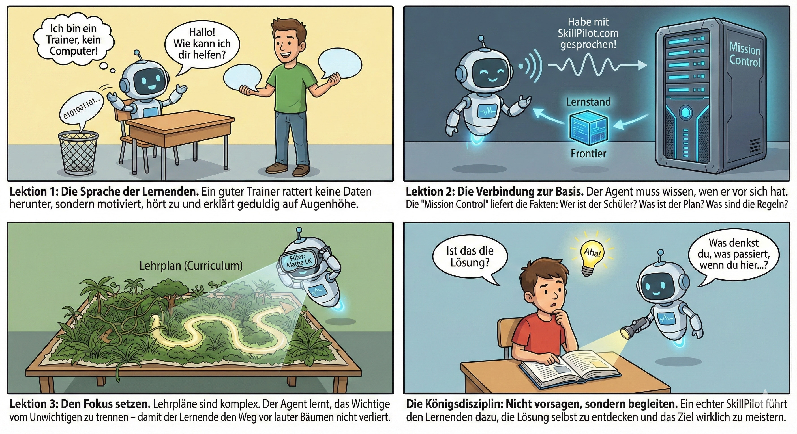
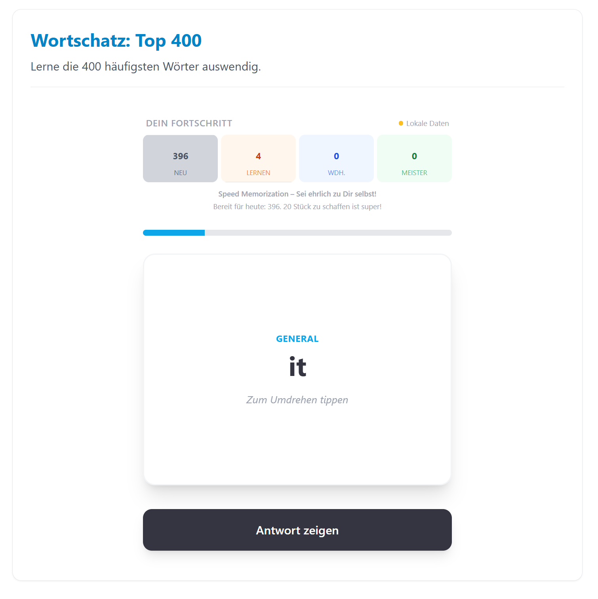

# SkillPilot Whitepaper (DE)

**Version:** 1.0.10
**Datum:** Januar 2026
**Projekt:** SkillPilot

---

## Zusammenfassung 

SkillPilot dockt an **bestehende Curricula** an und nutzt sie als **Source of Truth** (z.B. staatliche Lehrpläne, Modulhandbücher, Standards wie CEFR). SkillPilot ersetzt diese Standards nicht, sondern übersetzt sie in einen maschinenlesbaren **Skill-Graph**. Lernende, Lehrkräfte und ein KI-Tutor nutzen diesen als maschinenlesbare Landkarte. So kann der Lernende von seinem aktuellen **Skill-Stand** sicher zu seinen **Skill-Zielen** navigieren. Der KI-Tutor führt dabei dialogisch – und stützt sich für Lernstand, Regeln und nächste Schritte auf die **exakte Backend-Logik**.

Dazu erfasst das System Lernerfolge auf atomaren Skill-Zielen und leitet daraus den **Beherrschungsgrad** für übergeordnete Themen ab. Auf dieser Basis führt der Weg über die **nächsten erreichbaren Skill-Ziele** systematisch hin zu den individuellen Bildungszielen.

Die Qualitätssicherung erfolgt offen: über ein **Champion-Programm** aus der Praxis sowie über den **Open-Source-Workflow** (Issues/PRs).

---

## 1. Die Herausforderung: Individuelle Skill-Navigation skaliert nicht

Bildung folgt Curricula, die staatlich vorgegeben oder durch **Akkreditierung** definiert sind. In der Praxis klafft jedoch eine Lücke zwischen Curriculum und Lernrealität:

* Lernende starten **nicht am selben Punkt** (Vorwissen, Tempo, Lücken).
* Lehrende müssen trotzdem **viele Personen parallel** steuern – oft in großen Kohorten.
* Lernziele liegen meist **als Text** vor, aber nicht als **navigierbare Struktur** mit Abhängigkeiten und sinnvollen nächsten Schritten.

Das führt zu Überforderung bei einigen, Langeweile bei anderen – und zu hohem Aufwand, Lernstände und nächste Schritte sauber zu erfassen.

SkillPilot schließt diese **Tool-Lücke**: outcome-orientierte Navigation im Curriculum, ohne dass Lehrende zu „Buchhalter:innen“ werden. SkillPilot setzt dabei **auf dem geltenden Curriculum auf** – es schafft keine neuen Standards, sondern macht bestehende Standards operational und navigierbar.

---

## 2. Der Umbruch: Möglichkeiten moderner KI-Agenten nutzen

In den drei Jahren, seit ChatGPT im November 2022 online ging, hat sich die Welt der sprachbasierten KI rasant entwickelt. Ein Gefühl für dieses Tempo vermittelt der Blick auf *Humanity's Last Exam*, den bisher härtesten KI-Benchmark. Dieser wurde Anfang 2025 eingeführt, um KIs mit tausenden extremen Expertenfragen auf echtes logisches Denken statt bloßes Wissen zu prüfen. Während Spitzenmodelle zu Jahresbeginn noch fast völlig versagten (unter 10 % Erfolg), konnten führende KIs diese Leistung bis zum Jahresende auf etwa 50 % verfünffachen.

Stand Ende 2025 sind KIs damit fachlich und sprachlich vielen Themen gewachsen, die an Schulen und Universitäten gelehrt werden. Doch sie haben Grenzen: Sie sind keine ausgebildeten Pädagogen und arbeiten nicht wie algorithmisch exakte Buchhaltungsprogramme, die fehlerfrei rechnen und verwalten.

Um die für **SkillPilot** benötigte algorithmische **Präzision** bei der Navigation auf den Lernzielen zu sichern, kommt uns ein weiterer Trend zugute: Die Kopplung von Sprach-KIs an klassische Software. Es etablieren sich Standards, die es KIs wie ChatGPT ermöglichen, gezielt Schnittstellen (APIs) klassischer Programme aufzurufen.

Daraus ergibt sich der Ansatz für **SkillPilot** fast von selbst: Es entsteht als hybride Anwendung. Eine klassische, exakte Software übernimmt im Hintergrund die präzise „Buchführung“ und Navigation der Skill-Ziele. Führende Sprach-KIs werden so instruiert (als SkillPilot GPT), dass sie als einfühlsame Trainer mit den Lernenden sprechen, für den Lernfortschritt aber die exakte Logik der Software im Hintergrund nutzen.

---

## 3. Der KI-Tutor: Ein Agent „in Ausbildung“

Der SkillPilot KI-Tutor ist kein fertiges Produkt, sondern ein **Trainer in Ausbildung**. Vier Fähigkeiten sind zentral:

1. **Tonart (Chat Persona)**  
   Motivieren, verständlich erklären, auf Augenhöhe bleiben.

2. **Mission Control (Backend-Interaktion)**  
   Lernstand, Regeln und nächste Schritte werden **nicht geraten**, sondern aus dem Backend bezogen.

3. **Curriculum-Navigation**  
   Komplexe Curricula werden per Filter (z.B. Track, Niveau) auf sinnvolle Pfade reduziert. Das Curriculum bleibt Referenz; verbessert wird nur die **maschinenlesbare Abbildung** (Granularität, Verweise, Abhängigkeiten).

4. **Didaktik**  
   Nicht vorsagen, sondern führen: gute Fragen, Fehler sichtbar machen, Transfer fördern – bis zum „Aha“.

**Qualitätsprinzip:** SkillPilot ist primär **formativ** (Feedback/Üben/Orientierung). Für **High-stakes** (Noten, Anerkennung) braucht es institutionelle Regeln und ggf. Human-in-the-loop.

---
 

## 4. Die Technologie: Der Skill-Graph

SkillPilot ersetzt lineare Listen durch einen vernetzten Graphen.

### 4.1 Andocken an bestehende Curricula (Rohinput & Traceability)

SkillPilot „erfindet“ keine Curricula: Lehrpläne, Modulhandbücher oder Standards dienen als **Rohinput** und werden in einen Skill-Graph übersetzt.

Dabei geht es um:

* **Operationalisierung:** Learning Outcomes werden in atomare Skill-Ziele zerlegt (ohne den Standard zu verändern).
* **Traceability:** Jeder Skill bleibt auf Quelle/Abschnitt/Version zurückführbar.
* **Navigierbarkeit:** Prereqs und Hierarchien werden explizit modelliert, damit Pfade planbar werden (didaktische Prereqs ggf. als **Overlay**).
* **Governance:** Änderungen laufen aktuell über GitHub (Issues/PRs), Versionierung über die GitHub-Historie (siehe Abschnitt 10).

### 4.2 Landkarte: Knoten & Kanten

* **Knoten:** atomare Skills („kann X erklären/anwenden“) und Cluster (Themen/Module).
* **Kanten:**
  * **Prerequisites:** „A vor B“
  * **Contains/Part-of:** „X umfasst Y und Z“

### 4.3 Frontier: Nächste erreichbare Schritte

SkillPilot berechnet die **Frontier**: Skills, deren Voraussetzungen erfüllt sind, die aber noch nicht beherrscht werden.  
So werden Sprünge vermieden und Lernen bleibt im Bereich sinnvoller nächster Schritte.

### 4.4 Fokus statt Ablenkung

Der Graph dient als **Fokus-Filter**: Aus der Gesamtmenge werden nur die Inhalte gezeigt, die zum Ziel und zum aktuellen Stand passen – der **nächste machbare Schritt** statt „alles auf einmal“.

### 4.5 Mastery: Fortschritt als Evidenzmodell

**Mastery** ist kein Logbuch, sondern ein abgeleiteter Status aus Lerninteraktionen. Für Anschlussfähigkeit hilft ein simples Evidenzmodell:

* **Formativ:** Tutor-Dialoge, Aufgaben im Gespräch, kurze Checks.
* **Optional stärker:** Quizzes, Aufgabenserien, Artefakte (Rechenweg/Code/Kurztext), mündliche Checks.
* **Optional Review:** Skills können später ein Re-Check verlangen.

> SkillPilot macht Fortschritt sichtbar – die Institution entscheidet, welche Evidenz welche Konsequenz hat.

### 4.6 Lerngeschwindigkeit (Learning Velocity)

Learning Velocity zeigt, wie viele **atomare Ziele** pro Woche neu als gemeistert gelten – als einfacher Rhythmus- und Kontinuitätsindikator.

--- 

## 5. Der hybride Lernkreislauf: Verstehen + Memorieren + Üben

Nicht jedes Lernziel lernt man gleich: Konzepte brauchen Verständnis und Anwendung, Fakten brauchen Wiederholung – und viele Skills brauchen **aktives Tun** (z.B. Programmieren, Rechnen, Schreiben).

Der Skill-Graph modelliert Verständnis und Abhängigkeiten. Für reines Auswendiglernen (Vokabeln, Formeln, Fakten) ist **Spaced Repetition** effizienter.

SkillPilot integriert dafür eine **Flashcard Drill Engine** (SRS):

* **Kompetenz-Loop:** Der Skill-Graph definiert, *was* als Nächstes dran ist.
* **Memorisier-Loop:** Die Drill Engine optimiert *wie* wiederholt wird (Intervalle, Priorisierung; z.B. SuperMemo-2).

Ergänzend braucht es weitere Lernmodi für „Doing“-Skills: Der Tutor soll Lernende in passende **Practice-Formate** schicken (z.B. Aufgabenserien, Programmieraufgaben, Schreib-/Sprechübungen) und sie anschließend im Chat bei Auswertung, Feedback und Transfer begleiten.

---
## 6. Datenansatz: Security & Privacy by Design

Ein zentraler Pfeiler von SkillPilot ist **Datentrennung**.

### 6.1 Pseudonym statt Identität

Der **SkillPilot-Server** kennt Lernende ausschließlich als Pseudonym (`skillpilotId`).  
Auf dem Server werden nur technisch notwendige Metadaten gespeichert, z.B. der Lernfortschritt im Graphen.

### 6.2 Dialoginhalt ist entkoppelt

Der Dialoginhalt (Tutor-Gespräche) ist vom SkillPilot-Server entkoppelt. So bleibt der zentrale Datenbestand minimal.

**Empfehlung für Bildungsinstitutionen:**  
Klare Guidelines, welche Daten im Tutor-Chat nicht hineingehören (sensibles Privates) und wie Lernende sicher unterstützt werden.

### 6.3 Zuordnung in der Institution (lokal)

Die Zuordnung „Wer ist welches Pseudonym?“ liegt bei der Institution/Lehrkraft und wird **lokal** gespeichert (z.B. in geschützter Ablage) – nicht zentral.

### 6.4 KI-Frontend / Provider-Wahl (Souveränität)

Der Tutor-Dialog findet im jeweiligen KI-Frontend statt (aktuell: ChatGPT als Referenz-Integration) und unterliegt dessen Betriebs- und Datenschutzrahmen.  
Für Kontexte mit höheren Souveränitätsanforderungen sind alternative KI-Backends bis hin zu lokalen Modellen vorgesehen. Voraussetzung ist, dass sie die benötigten Eigenschaften (Tool-Nutzung, Stabilität, Struktur, Didaktik) zuverlässig erfüllen.

---

## 7. Nachweiskette (Chain of Custody): Integrität & Nachvollziehbarkeit

Damit Lernstände **portabel** und **prüfbar** bleiben, nutzt SkillPilot ein **Chain-of-Custody**-Pattern.

* Tutor-Instanzen authentisieren sich gegenüber dem Backend.
* Schreibrechte für Fortschritts-Updates erhalten nur **autorisierte Akteure** (aktuelles Muster: der Tutor als schreibender Akteur).

### 7.1 Signierte Exporte

Lernende können Profil + Fortschritt exportieren.  
Der Server **signiert** diese Exporte kryptografisch, sodass Offline-Manipulation erkennbar ist.

### 7.2 Herkunftsnachweis beim Import

Beim Import (z.B. Wechsel, Backup) kann die komplette **Herkunftskette** mitgeführt werden. So wird sichtbar, ob ein Stand weitergeführt oder von außen übernommen wurde.

**Wichtig:** Chain of Custody schützt Integrität und Herkunft – sie ist ein **Transparenzwerkzeug**, kein vollständiger Betrugsschutz.

--- 

## 8. Status quo: Verfügbare Inhalte (Beispiele)

SkillPilot ist nicht nur Konzept: Es enthält bereits Curricula/Standards als Startpunkt, die **offizielle Vorgaben** abbilden.

### Schule (Bayern & Hessen)

**Bayern:**
* Grundschule (Alle Fächer, Jgst 1–4)
* Mittelschule (Alle Fächer, Jgst 5–10)
* Realschule (Alle Fächer, Jgst 5–10)
* Gymnasium (Alle Fächer, Jgst 5–13)
* Fachoberschule & Berufsoberschule (FOS/BOS)
* Wirtschaftsschule

**Hessen:**
* Gymnasiale Oberstufe (G9, Sekundarstufe II)
* Gymnasiale Mittelstufe (G9, Sekundarstufe I)

### Hochschule (Bologna-relevant)
* Uni Heidelberg: Bachelor Biowissenschaften, Master Molecular BioSciences, Physikum Medizin
* Uni Mannheim: Bachelor BWL, Bachelor Jura, Master Jura
* TU Darmstadt: Bachelor Informatik
* TU München: Bachelor Informatik, Bachelor Mathematik, Bachelor Physik, Master Quantenwissenschaft und -technologie, Master Theoretische und Mathematische Physik, Executive Master of Business Administration (MBA)

### Sprachen (CEFR A1–C2)
* Englisch (A1–C2)
* Französisch (A1–C2)

Die Inhalte sind erweiterbar und versioniert; Quellenbezüge sind dokumentiert, und Änderungen laufen aktuell über GitHub (Issues/PRs).

---

## 9. SkillPilot im Kontext Bologna/EHEA (Kurzüberblick)

Bologna/EHEA setzt im Hochschulraum den Rahmen für **Outcomes, Transparenz, Anerkennung und Qualität**. SkillPilot kann diese Ziele unterstützen – ersetzt aber keine institutionellen Entscheidungen.

- **Learning Outcomes / Kompetenzen:** Beitrag: Outcomes als Skill-Graph navigierbar machen; Fortschritt sichtbar. Grenze/Voraussetzung: Saubere Modellierung, Quellenbezug, Versionierung.
- **Credits/Workload (ECTS-Logik):** Beitrag: Pfade/Prereqs und Workload-Transparenz unterstützen. Grenze/Voraussetzung: **Keine Credit-Vergabe**; Regeln bleiben institutionell.
- **Anerkennung/Mobilität:** Beitrag: Evidenz + signierte Exporte als Vorbereitung/Unterstützung. Grenze/Voraussetzung: Anerkennung bleibt formaler Prozess.
- **Qualitätssicherung:** Beitrag: Signale über Hürden/Pfade für Lehrentwicklung. Grenze/Voraussetzung: QA-Prozesse + transparente KI-Regeln nötig.

---

## 10. Offener Ansatz: Open Source, Governance & Einladung

SkillPilot wird als **Open Source** unter der **Apache-2.0-Lizenz** veröffentlicht – als Einladung, bestehende Akteure einzubinden statt zu verdrängen:

* Institutionen behalten **Souveränität** über Curricula und Inhalte.
* Die Kopplung von Content an Skillziele ist perspektivisch möglich.
* Offene Schnittstellen ermöglichen Beiträge und Integration.

**Curriculum Champions (Praxisanker):**
* Champions übernehmen Verantwortung für ein Curriculum oder einen **klaren Themen-Scope**.
* Sie **lernen das Curriculum durch**, sammeln Praxisfeedback und bündeln es in Issues/PRs.
* Sichtbarkeit schafft Verantwortung: Champion-Profile zeigen Engagement (z.B. Issues/PRs) und Fortschritt.

**Governance & Qualitätssicherung (aktuell über GitHub + Champion-Programm):**
* Feedback fließt über **GitHub Issues** und wird häufig durch Champions initiiert.
* Änderungen am Curriculum/Graph laufen über **Pull Requests** (Review in GitHub).
* **Versionierung** erfolgt über die GitHub-Historie; **Curriculaquellen** sind referenziert.
* Weitergehende Governance-Mechanismen (z.B. Fachreview-Gremien, QA-Prozesse, Overlays) sind perspektivisch möglich.

**Initiator:**  
Träger ist die **enpasos GmbH**. Wir laden Partner ein, SkillPilot gemeinsam weiterzuentwickeln – fachlich, didaktisch und technisch.

---
