# SkillPilot Whitepaper (DE)

**Version:** 1.0.18
**Datum:** April 2026
**Projekt:** SkillPilot

---

## Zusammenfassung

SkillPilot dockt an **bestehende Curricula** an und nutzt sie als **normative Source of Truth** (z.B. staatliche Lehrpläne, Modulhandbücher, Standards wie CEFR). SkillPilot ersetzt diese Standards nicht, sondern übersetzt sie in einen versionierten, maschinenlesbaren **Skill-Graph** als operatives Modell. Lernende, Lehrkräfte und ein KI-Lerncoach nutzen diesen Graphen als maschinenlesbare Landkarte. So kann der Lernende von seinem aktuellen **Skill-Stand** sicher zu seinen **Skill-Zielen** navigieren. Die laufzeitliche Autorität für Lernstand, aktive Filter, Regeln und nächste Schritte liegt im Backend-State; der KI-Lerncoach führt dabei dialogisch auf Basis dieser **exakten Backend-Logik**.

Dazu erfasst das System Lernerfolge auf atomaren Skill-Zielen und leitet daraus den **Beherrschungsgrad** für übergeordnete Themen ab. Auf dieser Basis führt der Weg über die **nächsten erreichbaren Skill-Ziele** systematisch hin zu den individuellen Bildungszielen.

Die Qualitätssicherung erfolgt offen: über ein **Champion-Programm** aus der Praxis sowie über den **Open-Source-Workflow** (Issues/Pull Requests).

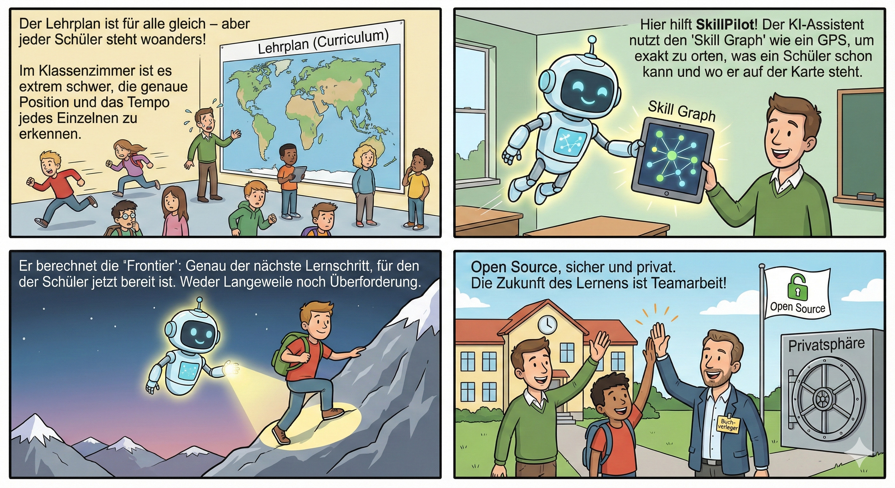

### SkillGraph Processing

SkillGraph Processing strukturiert Curricula und Kompetenzmodelle zu abhängigkeitsbasierten Lernlandschaften, die von Menschen und KI-Agenten validiert, erkundet und genutzt werden können.

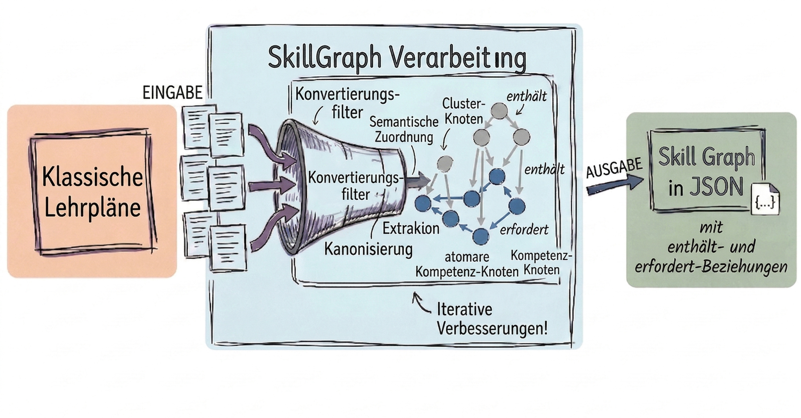

### SkillPilot Lerncoach

SkillPilot Lerncoach begleitet Lernende durch diese Landschaften mit frontier-basierten nächsten Schritten, Mastery-Tracking und kontextbezogener Lerncoach-Unterstützung.

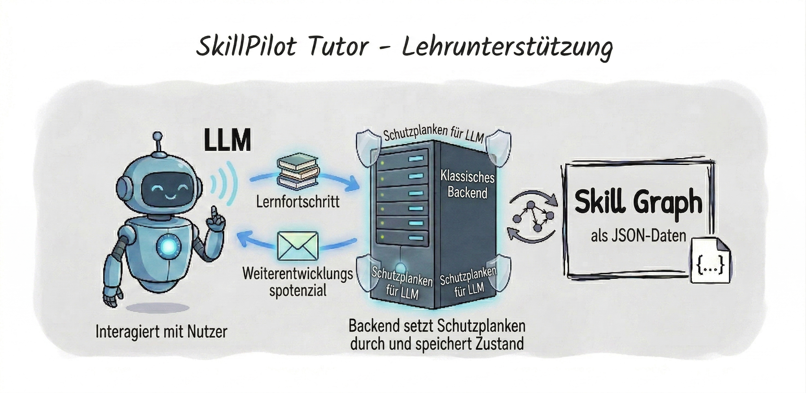

**Lesart dieses Whitepapers:** Wenn nicht anders markiert, beschreibt der Text den aktuellen Stand. Formulierungen wie *geplant*, *vorgesehen* oder *in weiteren Ausbaustufen* kennzeichnen Roadmap-Punkte.

---

## 1. Die Herausforderung: Individuelle Skill-Navigation skaliert nicht

Bildung folgt Curricula, die staatlich vorgegeben oder durch **Akkreditierung** definiert sind. In der Praxis klafft jedoch eine Lücke zwischen Curriculum und Lernrealität:

- Lernende starten **nicht am selben Punkt** (Vorwissen, Tempo, Lücken).
- Lehrende müssen trotzdem **viele Personen parallel** steuern – oft in großen Kohorten.
- Lernziele liegen meist **als Text** vor, aber nicht als **navigierbare Struktur** mit Abhängigkeiten und sinnvollen nächsten Schritten.

Das führt zu Überforderung bei einigen, Langeweile bei anderen – und zu hohem Aufwand, Lernstände und nächste Schritte sauber zu erfassen.

SkillPilot schließt diese **Tool-Lücke**: outcome-orientierte Navigation im Curriculum, ohne dass Lehrende zu „Buchhalter:innen“ werden. SkillPilot setzt dabei **auf dem geltenden Curriculum auf** – es schafft keine neuen Standards, sondern macht bestehende Standards operational und navigierbar.

---

## 2. Der Umbruch: Möglichkeiten moderner KI-Agenten nutzen

Seit Ende 2022 hat sich die Welt der sprachbasierten KI rasant entwickelt. Ein Gefühl für dieses Tempo vermittelt der Blick auf *Humanity's Last Exam*, den bisher härtesten KI-Benchmark. Dieser wurde Anfang 2025 eingeführt, um KIs mit tausenden extremen Expertenfragen auf echtes logisches Denken statt bloßes Wissen zu prüfen. Während Spitzenmodelle zu Jahresbeginn noch fast völlig versagten (unter 10 % Erfolg), konnten führende KIs diese Leistung bis zum Jahresende auf etwa 50 % verfünffachen.

Stand **Dezember 2025** sind KIs damit fachlich und sprachlich vielen Themen gewachsen, die an Schulen und Universitäten gelehrt werden. Doch sie haben Grenzen: Sie sind keine ausgebildeten Pädagogen und arbeiten nicht wie algorithmisch exakte Buchhaltungsprogramme, die fehlerfrei rechnen und verwalten.

Um die für **SkillPilot** benötigte algorithmische **Präzision** bei der Navigation auf den Lernzielen zu sichern, kommt uns ein weiterer Trend zugute: Die Kopplung von Sprach-KIs an klassische Software. Es etablieren sich Standards, die es KIs wie ChatGPT ermöglichen, gezielt Schnittstellen (APIs) klassischer Programme aufzurufen.

Daraus ergibt sich der Ansatz für **SkillPilot** fast von selbst: Es entsteht als hybride Anwendung. Eine klassische, exakte Software übernimmt im Hintergrund die präzise „Buchführung“ und Navigation der Skill-Ziele. Führende Sprach-KIs werden so instruiert (als SkillPilot GPT), dass sie als einfühlsame Lerncoaches mit den Lernenden sprechen, für den Lernfortschritt aber die exakte Logik der Software im Hintergrund nutzen.

---

## 3. Das Produkt: Wie SkillPilot funktioniert

### 3.1 Die Technologie: Der Skill-Graph (operatives Modell & Frontier)

SkillPilot ersetzt lineare Listen durch einen vernetzten Graphen.

Wichtig ist dabei die Trennung der Ebenen: Das offizielle Curriculum bleibt die **normative Quelle**. Der versionierte **Skill-Graph** ist das daraus abgeleitete **operative Modell**. Im Laufzeitbetrieb ist der **Backend-State** die maßgebliche Instanz für aktuellen Lernstand, aktive Filter und erlaubte Übergänge.

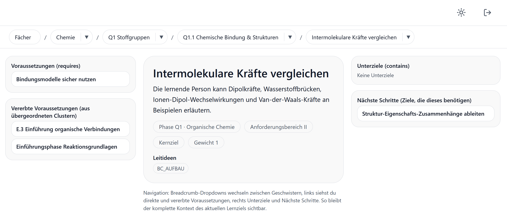

#### Andocken an bestehende Curricula (Rohinput & Traceability)

SkillPilot „erfindet“ keine Curricula: Lehrpläne, Modulhandbücher oder Standards dienen als **Rohinput** und werden in einen Skill-Graph übersetzt.

Die Integrität des Graphen wird durch eine formale mathematische Spezifikation sichergestellt (Acyclicity, Effective Requires, Transitive Minimality), die Zirkelbezüge verhindert und Abhängigkeiten logisch validiert.

Dabei geht es um:

- **Operationalisierung:** Learning Outcomes werden in atomare Skill-Ziele zerlegt (ohne den Standard zu verändern).
- **Traceability:** Jeder Skill bleibt auf Quelle/Abschnitt/Version zurückführbar.
- **Navigierbarkeit:** Prereqs und Hierarchien werden explizit modelliert, damit Pfade planbar werden (didaktische Prereqs ggf. als **Overlay**). Der **Gesamtgraph** erzwingt keinen einzelnen Lehrpfad, sondern erlaubt mehrere didaktisch sinnvolle Wege. Innerhalb eines **gewählten Scopes** oder einer **explizit modellierten Ziel-Route** schränkt SkillPilot die nächsten Schritte dann bewusst auf die passende Teilmenge ein. Der **Optimistische Modus** prüft Voraussetzungen nur **innerhalb des gewählten Filters** (z.B. Jahrgang), sodass ein Einstieg direkt im Themenjahr möglich ist, ohne dass Lücken aus Vorjahren blockieren. Erst wenn Lernende scheitern, schaltet der Lerncoach zur Diagnose in den **Pessimistischen Modus**, um die Lücke im Fundament zu finden.
- **Governance:** Änderungen laufen aktuell über GitHub (Issues/PRs), Versionierung über die GitHub-Historie (siehe Abschnitt 6).

#### Landkarte: Knoten & Kanten

- **Knoten:** atomare Skills („kann X erklären/anwenden“) und Cluster (Themen/Module).
- **Kanten:**
  - **Prerequisites:** „A vor B“
  - **Contains/Part-of:** „X umfasst Y und Z“

#### Drei Lernmodi bzw. Knotentypen in der Praxis

SkillPilot unterscheidet drei **Knotentypen**, die verschiedene Lernmodi abbilden:

- **Verstehen:** Alle Stoffthemen werden vom KI-Lerncoach erklärt und eingeübt.
- **Sich merken:** Einzelne Fakten werden gezielt memoriert (modernes Karteikastenprinzip).
- **Selbstständig Probleme lösen:** Abitur‑Aufgaben werden selbstständig gelöst (z. B. auf einem Zettel, mit Handy fotografiert und hochgeladen), sofort bewertet (Punkte, bestanden/nicht bestanden, Fehler) und anschließend erklärt.

Diese drei Typen beschreiben **Lernmodi**. Die in Abschnitt 3.3 beschriebene didaktische Route ist eine separate Ebene: Sie ordnet Schritte wie Motivation, Verstehen, Memorieren und Anwenden entlang eines Pfads. **Motivation** ist damit eine didaktische Phase; wenn sie im Curriculum explizit modelliert wird, erscheint sie als vorgeschalteter Routen-Knoten, nicht als vierter Basistyp.

Im Fach **Mathematik** innerhalb der Gymnasium-Landschaften werden beispielsweise **alle drei Knotentypen** eingesetzt.

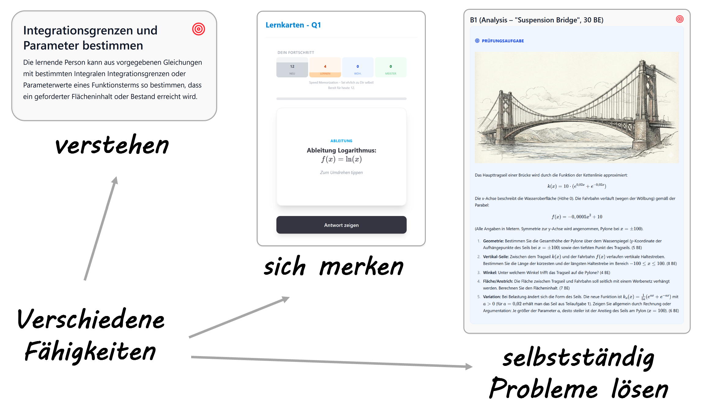

**Formale Spezifikation:** Die mathematische Definition des Graphen (u.a. Acyclicity, Effective Requires) ist öffentlich dokumentiert:
[Graph-Definition](https://enpasos.github.io/skillpilot/concept/curriculum-graph/graph-definition/)

#### Frontier: Nächste erreichbare Schritte

SkillPilot berechnet die **Frontier** relativ zum **aktiven Scope bzw. Filter**: Skills, deren Voraussetzungen in diesem aktiven Graph-Ausschnitt erfüllt sind, die aber noch nicht beherrscht werden.
So werden Sprünge vermieden und Lernen bleibt im Bereich sinnvoller nächster Schritte. Diese Grenze des aktuellen Wissens nennen wir die **Frontier** (didaktisch: Zone der nächsten Entwicklung nach Wygotski). Sie markiert exakt die Skills, die **innerhalb des aktuellen Filters** als Nächstes lernbar sind.
Die **Frontier ist keine KI-Empfehlung**, sondern die mathematisch berechnete Menge der im aktiven Graph-Ausschnitt logisch freigeschalteten Lernziele. Für Diagnose kann der Scope bewusst erweitert werden (z.B. im **Pessimistischen Modus**).

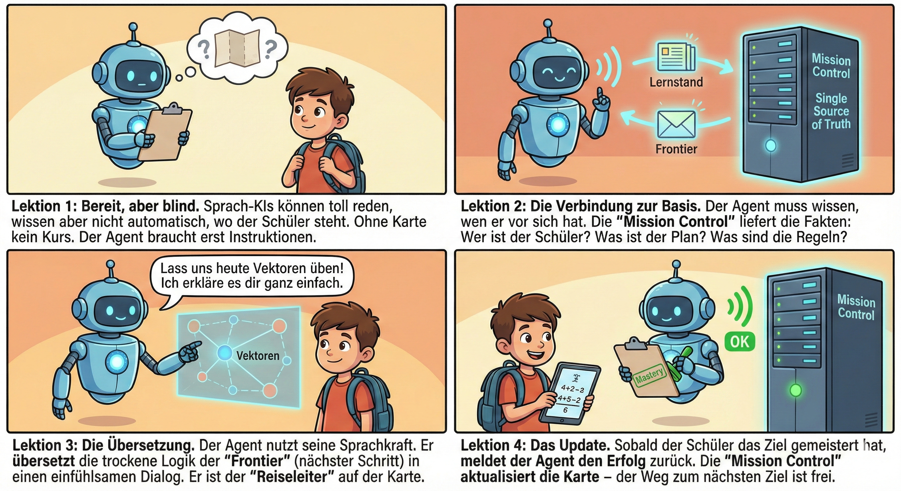

### 3.2 Der Interaktions-Layer: Der KI-Lerncoach

Der Skill-Graph liefert die Route, doch Lernende interagieren nicht mit Datensätzen, sondern brauchen einen Reiseleiter. Diese Rolle übernimmt der **KI-Lerncoach** (SkillPilot GPT). Er dient als intuitive Schnittstelle, die die abstrakten Instruktionen des Graphen in natürliche, motivierende Sprache übersetzt.

Der Lerncoach ist dabei keine „Black Box“, sondern agiert strikt auf Basis der Backend-Logik: Er empfängt vom Backend den aktiven Scope, die Frontier, das nächste Ziel und die erlaubten Übergänge, verpackt diese aber in einen didaktisch sinnvollen Dialog. So wird aus der „exakten Buchhaltung“ ein persönliches Lernerlebnis.

#### Fokus statt Ablenkung

Die in Kapitel 3.1 für den **aktiven Scope** berechnete **Frontier** dient dem Lerncoach als **Fokus-Filter**: Aus der Gesamtmenge werden nur die Inhalte gezeigt, die zum Ziel und zum aktuellen Stand passen – der **nächste machbare Schritt** statt „alles auf einmal“.

#### Mastery: Fortschritt als Evidenzmodell

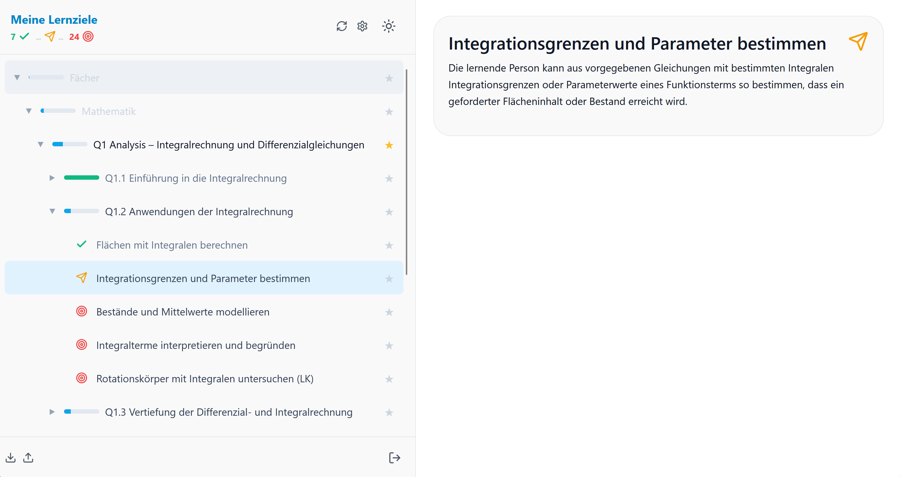

**Mastery** ist kein Logbuch, sondern ein abgeleiteter Status aus Lerninteraktionen. Für Anschlussfähigkeit hilft ein simples Evidenzmodell:

- **Formativ:** Lerncoach-Dialoge, Aufgaben im Gespräch, kurze Checks.
- **Optional stärker:** Quizzes, Aufgabenserien, Artefakte (Rechenweg/Code/Kurztext), mündliche Checks.
- **Optional Review:** Skills können später ein Re-Check verlangen.

Im aktuellen System bleibt diese Evidenz vom zentralen Zustand getrennt: Auf dem SkillPilot-Server liegt primär der abgeleitete Status. Zusätzliche Nachweise können institutionell über Artefakte oder Referenzen ergänzt werden.

> SkillPilot macht Fortschritt sichtbar – die Institution entscheidet, welche Evidenz welche Konsequenz hat.

#### Lerngeschwindigkeit (Learning Velocity)

Learning Velocity zeigt, wie viele **atomare Ziele** pro Woche neu als gemeistert gelten – als einfacher Rhythmus- und Kontinuitätsindikator.

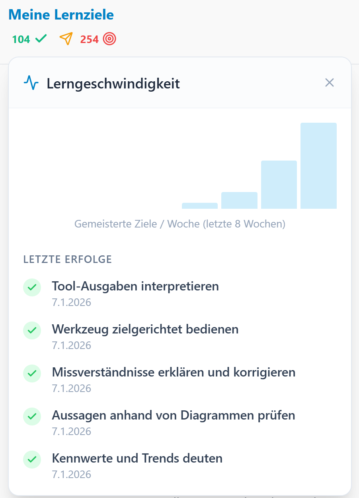

### 3.3 Der hybride Lernkreislauf: Verstehen + Memorieren + Üben

Nicht jedes Lernziel lernt man gleich: Konzepte brauchen Verständnis und Anwendung, Fakten brauchen Wiederholung, und viele Skills brauchen **aktives Tun** (z.B. Programmieren, Rechnen, Schreiben). In Prüfungen wird genau dieses selbstständige Problemlösen verlangt.

**Der Weg zur Prüfungsreife ("Mach mich fit fürs Abi")**
In der Praxis lernen Schüler:innen selten isolierte Einzelthemen, sondern verfolgen ein übergreifendes Endziel. Die typische Herangehensweise ist das Abstecken eines festen Kontextes – beispielsweise „Leistungskurs Physik, Hessen, Abiturvorbereitung“.
Sobald dieser Kontext in SkillPilot definiert ist, bündelt das System aus der Gesamt-Landkarte alle relevanten Lernrouten, die zu den verlangten Klausurfähigkeiten führen. Lernende werden vom Lerncoach systematisch entlang dieser Routen dorthin geführt.
Diese Ziel-Route ist dabei eine Auswahl **innerhalb des größeren Graphen**, nicht dessen einzig möglicher Pfad.

**Die Systematik der Lernpfade (die didaktische Route)**
Innerhalb dieses Curriculums ist der Weg nicht dem Zufall überlassen. Jede einzelne Themen-Route folgt einer klaren didaktischen Struktur. Das finale Ziel jeder Route ist immer die Befähigung, komplexe Aufgaben und Lösungen selbstständig zu erarbeiten. Alle Lernziele davor dienen dazu, die Fähigkeiten dafür systematisch aufzubauen.

Eine typische Route durchläuft dabei stets die folgenden Phasen:
1. **Motivation ("Warum lernen wir das?")**: Jede Route beginnt mit der Einordnung, wozu das Thema überhaupt relevant ist.
2. **Verstehen (Guided Learning)**: Im sokratischen Dialog mit dem KI-Lerncoach wird das neue Konzept geführt kennengelernt und das Verständnis Schritt für Schritt aufgebaut.
3. **Memorieren (Drill)**: Parallel zum Verstehen werden notwendige Fakten und Formeln über das integrierte Flashcard-System gefestigt.
4. **Anwenden (Mastery)**: Am Ende der Route steht die eigenständige Bearbeitung komplexer Problemstellungen auf Prüfungsniveau (z.B. abfotografierte Rechenwege), bei der der Lerncoach nur noch bewertet und Feedback gibt.

Diese vier Phasen beschreiben **didaktische Rollen entlang einer Route**. Sie ersetzen nicht die oben eingeführten drei Lernmodi, sondern ordnen sie zusammen mit optionalen Motivationsknoten in eine lernbare Sequenz ein.

Hier ein Beispiel für eine einfache Route aus Motivation/Verstehen/Anwenden (Memorisieren läuft parallel), wie es in SkillPilot visualisiert wird und als PDF exportierbar ist.

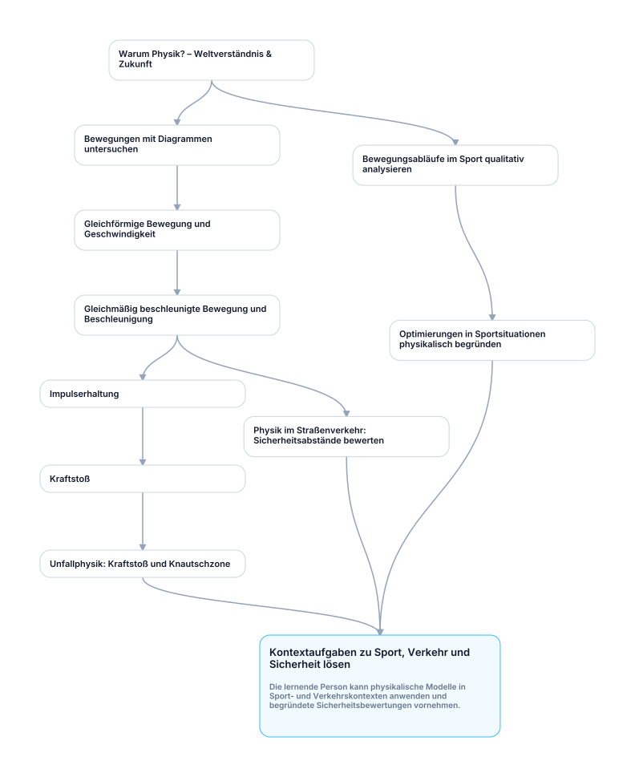

Während beim Verstehen sowie beim Bewerten und Erklären von Prüfungsleistungen die Interaktion mit einem Lerncoach hilft, funktioniert reines Auswendiglernen (Vokabeln, Formeln, Fakten) per modernem Karteikasten a la **Spaced Repetition** effizienter.

SkillPilot integriert dafür eine **Flashcard Drill Engine** (SRS):

- **Kompetenz-Loop:** Der Skill-Graph definiert, *was* als Nächstes dran ist.
- **Memorisier-Loop:** Die Drill Engine optimiert *wie* wiederholt wird (Intervalle, Priorisierung; z.B. SuperMemo-2).

Ergänzend braucht es weitere Lernmodi für „Doing“-Skills. **In weiteren Ausbaustufen** soll der Lerncoach Lernende in passende **Practice-Formate** schicken (z.B. Aufgabenserien, Programmieraufgaben, Schreib-/Sprechübungen) und sie anschließend im Chat bei Auswertung, Feedback und Transfer begleiten.

#### Technische Ableitungen: Ziel-Route in Backend, UI und Lerncoach

- **Backend (didaktische Routenlogik):** Die Ziel-Route ist keine freie KI-Berechnung, sondern eine im Curriculum modellierte **Teilroute im größeren Graphen** unter DAG-Constraints. Das bedeutet: Die menschlichen Lehrplan-Autor:innen (Champions) behalten die volle pädagogische Kontrolle. Die KI darf die **gewählte Route** nicht eigenmächtig verlassen, solange Scope und Modus unverändert bleiben; ein Scope-Wechsel oder die diagnostische Eskalation in den **Pessimistischen Modus** sind explizite Systemübergänge. Für route-orientierte Curricula können die vorgelagerten Schritte (Motivation, Verstehen, Memorieren, Anwenden) als explizite `requires`-Knoten oder eng geführte Routensegmente modelliert werden.
- **UI/UX (Routen-Visualisierung):** Lernende wählen ihren Zielkontext (z.B. LK Physik) und ein Fernziel. Die Oberfläche blendet irrelevante Bereiche aus und hebt die didaktische Route zum Ziel klar hervor.
- **KI-Lerncoach (Didaktischer Kontext):** Der Lerncoach arbeitet strikt auf Basis dieser gewählten Route und des aktiven Modus und erklärt transparent, warum der aktuelle Schritt der logische nächste Halt auf dem Weg zur Prüfungsreife ist.

---

## 4. Vertrauensarchitektur: Security & Integrity

### 4.1 Datenansatz: Privacy by Design & Souveränität

Ein zentraler Pfeiler von SkillPilot ist **Datentrennung**.

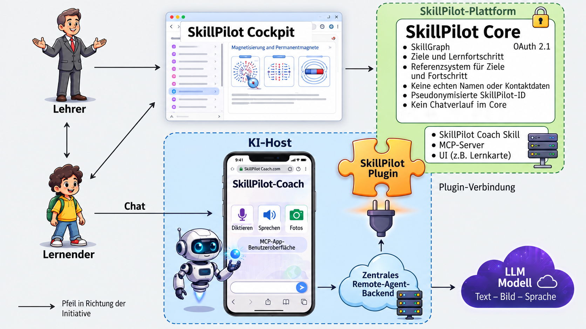

#### Pseudonym statt Identität

Der **SkillPilot-Server** kennt Lernende ausschließlich als Pseudonym (`skillpilotId`).
Auf dem Server werden nur technisch notwendige Metadaten gespeichert, z.B. der Lernfortschritt im Graphen.

#### Session-Abschirmung gegenüber dem KI-Frontend

Beim Start von **SkillPilot GPT** wird die dauerhafte SkillPilot-ID nicht an ChatGPT übergeben. Der Browser fordert beim SkillPilot-Backend einen kurzlebigen, einmalig nutzbaren **Startcode** an. Nach dem Einlösen arbeitet der Lerncoach nur noch mit einem temporären **Chat-Session-Token**.

Die Zuordnung `chatSessionToken -> skillpilotId` passiert ausschließlich im SkillPilot-Backend; die aktive SkillPilot-ID liegt nur im Browser und im Backend. Dadurch kann das KI-Frontend Lerncoach-Dialoge und Tool-Ergebnisse nicht mehr der dauerhaften SkillPilot-ID zuordnen. Es erhält weiterhin die didaktisch notwendigen Zustandsdaten der aktuellen Session, aber nicht den stabilen Schlüssel des Lernenden.

#### Dialoginhalt ist entkoppelt

Der Dialoginhalt (Lerncoach-Gespräche) ist vom SkillPilot-Server entkoppelt. So bleibt der zentrale Datenbestand minimal.

**Empfehlung für Bildungsinstitutionen:**
Klare Guidelines, welche Daten im Lerncoach-Chat nicht hineingehören (sensibles Privates) und wie Lernende sicher unterstützt werden.

#### Zuordnung in der Institution (lokal)

Die Zuordnung „Wer ist welches Pseudonym?“ liegt bei der Institution/Lehrkraft und wird **lokal** gespeichert (z.B. in geschützter Ablage) – nicht zentral.

#### KI-Frontend / Provider-Wahl (Souveränität)

Der Lerncoach-Dialog findet im jeweiligen KI-Frontend statt (aktuell: ChatGPT als Referenz-Integration) und unterliegt dessen Betriebs- und Datenschutzrahmen.
Für Kontexte mit höheren Souveränitätsanforderungen sind alternative KI-Backends bis hin zu lokalen Modellen vorgesehen. Voraussetzung ist, dass sie die benötigten Eigenschaften (Tool-Nutzung, Stabilität, Struktur, Didaktik) zuverlässig erfüllen.

### 4.2 Nachweiskette (Chain of Custody): Integrität & Nachvollziehbarkeit

Damit Lernstände **portabel** und **prüfbar** bleiben, nutzt SkillPilot ein **Chain-of-Custody**-Pattern.

- Lerncoach-Instanzen authentisieren sich gegenüber dem Backend.
- Schreibrechte für Fortschritts-Updates erhalten nur **autorisierte Akteure** (aktuelles Muster: der Lerncoach als schreibender Akteur über ein temporäres Chat-Session-Token).
- Die dauerhafte SkillPilot-ID wird in AI-Session-Responses nicht ausgegeben; vorhandene Response-Felder werden dort leer bzw. `null` gehalten.

#### Signierte Exporte

Lernende können Profil + Fortschritt exportieren.
Der Server **signiert** diese Exporte kryptografisch, sodass Offline-Manipulation erkennbar ist. Heute signiert der Export primär Zustandsdaten (Mastery/Status), Scope-Information, Zeitstempel und Provenienz-/Integritätsmetadaten. Er ist damit **kein Ersatz** für eine vollständige Ablage aller zugrunde liegenden Dialoge oder Artefakte.

#### Herkunftsnachweis beim Import

Beim Import (z.B. Wechsel, Backup) kann die komplette **Herkunftskette** mitgeführt werden. So wird sichtbar, ob ein Stand weitergeführt oder von außen übernommen wurde.

**Wichtig:** Chain of Custody schützt Integrität und Herkunft – sie ist ein **Transparenzwerkzeug**, kein vollständiger Betrugsschutz.

---

## 5. Das Ökosystem: Inhalte & Standards

### 5.1 Status quo: Verfügbare Inhalte (Beispiele)

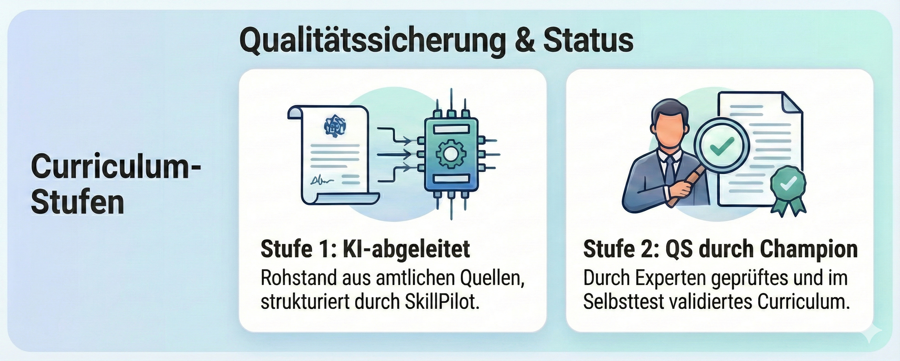

SkillPilot ist nicht nur Konzept: Es enthält bereits Curricula/Standards als Startpunkt. Wichtig ist dabei die **Qualitätsstufe**:

1. **Stufe 1 – KI-abgeleiteter Rohstand**
   Lernziele in SkillPilot sind aus öffentlich zugänglichen, amtlichen Curricula/Ordnungen abgeleitet. Wir geben die Quellen an; SkillPilot bietet eine eigene Strukturierung und Zusammenfassung – kein offizieller Wortlaut.
   Ergebnis: Das Curriculum existiert und wird in der Oberfläche angezeigt.
2. **Stufe 2 – QS durch Curriculum Champion**
   Ein Curriculum Champion hat einen **explizit benannten Scope** in SkillPilot selbst durchgearbeitet, Fehler im Curriculum und in SkillPilot bereinigt und ein **QS-Häkchen** vergeben. Dieser Scope kann ein gesamtes Fach, ein Modul oder ein klar abgegrenzter Themenbereich sein. Von diesen QS-Häkchen kann es mehrere geben.
   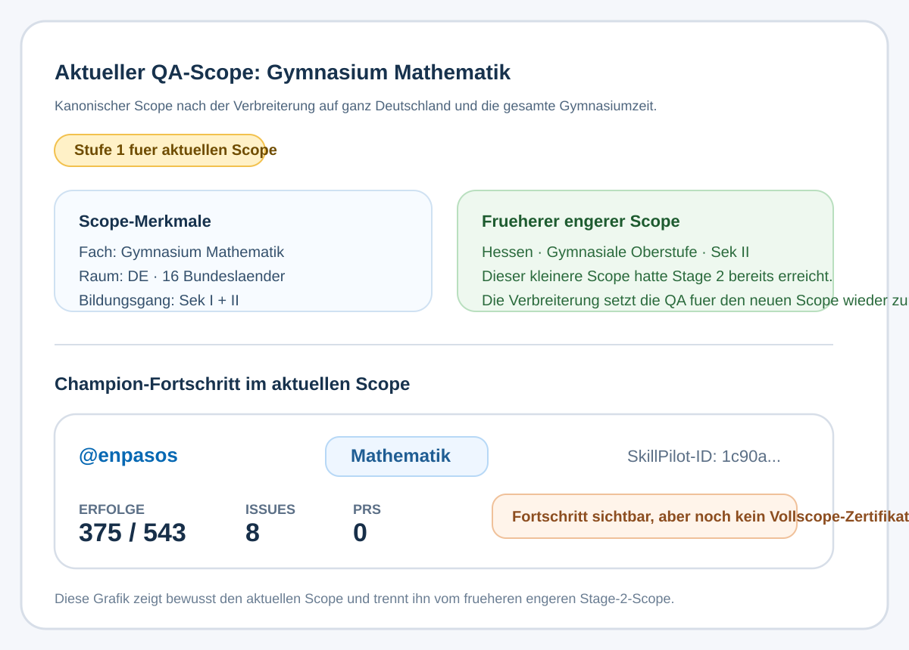

**Aktueller Stand:** Der frühere, enger gefasste Scope **Mathematik in der Gymnasialen Oberstufe Hessen (G9, Sekundarstufe II)** hatte bereits **Stufe 2** erreicht. Mit der Kanonisierung zum breiteren Scope **Gymnasium Mathematik (bundesweit, Sekundarstufe I + II)** wurde der Prüfgegenstand jedoch deutlich erweitert: einmal von Hessen auf alle 16 Bundesländer und einmal von der Oberstufe auf die gesamte Gymnasiumzeit. Für diesen verbreiterten Scope ist das Zertifikat aktuell noch **nicht** erreicht; er ist bis zur erneuten Praxisabdeckung wieder als **Stufe 1** zu lesen. Das gezeigte Champion-Profil illustriert daher Fortschritt und Engagement, nicht automatisch eine Stufe-2-Freigabe für den gesamten aktuellen Scope. Der aktuelle Stand ist im [Curriculum-Verzeichnis](https://skillpilot.com/curricula) einsehbar.

**Curriculum Champions (Praxisanker):**
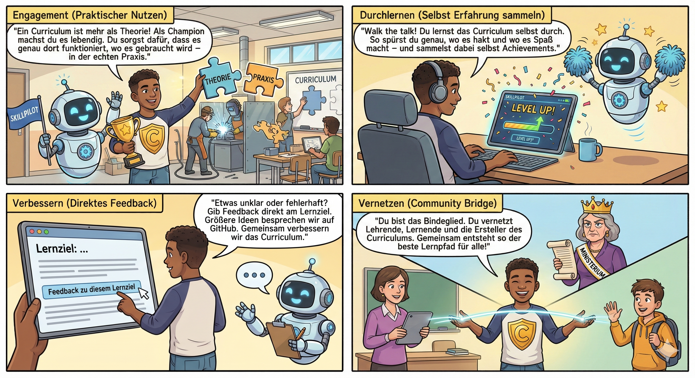

- Champions übernehmen Verantwortung für ein Curriculum oder einen **klaren Themen-Scope**.
- Sie **lernen das Curriculum durch**, sammeln Praxisfeedback und bündeln es in Issues/PRs.
- Sichtbarkeit schafft Verantwortung: Champion-Profile zeigen Engagement (z.B. Issues/PRs) und Fortschritt.

Der QS-Prozess bezieht sich nicht nur auf Curricula: Der SkillPilot KI-Lerncoach wird im laufenden Betrieb kontinuierlich qualifiziert, damit die Nutzung über reale Curricula hinweg zuverlässig und didaktisch sinnvoll bleibt.

#### Schule (Bayern & Hessen)

**Bayern:**

- Grundschule (Alle Fächer, Jgst 1–4)
- Mittelschule (Alle Fächer, Jgst 5–10)
- Realschule (Alle Fächer, Jgst 5–10)
- Gymnasium (Alle Fächer, Jgst 5–13)
- Fachoberschule & Berufsoberschule (FOS/BOS)
- Wirtschaftsschule

**Hessen:**

- Gymnasiale Oberstufe (G9, Sekundarstufe II)
- Gymnasiale Mittelstufe (G9, Sekundarstufe I)

#### Hochschule (Bologna-relevant)

- Uni Heidelberg: Bachelor Biowissenschaften, Master Molecular BioSciences, Physikum Medizin
- Uni Mannheim: Bachelor BWL, Bachelor Jura, Master Jura
- TU Darmstadt: Bachelor Informatik
- TU München: Bachelor Informatik, Bachelor Mathematik, Bachelor Physik, Master Quantenwissenschaft und -technologie, Master Theoretische und Mathematische Physik, Executive Master of Business Administration (MBA)

#### Sprachen (CEFR A1–C2)

- Englisch (A1–C2)
- Französisch (A1–C2)

Die hier gelisteten Curricula sind daher zunächst als **verfügbare Inhalte** zu lesen, nicht automatisch als **Stufe-2-zertifiziert**. Ob ein Scope bereits **Stufe 2** erreicht hat, muss immer für genau den angezeigten Scope im [Curriculum-Verzeichnis](https://skillpilot.com/curricula) gelesen werden. Der Prozess, einen Scope in **Stufe 2** zu überführen, läuft über den **Curriculum Champion Prozess**.

> Wir laden dazu ein, diesen Prozess aktiv mitzugestalten: **[Werden Sie Curriculum Champion](https://skillpilot.com/curricula)** und helfen Sie dabei, die Qualität und Praxisnähe Ihres Fachbereichs sicherzustellen.

Die Inhalte sind erweiterbar und versioniert; Quellenbezüge sind dokumentiert, und Änderungen laufen aktuell über GitHub (Issues/PRs).

### 5.2 SkillPilot im Kontext Bologna/EHEA (Kurzüberblick)

Bologna/EHEA setzt im Hochschulraum den Rahmen für **Outcomes, Transparenz, Anerkennung und Qualität**. SkillPilot kann diese Ziele unterstützen – ersetzt aber keine institutionellen Entscheidungen.

- **Learning Outcomes / Kompetenzen:** Beitrag: Outcomes als Skill-Graph navigierbar machen; Fortschritt sichtbar. Grenze/Voraussetzung: Saubere Modellierung, Quellenbezug, Versionierung.
- **Credits/Workload (ECTS-Logik):** Beitrag: Pfade/Prereqs und Workload-Transparenz unterstützen. Grenze/Voraussetzung: **Keine Credit-Vergabe**; Regeln bleiben institutionell.
- **Anerkennung/Mobilität:** Beitrag: Evidenz + signierte Exporte als Vorbereitung/Unterstützung. Wie in Kapitel 4.2 beschrieben, sichern die signierten Exporte vor allem Zustandsdaten und Provenienz ab; für stärkere Anerkennungsprozesse können zusätzliche institutionelle Nachweise nötig sein. Grenze/Voraussetzung: Anerkennung bleibt formaler Prozess.
- **Qualitätssicherung:** Beitrag: Signale über Hürden/Pfade für Lehrentwicklung. Grenze/Voraussetzung: QA-Prozesse + transparente KI-Regeln nötig.

---

## 6. Governance & Community: Open Source & Einladung

SkillPilot wird als **Open Source** unter der **Apache-2.0-Lizenz** veröffentlicht – als Einladung, bestehende Akteure einzubinden statt zu verdrängen:

- Institutionen behalten **Souveränität** über Curricula und Inhalte.
- Die Kopplung von Content an Skillziele ist **in der Roadmap vorgesehen**.
- Offene Schnittstellen ermöglichen Beiträge und Integration.

**Governance & Qualitätssicherung (aktuell über GitHub + Champion-Programm):**

- Feedback fließt über **GitHub Issues** und wird häufig durch Champions initiiert.
- Änderungen am Curriculum/Graph laufen über **Pull Requests** (Review in GitHub).
- **Versionierung** erfolgt über die GitHub-Historie; **Curriculaquellen** sind referenziert.
- Weitergehende Governance-Mechanismen (z.B. Fachreview-Gremien, QA-Prozesse, Overlays) sind perspektivisch möglich.

**Initiator:**
Träger ist die **enpasos GmbH**. Wir laden Partner ein, SkillPilot gemeinsam weiterzuentwickeln – fachlich, didaktisch und technisch.

Starten Sie sofort und anmeldefrei **(ID-basiert)** Ihren Piloten: Eine Anleitung für den 5-Minuten-Start finden Sie im [Kurzstart](https://skillpilot.com/quickstart/de).
Hinweis: Ihre **ID ist der einzige Schlüssel** zu Ihren Daten – speichern Sie sie gut.

**Mehr Transparenz:**
[GitHub](https://github.com/enpasos/skillpilot)
[Dokumentation](https://enpasos.github.io/skillpilot/)
[Graph-Definition](https://enpasos.github.io/skillpilot/concept/curriculum-graph/graph-definition/)

---
