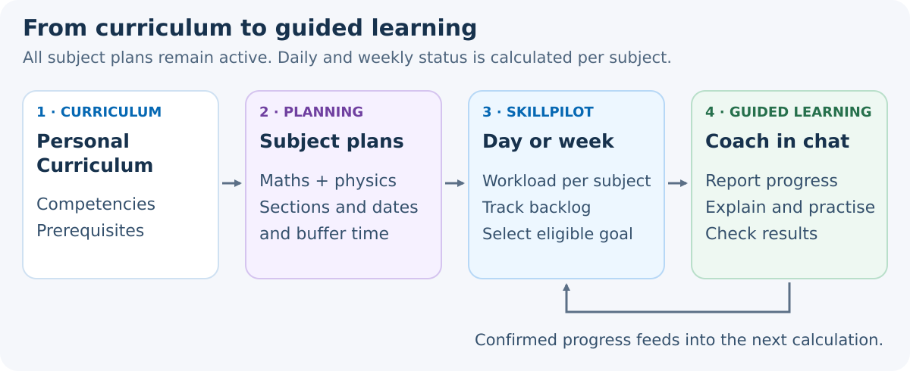
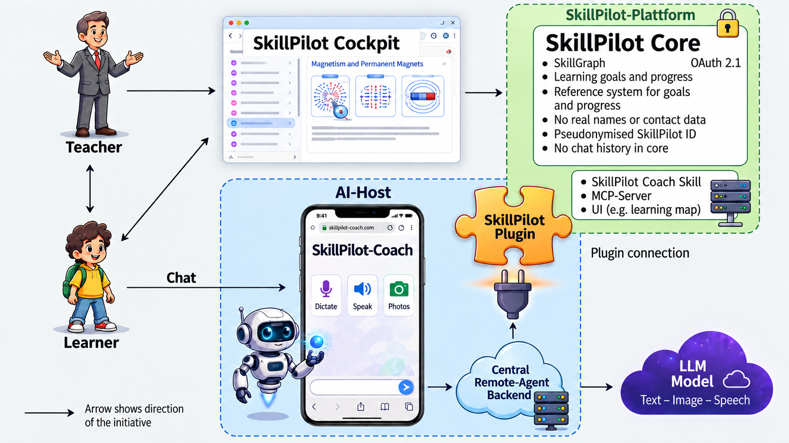
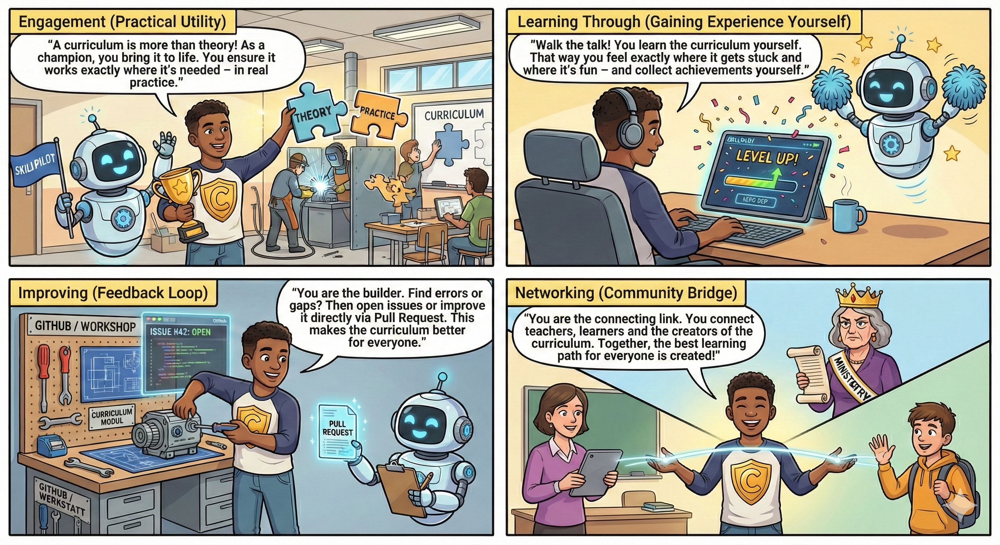

# SkillPilot Whitepaper (EN)

**Version:** 1.0.22
**Project:** SkillPilot

---

## Summary

SkillPilot connects to **existing curricula** and uses them as the **normative source of truth** (e.g., state curricula, module handbooks, standards like CEFR). SkillPilot does not replace these standards; it translates them into a versioned, machine-readable **skill graph** as an operational model. Learners, teachers, and an AI learning coach use this graph as a machine-readable map. This allows the learner to move safely from their current **skill state** to their **skill goals**. Runtime authority for learning state, Personal Curriculum, current focus, active goal, rules, and next steps sits in the backend state; the AI learning coach leads the dialogue by relying on this **exact backend logic**.

To achieve this, the system records learning achievements on atomic skill goals and derives the **mastery level** for higher-level topics. On this basis, the path via the **next attainable skill goals** leads systematically to individual educational objectives.

**Learning plans add a time frame to this navigation:** Which parts of the Personal Curriculum should be achieved by when? SkillPilot shows the **daily or weekly workload**, backlog, and work ahead for all planned subjects. Each subject is evaluated independently. The coach reports progress in chat and guides the learner to the next learnable goal, without requiring learners to manage plan sections or select learning goals themselves (see section 3.4).

Quality assurance is anchored in a practice-driven **Champion program** and the **open-source workflow** (Issues/PRs).

### SkillGraph Processing

SkillGraph Processing structures curricula and competence models into dependency-aware skill landscapes that can be validated, explored, and used by humans or AI agents. In the web interface, this becomes a Personal Curriculum with a clearly identified education context.

> The current screenshots show a German learning context. Selecting an English context uses the same workflow and makes the learning coach communicate in English.

### SkillPilot Learning Coach

SkillPilot Learning Coach guides learners through those landscapes with frontier-based next steps, mastery tracking, and contextual learning-coach support.

The **SkillPilot Learning Coach** connects dialogue in an AI chat to SkillPilot’s authoritative learning logic. The Claude and ChatGPT integrations use the same domain core through separate provider adapters. In the responsive SkillPilot web app, learners configure their Personal Curriculum, view their progress, and start a learning session.

---

## 1. The Challenge: Individual Skill Navigation Does Not Scale

Education follows curricula that are defined by the state or through **accreditation**. In practice, there is a gap between curriculum and learning reality:

- Learners do not start at the same point (prior knowledge, pace, gaps).
- Teachers still have to guide **many people in parallel**, often in large cohorts.
- Learning goals usually exist **as text**, but not as a **navigable structure** with dependencies and sensible next steps.

This leads to overload for some, boredom for others, and high effort to track learning states and next steps.

SkillPilot closes this **tool gap**: outcome-oriented navigation in the curriculum without turning teachers into "bookkeepers." SkillPilot builds on the **existing curriculum** - it does not create new standards, it makes existing standards operational and navigable.

---

## 2. The Shift: Why Hybrid AI Systems Are the Right Approach

Language-based AI can explain concepts, formulate tasks, discuss solutions, and respond to questions in natural language. In a learning dialogue, it offers different approaches to a topic and adapts explanations to the learner’s responses.

Reliable learning guidance also needs an authoritative foundation: which goals belong to the curriculum, which prerequisites are met, and which progress has been recorded? SkillPilot manages these facts and rules in the backend.

The learning coach accesses this **exact backend logic** through defined tools. SkillPilot calculates reachable learning goals and plan status, validates permitted state changes, and stores confirmed progress.

**SkillPilot is a hybrid application:** The AI learning coach handles language understanding, explanations, and subject-specific feedback. Conventional software owns learning state, permissions, navigation, and progress tracking.

---

## 3. The Product: How SkillPilot Works

### 3.1 The Technology: The Skill Graph (Operational Model & Frontier)

SkillPilot replaces linear lists with a connected graph.

The separation of layers matters: the official curriculum remains the **normative source**. The versioned **skill graph** is the derived **operational model**. At runtime, the **backend state** is the authoritative source for current learning state, Personal Curriculum, current focus, active goal, and allowed transitions.

#### Plugging into Existing Curricula (Raw Input & Traceability)

SkillPilot does not "invent" curricula: curricula, module handbooks, or standards serve as **raw input** and are translated into a skill graph.

The integrity of the graph is ensured by a formal mathematical specification (Acyclicity, Effective Requires, Transitive Minimality), which prevents circular references and logically validates dependencies.

This is about:

- **Operationalization:** learning outcomes are broken down into atomic skill goals (without changing the standard).
- **Traceability:** each skill remains traceable to source/section/version.
- **Navigability:** prerequisites and hierarchies are modeled explicitly so paths are plannable (didactic prereqs possibly as **overlay**). The **overall graph** does not enforce a single teaching path; it allows multiple didactically meaningful routes. Inside a **selected scope** or an **explicitly modeled target route**, SkillPilot then deliberately narrows the next steps to the relevant subset. In the default mode, prerequisites are checked within the selected focus. Optional **Strict Mode** also enforces prerequisites globally and can therefore expose missing foundations outside that focus.
- **Governance:** changes currently run via GitHub (Issues/PRs), with versioning through GitHub history (see section 6).

#### Map: Nodes & Edges

- **Nodes:** atomic skills ("can explain/apply X") and clusters (topics/modules).
- **Edges:**
  - **Prerequisites:** "A before B"
  - **Contains/Part-of:** "X includes Y and Z"

#### Three Learning Modes / Node Types in Practice

SkillPilot distinguishes three **node types** that reflect different learning modes:

- **Understanding:** Ordinary content learning goals are explained and practiced with the AI learning coach.
- **Memorization:** Individual facts are memorized in a targeted way (modern flashcard principle).
- **Independent problem solving:** Final-exam tasks are solved independently (e.g., on paper, photographed, and uploaded), immediately graded (points, pass/fail, errors), and then explained.

These three types describe **learning modes**. The didactic route described in section 3.3 is a separate layer: it arranges steps such as motivation, understanding, memorization, and application along a path. **Motivation** is therefore a didactic phase; when modeled explicitly in a curriculum, it appears as a route node, not as a fourth base type.

In **mathematics** within the Gymnasium landscapes, **all three node types** are used.

**Formal specification:** The mathematical definition of the graph (e.g., acyclicity, Effective Requires) is publicly documented:
[Graph definition](https://enpasos.github.io/skillpilot/concept/skill-graph/graph-definition/)

#### Frontier: Next Reachable Steps

SkillPilot computes the **frontier** relative to the **active scope or filter**: skills whose prerequisites are met inside that active graph slice but are not yet mastered.
This avoids jumps and keeps learning in the zone of sensible next steps. We call this boundary of current knowledge the **Frontier** (didactically: Zone of Proximal Development according to Vygotsky). It marks exactly the skills that are learnable next **within the current filter**.
The **frontier is not an AI recommendation**, but the mathematically computed set of logically unlocked learning goals in the active graph slice. Optional **Strict Mode** also considers prerequisites globally and can expose missing foundations outside the current focus.

### 3.2 The Interaction Layer: The AI learning coach

The skill graph provides the route, but learners do not interact with datasets; they need a guide. This role is taken by the **SkillPilot Learning Coach** as the AI learning coach. It serves as an intuitive interface that translates the abstract instructions of the graph into natural, motivating language.

The learning coach is not a "black box" but acts strictly based on backend logic: it receives the active scope, frontier, next goal, and allowed transitions from the backend, and turns them into a didactically meaningful dialogue. This turns "exact bookkeeping" into a personal learning experience.

#### Focus Instead of Distraction

The **frontier** calculated in chapter 3.1 for the **active scope** serves as a **focus filter** for the learning coach: from the full set, only content that fits the goal and current state is shown - the **next feasible step** instead of "everything at once".

#### Mastery: Progress as an Evidence Model

The current Cockpit view separates ordinary flashcard practice from evidence-bearing **Verified Recall**.

**Mastery** is the backend-owned learning state on atomic goals, not a chat log. For ordinary atomic goals, it can be adjusted in the Cockpit or stored by the learning coach only after sufficient evidence. Orientation nodes use a completion marker only and do not certify subject mastery. For memorization nodes, mastery is derived from server-side card state and strict **Verified Recall**; ordinary flashcard practice changes only the repetition schedule. Cluster progress is aggregated from contained goals using their weights.

The central state remains separate from complete dialogues and additional artifacts. Further evidence can be added institutionally through artifacts or references.

> SkillPilot makes progress visible - the institution decides which evidence has which consequences.

#### Learning Velocity

Learning velocity shows how many **atomic goals** are newly mastered per week - a simple indicator of rhythm and continuity.

### 3.3 The Hybrid Learning Loop: Understanding + Memorizing + Practice

Not every learning goal is learned the same way: concepts need understanding and application, facts need repetition, and many skills require **active doing** (e.g., programming, calculating, writing). In assessments, this kind of independent problem solving is exactly what counts.

**The Path to Exam Readiness ("Get me ready for finals")**
In practice, students rarely learn isolated topics. They usually pursue an overarching end goal. The typical approach is to define a fixed context - for example, "Advanced Physics Course, Hesse, Final Exam Preparation."
As soon as this context is defined in SkillPilot, the system bundles all relevant learning routes from the full landscape that lead to the required exam competencies. Learners are then guided by the learning coach systematically along these routes.
This target route is therefore a selection **inside the larger graph**, not the graph's only possible path.

**The System of Learning Paths (The didactic route)**
Within this curriculum, the path is not left to chance. Depending on the curriculum and goal type, a topic route may connect several didactic roles and lead toward independent application or an appropriate practice or assessment node.

A typical subject-learning route may connect the following roles:
1. **Motivation ("Why are we learning this?")**: Where an orientation node is modeled, it frames why the following topic may be relevant.
2. **Understanding (Guided Learning):** In Socratic dialogue with the AI learning coach, a new concept is introduced with guidance and understanding is built step by step.
3. **Memorization (Drill):** Where compact facts or formulas must be recalled reliably, they are reinforced through the integrated flashcard system.
4. **Application:** Appropriate practice, autonomy, or assessment nodes lead to independent problem solving; the learning coach can then evaluate and provide feedback.

These roles are not a rigid four-step sequence. They do not replace the three learning modes introduced above; they may connect those modes, together with optional orientation nodes, into an appropriate route.

One possible short form of such a route, where memorization is appropriate:
**Understand why this is relevant for me** -> **build understanding through guided familiarization** -> **memorize in parallel** -> **independently develop solutions**.

Here is a schematic example of a motivation/understanding/application route as it can be modeled in SkillPilot and exported as PDF.

While learning coach interaction is valuable for understanding and for evaluating/explaining exam solutions, pure memorization (vocabulary, formulas, facts) is more efficient with **spaced repetition**.

SkillPilot integrates a **flashcard drill engine** (SRS):

- **Competence loop:** the skill graph defines *what* comes next.
- **Memorization loop:** the drill engine optimizes *how* to repeat (intervals, prioritization; e.g., SuperMemo-2).

SkillPilot already uses approved practice and assessment nodes for suitable scopes. Additional **practice and assessment formats** for "doing" skills (e.g., problem sets, programming tasks, writing/speaking exercises) remain areas for further development.

#### Technical Implications: Target Route in Backend, UI, and learning coach

- **Backend (didactic route logic):** The target route is not a free AI computation. It is a **modeled sub-route inside the larger graph** under DAG constraints. This means human curriculum authors (champions) retain pedagogical control. The **Personal Curriculum (Level 2)** is configured exclusively in the first-party SkillPilot web app. The learning coach does not change that configuration. In chat, the learning coach can change only the current focus and active goal (**Level 3**), using backend-approved options and with the learner's consent.
- **UI/UX (route visualization):** Learners configure their Personal Curriculum in the first-party web app. In the Cockpit, they can see and change the current focus and active goal; the interface shows progress and next reachable goals within that context.
- **AI learning coach (didactic context):** The learning coach operates strictly on the confirmed context, current focus, and transitions allowed by the backend, and explains transparently why the current step is appropriate.

### 3.4 From Curriculum to Everyday Learning: Learning Plans and Coach Guidance

A navigable curriculum does not yet answer the everyday question: **“What do I need to learn today or this week, and how far have I got?”** SkillPilot addresses this by connecting the Personal Curriculum to a timed learning plan and guidance from the coach.

#### The Teacher Plans the Framework

The **Personal Curriculum** defines which competencies belong to the selected education context. The **learning plan** specifies which topics or groups of learning goals should be addressed within which periods. It complements the skill graph without replacing its goals or prerequisites. To work through an entire curriculum, the plan must cover its intended scope; completing a partial plan does not automatically mean completing the curriculum.

Under **“Course planning”**, teachers prepare learning sections, date ranges, buffer time, and milestones. Subject plans, for example for mathematics and physics, apply **together** but are evaluated **per subject**: each subject has its own daily or weekly target, and work ahead in one subject does not offset backlog in another. Switching the current subject does not deactivate another subject plan or impose an order such as “finish all of mathematics before physics.” Several plans of the same subject are merged; overlapping sections do not count the same goal twice. The learner chooses the time resolution in the Personal Curriculum learning configuration in the Cockpit.

The **learner preview** shows each subject’s daily or weekly target and an outlook over the next seven calendar days before changes are applied; in weekly mode, entries are grouped by calendar week. It uses the same calculation as the Cockpit and chat. Dates are scheduled on weekdays from Monday to Friday. Goal counts describe the workload, not learning minutes. The teacher reviews scope and workload and adjusts the plan when necessary.

Drafts initially remain on the planning device. Only explicit joint confirmation makes them effective for the learner; later draft edits do not silently alter ongoing learning. **Teaching coverage is not learner mastery:** recording “covered in class” does not establish an individual's competence.

#### Daily and Weekly Resolution

Learners choose between **1 day** and **1 week**. This setting applies consistently to the Cockpit, chat, learner-specific planning, and selection of the next planned goal:

- **Daily resolution:** The workload covers the current calendar day.
- **Weekly resolution:** The workload covers the current calendar week from Monday to Sunday. Learners can complete it at the start of the week, over the weekend, or spread it out. Earlier days within the same week do not create additional backlog.

The choice is saved for the SkillPilot ID; daily resolution is the default. Switching changes the time frame of the evaluation while preserving plan dates and achieved learning progress. **Period workload and backlog are separate statements:** A daily or weekly target can be reached while backlog remains. Work ahead is taken into account within the same subject.

#### The Learner Works in Chat

With plan mode enabled and a valid learning session, SkillPilot handles the organization in the background:

1. **Orient:** The coach quotes the plan status formulated by SkillPilot verbatim: for each subject the daily or weekly target and any backlog or work ahead. The Cockpit shows the same sentences; the coach does no arithmetic of its own. It announces the active learning goal separately, once, when the learning task begins.
2. **Resume automatically:** A valid ongoing goal is continued; otherwise, while the daily or weekly workload remains open, a due goal whose prerequisites permit learning is selected, if one is available. Joint activation can already select this first goal. No extra “Continue learning” click or manual goal search is needed.
3. **Learn and check progress:** The coach explains, sets tasks, and supports the work. Only progress recorded under the applicable evidence rules changes the learning state and thus the plan status. The plan-guided flow then leads to the next permitted step.
4. **Switch subjects or finish:** A request such as “Physics now” switches within the available subject options; other requirements remain in place. Once the period targets are reached, the coach acknowledges this and does not start another goal on its own. A reached daily or weekly target does not mean there is no backlog; in that case the coach invites catching up without pressure. Further learning remains available on request, and future goals do not automatically become extra duties for the current period. The plan status names unevaluable plans explicitly instead of presenting them as complete.

A status-only question does not start a new task; a requested pause remains a pause. If prerequisites or invalid planning block open goals, the coach reports the blockage instead of inventing completion or a replacement duty. Plan corrections remain on the planning side. An expired learning session still requires a fresh start through SkillPilot; chat guidance does not extend the session.

#### Example: Mathematics and Physics on the Same Day

The figures below are an **illustrative calculation** on a daily basis, not live data:

- **Mathematics:** 13 goals are planned through today, 3 of them newly due today. 9 of the planned goals are mastered, one of them completed today.
- **Physics:** 10 goals are planned through today, 2 of them newly due today. 11 of the planned goals are mastered, two of them completed today.

SkillPilot balances each subject on its own and formulates the plan status that the Cockpit and the coach show identically:

> Mathematics: Daily target 1 of 3 · 2 learning goals behind
> Physics: Daily target reached · 1 learning goal ahead

When the learning task begins, it follows separately:

> Your active learning goal: Describe power functions with integer exponents

Mathematics is four goals short of the plan. Two of them are still open today; the other two are backlog. In physics, a goal planned for later is already mastered. This lead does **not** offset the mathematics backlog, and there is no cross-subject total. “Ahead” and “on track” describe the amount of progress, **not mastery of everything planned earlier**: open earlier goals remain available for goal selection. On a weekly basis, the same statement reads “Weekly target …” and covers the whole current week.

This turns the curriculum into a guided learning path: **The teacher owns scope and timing, SkillPilot calculates the next permitted steps, the coach leads the dialogue, and the learner concentrates on learning.**

---

## 4. Trust Architecture: Security & Integrity

### 4.1 Data Approach: Security, Privacy & Sovereignty by Design

A central pillar of SkillPilot is **data separation**. The following architecture overview shows how permanent pseudonymous identity, the short-lived learning session, app authorization, and authoritative learning state remain separated.

#### Pseudonym Instead of Identity

Learning states are managed under a permanent **pseudonymous SkillPilot ID**. Individual use does not require registration with a name or email address. The ID remains in SkillPilot, should be backed up as a protected ID file, and is not sent to the AI provider or to the learning coach. SkillPilot stores the data needed for learning state, navigation, and traceability.

#### Session Shielding Toward the AI Frontend

Starting the **SkillPilot Learning Coach** from the SkillPilot web app creates a new random `learningSessionId` with an absolute lifetime of 24 hours. It connects the prepared chat to the confirmed learning context without exposing the permanent SkillPilot ID. The learner does not need to copy or manage any technical value. Its lifetime is not extended by use or by an OAuth refresh. The session carries the German or English communication locale selected in the confirmed context. OAuth authorizes the integration; the learning session determines the learning context.

The backend connection is secured independently through several layers: SkillPilot accepts functional access only through the admitted and authenticated coach app and only together with a valid learning session. App authorization alone does not open a learning state, and a learning session alone does not grant backend access. This keeps integration permission and the time-bounded learning context deliberately separate.

#### Dialog Content Is Decoupled

The learning-coach dialogue stays with the respective AI provider. Answers, solution steps, and free-text assessment explanations are not sent to the SkillPilot backend. To track progress, SkillPilot processes structured completion decisions and, where applicable, authorized numerical exam scores. Chat history is governed by the AI provider’s terms. This limits SkillPilot’s central data store to learning state and authorized actions.

**Recommendation for educational institutions:**
Clear guidelines on which data should not be shared in learning-coach chats (sensitive personal data) and how learners are supported safely.

#### Mapping Inside the Institution (Local)

The mapping "who is which pseudonym?" stays with the institution/teacher and is stored **locally** (e.g., in protected storage) - not centrally.

#### AI Frontend / Provider Boundary

SkillPilot separates its shared domain core from AI provider integrations. Claude and ChatGPT connect through separate adapters with their own authentication and session boundaries. Curriculum, learning state, prerequisites, and plan calculations remain in the SkillPilot backend. Each provider is responsible for operating the chat and processing the dialogue; the responsive SkillPilot web app provides learning configuration and the Cockpit in mobile browsers as well.

Separating the domain core from provider integrations keeps learning state and rules independent of the chat provider. Each integration must meet the requirements for tool use, privacy, session separation, and reliable learning guidance.

### 4.2 Chain of Custody: Integrity & Traceability

To keep learning states **portable** and **verifiable**, SkillPilot uses a **chain-of-custody** pattern.

- SkillPilot accepts learning-progress changes only through admitted and authenticated integrations.
- Write access applies only through the admitted coach app, within an active short-lived learning session, and limited to the specific operation.
- The permanent pseudonymous identifier is not disclosed to the AI frontend.

#### Signed Exports

Learners can export profile + progress.
The server **cryptographically signs** these exports so offline manipulation is detectable. Today, the export primarily signs state data (mastery/status), scope information, timestamps, and provenance/integrity metadata. It is therefore **not a substitute** for a full archive of all underlying dialogs or artifacts.

#### Data Provenance on Import

On import (e.g., transfer, backup), the full **provenance chain** can be carried along. This makes it visible whether a state was continued or taken from elsewhere.

**Important:** Chain of custody protects integrity and provenance - it is a **transparency tool**, not a complete fraud-prevention system.

---

## 5. The Ecosystem: Content & Standards

### 5.1 Current Focus: Gymnasium in Germany

SkillPilot's current development and content focus is **Gymnasium, Germany's academic secondary school track, across all 16 federal states**. The shared “Gymnasium (DE)” entry provides access to subject-level competency graphs through state-specific mappings and views. Shared competencies are brought together by subject, while differences between state curricula, school stages, and course profiles remain represented.

The extent of development varies by subject:

- **Mathematics and Physics** are the most advanced. They are the main focus of development across lower and upper secondary education.
- **Chemistry and Biology** are the next priorities. They also have shared subject curricula with state-specific mappings, but their development is not yet as broad.
- **Other Gymnasium subjects** are present at varying stages of development and are being expanded gradually.

Coverage and quality are reported by subject, year group, and federal state. The current subject coverage and quality evidence for the specific area selected are reported in the [Curriculum Directory](https://skillpilot.com/curricula) and the generated quality status.

The machine-readable **M0-M7** maturity levels assess, among other things, graph integrity, jurisdiction coverage, route coverage, assessment-ready tasks, semantic atomicity, memory-card traceability, and approved visualizations. A maturity level always applies only to the precisely named scope. Equal maturity levels can therefore coexist with different breadths of subject development.

The repository also contains content for other school types, higher education, and CEFR-based language learning. These illustrate how the approach transfers to other settings, but they are not the current development focus.

**Curriculum Champions (practice anchor):**

- Champions take responsibility for a curriculum or a **clearly scoped topic area**.
- They **work through learning goals themselves** and report errors or unclear content directly on the relevant goal wherever a feedback entry is available.
- Larger, cross-cutting or technical topics, and feedback on other curricula, are collected on GitHub.
- The Champion role is optional. Public goal feedback does not require Champion registration or a GitHub account.
- Champion profiles show learning progress and available quality status, not rankings by feedback volume or Issues/PRs.

The QA process does not only cover curricula: the SkillPilot AI learning coach is continuously qualified in real-world use so that the experience remains reliable and didactically sound across curricula.

> [!IMPORTANT]
> We invite you to actively shape this process: **[Become a Curriculum Champion](https://skillpilot.com/curricula)** and help ensure the quality and practical relevance of your subject area.

The content is extensible and versioned; source references are documented, and changes currently flow through GitHub (Issues/PRs).

### 5.2 SkillPilot in the Bologna/EHEA Context (Short Overview)

Beyond the current Gymnasium focus, the model is also transferable to higher education. Bologna/EHEA sets the framework for **outcomes, transparency, recognition, and quality** in higher education. SkillPilot can support these goals, but it does not replace institutional decisions.

- **Learning outcomes / competencies:** Contribution: Make outcomes navigable as a skill graph; progress visible. Limit/prerequisite: Clean modeling, source references, versioning.
- **Credits/workload (ECTS logic):** Contribution: Support paths/prereqs and workload transparency. Limit/prerequisite: **No credit awarding**; rules remain institutional.
- **Recognition/mobility:** Contribution: Evidence + signed exports as preparation/support. As described in Chapter 4.2, signed exports primarily secure state data and provenance; stronger recognition processes may require additional institutional evidence. Limit/prerequisite: Recognition remains a formal process.
- **Quality assurance:** Contribution: Signals about hurdles/paths for curriculum development. Limit/prerequisite: QA processes + transparent AI rules required.

---

### 5.3 Optional Learning Materials: Link Content, Do Not Embed It

SkillPilot separates three responsibilities: the **canonical curriculum** defines
competencies, prerequisites and their source evidence. A **separate content layer**
maps external explanations, books, exercises or tools to existing goals.
**Personalization for a SkillPilot ID** determines which offers a learner selects;
teachers need explicit authorization to change that selection.

References point from materials to goals. Replacing a provider or disabling a
package changes neither the curriculum nor achieved learning progress. Missing
mappings and unavailable materials never block further learning. Opening a link
is not evidence of competence.

The first limited use case is **Physik Libre** for German Gymnasium Physics,
after Physics has demonstrably reached M7. Pilot mappings are independently
created references, not claims of full coverage or a provider partnership.
Curriculum QA, material quality and mapping quality remain separate statements.
SkillPilot-owned reviewed goal images retain their existing QA contract.

Activation initially means considering matching materials: it grants neither
access entitlement nor permission to copy content or let AI access it. It does
not send a SkillPilot ID or learning history to the provider. A URL in the coach
context does not mean the coach has read the page. The pilot does not require a
complete content catalog, payment system or new interchange standard.

The binding [Content Integration Architecture](https://enpasos.github.io/skillpilot/concept/skill-graph/content-integration/)
defines these boundaries; the [pilot report](https://enpasos.github.io/skillpilot/dev/content-integration-physik-libre-pilot/)
distinguishes implementation, tests and outstanding operational acceptance.

## 6. Governance & Community: Open Source & Invitation

SkillPilot is released as **open source** under the **Apache-2.0 license** - an invitation to include established stakeholders rather than displace them:

- Institutions retain **sovereignty** over curricula and content.
- Reviewed visualizations, tasks, and memory decks can already be linked directly to learning goals; additional content formats remain extensible.
- Open interfaces enable contributions and integration.

**Governance & quality assurance (currently via GitHub + Champion program):**
- Feedback flows through **GitHub Issues**, often initiated by champions.
- Changes to the curriculum/graph run through **pull requests** (review on GitHub).
- **Versioning** follows GitHub history; **curriculum sources** are referenced.
- More advanced governance mechanisms (e.g., expert review boards, QA processes, overlays) are possible in the future.

**Initiator:**
The legal entity behind SkillPilot is **enpasos GmbH**. We invite partners to develop SkillPilot further together - in content, didactics, and technology.

Start your pilot immediately and without registration **(ID-based)**: create or load your pseudonymous SkillPilot ID, back it up as a protected ID file, and configure your Personal Curriculum. A guide for the 5-minute start can be found in the [Quickstart](https://skillpilot.com/quickstart/en).
Note: Your **ID is the only key** to your data - keep the protected ID file safe.

**More transparency:**
[GitHub](https://github.com/enpasos/skillpilot)
[Documentation](https://enpasos.github.io/skillpilot/)
[Graph definition](https://enpasos.github.io/skillpilot/concept/skill-graph/graph-definition/)

---
