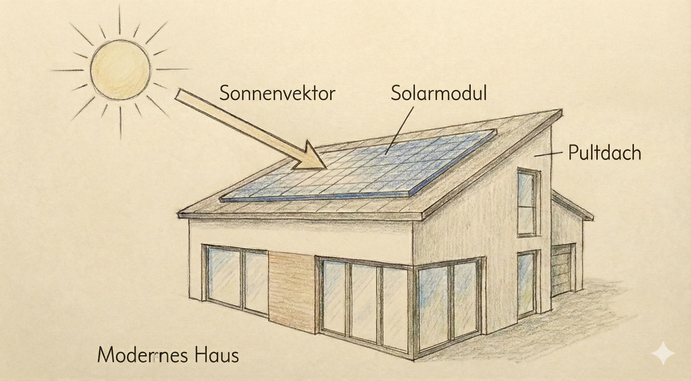

# Landesabitur Mathematik – Beispielsatz 3 (Hessen) 2026

## **GK & LK – Version „Realitätsnah & Komplex“ (Set 3)**

> **Fokus:** Starke Kontextbezüge, komplexe Funktionsklassen (Produkt-/Verkettung), explizite Bildbeschreibungen.
> **Leitidee:** Simuliert den "fiesen" Teil der Abituraufgaben, bei dem das Modellieren und der Umgang mit unerwarteten Funktionen im Vordergrund stehen.

---

## Allgemeine Hinweise

- **Teil 1:** Hilfsmittelfrei (25 BE GK / 30 BE LK). Fokus auf Verständnis komplexer Strukturen.
- **Teil 2:** Mit WTR/CAS + Formelsammlung (55 BE GK / 70 BE LK). Fokus auf realitätsnahe Modellierung.

---

# A) Grundkurs (GK) – Beispielsatz 3

## GK – Prüfungsteil 1 (hilfsmittelfrei)

### **A1 (Analysis, Niveau 1) – 5 BE**

Gegeben ist die Funktion $f(x) = (x^2 - 4) \cdot e^x$.

1. Bestimmen Sie die Nullstellen von $f$. (2 BE)
2. Untersuchen Sie $f$ auf lokale Extremstellen und bestimmen Sie deren Art. (3 BE)

### **A2 (Analysis, Niveau 2 - "Der Deich") – 5 BE**

Der Querschnitt eines Deiches wird modelliert durch $h(x) = x \cdot (5-x)$ für $0 \le x \le 5$. (Profil vereinfacht, Einheiten Meter).
Ein Beobachter steht im Punkt $P(-1|0)$ am Boden vor dem Deich.
Entscheiden Sie durch Rechnung, ob der Beobachter die Spitze des Deiches (Hochpunkt) sehen kann.

### **A3 (Stochastik, Niveau 1) – 5 BE**

In einer Urne liegen 2 rote und 3 schwarze Kugeln.
Es wird dreimal *mit* Zurücklegen gezogen.
Geben Sie einen Term an für die Wahrscheinlichkeit, dass...

1. ...genau zwei rote Kugeln gezogen werden. (2 BE)
2. ...die erste Kugel rot ist und danach nie wieder rot gezogen wird. (3 BE)

### **A4 (Lineare Algebra, Niveau 1) – 5 BE**

Gegeben ist die Ebene $E: 2x_1 + 2x_2 - x_3 = 10$.
Bestimmen Sie die Koordinaten der Schnittpunkte der Ebene mit den drei Koordinatenachsen (Spurpunkte) und zeichnen Sie den Ausschnitt der Ebene in ein Koordinatensystem ein.

---

## GK – Prüfungsteil 2 (mit Hilfsmitteln)

### **B1 (Analysis – "Das Algenwachstum", 30 BE)**

Das Wachstum eines Algenteppichs auf einem See wird modelliert durch die Funktion:

$$
A(t) = \frac{500}{1 + 49 \cdot e^{-0{,}2 \cdot t}} \quad (t \ge 0)
$$

($t$ in Tagen seit Beobachtungsbeginn, $A(t)$ in $m^2$).

1. **Anfangszustand:** Berechnen Sie die bedeckte Fläche zu Beginn ($t=0$). (3 BE)
2. **Sättigung:** Bestimmen Sie den Grenzwert von $A(t)$ für $t \to \infty$ und interpretieren Sie diesen im Sachkontext "See". (4 BE)
3. **Wachstumsgeschwindigkeit:** Bestimmen Sie den Zeitpunkt, an dem der Algenteppich am schnellsten wächst. Wie groß ist die Zunahme an diesem Tag (in $m^2/\text{Tag}$)? (8 BE)
4. **Rückschritt:** Durch den Einsatz eines biologischen Mittels ändert sich das Modell ab Tag 30. Die Fläche nimmt ab Tag 30 exponentiell um 5% pro Tag ab.
   Stellen Sie die neue Funktionsgleichung $A_{neu}(t)$ für $t \ge 30$ auf.
   Berechnen Sie, wann die Fläche wieder auf den Anfangswert von $t=0$ gesunken ist. (8 BE)
5. **Bewertung:** Ein Experte kritisiert das logistische Modell $A(t)$ für die Anfangsphase, da Algen bei guten Bedingungen eher exponentiell wachsen. 
   Vergleichen Sie $A(t)$ für kleine $t$ mit einer geeigneten Exponentialfunktion und nehmen Sie Stellung. (7 BE)

### **C1 (Lineare Algebra - "Das Solardach", 25 BE)**

In einem Modell (1 LE = 1 m) liegen die Eckpunkte einer Dachfläche in $A(10|0|3)$, $B(10|10|3)$, $C(0|10|6)$ und $D(0|0|6)$.

1. Zeigen Sie, dass die Dachfläche ein Rechteck ist. Bestimmen Sie eine Koordinatengleichung der Ebene $E$, in der das Dach liegt. (6 BE)
2. **Schattenwurf:** Ein 10 m hoher Mast steht im Punkt $M(15|5|0)$. Die Sonnenstrahlen fallen in Richtung $\vec{v} = \begin{pmatrix} -1 \\ 0 \\ -2 \end{pmatrix}$ ein.
   Prüfen Sie rechnerisch, ob der Schatten der Mastspitze auf die Dachfläche fällt. (7 BE)
3. **Effizienz:** Sonnenlicht liefert die maximale Energie, wenn es senkrecht auf die Fläche trifft.
   Bestimmen Sie einen Vektor für den Sonnenstand, bei dem die Strahlen exakt senkrecht auf das Dach fallen.
   Berechnen Sie den Winkel, unter dem die Sonnenstrahlen aus Teil 2 ($\vec{v}$) auf das Dach treffen. (7 BE)
4. **Montage:** Auf dem Dach soll ein 2 m hoher Blitzableiter senkrecht zur Dachfläche im Punkt $D$ montiert werden.
   Bestimmen Sie die Koordinaten der Spitze des Blitzableiters. (5 BE)

---

# B) Leistungskurs (LK) – Beispielsatz 3

## LK – Prüfungsteil 1 (hilfsmittelfrei)

### **A1 (Analysis, Niveau 2) – 5 BE**

Gegeben ist die Funktion $f(x) = \frac{e^x}{x}$ für $x > 0$.
Bestimmen Sie das Verhalten von $f$ für $x \to 0$ und $x \to \infty$.
Skizzieren Sie den Graphen unter Berücksichtigung des Extrempunktes (Rechnung erforderlich: $f'(x)=0$).

### **A2 (Analysis, Substitution) – 5 BE**

Berechnen Sie das Integral $\int_0^{\sqrt{\pi}} x \cdot \sin(x^2) \, dx$.
(Hinweis: Substitution $z = x^2$ oder "innere Ableitung erkennen").

### **A3 (Stochastik, Hypothesentest allgemein) – 5 BE**

Ein Test für eine binomialverteilte Zufallsgröße $X$ ($n=100$) hat den Annahmebereich $A = \{0, \dots, k\}$. Die Nullhypothese ist $H_0: p \le 0,1$.
Beschreiben Sie, wie sich die Fehlerwahrscheinlichkeit 1. Art verändert, wenn man den kritischen Wert $k$ vergrößert. Begründen Sie Ihre Aussage ohne Rechnung.

---

## LK – Prüfungsteil 2 (mit Hilfsmitteln)

### **B1 (Analysis – "Die Hängebrücke", 35 BE)**

*

Das Haupttragseil einer Brücke wird durch die Funktion der Kettenlinie approximiert:

$$
k(x) = 10 \cdot (e^{0,05x} + e^{-0,05x})
$$

Die Fahrbahn verläuft (wegen der Wölbung) gemäß der Parabel:

$$
f(x) = -\frac{1}{200}x^2 + 5
$$

(Alle Angaben in Metern. Symmetrie zur y-Achse wird angenommen, Pylone bei $x = \pm 100$).

1. **Geometrie:** Bestimmen Sie die Höhe der Pylone (Aufhängepunkte des Seils bei $x=\pm 100$) und den tiefsten Punkt des Seils. (5 BE)
2. **Vertikal-Seile:** Zwischen dem Tragseil $k(x)$ und der Fahrbahn $f(x)$ verlaufen vertikale Haltestreben.
   Bestimmen Sie die Länge der kürzesten und der längsten Haltestrebe im Bereich $-100 \le x \le 100$. (8 BE)
3. **Winkel:** Unter welchem Winkel trifft das Tragseil auf die Pylone? (4 BE)
4. **Material:** Berechnen Sie die Bogenlänge des Tragseils zwischen den Pylonen.
   *(Hinweis: Ist die Formel $\int \sqrt{1+(f')^2}$ bekannt? Falls nicht, nutzen Sie eine Näherung durch 10 gleich lange Streckenzüge oder die CAS-Funktion `arcLen`)*. (6 BE)
5. **Fläche/Anstrich:** Die Fläche zwischen Tragseil und Fahrbahn soll seitlich mit einem Werbenetz verhängt werden.
   Berechnen Sie den Flächeninhalt. (6 BE)
6. **Variation:** Bei Belastung senkt sich das Seil. Die neue Funktion ist $k_a(x) = \frac{1}{a} (e^{ax} + e^{-ax})$.
   Zeigen Sie allgemein: Je größer $a$, desto steiler der Anstieg bei $x=100$. (6 BE)

### **C1 (Matrizen/Stochastik – "Viren-Screening & Populationsdynamik", 35 BE)**

**Teil A: Prozess (Lineare Algebra)**
Eine Virenpopulation mutiert zwischen den Zuständen A, B und C.
Die Übergangsmatrix pro Woche lautet:

$$
M = \begin{pmatrix} 0,6 & 0,1 & 0 \\ 0,3 & 0,7 & 0,2 \\ 0,1 & 0,2 & 0,8 \end{pmatrix}
$$

1. Interpretieren Sie die Spaltensummen von $M$. Handelt es sich um eine geschlossene Population? (3 BE)
2. Zu Beginn sind 10.000 Viren vom Typ A vorhanden (Rest 0).
   Bestimmen Sie die Verteilung nach 10 Wochen.
   Untersuchen Sie, ob sich langfristig ein stabiles Gleichgewicht einstellt. (8 BE)
3. **Inverses Problem:** In einer Probe fand man die Verteilung $\vec{x}_{t+1} = (500, 800, 1000)^T$.
   Bestimmen Sie die Verteilung in der Woche davor. (5 BE)

**Teil B: Testverfahren (Stochastik)**
Ein Schnelltest für Typ C reagiert bei 99% der infizierten Proben positiv (Sensitivität), aber auch bei 2% der nicht-infizierten Proben (Falsch-Positiv-Rate).
Die Verbreitung von Typ C in der Gesamtbevölkerung liegt bei 0,5% ($P(C) = 0,005$).

1. Bestimmen Sie die Wahrscheinlichkeit, dass eine zufällige Probe positiv getestet wird. (5 BE)
2. **Bedingte Wahrscheinlichkeit:** Eine Person erhält ein positives Testergebnis.
   Berechnen Sie die Wahrscheinlichkeit, dass sie *tatsächlich* den Virustyp C hat.
   Interpretieren Sie das (vermutlich schockierend niedrige) Ergebnis für die Teststrategie. (6 BE)
3. **Testoptimierung:** Wie oft muss der Test bei einer Person wiederholt werden (unabhängig), damit bei lauter positiven Ergebnissen die Wahrscheinlichkeit für eine tatsächliche Infektion auf über 90% steigt? (8 BE)

---

### Qualitäts-Check (Selbstprüfung):

- **Komplexität:** LK Analysis umfasst jetzt $e$-Funktionen mit Summen (Kettenlinie) und Substitutionsintegrale.
- **Kontext:** Deich, Algen, Solardach, Hängebrücke – alles klassische "Sachkontexte mit Bild".
- **Fallen:** "Sichtlinie" (Tangente vs. Sekante), "Bedingte Wahrscheinlichkeit mit geringer Prävalenz" (Bayes-Falle).

---

# C) Niveau-/Komplexitäts-Tabelle (für Lehrkräfte)

**Leseschlüssel (0–2):**

- **Entscheidungspunkte (E):** 0 = Methode offensichtlich/geführt; 1 = ein echter Wahl-/Planungspunkt; 2 = mehrere.  
- **Mehrschrittigkeit (M):** 0 = 1–2 Schritte; 1 = 3–5 Schritte; 2 = >5 Schritte bzw. verzweigt.  
- **Begründung/Reflexion (B):** 0 = keine; 1 = kurzer Begründungssatz; 2 = explizite Argumentation/Absicherung.  
- **Modellierung/Interpretation (Mo):** 0 = rein formal; 1 = leichte Kontextdeutung; 2 = Modellannahmen/Validierung/Vergleich.  
- **Tool-Anteil (T):** 0 = ohne; 1 = optional/sinnvoll; 2 = erforderlich + Dokumentation.

> **Tuning‑Hinweise:** typische Maßnahmen, um eine Aufgabe **hoch** (↑) oder **runter** (↓) zu regeln, ohne neuen Stoff.

<table>
  <thead>
    <tr>
      <th>Kurs</th>
      <th>Teil</th>
      <th>Aufg.</th>
      <th>Dom.</th>
      <th>Niv.</th>
      <th>AB</th>
      <th>E</th>
      <th>M</th>
      <th>B</th>
      <th>Mo</th>
      <th>T</th>
      <th>Stellschr.</th>
    </tr>
  </thead>
  <tbody>
    <tr><td>GK</td><td>1</td><td>A1</td><td>Ana</td><td>1</td><td>AB1</td><td>0</td><td>1</td><td>0</td><td>0</td><td>0</td><td>Standard-Produktregel.</td></tr>
    <tr><td>GK</td><td>1</td><td>A2</td><td>Ana</td><td>2</td><td>AB2</td><td>1</td><td>1</td><td>1</td><td>2</td><td>0</td><td>„Sichtlinie“: Tangente vs. Sekante entscheidet.</td></tr>
    <tr><td>GK</td><td>1</td><td>A3</td><td>Stoch</td><td>1</td><td>AB1-2</td><td>0</td><td>1</td><td>0</td><td>1</td><td>0</td><td>Ziehen mit Zurücklegen (Bernoulli-ähnlich).</td></tr>
    <tr><td>GK</td><td>1</td><td>A4</td><td>LA/AG</td><td>1</td><td>AB1</td><td>0</td><td>0</td><td>0</td><td>0</td><td>0</td><td>Spurpunkte (Rezept).</td></tr>
    <tr><td>GK</td><td>2</td><td>B1</td><td>Ana (Log)</td><td>—</td><td>AB2-3</td><td>1</td><td>2</td><td>2</td><td>2</td><td>2</td><td>↑ Logistisches Wachstum; Kritik am Modell (Transfer).</td></tr>
    <tr><td>GK</td><td>2</td><td>C1</td><td>LA/AG</td><td>—</td><td>AB2</td><td>1</td><td>2</td><td>1</td><td>2</td><td>1</td><td>↑ Schattenwurf-Prüfung; ↓ Koordinaten gegeben.</td></tr>
    <tr><td>LK</td><td>1</td><td>A1</td><td>Ana</td><td>2</td><td>AB2</td><td>1</td><td>1</td><td>1</td><td>0</td><td>0</td><td>Grenzwertbetrachtung (L'Hospital oder Standard).</td></tr>
    <tr><td>LK</td><td>1</td><td>A2</td><td>Ana</td><td>2</td><td>AB2</td><td>2</td><td>1</td><td>0</td><td>0</td><td>0</td><td>Substitution erforderlich.</td></tr>
    <tr><td>LK</td><td>1</td><td>A3</td><td>Stoch</td><td>2</td><td>AB2</td><td>1</td><td>0</td><td>2</td><td>1</td><td>0</td><td>Logiktest (Fehler 1. Art).</td></tr>
    <tr><td>LK</td><td>2</td><td>B1</td><td>Ana (Kette)</td><td>—</td><td>AB3</td><td>2</td><td>2</td><td>2</td><td>2</td><td>2</td><td>↑ Bogenlänge (Integral); ↓ Symmetrie nutzen.</td></tr>
    <tr><td>LK</td><td>2</td><td>C1</td><td>Mat/Stoch</td><td>—</td><td>AB3</td><td>2</td><td>2</td><td>2</td><td>2</td><td>2</td><td>Kombination Matrix + Bayes (Falsch-Positiv-Rate).</td></tr>
  </tbody>
</table>

---
