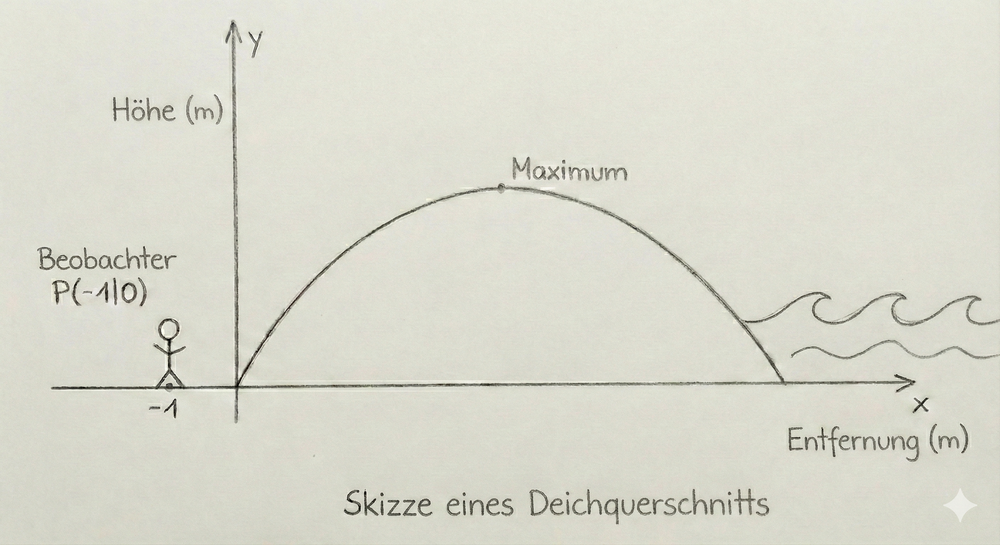
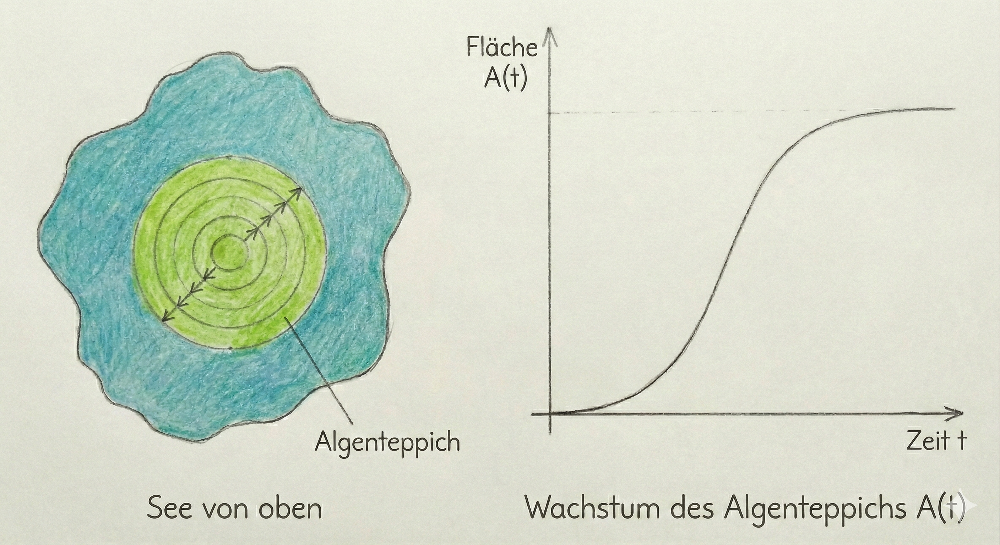
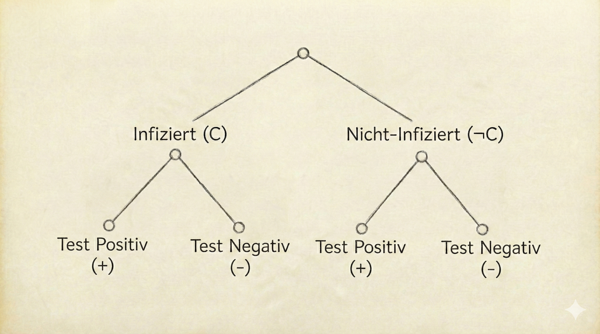
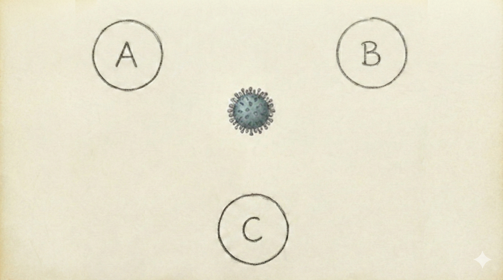

# Landesabitur Mathematik (Hessen) 2026 – SkillPilot Beispielklausur 1 (v2.3)

## **GK & LK – Version „Realitätsnah & Komplex“**

> **Fokus:** Starke Kontextbezüge, komplexe Funktionsklassen (Produkt-/Verkettung), explizite Bildbeschreibungen.
> **Leitidee:** Simuliert den **anspruchsvollen** Teil der Abituraufgaben, bei dem das Modellieren und der Umgang mit unerwarteten Funktionen im Vordergrund stehen.
> 
> **Hinweis zur Durchführung (gemäß Erlass):** Dies ist der vollständige Aufgabenpool.
> 
> * **GK (Teil 1):** Legen Sie alle 9 Aufgaben vor. Der Prüfling bearbeitet 5 Aufgaben: 4 Aufgaben aus Niveau 1 (3 Pflicht + 1 Wahl) und 1 Aufgabe aus Niveau 2.
> * **LK (Teil 1):** Legen Sie alle 10 Aufgaben vor. Der Prüfling bearbeitet 6 Aufgaben: 4 Pflichtaufgaben (Niveau 1) und 2 Wahlaufgaben aus Niveau 2.
> * **Teil 2:** Die Vorschläge C und D sind jeweils Pflicht. Zwischen B1 und B2 wählen die Prüflinge einen Vorschlag aus.

---

## Allgemeine Hinweise

- **Teil 1:** Hilfsmittelfrei (25 BE GK / 30 BE LK). Fokus auf Verständnis komplexer Strukturen.
- **Teil 2:** Mit WTR/CAS + Formelsammlung (55 BE GK / 70 BE LK). Fokus auf realitätsnahe Modellierung.

---

# A) Grundkurs (GK) – SkillPilot Beispielklausur 1

## GK – Prüfungsteil 1 (hilfsmittelfrei)

**Auswahlregel für Schüler:** Bearbeiten Sie insgesamt 5 Aufgaben.

* **Pflicht:** A1, A4, A5.
* **Wahl:** Wählen Sie **eine** Aufgabe aus dem Niveau-1-Pool (A3, A6, A8) und **eine** Aufgabe aus dem Niveau-2-Pool (A2, A7, A9).

### **A1 (Analysis) – 5 BE**

> **[Modus: Pflicht | Niveau: 1 | Domain: Analysis | 5 BE]**

Gegeben ist die Funktion $f(x) = (x^2 - 3) \cdot e^x$.

1. Bestimmen Sie die Nullstellen von $f$. (2 BE)
2. Untersuchen Sie $f$ auf lokale Extremstellen und bestimmen Sie deren Art. (3 BE)

### **A2 (Analysis - "Der Deich") – 5 BE**

> **[Modus: Wahl | Niveau: 2 | Domain: Analysis | 5 BE]**

Der Querschnitt eines Deiches wird modelliert durch $h(x) = x \cdot (5-x)$ für $0 \le x \le 5$. (Profil vereinfacht, Einheiten Meter).
Ein Beobachter steht im Punkt $P(-1|0)$ am Boden vor dem Deich.
Untersuchen Sie rechnerisch, ob die direkte Sichtlinie vom Beobachter zur Deichspitze (Hochpunkt) durch das Deichprofil unterbrochen wird.

### **A3 (Stochastik) – 5 BE**

> **[Modus: Wahl | Niveau: 1 | Domain: Stochastik | 5 BE]**

In einer Urne liegen 2 rote und 3 schwarze Kugeln.
Es wird dreimal *mit* Zurücklegen gezogen.
Geben Sie einen Term an für die Wahrscheinlichkeit, dass...

1. ...genau zwei rote Kugeln gezogen werden. (2 BE)
2. ...die erste Kugel rot ist und danach nie wieder rot gezogen wird. (3 BE)

### **A4 (Lineare Algebra) – 5 BE**

> **[Modus: Pflicht | Niveau: 1 | Domain: Lineare Algebra | 5 BE]**

Gegeben ist die Ebene $E: 2x_1 + 2x_2 - x_3 = 10$.
Bestimmen Sie die Koordinaten der Schnittpunkte der Ebene mit den drei Koordinatenachsen (Spurpunkte) und zeichnen Sie den Ausschnitt der Ebene in ein Koordinatensystem ein.

### **A5 (Stochastik) – 5 BE**

> **[Modus: Pflicht | Niveau: 1 | Domain: Stochastik | 5 BE]**

Ein Glücksrad hat drei Sektoren: Rot (50%), Blau (30%) und Gelb (20%).
Es wird zweimal gedreht.
Bestimmen Sie die Wahrscheinlichkeit, dass...

1. ...zweimal die gleiche Farbe erscheint. (2 BE)
2. ...mindestens einmal Gelb erscheint. (3 BE)

### **A6 (Analysis) – 5 BE**

> **[Modus: Wahl | Niveau: 1 | Domain: Analysis | 5 BE]**

Gegeben ist der Graph der Ableitungsfunktion $f'$ einer Polynomfunktion $f$.
Der Graph von $f'$ ist eine nach oben geöffnete Parabel, die die x-Achse in den Punkten $x_1 = -2$ und $x_2 = 2$ schneidet.

1. Begründen Sie, welche Steigung der Graph von $f$ an der Stelle $x=0$ hat. (2 BE)
2. Bestimmen Sie die x-Koordinaten der lokalen Extremstellen von $f$ und geben Sie jeweils die Art des Extremums an. (3 BE)

### **A7 (Lineare Algebra) – 5 BE**

> **[Modus: Wahl | Niveau: 2 | Domain: Lineare Algebra | 5 BE]**

Gegeben sind die Punkte $A(2|0|0)$, $B(0|2|0)$ und eine Schar von Punkten $C_k(0|0|k)$ mit $k \in \mathbb{R}$.
Bestimmen Sie alle Werte für $k$, sodass das Dreieck $ABC_k$ im Punkt $C_k$ einen rechten Winkel hat.

### **A8 (Lineare Algebra) – 5 BE**

> **[Modus: Wahl | Niveau: 1 | Domain: Lineare Algebra | 5 BE]**

Gegeben sind die Punkte $P(1|2|3)$ und $Q(3|2|1)$.

1. Stellen Sie eine Parametergleichung der Geraden $g$ durch $P$ und $Q$ auf. (3 BE)
2. Prüfen Sie, ob der Punkt $R(5|2|-1)$ auf der Geraden $g$ liegt. (2 BE)

### **A9 (Stochastik) – 5 BE**

> **[Modus: Wahl | Niveau: 2 | Domain: Stochastik | 5 BE]**

Bei einem Gewinnspiel beträgt der Einsatz $e$ Euro. Aus einer Urne mit 4 Gewinnerlosen und 6 Nieten wird ein Los gezogen.
Ist es ein Gewinnerlos, erhält man 10 Euro ausgezahlt. Ist es eine Niete, erhält man nichts.
Bestimmen Sie den Einsatz $e$ so, dass das Spiel fair ist (d.h. der Erwartungswert des Gewinns für den Spieler beträgt 0 Euro).

---

## GK – Prüfungsteil 2 (mit Hilfsmitteln)

> **Zugelassene Hilfsmittel:** WTR oder CAS, Formelsammlung.

### **B1 (Analysis – "Das Algenwachstum", 25 BE)**

Das Wachstum eines Algenteppichs auf einem See wird modelliert durch die Funktion:

$$
A(t) = \frac{500}{1 + 49 \cdot e^{-0{,}2 \cdot t}} \quad (t \ge 0)
$$

($t$ in Tagen seit Beobachtungsbeginn, $A(t)$ in $m^2$).

1. **Anfangszustand:** Berechnen Sie die bedeckte Fläche zu Beginn ($t=0$). (3 BE)
2. **Sättigung:** Bestimmen Sie den Grenzwert von $A(t)$ für $t \to \infty$ und interpretieren Sie diesen im Sachkontext "See". (4 BE)
3. **Wachstumsgeschwindigkeit:** Bestimmen Sie den Zeitpunkt, an dem der Algenteppich am schnellsten wächst. Wie groß ist die Zunahme an diesem Tag (in $m^2/\text{Tag}$)? (8 BE)
4. **Rückschritt:** Durch den Einsatz eines biologischen Mittels ändert sich das Modell ab Tag 30. Die Fläche nimmt ab Tag 30 exponentiell um 5% pro Tag ab.
   Stellen Sie die neue Funktionsgleichung $A_{neu}(t)$ für $t \ge 30$ auf.
   Berechnen Sie, wann die Fläche wieder auf den Anfangswert von $t=0$ gesunken ist. (6 BE)
5. **Bewertung:** Ein Experte kritisiert das logistische Modell $A(t)$ für die Anfangsphase, da Algen bei guten Bedingungen eher exponentiell wachsen.
   Vergleichen Sie $A(t)$ für kleine $t$ mit einer geeigneten Exponentialfunktion und nehmen Sie Stellung. (4 BE)

### **B2 (Analysis – "Der Bremstest", 25 BE)**

Ein Fahrzeug führt einen Bremstest durch. Die Geschwindigkeit wird für $0 \le t \le 10$ modelliert durch:

$$
v(t) = -\frac{1}{40}t^3 + \frac{3}{10}t^2 - \frac{9}{4}t + 20
$$

($t$ in Sekunden, $v(t)$ in $m/s$).

1. **Anfangsphase:** Bestimmen Sie die Geschwindigkeit zu Beginn ($t=0$) und zum Zeitpunkt $t=10$.
   Berechnen Sie die Beschleunigung $a(t) = v'(t)$ zum Zeitpunkt $t=0$. (4 BE)
2. **Extremwerte:** Bestimmen Sie den Zeitpunkt im Intervall $[0; 10]$, an dem die Geschwindigkeit am geringsten ist. (6 BE)
3. **Bremsweg:** Die zurückgelegte Strecke entspricht dem Integral der Geschwindigkeitsfunktion.
   Berechnen Sie die Strecke, die das Fahrzeug in den ersten 10 Sekunden zurücklegt.
   Bestimmen Sie die Durchschnittsgeschwindigkeit in diesem Zeitraum. (8 BE)
4. **Reaktion:** Ein Sensor überwacht die Bremswirkung. Er meldet ein Warnsignal ("Brake Fading"), sobald die Verzögerung (Bremskraft) im Verlauf des Bremsvorgangs **am geringsten** ist (lokales Maximum der Beschleunigung $a(t)$).
   Ermitteln Sie rechnerisch den Zeitpunkt $t \in [0; 10]$, an dem die Verzögerung am geringsten ist (lokales Maximum von $a(t)$), und geben Sie die dort herrschende Beschleunigung an. (7 BE)

### **C1 (Lineare Algebra - "Das Solardach", 15 BE)**

In einem Modell (1 LE = 1 m) liegen die Eckpunkte einer Dachfläche in $A(10|0|3)$, $B(10|10|3)$, $C(0|10|6)$ und $D(0|0|6)$.

1. **Geometrie:** Zeigen Sie, dass die Dachfläche ein Rechteck ist. Bestimmen Sie eine Koordinatengleichung der Ebene $E$, in der das Dach liegt. (5 BE)
2. **Schattenwurf:** Ein 10 m hoher Mast steht im Punkt $M(13|5|0)$. Die Sonnenstrahlen fallen in Richtung $\vec{v} = \begin{pmatrix} -1 \\ 0 \\ -2 \end{pmatrix}$ ein.
   Prüfen Sie rechnerisch, ob der Schatten der Mastspitze auf die Dachfläche fällt. (5 BE)
3. **Effizienz:** Sonnenlicht liefert die maximale Energie, wenn es senkrecht auf die Fläche trifft.
   Berechnen Sie den Einfallswinkel des aktuellen Sonnenlichts bezüglich der Dachfläche (Winkel zwischen Sonnenstrahl und Ebene). (5 BE)

### **D1 (Stochastik – "Viren-Screening", 15 BE)**

Ein Schnelltest für Typ C reagiert bei 99% der infizierten Proben positiv (Sensitivität), aber auch bei 2% der nicht-infizierten Proben (Falsch-Positiv-Rate).
Die Verbreitung von Typ C in der Gesamtbevölkerung liegt bei 0,5% ($P(C) = 0,005$).

1. **Testanalyse:** Bestimmen Sie die Wahrscheinlichkeit, dass eine zufällige Probe positiv getestet wird. (4 BE)
2. **Bedingte Wahrscheinlichkeit:** Eine Person erhält ein positives Testergebnis.
   Berechnen Sie die Wahrscheinlichkeit, dass sie *tatsächlich* den Virustyp C hat.
   Interpretieren Sie das Ergebnis im Hinblick auf die Verlässlichkeit eines einzelnen Massentests. (6 BE)
3. **Massen-Screening:** Wie viele Personen müssen mindestens getestet werden, damit mit einer Wahrscheinlichkeit von mehr als 99% mindestens ein positives Testergebnis auftritt? (5 BE)

---

# B) Leistungskurs (LK) – SkillPilot Beispielklausur 1

## LK – Prüfungsteil 1 (hilfsmittelfrei)

**Auswahlregel für Schüler:** Bearbeiten Sie insgesamt 6 Aufgaben.

* **Pflicht:** A1, A4, A5, A6.
* **Wahl:** Wählen Sie **zwei** Aufgaben aus dem Niveau-2-Pool (A2, A3, A7, A8, A9, A10).

### **A1 (Analysis) – 5 BE**

> **[Modus: Pflicht | Niveau: 1 | Domain: Analysis | 5 BE]**

Gegeben ist die Funktion $f(x) = \frac{e^x}{x}$ für $x > 0$.
Bestimmen Sie das Verhalten von $f$ für $x \to 0$ und $x \to \infty$.
Berechnen Sie das Extremum und skizzieren Sie den Graphen.

### **A2 (Analysis) – 5 BE**

> **[Modus: Wahl | Niveau: 2 | Domain: Analysis | 5 BE]**

Berechnen Sie das Integral $\int_0^{\sqrt{\pi}} x \cdot \sin(x^2) \, dx$.

### **A3 (Stochastik) – 5 BE**

> **[Modus: Wahl | Niveau: 2 | Domain: Stochastik | 5 BE]**

Ein Test für eine binomialverteilte Zufallsgröße $X$ ($n=100$) hat den Annahmebereich $A = \{0, \dots, k\}$. Die Nullhypothese ist $H_0: p \le 0,1$.
Beschreiben Sie, wie sich die Fehlerwahrscheinlichkeit 1. Art verändert, wenn man den kritischen Wert $k$ vergrößert. Begründen Sie Ihre Aussage ohne Rechnung.

### **A4 (Lineare Algebra) – 5 BE**

> **[Modus: Pflicht | Niveau: 1 | Domain: Lineare Algebra | 5 BE]**

Gegeben sind die Gerade $g: \vec{x} = \begin{pmatrix} 1 \\ 2 \\ 3 \end{pmatrix} + r \cdot \begin{pmatrix} 2 \\ 0 \\ -1 \end{pmatrix}$ und die Ebene $E: x_1 + 2x_2 + 2x_3 = 10$.
Untersuchen Sie die gegenseitige Lage von $g$ und $E$. Berechnen Sie gegebenenfalls den Schnittpunkt.

### **A5 (Analysis) – 5 BE**

> **[Modus: Pflicht | Niveau: 1 | Domain: Analysis | 5 BE]**

Gegeben ist $f(x) = e^{2x - 1}$.
Bestimmen Sie die Ableitung $f'(x)$ und die Stammfunktion $F(x)$.
Berechnen Sie den Wert von $f'(0,5)$.

### **A6 (Stochastik) – 5 BE**

> **[Modus: Pflicht | Niveau: 1 | Domain: Stochastik | 5 BE]**

In einer Gruppe sind 60% weiblich ($W$). 20% der Personen sind weiblich und rauchen ($R$).
Bestimmen Sie die Wahrscheinlichkeit, dass eine zufällig ausgewählte Person raucht, unter der Bedingung, dass sie weiblich ist: $P_W(R)$.
Interpretieren Sie das Ergebnis im Kontext.

### **A7 (Analysis) – 5 BE**

> **[Modus: Wahl | Niveau: 2 | Domain: Analysis | 5 BE]**

Die Funktion $f$ ist punktsymmetrisch zum Ursprung und für alle $x$ definiert. Es gilt $\int_0^3 f(x) \, dx = 4$.
Bestimmen Sie den Wert des Integrals $\int_{-3}^3 (f(x) + 2) \, dx$. Begründen Sie Ihren Rechenweg.

### **A8 (Lineare Algebra) – 5 BE**

> **[Modus: Wahl | Niveau: 2 | Domain: Lineare Algebra | 5 BE]**

Gegeben ist ein Parallelogramm $ABCD$ mit den Ortsvektoren $\vec{a}$, $\vec{b}$, $\vec{c}$ und $\vec{d}$. Der Diagonalenschnittpunkt ist $M$.
Drücken Sie den Vektor $\vec{m} = \vec{OM}$ ausschließlich durch $\vec{a}$ und $\vec{c}$ aus und begründen Sie vektoriell, dass $M$ der Mittelpunkt der Strecke $AC$ ist.

### **A9 (Lineare Algebra) – 5 BE**

> **[Modus: Wahl | Niveau: 2 | Domain: Lineare Algebra | 5 BE]**

Gegeben sind die Gerade $g: \vec{x} = \begin{pmatrix} 1 \\ 0 \\ 1 \end{pmatrix} + r \begin{pmatrix} 1 \\ 1 \\ 0 \end{pmatrix}$ und die Geradenschar $h_a: \vec{x} = \begin{pmatrix} 0 \\ 1 \\ 2 \end{pmatrix} + s \begin{pmatrix} 1 \\ a \\ 0 \end{pmatrix}$.
Untersuchen Sie, für welchen Parameter $a$ die Geraden $g$ und $h_a$ echt parallel zueinander sind.

### **A10 (Stochastik) – 5 BE**

> **[Modus: Wahl | Niveau: 2 | Domain: Stochastik | 5 BE]**

Ein Multiple-Choice-Test besteht aus $n$ Fragen mit je 4 Antwortmöglichkeiten, von denen genau eine richtig ist. Ein Kandidat rät bei allen Fragen (Bernoulli-Kette).
Geben Sie einen Ansatz an, um die Mindestanzahl $n$ der Fragen zu bestimmen, damit die Wahrscheinlichkeit, **mindestens eine** Frage richtig zu beantworten, größer als 99% ist. (Rechnung muss nicht zu Ende geführt werden, Ansatz genügt).

---

## LK – Prüfungsteil 2 (mit Hilfsmitteln)

> **Zugelassene Hilfsmittel:** WTR oder CAS, Formelsammlung.

### **B1 (Analysis – "Die Hängebrücke", 30 BE)**

Das Haupttragseil einer Brücke wird durch die Funktion der Kettenlinie approximiert:

$$
k(x) = 10 \cdot (e^{0,02x} + e^{-0,02x})
$$

Die x‑Achse beschreibt die Wasseroberfläche (Höhe 0). Die Fahrbahn verläuft (wegen der Wölbung) gemäß der Parabel:

$$
f(x) = -0,0005x^2 + 10
$$

(Alle Angaben in Metern. Symmetrie zur y-Achse wird angenommen, Pylone bei $x = \pm 100$).

1. **Geometrie:** Bestimmen Sie die Gesamthöhe der Pylone über dem Wasserspiegel (y‑Koordinate der Aufhängepunkte des Seils bei $x=\pm 100$) sowie den tiefsten Punkt des Tragseils. (5 BE)
2. **Vertikal-Seile:** Zwischen dem Tragseil $k(x)$ und der Fahrbahn $f(x)$ verlaufen vertikale Haltestreben.
   Bestimmen Sie die Länge der kürzesten und der längsten Haltestrebe im Bereich $-100 \le x \le 100$. (8 BE)
3. **Winkel:** Unter welchem Winkel trifft das Tragseil auf die Pylone? (4 BE)
4. **Fläche/Anstrich:** Die Fläche zwischen Tragseil und Fahrbahn soll seitlich mit einem Werbenetz verhängt werden.
   Berechnen Sie den Flächeninhalt. (7 BE)
5. **Variation:** Bei Belastung senkt sich das Seil. Die neue Funktion ist $k_a(x) = \frac{1}{a} (e^{ax} + e^{-ax})$.
   Zeigen Sie allgemein durch Rechnung oder Argumentation: Je größer der Parameter $a$ ($a>0$), desto steiler ist der Anstieg des Seils am Pylon ($x=100$). (6 BE)

 

### **B2 (Analysis – "Wirkstoffkonzentration", 30 BE)**

Die Konzentration eines Medikaments im Blut wird modelliert durch die Funktionenschar:

$$
c_k(t) = 10 \cdot t \cdot e^{1 - k \cdot t} \quad (t \ge 0, k > 0)
$$

($t$ in Stunden, $c_k(t)$ in mg/l).

1. **Verlauf:** Untersuchen Sie das Verhalten für $t \to \infty$. Begründen Sie, dass die Konzentration für $t>0$ stets positiv ist. (4 BE)
2. **Wirkungsmaximum:** Bestimmen Sie in Abhängigkeit von $k$ den Zeitpunkt der maximalen Konzentration und die Höhe der maximalen Konzentration.
   Für welchen Parameter $k$ wird das Maximum genau nach 2 Stunden erreicht? (9 BE)
3. **Abbaugeschwindigkeit:** Zeigen Sie, dass die Wendestelle der Funktion bei $t_W = \frac{2}{k}$ liegt.
   Interpretieren Sie die Bedeutung der Wendestelle im Kontext des Abbaus des Medikaments. (6 BE)
4. **Gesamtmenge:** Das Integral $\int_0^{\infty} c_k(t) \, dt$ ist ein Maß für die "totale Exposition" des Körpers (AUC = Area Under Curve).
   Bestimmen Sie diesen Wert in Abhängigkeit von $k$.
   Ein Arzt möchte die Exposition verdoppeln. Untersuchen Sie, wie er dafür den Parameter $k$ ändern muss. (11 BE)

### **C1 (Lineare Algebra – "Populationsdynamik", 20 BE)**

Eine Virenpopulation mutiert zwischen den Zuständen A, B und C.
Die Übergangsmatrix pro Woche lautet:

$$
M = \begin{pmatrix} 0,6 & 0,1 & 0 \\ 0,3 & 0,7 & 0,2 \\ 0,1 & 0,2 & 0,8 \end{pmatrix}
$$

1. **Systemverständnis:** Interpretieren Sie die Spaltensummen von $M$. Handelt es sich um eine geschlossene Population?
   Zeichnen Sie ein Übergangsdiagramm für die Zustände A, B und C. (4 BE)
2. **Prognose:** Zu Beginn sind 10.000 Viren vom Typ A vorhanden (Rest 0).
   Bestimmen Sie die Verteilung nach 10 Wochen.
   Untersuchen Sie, ob sich langfristig ein stabiles Gleichgewicht einstellt. (8 BE)
3. **Rekonstruktion:** In einer Probe fand man die Verteilung $\vec{x}_{t+1} = (500, 800, 1000)^T$.
   Bestimmen Sie die Verteilung in der Woche davor.
   Erläutern Sie, warum nicht jede beliebige Verteilung eine "Vorgänger"-Verteilung haben muss. (8 BE)

### **D1 (Stochastik – "Viren-Screening & Testgüte", 20 BE)**

Ein Schnelltest für Typ C reagiert bei 99% der infizierten Proben positiv (Sensitivität), aber auch bei 2% der nicht-infizierten Proben (Falsch-Positiv-Rate).
Die Verbreitung von Typ C in der Gesamtbevölkerung liegt bei 0,5% ($P(C) = 0,005$).

1. **Testanalyse:** Bestimmen Sie die Wahrscheinlichkeit, dass eine zufällige Probe positiv getestet wird. (4 BE)
2. **Bedingte Wahrscheinlichkeit:** Eine Person erhält ein positives Testergebnis. Berechnen Sie die Wahrscheinlichkeit, dass sie *tatsächlich* den Virustyp C hat. Interpretieren Sie das Ergebnis für die Teststrategie. (5 BE)
3. **Testoptimierung:** Wie oft muss der Test bei einer Person wiederholt werden (unabhängig), damit bei lauter positiven Ergebnissen die Wahrscheinlichkeit für eine tatsächliche Infektion auf über 90% steigt? (6 BE)
4. **Kapazitätsplanung:** Ein Labor wertet eine Serie von 2.000 Proben aus (Falsch-Positiv-Rate $p=0,02$). Bestimmen Sie die kleinste Zahl $k$, sodass die Anzahl der falsch-positiven Ergebnisse mit einer Wahrscheinlichkeit von mindestens 95% im Intervall $[0; k]$ liegt. (5 BE)

---

### Qualitäts-Check (Selbstprüfung):

- **Komplexität:** LK Analysis umfasst jetzt $e$-Funktionen mit Summen (Kettenlinie) und Substitutionsintegrale.
- **Kontext:** Deich, Algen, Solardach, Hängebrücke – alles klassische "Sachkontexte mit Bild".
- **Fallen:** "Sichtlinie" (Tangente vs. Sekante), "Bedingte Wahrscheinlichkeit mit geringer Prävalenz" (Bayes-Falle).

---

# C) Niveau-/Komplexitäts-Tabelle (für Lehrkräfte)

**Leseschlüssel (0–2):**

- **Entscheidungspunkte (E):** 0 = Methode offensichtlich/geführt; 1 = ein echter Wahl-/Planungspunkt; 2 = mehrere.  
- **Mehrschrittigkeit (M):** 0 = 1–2 Schritte; 1 = 3–5 Schritte; 2 = >5 Schritte bzw. verzweigt.  
- **Begründung/Reflexion (B):** 0 = keine; 1 = kurzer Begründungssatz; 2 = explizite Argumentation/Absicherung.  
- **Modellierung/Interpretation (Mo):** 0 = rein formal; 1 = leichte Kontextdeutung; 2 = Modellannahmen/Validierung/Vergleich.  
- **Tool-Anteil (T):** 0 = ohne; 1 = optional/sinnvoll; 2 = erforderlich + Dokumentation.

> **Tuning‑Hinweise:** typische Maßnahmen, um eine Aufgabe **hoch** (↑) oder **runter** (↓) zu regeln, ohne neuen Stoff.

**GK**

<table>
  <thead>
    <tr>
      <th>Teil</th>
      <th>Aufg.</th>
      <th>Dom.</th>
      <th>Niv.</th>
      <th>AB</th>
      <th>E</th>
      <th>M</th>
      <th>B</th>
      <th>Mo</th>
      <th>T</th>
      <th>Stellschr.</th>
    </tr>
  </thead>
  <tbody>
    <tr><td>1</td><td>A1</td><td>Ana</td><td>1</td><td>AB1</td><td>0</td><td>1</td><td>0</td><td>0</td><td>0</td><td>Standard-Produktregel.</td></tr>
    <tr><td>1</td><td>A6</td><td>Ana</td><td>1</td><td>AB1-2</td><td>0</td><td>0</td><td>1</td><td>0</td><td>0</td><td>Ableitungsgraph interpretieren.</td></tr>
    <tr><td>1</td><td>A7</td><td>LA</td><td>1</td><td>AB1-2</td><td>0</td><td>0</td><td>1</td><td>0</td><td>0</td><td>Skalarprodukt (rechter Winkel).</td></tr>
    <tr><td>1</td><td>A8</td><td>LA</td><td>1</td><td>AB1</td><td>0</td><td>1</td><td>0</td><td>0</td><td>0</td><td>Punktprobe Gerade.</td></tr>
    <tr><td>1</td><td>A9</td><td>Stoch</td><td>2</td><td>AB2</td><td>1</td><td>1</td><td>1</td><td>1</td><td>0</td><td>Erwartungswert (Fairness).</td></tr>
    <tr><td>1</td><td>A2</td><td>Ana</td><td>2</td><td>AB2</td><td>1</td><td>1</td><td>1</td><td>2</td><td>0</td><td>„Sichtlinie“: Tangente vs. Sekante entscheidet.</td></tr>
    <tr><td>1</td><td>A3</td><td>Stoch</td><td>1</td><td>AB1-2</td><td>0</td><td>1</td><td>0</td><td>1</td><td>0</td><td>Ziehen mit Zurücklegen (Bernoulli-ähnlich).</td></tr>
    <tr><td>1</td><td>A4</td><td>LA/AG</td><td>1</td><td>AB1</td><td>0</td><td>0</td><td>0</td><td>0</td><td>0</td><td>Spurpunkte (Rezept).</td></tr>
    <tr><td>1</td><td>A5</td><td>Stoch</td><td>1</td><td>AB1</td><td>0</td><td>1</td><td>0</td><td>0</td><td>0</td><td>Pfadregeln (Standard).</td></tr>
    <tr><td>2</td><td>B1</td><td>Ana (Log)</td><td>—</td><td>AB2-3</td><td>1</td><td>2</td><td>2</td><td>2</td><td>2</td><td>↑ Logistisches Wachstum; Kritik am Modell (Transfer).</td></tr>
    <tr><td>2</td><td>B2</td><td>Ana (Poly)</td><td>—</td><td>AB2</td><td>1</td><td>1</td><td>1</td><td>1</td><td>1</td><td>↑ Wendepunkt (Kontext); Integral als Strecke.</td></tr>
    <tr><td>2</td><td>C1</td><td>LA/AG</td><td>—</td><td>AB2</td><td>1</td><td>1</td><td>0</td><td>1</td><td>1</td><td>↑ Schattenwurf-Prüfung.</td></tr>
    <tr><td>2</td><td>D1</td><td>Stoch</td><td>—</td><td>AB2</td><td>1</td><td>1</td><td>1</td><td>2</td><td>2</td><td>Bedingte Wk. (Bayes); Interpretation Screening.</td></tr>
  </tbody>
</table>

**LK**

<table>
  <thead>
    <tr>
      <th>Teil</th>
      <th>Aufg.</th>
      <th>Dom.</th>
      <th>Niv.</th>
      <th>AB</th>
      <th>E</th>
      <th>M</th>
      <th>B</th>
      <th>Mo</th>
      <th>T</th>
      <th>Stellschr.</th>
    </tr>
  </thead>
  <tbody>
    <tr><td>1</td><td>A1</td><td>Ana</td><td>1</td><td>AB1</td><td>0</td><td>1</td><td>0</td><td>0</td><td>0</td><td>Grenzwertbetrachtung.</td></tr>
    <tr><td>1</td><td>A7</td><td>Ana</td><td>2</td><td>AB2</td><td>1</td><td>1</td><td>2</td><td>0</td><td>0</td><td>Integral-Eigenschaften (Symmetrie).</td></tr>
    <tr><td>1</td><td>A8</td><td>LA</td><td>2</td><td>AB2</td><td>0</td><td>1</td><td>1</td><td>0</td><td>0</td><td>Vektorbeweis (Mittelpunkt).</td></tr>
    <tr><td>1</td><td>A9</td><td>LA</td><td>2</td><td>AB2</td><td>1</td><td>1</td><td>1</td><td>0</td><td>0</td><td>Lagebeziehung (Parameter).</td></tr>
    <tr><td>1</td><td>A10</td><td>Stoch</td><td>2</td><td>AB2</td><td>2</td><td>1</td><td>1</td><td>1</td><td>0</td><td>Ansatz n-Bestimmung.</td></tr>
    <tr><td>1</td><td>A2</td><td>Ana</td><td>2</td><td>AB2</td><td>2</td><td>1</td><td>0</td><td>0</td><td>0</td><td>Substitution erforderlich.</td></tr>
    <tr><td>1</td><td>A3</td><td>Stoch</td><td>2</td><td>AB2</td><td>1</td><td>0</td><td>2</td><td>1</td><td>0</td><td>Logiktest (Fehler 1. Art).</td></tr>
    <tr><td>1</td><td>A4</td><td>LA/AG</td><td>1</td><td>AB1</td><td>0</td><td>1</td><td>0</td><td>0</td><td>0</td><td>Lagebeziehung Gerade/Ebene (Standardverfahren).</td></tr>
    <tr><td>1</td><td>A5</td><td>Ana</td><td>1</td><td>AB1</td><td>0</td><td>1</td><td>0</td><td>0</td><td>0</td><td>Kettenregel + Stammfunktion (Basiskalkül).</td></tr>
    <tr><td>1</td><td>A6</td><td>Stoch</td><td>1</td><td>AB1</td><td>0</td><td>0</td><td>1</td><td>1</td><td>0</td><td>Bed. Wkt. + Interpretation (Kontextdeutung).</td></tr>
    <tr><td>2</td><td>B1</td><td>Ana (Kette)</td><td>—</td><td>AB3</td><td>2</td><td>2</td><td>2</td><td>2</td><td>2</td><td>↑ Parameter-Variation; ↓ Symmetrie nutzen.</td></tr>
    <tr><td>2</td><td>B2</td><td>Ana (Schar)</td><td>—</td><td>AB3</td><td>2</td><td>2</td><td>2</td><td>1</td><td>1</td><td>↑ Allg. Parameter-Integration; Optimierung von k.</td></tr>
    <tr><td>2</td><td>C1</td><td>LA/AG</td><td>—</td><td>AB3</td><td>2</td><td>1</td><td>1</td><td>2</td><td>2</td><td>Populationsmatrix (stabil?); Rückrechnung LGS.</td></tr>
    <tr><td>2</td><td>D1</td><td>Stoch</td><td>—</td><td>AB3</td><td>2</td><td>1</td><td>2</td><td>2</td><td>2</td><td>Bayes + Mehrfachtest; Kritik Unabhängigkeit.</td></tr>
  </tbody>
</table>

---
