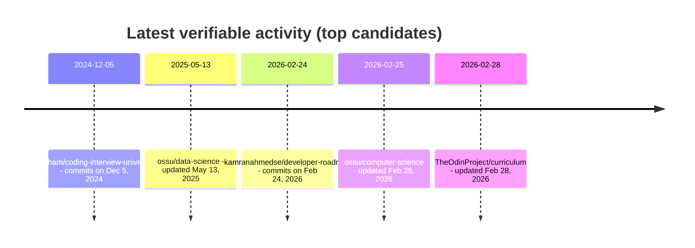

# Deep Research: Potential "Curriculum Champion" Candidates for SkillPilot Based on Open-Source Curricula

## Executive Summary

SkillPilot positions itself as an **open-source learning platform** with **AI support** that models curricula as a **dependency/competency graph** to enable **personalized learning paths** and **mastery tracking**. The community is explicitly invited to keep curricula practical and up to date through a **"Curriculum Champions" program** (issues/PRs).

To identify potential "Curriculum Champions," we prioritized technical, engineering/IT-oriented open-source projects that bundle **curated learning resources** and are structured as a **curriculum / learning path** (modules, sequencing, learning goals/outcomes, semesters/tiers). The strongest champion pools (large communities, clear structure, verifiable maintenance) are:

- **OSSU Computer Science (ossu/computer-science)**: very large community, clearly segmented curriculum (Prerequisites -> Intro -> Core -> Advanced -> Final Project), with explicit submodules (core programming/math/systems/theory/security/ethics, etc.), actively maintained (updated Feb 2026).  
- **The Odin Project Curriculum**: strongly structured didactically (courses -> lessons -> projects) and actively maintained (updated Feb 2026); content combines **original texts** and **curated web resources**, with community contact via Discord. However, the curriculum license is **CC BY-NC-SA 4.0** (non-commercial), which can matter for SkillPilot depending on usage model (commercial vs. non-commercial).  
- **Coding Interview University (jwasham)** and **P1xt Guides**: both highly structured, sequenced learning plans with large reach; last verified activity in 2024.  
- **Machine Learning Curriculum (offchan42)**: curated "ultimate list" with clear sections and many concrete resource links; MIT license; last commit cannot be reliably proven from the available dataset -> marked as "not specified," although the maintainer explicitly claims "regular updates."  
- **developer-roadmap (kamranahmedse)**: extremely active (commits in Feb 2026) and huge reach; license is classified as **"other"** (non-standard OSI), making it a **more license-sensitive** champion source.  

## Context: What a "Curriculum Champion" Needs to Deliver in SkillPilot

From SkillPilot docs and repository context, typical champion tasks are: selecting a curriculum, working through learning goals in practice, improving content/tooling via issues/PRs, and keeping curricula "practical and up to date."  
That makes candidate projects especially suitable when they already have:
- a **clearly segmented curriculum** (modules/tracks/semesters/tiers),
- **sequences** or **dependencies** expressed implicitly/explicitly (prerequisites, "Core -> Advanced," "Foundation -> Big Data," etc.),
- a **contribution culture** and contact channels (Discord, issues, maintainer handles).

## Methodology

The research focused on primary sources (repository pages, org repo lists, commit history, license files/repo license metadata), using GitHub and web queries such as:

- `site:github.com curriculum "learning path" repository` (finding curriculum/roadmap repos)  
- `open-source degree electrical engineering curriculum github`, `open-source cybersecurity university` (degree-like curricula)  
- `OSSU computer science curriculum`, `TheOdinProject curriculum`, `coding-interview-university`, `p1xt-guides`, `machine-learning-curriculum` (well-known references plus similar patterns)  
- Activity/recency: preference for "Updated/Commits" within the last 3 years (~ since Feb 2023); if not reliably extractable -> **"not specified."**

Selection criteria were then checked against the user constraints: (1) curation/link lists, (2) curriculum/path structure, (3) tech/STEM focus, (4) activity, (5) license/open-source intent, (6) modules + objectives/sequencing.

## Candidate Overview

*Display note:* URLs are shown as inline code. Missing data is marked as **"not specified."**

| Repository | URL | Short Description (EN) | Primary Discipline | Evidence of Curriculum Structure (Headings/Modules) | Example Links/Resources in Repo | License | Last Commit/Update | Stars/Forks | Maintainer/Contact | Fit for SkillPilot (1-2 sentences) |
|---|---|---|---|---|---|---|---|---|---|---|
| ossu/computer-science | `https://github.com/ossu/computer-science` | Complete, freely usable self-learning curriculum aligned with CS degree standards and quality-based course curation. | Computer Science | "Curriculum" split into **Prerequisites**, **Intro CS**, **Core CS** (core programming/math/systems/theory/security/applications/ethics), **Advanced CS** (advanced programming/systems/theory/security/math), **Final project**. | e.g., "Introduction to Computer Science and Programming using Python" + Discord chat link; includes prerequisite notes (high school math). | MIT | Updated **Feb 25, 2026** | **202k / 25.1k** | Owner: **Open Source Society University**; contact: GitHub issues/PRs (repo navigation). | Very strong mapping potential: clear module structure + prerequisites make it ideal for SkillPilot's graph model; large community improves champion recruitment potential. |
| ossu/data-science | `https://github.com/ossu/data-science` | Curated data-science curriculum as a "path" with assumed math/statistics background and sequenced topic blocks up to a final project. | Data Science | "Curriculum" modules include **Intro DS**, **Intro CS**, **DS&A**, **Databases**, **Calculus**, **Linear Algebra**, **Statistics & Probability**, **Tools & Methods**, **Machine Learning/Data Mining**, **Final project**. | Examples: Coursera "What is Data Science," MIT OCW "Intro to Computational Thinking and Data Science," edX algorithm courses, MITxOnline calculus. | not specified (GitHub: "View license") | Updated **May 13, 2025** | **21k / 4k** | Owner: ossu; contact: GitHub issues/PRs (repo navigation). | Very suitable for SkillPilot curriculum graphs (clear sequencing). License detail should be verified before integration/derivative usage. |
| TheOdinProject/curriculum | `https://github.com/TheOdinProject/curriculum` | Open-source web development curriculum with courses, lessons, and projects; combines original content with curated web resources; community via Discord. | Web Engineering / Software Engineering | Repo structure includes folders such as **foundations**, **javascript**, **nodeJS**, **ruby**, **ruby_on_rails**, plus HTML/CSS levels (advanced/intermediate). | Example lesson on website: "Git Basics" (Foundations course). | CC BY-NC-SA 4.0 (curriculum license file) | Updated **Feb 28, 2026** | **12.2k / 16.1k** | Org: **The Odin Project**; contact: Discord + contributing guide. | Didactically very strong and highly current; NC license can constrain usage in SkillPilot depending on business model, but still top-tier for champion methodology and structure. |
| jwasham/coding-interview-university | `https://github.com/jwasham/coding-interview-university` | Multi-month study plan (CS/DS&A) for software engineering interview preparation, with detailed ToC and day/week planning. | Software Engineering / Interview Prep (CS fundamentals) | "Table of Contents" includes "The Study Plan," "The Daily Plan," "Coding Question Practice," etc. | Includes links to experience reports ("Why I studied full-time...") and references roadmap.sh as complementary roadmaps. | CC BY-SA 4.0 | Last commits **Dec 5, 2024** | **338k / 81.6k** | Maintainer: **John Washam**; contact: GitHub issues/PRs. | Strong fit as a SkillPilot curriculum (clear plan/sequence), though current maintenance momentum is weaker; still valuable as a champion source due to reach. |
| P1xt/p1xt-guides | `https://github.com/P1xt/p1xt-guides` | Multi-tier programming/webdev learning paths with explicit goals per tier and clear progression instructions. | Web Development / General Programming | Table of contents with **Tier 1-5**, each with **Goal** + **Instructions**, including specialization focus (e.g., React/Angular/Math/CS). | Example: explicit recommendation to learn "alongside the Odin Project" and build parallel projects via Frontend Mentor; Discord recommended. | MIT | Activity: "Update Guide to Version 5" on **Nov 11, 2024** | **7.2k / 1.7k** | Maintainer: **P1xt** (profile/repo); contact: GitHub. | Very suitable for SkillPilot graphs (tiers + goals). Recency is borderline, but structure and learning-goal phrasing are champion-friendly. |
| offchan42/machine-learning-curriculum | `https://github.com/offchan42/machine-learning-curriculum` | Curated ML curriculum ("ultimate list") with recommended tools/media and sequenced topic sections. | Machine Learning / AI | Headings include **Machine Learning in General** (foundations) plus many subsections; maintainer states regular updates ("I update it regularly..."). | Examples: Elements of AI, Columbia Applied ML (videos/slides), fast.ai, Google ML Crash Course; also many tool/framework links (e.g., Optuna, Keras Tuner, Ray Tune). | MIT | not specified | **1.1k / 253** | Maintainer: **offchan42**; contact/workflow: PR + "tag me," or open an issue. | Very good as a SkillPilot curriculum due to many concrete resources and natural topic nodes. Recency should be verified before champion onboarding. |
| Artoriuz/OSEE | `https://github.com/Artoriuz/OSEE` | Open-source electrical engineering curriculum: online courses + book recommendations, structured into core and electives (3-year plan). | Electrical Engineering | Explicitly structured into **mandatory core** + **electives**, with specialization in later semesters. | not specified (no concrete course links visible in extracted snippet) | MIT | not specified | **613 / 50** | Maintainer: **Artoriuz**; contact: GitHub. | Ideal reference style for SkillPilot (close to the target "open-source degree/curriculum" model); very suitable as a blueprint for other STEM curricula. |
| vicoyeh/pointers-for-software-engineers | `https://github.com/vicoyeh/pointers-for-software-engineers` | "Breath-first" software engineering/CS curriculum: one reference per topic, structured into fundamentals/advanced/tracks/subjects. | Software Engineering / CS Fundamentals | Explicit four-part architecture: **fundamentals**, **advanced**, **tracks**, **subjects**; positioned as an alternative/supplement to college/bootcamp. | not specified (no concrete example links visible in extracted snippet) | MIT | not specified | **5.7k / 410** | Maintainer: **vicoyeh**; contact: GitHub. | Very suitable because "one link per topic" simplifies graph transformation; missing activity data should be checked before champion pitching. |
| Robotisim/mobile_robotics_engineer | `https://github.com/Robotisim/mobile_robotics_engineer` | Structured learning path for robotics software engineers (ROS2/C++, etc.) with learning outcomes per module. | Robotics / Embedded & Simulation | README promises a "structured path" and that **each module includes learning outcomes**. | not specified | not specified | not specified | **78 / 43** | Maintainer/Org: **Robotisim**; website linked: robotisim.com. | Potentially very suitable for SkillPilot because module-level learning goals are already explicit; license/recency must be clarified before integration. |
| John-L-Jones-IV/Open-Source-EE-Degree | `https://github.com/John-L-Jones-IV/Open-Source-EE-Degree` | Freely available, online-based curriculum for a BS in electrical engineering. | Electrical Engineering | not specified (README content not visible in extracted snippet) | not specified | not specified | not specified | **31 / 3** | Maintainer: **John L. Jones IV**; contact: GitHub. | Very close to target pattern ("EE degree"), but license and module structure metadata are currently not extractable; good candidate for direct maintainer outreach. |
| Bassamejlaoui/Open-Source-Cybersecurity-University | `https://github.com/Bassamejlaoui/Open-Source-Cybersecurity-University` | Practice-oriented cybersecurity bachelor curriculum with courses/books/alternatives; focus on "Threat Hunter." | Cybersecurity | Curriculum claim: "comprehensive and practical learning path" for a bachelor-level program. | not specified | GPL-3.0 | not specified | **14 / 4** | Maintainer: **Bassam Ejlaoui**; contact: GitHub. | Interesting niche curriculum (STEM/IT security), but low community traction; useful as a pilot for SkillPilot graph import if maintainer actively collaborates. |
| kamranahmedse/developer-roadmap | `https://github.com/kamranahmedse/developer-roadmap` | Very large collection of interactive roadmaps and learning content for developer careers (frontend/backend/devops, etc.). | Software Engineering / Career Roadmaps | README/meta excerpt lists roadmaps such as frontend, backend, devops, full stack, Git/GitHub, API design, etc. | Links to roadmap.sh (roadmaps, best practices, questions). | **other** (license file "license," non-standard OSI) | Commits including **Feb 24, 2026** | **350k / 43.7k** | Maintainer: **Kamran Ahmed**; contact: GitHub/roadmap.sh. | Extremely valuable content-wise (roadmaps are practical "skill graph seeds"), but license status ("other") makes direct integration/adoption into SkillPilot potentially risky; better as inspiration/link source. |

## Ranked Shortlist of Top Candidates

Ranking is based on (a) fit to "curriculum as learning path," (b) graph-structurability (prerequisites/modules), (c) license clarity, (d) verifiable activity (<=3 years preferred), (e) community/maintainer reachability.

1. **ossu/computer-science** - Very clear module and prerequisite structure, highly current (Feb 2026), and large community; ideal champion pool.  
2. **TheOdinProject/curriculum** - Extremely strong didactically and very active (Feb 2026); non-commercial license may create integration/usage constraints.  
3. **ossu/data-science** - Clearly sequenced with many concrete course links; activity (May 2025) is within 3 years.  
4. **offchan42/machine-learning-curriculum** - Very resource-rich, clear sections, MIT license; recency is not proven in available data -> verify before champion pitch.  
5. **vicoyeh/pointers-for-software-engineers** - "One reference per topic" + clear four-part architecture -> very good SkillPilot graph extraction potential, MIT.  
6. **jwasham/coding-interview-university** - Huge reach and clear study plan; last commits (Dec 2024) still within the 3-year window, but less fresh than top 1-3.  
7. **P1xt/p1xt-guides** - Explicit goals and instructions per tier; last larger activity in Nov 2024.  
8. **Artoriuz/OSEE** - Strong template character for EE, MIT; very good "model project" for SkillPilot STEM curricula.  
9. **John-L-Jones-IV/Open-Source-EE-Degree** - Very close to EE-degree pattern, but currently missing extractable license and module details -> targeted maintainer outreach recommended.  
10. **Robotisim/mobile_robotics_engineer** - Robotics path with module-level learning outcomes (strong for SkillPilot), but missing license/recency metadata -> clarification needed.  

*Note:* **kamranahmedse/developer-roadmap** would rank top-3 by reach/activity alone (commits Feb 2026). However, the license is classified as "other" and should be treated as source-available / non-OSI-conformant; therefore it is not prioritized as a "curriculum to import," but rather as inspiration/link source.  

## Activity Timelines of Top Candidates

The following timeline visualizes **verifiable** recency signals (GitHub "Updated" or commit history).

## Analytical Observations and Implications for SkillPilot

The strongest candidates follow recurring patterns that map directly to SkillPilot's graph approach: **prerequisites** as incoming/outgoing edges, "Core -> Advanced" as subgraph layers, "tracks" as alternative paths, and "final project/capstone" as terminal nodes. OSSU is especially explicit in this structure (Prerequisites -> Intro -> Core -> Advanced -> Final Project).  

From a licensing perspective, three clusters emerge:  
(1) **Permissive** (e.g., MIT) - typically low-friction for reuse/adaptation (while respecting third-party resource rights).  
(2) **Creative Commons ShareAlike** - stricter derivative conditions; for The Odin Project also non-commercial.  
(3) **"other"/custom** - often source-available from a legal perspective; riskier as an import base (developer-roadmap).  

For SkillPilot as an open-source platform, this means in practice: even if a curriculum is "open," each linked courseware asset (MOOCs, books, PDFs) remains under its own terms. Many curricula (OSSU, offchan42, Odin) are explicitly **curated link/lesson collections**, which maps very well to SkillPilot competency graphs - but champions must actively manage **link freshness** and **rights clarification** for embedding/copying.
