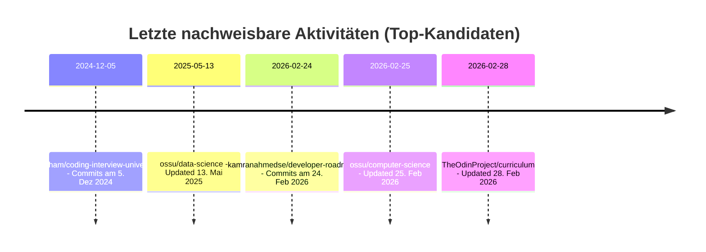

# Deep Research: Potenzielle "Curriculum Champion"-Kandidaten für SkillPilot auf Basis von Open-Source-Curricula

## Executive Summary

SkillPilot positioniert sich als **Open-Source-Lernplattform** mit **KI-Unterstützung**, die Curricula als **Abhängigkeits-/Skill-Graph** modelliert, um **personalisierte Lernpfade** und **Mastery-Tracking** zu ermöglichen; explizit eingeladen wird die Community, über ein **"Curriculum Champions"-Programm** Curricula praktisch nutzbar und aktuell zu halten (Issues/PRs).

Für die Identifikation potenzieller "Curriculum Champions" wurden technische, engineering-/IT-orientierte Open-Source-Projekte priorisiert, die **kuratierte Lernressourcen** bündeln und **als Curriculum / Lernpfad** strukturiert sind (Module, Sequenzierung, Lernziele/Learning Outcomes, Semester/Tiers). Besonders stark als Champion-Pools (große Communities, klare Struktur, nachweisliche Pflege) fallen heraus:

- **OSSU Computer Science (ossu/computer-science)**: sehr große Community, klar segmentiertes Curriculum (Prerequisites -> Intro -> Core -> Advanced -> Final Project), mit expliziten Untermodulen (Core programming/math/systems/theory/security/ethics etc.), aktuell gepflegt (Update Feb 2026).  
- **The Odin Project Curriculum**: stark didaktisch strukturiert (Kurse -> Lessons -> Projekte) und aktiv gepflegt (Update Feb 2026); Inhalte kombinieren **eigene Texte** + **kuratierte Web-Ressourcen**, Community-Kontakt via Discord. Allerdings ist die Curriculum-Lizenz **CC BY-NC-SA 4.0** (Non-Commercial), was für SkillPilot je nach Nutzung (kommerziell vs. nicht-kommerziell) relevant sein kann.  
- **Coding Interview University (jwasham)** und **P1xt Guides**: beides hochstrukturierte, sequenzierte Lernpläne mit großer Reichweite; Aktivität zuletzt (nachweislich) in 2024.  
- **Machine Learning Curriculum (offchan42)**: kuratierte "Ultimate List" mit klaren Sektionen und vielen konkreten Ressourcen-Links; Lizenz MIT; Last-Commit im Datensatz nicht eindeutig nachweisbar -> als "nicht angegeben" markiert, obwohl der Maintainer explizit "regular updates" behauptet.  
- **developer-roadmap (kamranahmedse)**: extrem aktiv (Commits in Feb 2026) und riesige Reichweite; **Lizenz wird als "other"** klassifiziert (nicht Standard-OSI), daher als **lizenzrechtlich heiklere** Champion-Quelle einzuordnen.  

## Kontext: Was ein "Curriculum Champion" bei SkillPilot praktisch leisten muss

Aus den SkillPilot-Dokumenten und dem Repository ergeben sich für Champions typischerweise folgende Aufgaben: Curriculum auswählen, Lernziele praktisch durcharbeiten, Inhalte/Tooling per Issues/PRs verbessern und Curricula "practical and up to date" halten.  
Damit eignen sich Kandidaten-Projekte besonders dann, wenn sie bereits:
- ein **klar segmentiertes Curriculum** (Module/Tracks/Semester/Tiers) besitzen,
- **Sequenzen** oder **Abhängigkeiten** implizit/explicit formulieren (Prerequisites, "Core -> Advanced", "Foundation -> Big Data" etc.),
- eine **Contribution-Kultur** und Kontaktwege (Discord, Issues, Maintainer-Handles) haben.

## Methodik

Die Recherche fokussierte auf Primärquellen (Repository-Seiten, Organisations-Repo-Listen, Commit-Historien, Lizenzdateien/Repos-"License"-Metadaten) und nutzte insbesondere GitHub- und Web-Suchen mit Kombinationen aus:

- `site:github.com curriculum "learning path" repository` (Curriculum-/Roadmap-Repos finden)  
- `open-source degree electrical engineering curriculum github`, `open-source cybersecurity university` (Bachelor-/Degree-ähnliche Curricula)  
- `OSSU computer science curriculum`, `TheOdinProject curriculum`, `coding-interview-university`, `p1xt-guides`, `machine-learning-curriculum` (bekannte Referenzen + ähnliche Muster)  
- Aktivität/Recency: bevorzugt "Updated/Commits" in den letzten 3 Jahren (~ seit Feb 2023); falls nicht belastbar extrahierbar -> **"nicht angegeben"**.

Auswahlkriterien wurden anschließend gegen die vom Nutzer definierten Constraints geprüft: (1) Kuratierung/Linklisten, (2) Curriculum/Path-Struktur, (3) Tech/STEM, (4) Aktivität, (5) Lizenz/OS-Intent, (6) Module + Objectives/Sequencing.

## Kandidatenübersicht

*Hinweis zur Darstellung:* URLs sind als Inline-Code angegeben. Fehlende Daten sind als **"nicht angegeben"** markiert.

| Repository | URL | Kurzbeschreibung (DE) | Primäre Disziplin | Evidenz Curriculum-Struktur (Headings/Module) | Beispiel-Links/Ressourcen im Repo | Lizenz | Letzter Commit/Update | Stars/Forks | Maintainer/Kontakt | Eignung für SkillPilot (1-2 Sätze) |
|---|---|---|---|---|---|---|---|---|---|---|
| ossu/computer-science | `https://github.com/ossu/computer-science` | Vollständiges, frei nutzbares Selbstlern-Curriculum, das sich an CS-Studienstandards orientiert und Kurse nach Qualitätskriterien kuratiert. | Informatik (Computer Science) | "Curriculum" gegliedert in **Prerequisites**, **Intro CS**, **Core CS** (Core programming/math/systems/theory/security/applications/ethics), **Advanced CS** (Advanced programming/systems/theory/security/math), **Final project**. | z. B. "Introduction to Computer Science and Programming using Python" + Discord-Chat-Link; außerdem Hinweise zu Prerequisites (High school math). | MIT | Updated **Feb 25, 2026** | **202k / 25.1k** | Owner: **Open Source Society University**; Kontakt: GitHub Issues/PRs (Repo-Navigation). | Sehr gutes Mapping-Potenzial: klare Modulstruktur + Prerequisites -> ideal für SkillPilots Graph-Modell; große Community erhöht Champion-Rekrutierungschancen. |
| ossu/data-science | `https://github.com/ossu/data-science` | Kuratiertes Data-Science-Curriculum als "Path" mit vorausgesetztem Mathe/Statistik und sequenzierten Themenblöcken bis zum Final Project. | Data Science | "Curriculum" mit Modulen wie **Intro DS**, **Intro CS**, **DS&A**, **Databases**, **Calculus**, **Linear Algebra**, **Statistics & Probability**, **Tools & Methods**, **Machine Learning/Data Mining**, **Final project**. | Beispiele: Coursera "What is Data Science", MIT OCW "Intro to Computational Thinking and Data Science", edX Algorithms-Kurse, MITxOnline Calculus. | nicht angegeben (GitHub: "View license") | Updated **May 13, 2025** | **21k / 4k** | Owner: ossu; Kontakt: GitHub Issues/PRs (Repo-Navigation). | Sehr passend für SkillPilot-"Skill Graphs" (klar sequenzierte Module); Lizenzdetail müsste vor Integration/Derivaten verifiziert werden. |
| TheOdinProject/curriculum | `https://github.com/TheOdinProject/curriculum` | Open-Source-Webdev-Curriculum mit Kursen, Lessons und Projekten; kombiniert eigene Inhalte + kuratierte Web-Ressourcen; Community via Discord. | Web Engineering / Software Engineering | Repo-Struktur enthält u. a. Ordner wie **foundations**, **javascript**, **nodeJS**, **ruby**, **ruby_on_rails**, plus HTML/CSS-Level (advanced/intermediate). | Beispiel-Lesson auf der Website: "Git Basics" (Foundations Course). | CC BY-NC-SA 4.0 (Curriculum-Lizenzdatei) | Updated **Feb 28, 2026** | **12.2k / 16.1k** | Org: **The Odin Project**; Kontakt: Discord + Contributing Guide. | Didaktisch sehr stark und hochaktuell; Lizenz (NC) kann die Nutzung in SkillPilot je nach Geschäftsmodell einschränken -> trotzdem top für Champion-Methodik & Struktur. |
| jwasham/coding-interview-university | `https://github.com/jwasham/coding-interview-university` | Mehrmonatiger Studienplan (CS/DS&A) zur Interviewvorbereitung für Software-Engineering-Rollen, mit detaillierter ToC und Tages-/Wochensystematik. | Software Engineering / Interview Prep (CS-Grundlagen) | "Table of Contents" inkl. "The Study Plan", "The Daily Plan", "Coding Question Practice" u.a. | Enthält u. a. Links zu Erfahrungsberichten ("Why I studied full-time...") und verweist auf roadmap.sh als ergänzende Roadmaps. | CC BY-SA 4.0 | Commits zuletzt **Dec 5, 2024** | **338k / 81.6k** | Maintainer: **John Washam**; Kontakt: GitHub Issues/PRs. | Als SkillPilot-Curriculum gut geeignet (klarer Lernplan/Sequenz), aber Maintenance/Update-Dynamik aktuell schwächer; als Champion-Quelle dennoch wertvoll wegen Reichweite. |
| P1xt/p1xt-guides | `https://github.com/P1xt/p1xt-guides` | Mehrstufige Programmier-/Webdev-Lernpfade mit expliziten Zielen pro Tier und Anweisungen zur Progression. | Web Development / General Programming | Table of Contents mit **Tier 1-5**, jeweils **Goal** + **Instructions**, inkl. Spezialisierungs-Focus (z. B. React/Angular/Math/CS). | Beispiel: explizite Empfehlung, "alongside the Odin Project" zu lernen und parallel Projekte bei Frontend Mentor zu bauen; Discord-Nutzung empfohlen. | MIT | Aktivität: "Update Guide to Version 5" am **Nov 11, 2024** | **7.2k / 1.7k** | Maintainer: **P1xt** (Profil/Repo); Kontakt: GitHub. | Sehr gut geeignet für SkillPilot-Graphen (Tiers + Goals); Update-Recency ist grenzwertig, aber Struktur und Lernziel-Formulierungen sind Champion-freundlich. |
| offchan42/machine-learning-curriculum | `https://github.com/offchan42/machine-learning-curriculum` | Kuratiertes ML-Curriculum ("ultimate list") mit empfohlenen Tools/Medien und sequenzierten Themen-Sektionen. | Machine Learning / AI | Headings u. a. **Machine Learning in General** (Fundamente) und viele subsections; Maintainer betont regelmäßige Aktualisierung ("I update it regularly..."). | Beispiele: Elements of AI, Columbia Applied ML (Videos/Slides), fast.ai, Google ML Crash Course; außerdem zahlreiche Tool-/Framework-Links (z. B. Optuna, Keras Tuner, Ray Tune). | MIT | nicht angegeben | **1.1k / 253** | Maintainer: **offchan42**; Kontakt/Workflow: PR + "tag me", oder Issue einreichen. | Sehr gut als SkillPilot-Curriculum, weil viele konkrete Ressourcen und natürliche Knoten (Tools/Topics) vorliegen; Recency muss vor Champion-Onboarding noch verifiziert werden. |
| Artoriuz/OSEE | `https://github.com/Artoriuz/OSEE` | Open-Source-Curriculum für Elektrotechnik: Online-Kurse + Buchempfehlungen, strukturiert in Kern und Wahlbereiche (3-Jahres-Plan). | Elektrotechnik | Explizit: Curriculum in **mandatory core** + **electives**, Spezialisierung über spätere Semester geplant. | nicht angegeben (im extrahierten Ausschnitt keine konkreten Kurslinks) | MIT | nicht angegeben | **613 / 50** | Maintainer: **Artoriuz**; Kontakt: GitHub. | Idealer Referenzstil für SkillPilot (nahezu 1:1 zum gewünschten Modell "Open-Source Degree/Curriculum"); sehr geeignet als "Blueprint" für andere STEM-Curricula. |
| vicoyeh/pointers-for-software-engineers | `https://github.com/vicoyeh/pointers-for-software-engineers` | "Breath-first" Software-Engineering/CS-Curriculum: pro Thema nur eine Referenz; gegliedert in Fundamentals/Advanced/Tracks/Subjects. | Software Engineering / CS-Grundlagen | Explizite vier Hauptteile: **fundamentals**, **advanced**, **tracks**, **subjects**; als Alternative/Supplement zu College/Bootcamp beschrieben. | nicht angegeben (im extrahierten Ausschnitt keine konkreten Beispiel-Links) | MIT | nicht angegeben | **5.7k / 410** | Maintainer: **vicoyeh**; Kontakt: GitHub. | Sehr gut geeignet, weil "ein Link pro Topic" die Graph-Transformation vereinfacht; fehlende Activity-Daten sollten vor Champion-Pitch geprüft werden. |
| Robotisim/mobile_robotics_engineer | `https://github.com/Robotisim/mobile_robotics_engineer` | Strukturierter Lernpfad für Robotics Software Engineer (ROS2/C++ etc.) mit Learning Outcomes je Modul. | Robotik / Embedded & Simulation | README verspricht "structured path" und dass **jedes Modul Learning Outcomes** enthält. | nicht angegeben | nicht angegeben | nicht angegeben | **78 / 43** | Maintainer/Org: **Robotisim**; Website verlinkt: robotisim.com. | Potenziell sehr passend für SkillPilot, weil Lernziele pro Modul bereits explizit angelegt sind; Lizenz/Recency müssen vor Integration geklärt werden. |
| John-L-Jones-IV/Open-Source-EE-Degree | `https://github.com/John-L-Jones-IV/Open-Source-EE-Degree` | Frei verfügbares, online-basiertes Curriculum für einen Bachelor (BS) in Elektrotechnik. | Elektrotechnik | nicht angegeben (README-Inhalt im extrahierten Ausschnitt nicht sichtbar) | nicht angegeben | nicht angegeben | nicht angegeben | **31 / 3** | Maintainer: **John L. Jones IV**; Kontakt: GitHub. | Inhaltlich sehr nahe am Ziel ("EE Degree"), aber Metadaten (Lizenz, Modulstruktur) sind derzeit nicht extrahierbar; Kandidat für direkte Ansprache zur Struktur-/Lizenzklärung. |
| Bassamejlaoui/Open-Source-Cybersecurity-University | `https://github.com/Bassamejlaoui/Open-Source-Cybersecurity-University` | Praxisorientiertes Cybersecurity-Bachelor-Curriculum mit Kursen/Büchern/Alternativen; Fokus "Threat Hunter". | Cybersecurity | Curriculum-Anspruch: "comprehensive and practical learning path" für Bachelor-Studienprogramm. | nicht angegeben | GPL-3.0 | nicht angegeben | **14 / 4** | Maintainer: **Bassam Ejlaoui**; Kontakt: GitHub. | Als Nischen-Curriculum interessant (STEM/IT Security), aber geringe Community/Traktion; gut als Pilot für SkillPilot-Graph-Import, wenn Maintainer aktiv mitarbeitet. |
| kamranahmedse/developer-roadmap | `https://github.com/kamranahmedse/developer-roadmap` | Sehr umfangreiche Sammlung interaktiver Roadmaps & Lerninhalte für Dev-Karrieren (Frontend/Backend/DevOps etc.). | Software Engineering / Career Roadmaps | README-/Meta-Auszug listet Roadmaps wie Frontend, Backend, DevOps, Full Stack, Git/GitHub, API Design u. a. | Links zu roadmap.sh (Roadmaps, Best Practices, Questions). | **other** (Lizenzdatei "license", nicht Standard-OSI) | Commits u. a. am **Feb 24, 2026** | **350k / 43.7k** | Maintainer: **Kamran Ahmed**; Kontakt: GitHub/roadmap.sh. | Inhaltlich extrem wertvoll (Roadmaps sind praktisch "Skill Graph Seeds"), aber Lizenzstatus ("other") macht eine Integration/Übernahme in SkillPilot potenziell riskant; eher als Inspirations-/Linkquelle geeignet. |

## Ranked Shortlist der Top-Kandidaten

Bewertung basiert auf (a) Nähe zu "Curriculum als Learning Path", (b) Strukturierbarkeit als Graph (Prerequisites/Module), (c) Lizenzklarheit, (d) nachweisliche Aktivität (<=3 Jahre bevorzugt), (e) Community-/Maintainer-Erreichbarkeit.

1. **ossu/computer-science** - Sehr klare Modul- und Prerequisite-Struktur, sehr aktuell (Feb 2026) und mit großer Community; idealer Champion-Pool.  
2. **TheOdinProject/curriculum** - Didaktisch extrem stark und sehr aktiv (Feb 2026); Non-Commercial-Lizenz kann aber Integrations-/Nutzungsfragen erzeugen.  
3. **ossu/data-science** - Klar sequenziert mit vielen konkreten Kurs-Links; Activity (May 2025) innerhalb 3 Jahre.  
4. **offchan42/machine-learning-curriculum** - Sehr ressourcenreich; klare Sektionen; MIT-Lizenz; Recency ist im Datensatz nicht belegbar -> vor Champion-Pitch verifizieren.  
5. **vicoyeh/pointers-for-software-engineers** - "One reference per topic" + klare 4-Teil-Architektur -> sehr gute SkillPilot-Graph-Extraktion, MIT.  
6. **jwasham/coding-interview-university** - Riesige Reichweite, klarer Studienplan; letzte Commits (Dec 2024) noch im 3-Jahresfenster, aber weniger frisch als Top 1-3.  
7. **P1xt/p1xt-guides** - Explizite Ziele und Anweisungen je Tier; letzte größere Aktivität Nov 2024.  
8. **Artoriuz/OSEE** - Direkter Template-Charakter für EE; MIT; sehr gutes "Modellprojekt" für SkillPilot-STEM-Curricula.  
9. **John-L-Jones-IV/Open-Source-EE-Degree** - Sehr nah am EE-Degree-Pattern, aber derzeit fehlen extrahierbare Lizenz- und Moduldetails -> gezielte Maintainer-Ansprache empfohlen.  
10. **Robotisim/mobile_robotics_engineer** - Robotics-Pfad mit Learning Outcomes pro Modul (stark für SkillPilot), jedoch fehlen Lizenz-/Recency-Metadaten -> Klärung nötig.  

*Hinweis:* **kamranahmedse/developer-roadmap** wäre nach Reichweite/Activity eigentlich Top-3 (Commits Feb 2026). Allerdings ist die Lizenz als "other" klassifiziert und muss als "source-available" / nicht-OSI-konform behandelt werden; daher nicht als "Curriculum-to-import" priorisiert, eher als Inspirations-/Linkquelle.  

## Aktivitäts-Timelines der Top-Kandidaten

Die folgenden Timelines visualisieren **nachweisbare** Recency-Signale (GitHub "Updated" bzw. Commit-Historie).

## Analytische Beobachtungen und Implikationen für SkillPilot

Die stärksten Kandidaten folgen wiederkehrenden Mustern, die sich direkt auf SkillPilots "Graph"-Ansatz abbilden lassen: **Prerequisites** als ein- und ausgehende Kanten; "Core -> Advanced" als Subgraph-Ebenen; "Tracks" als alternative Pfade; "Final project/Capstone" als Endknoten. Das ist bei OSSU besonders explizit (Prerequisites -> Intro -> Core -> Advanced -> Final Project).  

Lizenzseitig ergeben sich drei Cluster:  
(1) **Permissive** (z. B. MIT) - typisch unproblematisch für Re-Use/Adaption (unter Beachtung der Drittressourcen).  
(2) **Creative Commons ShareAlike** - stärkere Bedingungen bei Derivaten; bei The Odin Project zusätzlich "Non-Commercial".  
(3) **"other"/Custom** - rechtlich oft "source-available"; als Import-Basis riskanter (developer-roadmap).  

Für SkillPilot als Open-Source-Plattform bedeutet das in der Praxis: Auch wenn ein Curriculum selbst "open" ist, bleibt jedes gelinkte Courseware-Material (MOOCs, Bücher, PDFs) weiterhin unter eigenen Nutzungsbedingungen. Viele Curricula (OSSU, offchan42, Odin) sind explizit **kuratierte Link-/Lesson-Sammlungen**, was SkillPilot besonders gut in Skill-Graphen überführen kann - aber Champions müssen die **Link-Freshness** und **Rechte-Klärung** bei Einbettung/Copying im Blick behalten.
