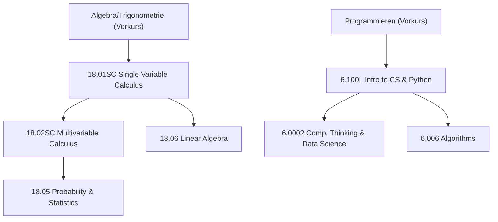

# Mapping von MIT OpenCourseWare Modulen in SkillPilot

## Executive Summary

Diese Recherche identifiziert 15 besonders geeignete MIT-OpenCourseWare-(OCW)-Kurse, die sich als **Basismodule** für einen SkillPilot-Learning-Graph eignen, und rankt sie mit einem transparenten Scoring (A = pädagogische Qualität, B = Wichtigkeit für Breitenausbildung; Combined = A*B). Der Fokus liegt auf Kursen mit **klarer Modul-/Einheitenstruktur**, **starker didaktischer Aufbereitung** (z. B. OCW Scholar/Selbstlern-Design), **vielfältigen Materialtypen** (Videos, Notes, Problem Sets, Exams) und **klaren Wiederverwendungsbedingungen** über die OCW-Lizenz.

Die Top-5 (nach Combined Score) sind:
- **18.01SC Single Variable Calculus** - extrem vollständiges OCW-Scholar-Selbstlernmodul mit Aufgaben/Prüfungen inkl. Lösungen und interaktiven "Mathlets".  
- **18.05 Introduction to Probability and Statistics** - moderne, anwendungsnahe Statistik/Probability mit aktivem Lernen (u. a. R-Studios) und umfangreichen Übungs-/Prüfungsressourcen.  
- **18.02SC Multivariable Calculus** - OCW-Scholar-Pendant zu Mehrvariablenanalysis/Vektoranalysis mit Exam-/Problem-Lösungen und Mathlets.  
- **18.06 Linear Algebra (Spring 2010)** (Ihr Favorit) - sehr starkes Kernmodul mit vollständigen Video-Vorlesungen (inkl. Transkripten) sowie Problem Sets/Exams mit Lösungen und expliziten Kurszielen.  
- **6.100L Introduction to CS and Programming using Python** - sehr gut strukturiertes Einsteiger-Programmiermodul mit Videos, Notizen, Code, Finger Exercises und Problem Sets.  

## Methodik

Die Auswahl und Priorisierung erfolgte in drei Schritten:

Erstens wurde ausschließlich auf **primäre OCW-Kursseiten** (Domain ocw.mit.edu) fokussiert, inkl. Kurs-Homepage, Syllabus/Goals, und insbesondere der Sektion **"Learning Resource Types"** als objektiver Indikator für Materialabdeckung (Videos/Notes/Problem Sets/Exams/Solutions).  

Zweitens wurden Suchanfragen systematisch aufgebaut (Beispiele):  
- `site:ocw.mit.edu 18.06 Linear Algebra Spring 2010 Learning Resource Types`  
- `site:ocw.mit.edu 18.01SC Single Variable Calculus Fall 2010`  
- `site:ocw.mit.edu 6.100L Fall 2022 Learning Resource Types`  
- `site:ocw.mit.edu 18.05 Introduction to Probability and Statistics Spring 2022 syllabus`  

Drittens wurden Kurse bevorzugt, die explizit als **Selbstlern-/OCW-Scholar** aufbereitet sind (typisch: zusätzliche Recitation-/Problem-Solving-Videos, Worked Examples, Lösungen, Applets/Mathlets).  

## Bewertungsrahmen und Normalisierung

Jedes Modul erhält zwei **normalisierte Scores (0-10)**:

**A - Pädagogische Qualität (0-10)** als Summe von fünf gleichgewichteten Teilkriterien (je 0-2 Punkte):  
Materialvielfalt, Übungs-/Assessmentdichte, Verfügbarkeit von Lösungen/Feedback, Selbststudien-Design/Struktur, Lernunterstützung (z. B. Transkripte, Applets, Problem-Solving-Videos, Instructor Insights).

**B - Wichtigkeit für Breitenausbildung (0-10)** als Summe von fünf Teilkriterien (je 0-2 Punkte):  
Fundamentalität, Querschnittsrelevanz, Prerequisite-Zentralität, Praxis-/Arbeitsmarktrelevanz, Skalierbarkeit als Basismodul im SkillPilot-Graph.

**Normalisierungsmethode:** Beide Scores sind bereits durch die feste Maximalsumme (5 x 2 = 10) auf 0-10 skaliert (keine nachträgliche Min-Max-Skalierung).

**Combined Score = A * B** (0-100) priorisiert Kurse, die *gleichzeitig* didaktisch stark *und* breit relevant sind.

## Überblick: Top-15-OCW-Module für SkillPilot

**Lizenz-Hinweis (für alle unten gelisteten OCW-Kurse):** MIT OCW veröffentlicht Inhalte unter **Attribution-NonCommercial-ShareAlike 4.0 International (CC BY-NC-SA 4.0)**; Weitergabe und Adaption sind erlaubt, solange Attribution erfolgt, Nutzung nicht-kommerziell ist und Ableitungen unter derselben Lizenz geteilt werden.  
(Organisation hinter der Lizenz: Creative Commons.)

> **Hinweis zu "Dauer/ECTS":** OCW weist i. d. R. kein ECTS aus; wo es Sitzungszeiten im Syllabus gibt, werden diese aufgeführt, sonst "nicht angegeben".

| Rank | Combined Score | A | B | Kursname | URL | Disziplin | Einordnung | Kurzbeschreibung | Lernziele (3-6) | Materialtypen | Lizenz | Dauer/ECTS | Sprache |
|---:|---:|---:|---:|---|---|---|---|---|---|---|---|---|---|
| 1 | 95.00 | 10.0 | 9.5 | 18.01SC Single Variable Calculus | `https://ocw.mit.edu/courses/18-01sc-single-variable-calculus-fall-2010/` | Mathematik (Analysis) | Prerequisites | OCW-Scholar-Selbstlernmodul zu Differential- & Integralrechnung einer Variablen bis zu Reihen. Stärken: Exams/Problem Sets **mit Lösungen**, Problem-Solving-Videos, interaktive Mathlets. Breite: Fundament für nahezu alle MINT-Pfade. | - Grenzwerte/Stetigkeit zur Begründung der Ableitung/Integration nutzen - Ableitungsregeln (inkl. Kettenregel, implizit) anwenden - Optimierung & Kurvenskizzen (Anwendungen der Ableitung) lösen - Bestimmte Integrale & Hauptsätze der Analysis für Anwendungen einsetzen - Integrationstechniken (z. B. Substitution, partielle Integration, Partialbrüche) - Grundideen von Reihen/Taylorreihen anwenden | Lecture Videos + unterstützende Notes; Problem-Solving/Recitation Videos; Problem Sets + Solutions; Exams + Solutions; interactive Mathlets | CC BY-NC-SA 4.0 | Semester (Fall 2010); ECTS nicht angegeben | Englisch (nicht anders angegeben) |
| 2 | 90.25 | 9.5 | 9.5 | 18.05 Introduction to Probability and Statistics | `https://ocw.mit.edu/courses/18-05-introduction-to-probability-and-statistics-spring-2022/` | Mathematik (Wahrscheinlichkeit/Statistik) | Core | Elementare Einführung mit Anwendungen: Kombinatorik, Zufallsvariablen, Bayes, Hypothesentests, Konfidenzintervalle, Regression. Stärken: aktive Studios (R), Aufgaben/Prüfungen mit Lösungen, Applets/Mathlets & Instructor-Insights. Breite: Kern für Datenkompetenz und wissenschaftliche Literacy. | - Kombinatorik & grundlegende Wahrscheinlichkeitsmodelle anwenden - Zufallsvariablen/Verteilungen modellieren & Kenngrößen berechnen - Bayesianische Inferenz als Prior->Posterior Updates durchführen - Hypothesentests (NHST) & p-Werte konstruieren/interpretieren - Konfidenzintervalle und lineare Regression praktisch einsetzen - Statistik-Workflows in R-Studios nachvollziehen | Lecture Notes; Readings; Problem Sets + Solutions; Exams + Solutions; Activity Assignments (mit Beispielen); Supplemental Exam Materials; R-Studios; Instructor Insights | CC BY-NC-SA 4.0 | Vorlesungen: 2x/Woche (80 min); Studios: 1x/Woche (50 min); ECTS nicht angegeben | Englisch (nicht anders angegeben) |
| 3 | 90.00 | 10.0 | 9.0 | 18.02SC Multivariable Calculus | `https://ocw.mit.edu/courses/18-02sc-multivariable-calculus-fall-2010/` | Mathematik (Mehrvariablen-/Vektoranalysis) | Prerequisites | OCW-Scholar-Selbstlernmodul zu Mehrvariablen- und Vektorrechnung (inkl. Green/Divergenz/Stokes). Stärken: campusbasierte Videos, Recitation-Videos, Problems/Exams mit Lösungen, Mathlets. Breite: Basiswerkzeug für Natur-/Ingenieurwissenschaften und u. a. Computer Graphics. | - Vektoren/Matrizen und parametrische Kurven einsetzen - Partielle Ableitungen, Gradienten & Optimierung (Lagrange) anwenden - Doppel-/Dreifachintegrale für Flächen/Volumina/Massen berechnen - Linien- & Oberflächenintegrale auswerten - Zentrale Integralsätze (Green, Divergenz, Stokes) anwenden | Lecture Videos; Recitation-Problem-Solving Videos; Sample solutions; Problems + Solutions; Exams + Solutions; interactive Mathlets; Problem Sets + Solutions | CC BY-NC-SA 4.0 | Semester (Fall 2010); ECTS nicht angegeben | Englisch (nicht anders angegeben) |
| 4 | 90.00 | 9.0 | 10.0 | 18.06 Linear Algebra (Spring 2010) | `https://ocw.mit.edu/courses/18-06-linear-algebra-spring-2010/` | Mathematik (Lineare Algebra) | Core | Fokus auf "Matrizen benutzen und verstehen": Elimination/LU, Unterräume (Column/Nullspace), Basis/Dimension, Least Squares & QR (Gram-Schmidt). Stärken: vollständige Video-Vorlesung mit Transkripten, Problem Sets/Exams inkl. Lösungen, Instructor Insights. Breite: Schlüsselmodul für MINT & Data/ML-Pfade. | - Lineare Gleichungssysteme per Elimination lösen und LU-Faktorisierung verstehen - Column Space/Nullspace & Rang interpretieren, Basen konstruieren - Dimension & fundamentale Unterräume einsetzen - Least-Squares-Probleme über Projektionen lösen - Orthogonalisierung (Gram-Schmidt) & QR-Faktorisierung anwenden | Lecture Videos (inkl. Transkripte); Problem Sets + Solutions; Exams + Solutions; Instructor Insights | CC BY-NC-SA 4.0 | Semester (Spring 2010); ECTS nicht angegeben | Englisch (nicht anders angegeben) |
| 5 | 90.00 | 9.0 | 10.0 | 6.100L Introduction to CS and Programming using Python (Fall 2022) | `https://ocw.mit.edu/courses/6-100l-introduction-to-cs-and-programming-using-python-fall-2022/` | Informatik (Programmieren) | Prerequisites | Einstiegskurs für Lernende mit wenig/keiner Programmiererfahrung; Ziel: computation als Problemlösewerkzeug, Selbstvertrauen für kleine Programme; Python 3. Stärken: Videos, Notes, Code, Finger Exercises, Problem Sets, Recitations/Problem-Solving Notes und teils Beispiele. Breite: Standard-Startknoten für IT-/Data-Curricula. | - Python-Grundlagen (Datentypen, Variablen, Kontrollfluss) sicher anwenden - Iteration/Loops und elementare Such-/Approx.-Methoden (z. B. Bisection) nutzen - Programme in Funktionen zerlegen (Decomposition/Abstraction) - Datenstrukturen (z. B. Strings, Listen, Tupel) zielgerichtet einsetzen - Problemlösen über regelmäßige Finger Exercises & Problem Sets trainieren | Lecture Videos; Lecture Notes; Lecture Code; Finger Exercises; Problem Sets; Recitations/Problem-Solving Notes; Podcasts; Readings; Programming Assignments (mit Beispielen) | CC BY-NC-SA 4.0 | Semester (Fall 2022); ECTS nicht angegeben | Englisch (nicht anders angegeben) |
| 6 | 85.00 | 10.0 | 8.5 | 18.03SC Differential Equations (Fall 2011) | `https://ocw.mit.edu/courses/18-03sc-differential-equations-fall-2011/` | Mathematik (Differentialgleichungen) | Core | "Naturgesetze als Differentialgleichungen": Modellierung, Lösung und Interpretation für Science/Engineering. Stärken: explizit als Selbststudium (Kursvideos, Notes zu jedem Thema, Practice Problems+Lösungen, Problem-Solving-Videos, Problem Sets/Exams inkl. Lösungen) mit klarer Einheitenstruktur. | - Reale Systeme in Differentialgleichungen modellieren und Lösungen interpretieren - Methoden für 1. Ordnung (geometrisch, numerisch, integrating factors) anwenden - Lineare ODEs mit Konstantkoeffizienten und sinusförmigen Inputs behandeln - Fourier-Reihen und Laplace-Transformation für LTI-Probleme nutzen - Systemdenken: Transferfunktionen, Pole, Faltung/Impulsantworten einsetzen | Lecture Videos; Lecture Notes; Problem Sets + Solutions; Exams + Solutions; Problem-Solving Videos; Practice Problems + Solutions | CC BY-NC-SA 4.0 | Semester (Fall 2011); ECTS nicht angegeben | Englisch (nicht anders angegeben) |
| 7 | 81.00 | 9.0 | 9.0 | 6.006 Introduction to Algorithms (Spring 2020) | `https://ocw.mit.edu/courses/6-006-introduction-to-algorithms-spring-2020/` | Informatik (Algorithmen/Datenstrukturen) | Core | Einführung in Modellierung von Rechenproblemen, Algorithmen-Paradigmen und Datenstrukturen; betont Verbindung von Algorithmen & Programmierung sowie Performance-Maße/Analysetechniken. Stärken: Lecture Videos/Notes, Problem Sets + Solutions, Exams + Solutions. | - Computational Problems formal modellieren und Lösungsstrategien wählen - Grundlegende Datenstrukturen passend zum Problem einsetzen - Algorithmische Paradigmen vergleichen und anwenden - Laufzeit/Performance-Maße erklären und Analyseprinzipien anwenden - Trade-offs (Zeit/Speicher/Komplexität) systematisch bewerten | Lecture Videos; Lecture Notes; Problem Sets + Solutions; Exams + Solutions | CC BY-NC-SA 4.0 | Semester (Spring 2020); ECTS nicht angegeben | Englisch (nicht anders angegeben) |
| 8 | 72.00 | 8.0 | 9.0 | 6.042J Mathematics for Computer Science (Spring 2015) | `https://ocw.mit.edu/courses/6-042j-mathematics-for-computer-science-spring-2015/` | Mathematik (Diskrete Mathematik/Probability) | Core | Interaktive diskrete Mathematik für CS/Engineering; grob drittelt in (1) Beweise/Grundbegriffe, (2) diskrete Strukturen (z. B. Graphen, Automaten, modulare Arithmetik, Zählen) und (3) diskrete Wahrscheinlichkeit. Stärken: Videos/Notes, Open Textbook, Problem Sets & Exams; expliziter Outcome-Fokus für nachgelagerte CS-Kurse. | - Definitionen/Beweise/Sets/Relationen sicher anwenden - Diskrete Strukturen (Graphen, Zustandsautomaten, Counting, modular arithmetic) modellieren - Diskrete Wahrscheinlichkeit als Werkzeug für CS verwenden - Mathematische Methoden auf Algorithmik/Computability/Systeme übertragen - Formales Denken für Software Engineering & Systems trainieren | Open Textbooks; Lecture Videos; Lecture Notes; Problem Sets; Exams | CC BY-NC-SA 4.0 | Semester (Spring 2015); ECTS nicht angegeben | Englisch (nicht anders angegeben) |
| 9 | 72.00 | 9.0 | 8.0 | 6.003 Signals and Systems (Fall 2011) | `https://ocw.mit.edu/courses/6-003-signals-and-systems-fall-2011/` | EE/Signal Processing | Core | Fundament der Signal-/Systemanalyse: Fourier-Darstellungen, Laplace/Z-Transform, Sampling; LTI-Systeme via Differential-/Differenzgleichungen, Pole/Nullstellen, Faltung, Impuls-/Sprungantwort, Frequenzgang. Stärken: Videos/Notes, Open Textbook, Problem Sets+Solutions, Exams+Solutions. | - Signale in Zeit-/Frequenzdomäne darstellen und transformieren - LTI-Systeme über Differential-/Differenzgleichungen beschreiben - Laplace- und Z-Transform zur Systemanalyse einsetzen - Faltung, Impuls- und Sprungantworten interpretieren - Pole/Nullstellen und Frequenzantwort für Design/Analyse nutzen | Lecture Videos; Lecture Notes; Open Textbooks; Problem Sets + Solutions; Exams + Solutions | CC BY-NC-SA 4.0 | Semester (Fall 2011); ECTS nicht angegeben | Englisch (nicht anders angegeben) |
| 10 | 63.75 | 8.5 | 7.5 | 6.004 Computation Structures (Spring 2017) | `https://ocw.mit.edu/courses/6-004-computation-structures-spring-2017/` | Computer Engineering (Architektur/Digital) | Core | Architektur digitaler Systeme mit starken Strukturprinzipien und mehrstufigen Implementationsstrategien (von "Primitives" wie Gates/Instructions bis zur Mechanisierung auf unteren Ebenen). Stärken: Instructor Insights, Lecture Notes/Videos, Podcasts, Programming Assignments mit Beispielen; stark kapitel-/themenorientiert (u. a. Instruction Set, Compiler, Stacks, Caches). | - Digitales Systemdesign über Abstraktionsebenen erklären - Bausteine/Primitives (Gates->Instructions->Procedures/Processes) konzeptualisieren - Instruktionssatz & Assembly-Modelle einordnen - Compiler- und Stack-Grundideen nachvollziehen - Memory-Hierarchy/Caches als Performance-Treiber verstehen | Lecture Videos; Lecture Notes; Podcasts; Programming Assignments (mit Beispielen); Instructor Insights | CC BY-NC-SA 4.0 | Semester (Spring 2017); ECTS nicht angegeben | Englisch (nicht anders angegeben) |
| 11 | 61.75 | 9.5 | 6.5 | 3.091 Introduction to Solid-State Chemistry (Fall 2018) | `https://ocw.mit.edu/courses/3-091-introduction-to-solid-state-chemistry-fall-2018/` | Materials Science/Chemistry | Elective | Material- und festkörperchemischer Grundlagenkurs mit "chemical intuition" und Engineering-Bezug; 2018-Version erweitert um Goodie Bags/"Why This Matters"/CHEMATLAS sowie zusätzliche Practice Problems/Quizzes/Exams. Stärken: sehr vollständiger Resource Index und vielfältige Materialtypen inkl. Tutorial-Videos und Problem-Set-Lösungen. | - Atomare Struktur, Periodensystem- und Quantengrundlagen anwenden - Bindung/Orbitale zur Erklärung von Materialeigenschaften nutzen - Festkörperthemen wie Halbleiter, Dotierung, Metalle einordnen - Kristallographie/X-Ray-Grundlagen und Defekte verstehen - Materialphänomene wie Gläser, Kinetik/Reaktionsraten, Polymere über Modelle erklären | Lecture Videos; Tutorial Videos; Open Textbooks; Podcasts; Problem Sets + Solutions; Exams; Instructor Insights; strukturierter Resource Index | CC BY-NC-SA 4.0 | Semester (Fall 2018); ECTS nicht angegeben | Englisch (nicht anders angegeben) |
| 12 | 55.25 | 6.5 | 8.5 | 8.01SC Classical Mechanics (Fall 2016) | `https://ocw.mit.edu/courses/8-01sc-classical-mechanics-fall-2016/` | Physik (Mechanik) | Core | Einstieg in klassische Mechanik mit Kernbegriffen (u. a. Kraft, Impuls, Drehmoment, Drehimpuls) und zwei Problemlösepfaden: Kräfte vs. Erhaltungssätze. Stärken: Lecture Videos, Open Textbook/Online-Kapitel (mit Updates) und viele Problem Sets; stark wochenweise modularisiert. | - Newtonsche Konzepte (Kraft/Impuls/Drehmoment) auf Bewegungsprobleme anwenden - Energie-, Impuls- und Drehimpulserhaltung als Lösungswerkzeuge nutzen - Mechanische Probleme systematisch mit FBD/Modellen formulieren - Intuition für physikalische Modelle durch Übungsaufgaben entwickeln | Lecture Videos; Open Textbooks; Problem Sets | CC BY-NC-SA 4.0 | Semester (Fall 2016); ECTS nicht angegeben | Englisch (nicht anders angegeben) |
| 13 | 52.00 | 6.5 | 8.0 | 6.0002 Introduction to Computational Thinking and Data Science (Fall 2016) | `https://ocw.mit.edu/courses/6-0002-introduction-to-computational-thinking-and-data-science-fall-2016/` | Informatik/Data Science (Python) | Core | Fortsetzung von 6.0001; zielt auf computation als Problemlösewerkzeug und baut methodisch Richtung Data-Science auf (Python 3.5). Stärken: Lecture Videos/Notes, Problem Sets und Programming Assignments; Einschränkung: Problem-Set-Lösungen sind nicht verfügbar. Breite: sinnvoller Brückenknoten von "Programmieren" zu Simulation/ML-Basics. | - Optimierungsprobleme mit computational thinking strukturieren - Simulationen (z. B. Monte-Carlo) implementieren und auswerten - Random-Walk/Prozessmodelle als Daten-/Systemmodelle einsetzen - Grundideen von ML/Clustering einführen und in Python nachvollziehen - Programmieraufgaben iterativ testen/verbessern (Assignments) | Lecture Videos; Lecture Notes; Problem Sets; Programming Assignments | CC BY-NC-SA 4.0 | Semester (Fall 2016); ECTS nicht angegeben | Englisch (nicht anders angegeben) |
| 14 | 48.00 | 6.0 | 8.0 | 8.02 Physics II: Electricity and Magnetism (Spring 2007) | `https://ocw.mit.edu/courses/8-02-physics-ii-electricity-and-magnetism-spring-2007/` | Physik (Elektromagnetismus) | Core | Zweites Einführungssemester Physik mit Fokus auf Elektrizität & Magnetismus; didaktisch als TEAL (aktive, technologiegestützte Kleingruppen) konzipiert zur Intuitionsbildung. Stärken: umfangreiche Lecture Notes, Open-Textbook-Kapitel, Problem Sets sowie Experiments/Class Activities. | - Elektrische Felder/Fluss/Potentiale modellieren; Gauss-Idee anwenden - Grundlegende Schaltkreiskonzepte (u. a. Strom, Ohm's Law) einordnen - Magnetfelder und Kräfte qualitativ/quantitativ analysieren - E&M-Konzepte in Aktivformaten (TEAL-Activities/Experimente) anwenden | Lecture Notes; Open Textbooks; Problem Sets; Experiments/Lab Assignments; Class Activities | CC BY-NC-SA 4.0 | Semester (Spring 2007); ECTS nicht angegeben | Englisch (nicht anders angegeben) |
| 15 | 45.50 | 6.5 | 7.0 | 6.002 Circuits and Electronics (Spring 2007) | `https://ocw.mit.edu/courses/6-002-circuits-and-electronics-spring-2007/` | EE/EECS (Schaltungen/Elektronik) | Core | Erstkurs für EE/EECS; führt "lumped circuit" Modelle und zentrale Abstraktionen ein; umfasst Analyse/Design einfacher Schaltungen und Zeitverhalten über Differentialgleichungen. Stärken: explizite Course Objectives und klare Kursstruktur (Lectures/Recitations/Labs); Lecture Videos, Problem Sets und Exams. | - Grundabstraktionen der Elektrotechnik (lumped circuits, digitale Schaltungen, Op-Amps) verstehen - Einfache Schaltungen analysieren und entwerfen - Differentialgleichungen für Schaltungen mit Energiespeichern formulieren/lösen | Lecture Videos; Problem Sets; Exams; Labs (Materialien vorhanden) | CC BY-NC-SA 4.0 | Lectures: 2x/Woche (1 h); Recitations: 1x/Woche (1 h); ECTS nicht angegeben | Englisch (nicht anders angegeben) |

## Integrationshinweise für SkillPilot

### Prerequisite-Logik für die Top-5

Ein robustes Basisskelett für SkillPilot lässt sich als **Mathe-Kern** (18.01SC -> 18.02SC -> 18.05; plus 18.06) und ein **Programmier-Kern** (6.100L) modellieren. Explizite OCW-Voraussetzungen stützen dabei mindestens zwei zentrale Kanten: 18.05 nennt **18.02** als Voraussetzung. Außerdem benennt die OCW-Version 18.03 als Voraussetzung **18.01** und als Corequisite **18.02**; das ist konsistent mit einem SkillPilot-Graph, in dem Analysis der "Feeder" für Differentialgleichungen ist.  

### Konkrete Mapping-Notizen je Top-5-Modul

**18.01SC Single Variable Calculus** eignet sich als SkillPilot-"Root-Math-Module", weil die OCW-Seite eine klare Sequenz (Differentiation -> Anwendungen -> Integral/Anwendungen -> Integrationstechniken -> Unendliches/Taylor) und sehr umfangreiche Selbstlernressourcen ausweist.  
Empfohlene Graph-Knoten (Beispiele): *Limits & Continuity* -> *Derivatives & Rules* -> *Optimization* -> *Definite Integrals* -> *Techniques of Integration* -> *Series/Taylor*.  
Empfohlene Edges: 18.01SC -> 18.02SC, 18.01SC -> 18.06 (beide als "Math Core"), 18.01SC -> 18.03SC (Engineering-Math-Track).

**18.05 Introduction to Probability and Statistics** passt als SkillPilot-Core-Modul für "Data Literacy", weil der Kurs ausdrücklich die Kerninhalte (u. a. Bayes, NHST, Confidence Intervals, Regression) nennt und zusätzliche aktive Lernformate (Studios) anbietet.  
Empfohlene Knoten: *Combinatorics* -> *Random Variables & Distributions* -> *Bayesian Inference* -> *Frequentist Inference (NHST)* -> *Confidence Intervals & Regression* -> *R-Studios (Applied)*.  
Edges: 18.02SC -> 18.05 (explizite Voraussetzung).

**18.02SC Multivariable Calculus** ist als "Advanced Calculus Core" gut graph-fähig, weil Struktur (Vektoren/Matrizen -> partielle Ableitungen/Lagrange -> Mehrfachintegrale -> Vektoranalysis) und Selbstlernmaterialien inkl. Lösungen/Mathlets explizit sind.  
Empfohlene Knoten: *Vectors & Matrices* -> *Partial Derivatives* -> *Double/Triple Integrals* -> *Line/Surface Integrals* -> *Green/Stokes/Divergence*.

**18.06 Linear Algebra** ist ein SkillPilot-"Math Core"-Baustein mit klaren, auf Kompetenzen formulierten Kurszielen (Elimination/LU; Subräume; Basis/Dimension; Least Squares/Projektionen; Gram-Schmidt/QR) und starken Videomaterialien.  
Empfohlene Knoten: *Linear Systems (LU)* -> *Four Fundamental Subspaces* -> *Basis/Dimension* -> *Least Squares* -> *Orthogonality (QR)*.  
Edges (Vorschlag, SkillPilot-seitig): 18.06 -> 6.003 (Signals), 18.06 -> 6.006 (Algorithmen-Analyse), 18.06 -> 18.05 (Regression/Least-Squares-Brücke), jeweils als "supports".

**6.100L Intro to CS and Programming using Python** ist als "Programming Foundation" sehr gut geeignet, weil OCW die Materialtypen (Videos/Notes/Code/Finger-Exercises/Problem Sets/Recitations) sowie eine thematische Vorlesungssequenz offen ausweist.  
Empfohlene Knoten: *Python Basics & Types* -> *Control Flow* -> *Iteration & Search* -> *Functions & Abstraction* -> *Data Structures* -> *Practice Loop (Finger Exercises/Problem Sets)*.  
Edges: 6.100L -> 6.0002 (Data-Science-Track) und 6.100L -> 6.006 (Algorithms), als SkillPilot-"Programmatic Prereq" (Hinweis: 6.0002 wird als Fortsetzung von 6.0001 beschrieben; die Zuordnung 6.100L->6.0002 ist daher als Kurationsentscheidung zu behandeln).  

## Lizenz- und Reuse-Hinweise

Alle in der Tabelle gelisteten Module sind OCW-Inhalte und stehen unter **CC BY-NC-SA 4.0** gemäß OCW "Privacy and Terms of Use". Das ist der maßgebliche Reuse-Hinweis für SkillPilot-Integration (z. B. Einbettung, Remixes, abgeleitete Lernpfade), solange **Namensnennung**, **nicht-kommerzielle Nutzung** und **Share-Alike** eingehalten werden.
