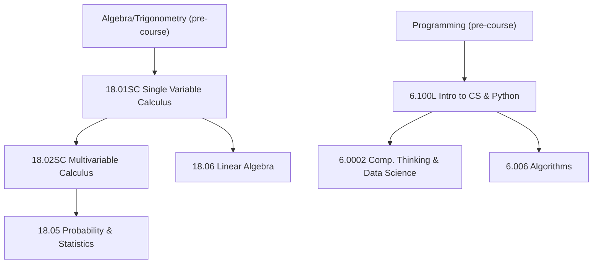

# Mapping MIT OpenCourseWare Modules into SkillPilot

## Executive Summary

This research identifies 15 particularly suitable MIT OpenCourseWare (OCW) courses that can serve as **foundation modules** for a SkillPilot learning graph, and ranks them with a transparent scoring model (A = pedagogical quality, B = importance for broad education; Combined = A*B). The focus is on courses with a **clear module/unit structure**, **strong didactic design** (e.g., OCW Scholar/self-study design), **diverse resource types** (videos, notes, problem sets, exams), and **clear reuse conditions** under the OCW license.

The top 5 (by Combined Score) are:
- **18.01SC Single Variable Calculus** - an extremely complete OCW Scholar self-study module with assignments/exams including solutions and interactive "Mathlets".  
- **18.05 Introduction to Probability and Statistics** - modern, application-oriented statistics/probability with active learning (including R studios) and extensive exercise/exam resources.  
- **18.02SC Multivariable Calculus** - the OCW Scholar counterpart for multivariable/vector calculus with exam/problem solutions and Mathlets.  
- **18.06 Linear Algebra (Spring 2010)** (your favorite) - a very strong core module with full video lectures (including transcripts), problem sets/exams with solutions, and explicit course outcomes.  
- **6.100L Introduction to CS and Programming using Python** - a very well-structured entry-level programming module with videos, notes, code, finger exercises, and problem sets.  

## Methodology

Selection and prioritization were done in three steps:

First, we focused exclusively on **primary OCW course pages** (domain `ocw.mit.edu`), including course homepages, syllabi/goals, and especially the **"Learning Resource Types"** section as an objective indicator of resource coverage (videos/notes/problem sets/exams/solutions).  

Second, search queries were built systematically (examples):  
- `site:ocw.mit.edu 18.06 Linear Algebra Spring 2010 Learning Resource Types`  
- `site:ocw.mit.edu 18.01SC Single Variable Calculus Fall 2010`  
- `site:ocw.mit.edu 6.100L Fall 2022 Learning Resource Types`  
- `site:ocw.mit.edu 18.05 Introduction to Probability and Statistics Spring 2022 syllabus`  

Third, courses explicitly designed as **self-study/OCW Scholar** were preferred (typically: additional recitation/problem-solving videos, worked examples, solutions, applets/Mathlets).  

## Evaluation Framework and Normalization

Each module receives two **normalized scores (0-10)**:

**A - Pedagogical Quality (0-10)** as the sum of five equally weighted sub-criteria (0-2 points each):  
Resource diversity, exercise/assessment density, availability of solutions/feedback, self-study design/structure, and learning support (e.g., transcripts, applets, problem-solving videos, instructor insights).

**B - Importance for Broad Education (0-10)** as the sum of five sub-criteria (0-2 points each):  
Fundamentality, cross-domain relevance, prerequisite centrality, practical/job-market relevance, and scalability as a baseline module in the SkillPilot graph.

**Normalization method:** Both scores are already scaled to 0-10 via the fixed maximum sum (5 x 2 = 10), with no additional min-max scaling.

**Combined Score = A * B** (0-100), prioritizing courses that are strong both didactically and broadly relevant.

## Overview: Top 15 OCW Modules for SkillPilot

**License note (for all OCW courses listed below):** MIT OCW publishes content under **Attribution-NonCommercial-ShareAlike 4.0 International (CC BY-NC-SA 4.0)**; redistribution and adaptation are allowed as long as attribution is provided, use is non-commercial, and derivatives are shared under the same license.  
(Organization behind the license: Creative Commons.)

> **Note on "Duration/ECTS":** OCW generally does not provide ECTS credits; where syllabus meeting times are available, they are listed, otherwise "not specified."

| Rank | Combined Score | A | B | Course | URL | Discipline | Role | Short Description | Learning Goals (3-6) | Resource Types | License | Duration/ECTS | Language |
|---:|---:|---:|---:|---|---|---|---|---|---|---|---|---|---|
| 1 | 95.00 | 10.0 | 9.5 | 18.01SC Single Variable Calculus | `https://ocw.mit.edu/courses/18-01sc-single-variable-calculus-fall-2010/` | Mathematics (Calculus) | Prerequisites | OCW Scholar self-study module on differential and integral calculus of one variable, up to series. Strengths: exams/problem sets **with solutions**, problem-solving videos, interactive Mathlets. Breadth: foundation for almost all STEM paths. | - Use limits/continuity to justify differentiation/integration - Apply derivative rules (including chain rule and implicit differentiation) - Solve optimization and curve-sketching tasks (applications of derivatives) - Use definite integrals and the fundamental theorems of calculus for applications - Apply integration techniques (e.g., substitution, integration by parts, partial fractions) - Apply core ideas of series/Taylor series | Lecture videos + supporting notes; problem-solving/recitation videos; problem sets + solutions; exams + solutions; interactive Mathlets | CC BY-NC-SA 4.0 | Semester (Fall 2010); ECTS not specified | English (unless otherwise specified) |
| 2 | 90.25 | 9.5 | 9.5 | 18.05 Introduction to Probability and Statistics | `https://ocw.mit.edu/courses/18-05-introduction-to-probability-and-statistics-spring-2022/` | Mathematics (Probability/Statistics) | Core | Introductory course with applications: combinatorics, random variables, Bayes, hypothesis tests, confidence intervals, regression. Strengths: active studios (R), assignments/exams with solutions, applets/Mathlets, and instructor insights. Breadth: core module for data literacy and scientific literacy. | - Apply combinatorics and basic probability models - Model random variables/distributions and compute key quantities - Perform Bayesian inference as prior-to-posterior updates - Construct/interpret hypothesis tests (NHST) and p-values - Use confidence intervals and linear regression in practice - Reproduce statistical workflows in R studios | Lecture notes; readings; problem sets + solutions; exams + solutions; activity assignments (with examples); supplemental exam materials; R studios; instructor insights | CC BY-NC-SA 4.0 | Lectures: 2x/week (80 min); studios: 1x/week (50 min); ECTS not specified | English (unless otherwise specified) |
| 3 | 90.00 | 10.0 | 9.0 | 18.02SC Multivariable Calculus | `https://ocw.mit.edu/courses/18-02sc-multivariable-calculus-fall-2010/` | Mathematics (Multivariable/Vector Calculus) | Prerequisites | OCW Scholar self-study module on multivariable and vector calculus (including Green's Theorem, Divergence Theorem, and Stokes' Theorem). Strengths: campus-based videos, recitation videos, problems/exams with solutions, Mathlets. Breadth: foundational toolset for natural sciences/engineering and, for example, computer graphics. | - Use vectors/matrices and parametric curves - Apply partial derivatives, gradients, and optimization (Lagrange multipliers) - Compute double/triple integrals for areas/volumes/masses - Evaluate line and surface integrals - Apply key integral theorems (Green, Divergence, Stokes) | Lecture videos; recitation problem-solving videos; sample solutions; problems + solutions; exams + solutions; interactive Mathlets; problem sets + solutions | CC BY-NC-SA 4.0 | Semester (Fall 2010); ECTS not specified | English (unless otherwise specified) |
| 4 | 90.00 | 9.0 | 10.0 | 18.06 Linear Algebra (Spring 2010) | `https://ocw.mit.edu/courses/18-06-linear-algebra-spring-2010/` | Mathematics (Linear Algebra) | Core | Focus on "using and understanding matrices": elimination/LU, subspaces (column space/nullspace), basis/dimension, least squares and QR (Gram-Schmidt). Strengths: full video lectures with transcripts, problem sets/exams with solutions, instructor insights. Breadth: key module for STEM and data/ML pathways. | - Solve linear systems by elimination and understand LU factorization - Interpret column space/nullspace and rank; construct bases - Apply dimension and the four fundamental subspaces - Solve least-squares problems via projections - Apply orthogonalization (Gram-Schmidt) and QR factorization | Lecture videos (including transcripts); problem sets + solutions; exams + solutions; instructor insights | CC BY-NC-SA 4.0 | Semester (Spring 2010); ECTS not specified | English (unless otherwise specified) |
| 5 | 90.00 | 9.0 | 10.0 | 6.100L Introduction to CS and Programming using Python (Fall 2022) | `https://ocw.mit.edu/courses/6-100l-introduction-to-cs-and-programming-using-python-fall-2022/` | Computer Science (Programming) | Prerequisites | Entry-level course for learners with little or no programming background; goal: use computation as a problem-solving tool and build confidence writing small programs; Python 3. Strengths: videos, notes, code, finger exercises, problem sets, recitations/problem-solving notes, and examples. Breadth: standard starting node for IT/data curricula. | - Apply Python fundamentals (data types, variables, control flow) confidently - Use iteration/loops and basic search/approximation methods (e.g., bisection) - Decompose programs into functions (decomposition/abstraction) - Use data structures (e.g., strings, lists, tuples) effectively - Train problem solving through regular finger exercises and problem sets | Lecture videos; lecture notes; lecture code; finger exercises; problem sets; recitations/problem-solving notes; podcasts; readings; programming assignments (with examples) | CC BY-NC-SA 4.0 | Semester (Fall 2022); ECTS not specified | English (unless otherwise specified) |
| 6 | 85.00 | 10.0 | 8.5 | 18.03SC Differential Equations (Fall 2011) | `https://ocw.mit.edu/courses/18-03sc-differential-equations-fall-2011/` | Mathematics (Differential Equations) | Core | "Laws of nature as differential equations": modeling, solving, and interpretation for science/engineering. Strengths: explicitly self-study oriented (course videos, notes for each topic, practice problems + solutions, problem-solving videos, problem sets/exams with solutions) with a clear unit structure. | - Model real systems as differential equations and interpret solutions - Apply first-order methods (geometric, numerical, integrating factors) - Treat linear ODEs with constant coefficients and sinusoidal inputs - Use Fourier series and Laplace transforms for LTI problems - Use systems thinking: transfer functions, poles, convolution/impulse responses | Lecture videos; lecture notes; problem sets + solutions; exams + solutions; problem-solving videos; practice problems + solutions | CC BY-NC-SA 4.0 | Semester (Fall 2011); ECTS not specified | English (unless otherwise specified) |
| 7 | 81.00 | 9.0 | 9.0 | 6.006 Introduction to Algorithms (Spring 2020) | `https://ocw.mit.edu/courses/6-006-introduction-to-algorithms-spring-2020/` | Computer Science (Algorithms/Data Structures) | Core | Introduction to modeling computational problems, algorithmic paradigms, and data structures; emphasizes the link between algorithms and programming, plus performance metrics/analysis techniques. Strengths: lecture videos/notes, problem sets + solutions, exams + solutions. | - Model computational problems formally and choose solution strategies - Use fundamental data structures appropriate to each problem - Compare and apply algorithmic paradigms - Explain runtime/performance metrics and apply analysis principles - Evaluate trade-offs (time/memory/complexity) systematically | Lecture videos; lecture notes; problem sets + solutions; exams + solutions | CC BY-NC-SA 4.0 | Semester (Spring 2020); ECTS not specified | English (unless otherwise specified) |
| 8 | 72.00 | 8.0 | 9.0 | 6.042J Mathematics for Computer Science (Spring 2015) | `https://ocw.mit.edu/courses/6-042j-mathematics-for-computer-science-spring-2015/` | Mathematics (Discrete Mathematics/Probability) | Core | Interactive discrete mathematics for CS/engineering; roughly split into (1) proofs/foundations, (2) discrete structures (e.g., graphs, automata, modular arithmetic, counting), and (3) discrete probability. Strengths: videos/notes, open textbook, problem sets and exams; explicit outcome focus for downstream CS courses. | - Apply definitions/proofs/sets/relations confidently - Model discrete structures (graphs, finite-state machines, counting, modular arithmetic) - Use discrete probability as a tool for CS - Transfer mathematical methods to algorithms/computability/systems - Train formal reasoning for software engineering and systems | Open textbooks; lecture videos; lecture notes; problem sets; exams | CC BY-NC-SA 4.0 | Semester (Spring 2015); ECTS not specified | English (unless otherwise specified) |
| 9 | 72.00 | 9.0 | 8.0 | 6.003 Signals and Systems (Fall 2011) | `https://ocw.mit.edu/courses/6-003-signals-and-systems-fall-2011/` | EE/Signal Processing | Core | Foundation of signal/system analysis: Fourier representations, Laplace/Z transforms, sampling; LTI systems via differential/difference equations, poles/zeros, convolution, impulse/step response, frequency response. Strengths: videos/notes, open textbook, problem sets + solutions, exams + solutions. | - Represent and transform signals in time/frequency domains - Describe LTI systems via differential/difference equations - Use Laplace and Z transforms for system analysis - Interpret convolution, impulse response, and step response - Use poles/zeros and frequency response for design/analysis | Lecture videos; lecture notes; open textbooks; problem sets + solutions; exams + solutions | CC BY-NC-SA 4.0 | Semester (Fall 2011); ECTS not specified | English (unless otherwise specified) |
| 10 | 63.75 | 8.5 | 7.5 | 6.004 Computation Structures (Spring 2017) | `https://ocw.mit.edu/courses/6-004-computation-structures-spring-2017/` | Computer Engineering (Architecture/Digital) | Core | Architecture of digital systems with strong structural principles and multi-level implementation strategies (from "primitives" such as gates/instructions to mechanization at lower levels). Strengths: instructor insights, lecture notes/videos, podcasts, programming assignments with examples; strongly chapter/topic oriented (including instruction set, compiler, stacks, caches). | - Explain digital system design across abstraction levels - Conceptualize primitives/building blocks (gates -> instructions -> procedures/processes) - Classify instruction-set and assembly models - Explain core compiler and stack concepts - Understand memory hierarchy/caches as performance drivers | Lecture videos; lecture notes; podcasts; programming assignments (with examples); instructor insights | CC BY-NC-SA 4.0 | Semester (Spring 2017); ECTS not specified | English (unless otherwise specified) |
| 11 | 61.75 | 9.5 | 6.5 | 3.091 Introduction to Solid-State Chemistry (Fall 2018) | `https://ocw.mit.edu/courses/3-091-introduction-to-solid-state-chemistry-fall-2018/` | Materials Science/Chemistry | Elective | Foundational materials/solid-state chemistry course with "chemical intuition" and engineering relevance; the 2018 version was expanded with Goodie Bags/"Why This Matters"/CHEMATLAS plus extra practice problems/quizzes/exams. Strengths: very complete resource index and diverse resource types including tutorial videos and problem-set solutions. | - Apply atomic structure, periodic-table concepts, and quantum foundations - Use bonding/orbitals to explain material properties - Classify solid-state topics such as semiconductors, doping, and metals - Understand crystallography/X-ray fundamentals and defects - Explain material phenomena (glasses, kinetics/reaction rates, polymers) using models | Lecture videos; tutorial videos; open textbooks; podcasts; problem sets + solutions; exams; instructor insights; structured resource index | CC BY-NC-SA 4.0 | Semester (Fall 2018); ECTS not specified | English (unless otherwise specified) |
| 12 | 55.25 | 6.5 | 8.5 | 8.01SC Classical Mechanics (Fall 2016) | `https://ocw.mit.edu/courses/8-01sc-classical-mechanics-fall-2016/` | Physics (Mechanics) | Core | Introductory classical mechanics with core concepts (including force, momentum, torque, angular momentum) and two problem-solving pathways: forces vs. conservation laws. Strengths: lecture videos, open textbook/online chapters (with updates), and many problem sets; strongly modularized by week. | - Apply Newtonian concepts (force/momentum/torque) to motion problems - Use conservation of energy, momentum, and angular momentum as solution tools - Formulate mechanics problems systematically using FBDs/models - Build intuition for physical models through practice tasks | Lecture videos; open textbooks; problem sets | CC BY-NC-SA 4.0 | Semester (Fall 2016); ECTS not specified | English (unless otherwise specified) |
| 13 | 52.00 | 6.5 | 8.0 | 6.0002 Introduction to Computational Thinking and Data Science (Fall 2016) | `https://ocw.mit.edu/courses/6-0002-introduction-to-computational-thinking-and-data-science-fall-2016/` | Computer Science/Data Science (Python) | Core | Continuation of 6.0001; focuses on computation as a problem-solving tool and moves methodically toward data science (Python 3.5). Strengths: lecture videos/notes, problem sets, and programming assignments; limitation: problem-set solutions are not available. Breadth: useful bridge node from "programming" to simulation/ML basics. | - Structure optimization problems with computational thinking - Implement and evaluate simulations (e.g., Monte Carlo) - Use random-walk/process models as data/system models - Introduce ML/clustering basics and reproduce them in Python - Iteratively test/improve programming tasks (assignments) | Lecture videos; lecture notes; problem sets; programming assignments | CC BY-NC-SA 4.0 | Semester (Fall 2016); ECTS not specified | English (unless otherwise specified) |
| 14 | 48.00 | 6.0 | 8.0 | 8.02 Physics II: Electricity and Magnetism (Spring 2007) | `https://ocw.mit.edu/courses/8-02-physics-ii-electricity-and-magnetism-spring-2007/` | Physics (Electromagnetism) | Core | Second introductory physics semester focused on electricity and magnetism; didactically designed as TEAL (technology-enabled active learning in small groups) to build intuition. Strengths: extensive lecture notes, open-textbook chapters, problem sets, and experiments/class activities. | - Model electric fields/flux/potentials; apply Gauss's idea - Classify core circuit concepts (including current, Ohm's law) - Analyze magnetic fields and forces qualitatively/quantitatively - Apply E&M concepts in active formats (TEAL activities/experiments) | Lecture notes; open textbooks; problem sets; experiments/lab assignments; class activities | CC BY-NC-SA 4.0 | Semester (Spring 2007); ECTS not specified | English (unless otherwise specified) |
| 15 | 45.50 | 6.5 | 7.0 | 6.002 Circuits and Electronics (Spring 2007) | `https://ocw.mit.edu/courses/6-002-circuits-and-electronics-spring-2007/` | EE/EECS (Circuits/Electronics) | Core | Introductory course for EE/EECS; introduces lumped-circuit models and key abstractions; covers analysis/design of simple circuits and time behavior via differential equations. Strengths: explicit course objectives and clear structure (lectures/recitations/labs), plus lecture videos, problem sets, and exams. | - Understand core EE abstractions (lumped circuits, digital circuits, op-amps) - Analyze and design simple circuits - Formulate/solve differential equations for circuits with energy storage | Lecture videos; problem sets; exams; labs (materials available) | CC BY-NC-SA 4.0 | Lectures: 2x/week (1 h); recitations: 1x/week (1 h); ECTS not specified | English (unless otherwise specified) |

## Integration Notes for SkillPilot

### Prerequisite Logic for the Top 5

A robust baseline skeleton for SkillPilot can be modeled as a **math core** (18.01SC -> 18.02SC -> 18.05; plus 18.06) and a **programming core** (6.100L). Explicit OCW prerequisites support at least two central edges: 18.05 names **18.02** as a prerequisite. In addition, the OCW version of 18.03 names **18.01** as a prerequisite and **18.02** as a corequisite; this is consistent with a SkillPilot graph where calculus is the "feeder" for differential equations.  

### Concrete Mapping Notes per Top-5 Module

**18.01SC Single Variable Calculus** works well as a SkillPilot "root math module" because the OCW page provides a clear sequence (differentiation -> applications -> integral/applications -> integration techniques -> infinity/Taylor) and very extensive self-study resources.  
Recommended graph nodes (examples): *Limits & Continuity* -> *Derivatives & Rules* -> *Optimization* -> *Definite Integrals* -> *Techniques of Integration* -> *Series/Taylor*.  
Recommended edges: 18.01SC -> 18.02SC, 18.01SC -> 18.06 (both as "math core"), 18.01SC -> 18.03SC (engineering math track).

**18.05 Introduction to Probability and Statistics** fits as a SkillPilot core module for "data literacy" because the course explicitly lists key topics (including Bayes, NHST, confidence intervals, regression) and offers additional active learning formats (studios).  
Recommended nodes: *Combinatorics* -> *Random Variables & Distributions* -> *Bayesian Inference* -> *Frequentist Inference (NHST)* -> *Confidence Intervals & Regression* -> *R Studios (Applied)*.  
Edges: 18.02SC -> 18.05 (explicit prerequisite).

**18.02SC Multivariable Calculus** is a strong "advanced calculus core" for graph modeling because the structure (vectors/matrices -> partial derivatives/Lagrange -> multiple integrals -> vector calculus) and self-study resources with solutions/Mathlets are explicit.  
Recommended nodes: *Vectors & Matrices* -> *Partial Derivatives* -> *Double/Triple Integrals* -> *Line/Surface Integrals* -> *Green/Stokes/Divergence*.

**18.06 Linear Algebra** is a SkillPilot "math core" building block with clear competence-oriented course outcomes (elimination/LU; subspaces; basis/dimension; least squares/projections; Gram-Schmidt/QR) and strong video resources.  
Recommended nodes: *Linear Systems (LU)* -> *Four Fundamental Subspaces* -> *Basis/Dimension* -> *Least Squares* -> *Orthogonality (QR)*.  
Edges (SkillPilot-side proposal): 18.06 -> 6.003 (signals), 18.06 -> 6.006 (algorithm analysis), 18.06 -> 18.05 (regression/least-squares bridge), each as "supports".

**6.100L Intro to CS and Programming using Python** is very suitable as a "programming foundation" because OCW openly provides resource types (videos/notes/code/finger exercises/problem sets/recitations) and a thematic lecture sequence.  
Recommended nodes: *Python Basics & Types* -> *Control Flow* -> *Iteration & Search* -> *Functions & Abstraction* -> *Data Structures* -> *Practice Loop (Finger Exercises/Problem Sets)*.  
Edges: 6.100L -> 6.0002 (data science track) and 6.100L -> 6.006 (algorithms) as a SkillPilot "programmatic prerequisite" (note: 6.0002 is described as a continuation of 6.0001; mapping 6.100L -> 6.0002 should therefore be treated as a curation decision).  

## License and Reuse Notes

All modules listed in the table are OCW content and are published under **CC BY-NC-SA 4.0** according to OCW "Privacy and Terms of Use." This is the key reuse rule for SkillPilot integration (e.g., embedding, remixes, derived learning paths), as long as **attribution**, **non-commercial use**, and **share-alike** are respected.
