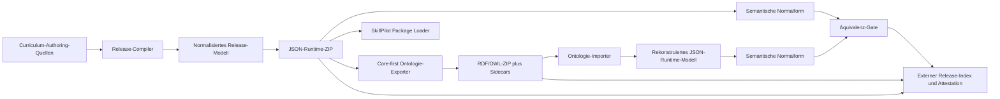

# Duale Curriculum-Pakete: JSON-Runtime und Lehrplan-Ontologie

Status: Zielkonzept  
Referenzbasis: Mathematik-Paket und MEM/FWU-Roundtrip-Pilot  
Geltungsbereich: versionierte Curriculum-Releases, SkillPilot-Runtime und spätere Trennung von Curriculum-Erstellung und SkillPilot-Software

## Kurzfassung

Ein Curriculum-Release soll genau einen fachlichen Stand in zwei gleichwertigen Darstellungen veröffentlichen:

1. ein **JSON-Paket**, das als alleiniger fachlicher Input einer SkillPilot-Installation verwendbar ist;
2. ein **Lehrplan-Ontologie-Paket**, das denselben Stand Core-first als RDF/OWL plus binäre Sidecars ausdrückt.

Beide Pakete werden nicht getrennt gepflegt. Ein normalisiertes Release-Modell erzeugt zunächst das JSON-Referenzpaket. Das Ontologiepaket wird aus genau diesem JSON-Artefakt abgeleitet. Anschließend muss der Rückweg aus RDF/OWL und Sidecars, ohne Zugriff auf das ursprüngliche JSON, wieder ein gültiges JSON-Runtime-Paket erzeugen. Ein maschinenlesbarer Äquivalenzbericht bindet beide ZIP-Hashes, den gemeinsamen fachlichen Digest, die verwendeten Schemas, den FWU-Core-Stand und die Transformationswerkzeuge.

Die Zielrichtung lautet damit:

> Curriculum-Erstellung liefert signierte, reproduzierbare und eigenständig validierbare Pakete. SkillPilot konsumiert nur noch den veröffentlichten JSON-Vertrag und benötigt weder das Curriculum-Quellrepository noch dessen Verzeichnisstruktur.

Aktueller Umsetzungsstand: [Dual Curriculum Package Implementation Status](../../dev/dual-curriculum-package-implementation-status.md)

## Ziele

Das Vorhaben ist erfolgreich, wenn:

- für jeden Release-Stand genau ein fachlicher Inhalt und zwei Darstellungsvarianten existieren;
- das JSON-ZIP alle Landschaften, Ansichten, Karten, Aufgaben, Ressourcen, Bilder und transitiven Runtime-Abhängigkeiten enthält, die SkillPilot für dieses Curriculum benötigt;
- eine SkillPilot-Instanz mit leerem Curriculum-Quellverzeichnis allein aus dem JSON-ZIP starten kann;
- das Ontologie-ZIP denselben fachlichen Inhalt mit möglichst viel FWU-Core-Semantik und nur notwendigen SkillPilot-Erweiterungen ausdrückt;
- aus dem Ontologie-ZIP ohne versteckte Kopie des ursprünglichen JSON wieder das normative Runtime-Modell erzeugt werden kann;
- jede fachlich relevante Abweichung, jedes verlorene Feld und jedes veränderte Bild den Release blockiert;
- Paketformat, fachlicher Stand, Runtime-Vertrag und Ontologieprofil unabhängig versioniert werden;
- die SkillPilot-Software Curricula über einen generischen Paket-Loader statt über fach- oder repository-spezifische Pfade lädt;
- Curriculum-Tooling und Curriculum-Inhalte später in ein eigenes Repository oder eine eigene Build-Pipeline umziehen können, ohne die Runtime-Schnittstelle zu ändern.

## Nicht-Ziele

Dieses Konzept verlangt nicht:

- dass SkillPilot RDF/OWL direkt als Produktions-Runtime laden muss;
- dass jede SkillPilot-Runtime-Struktur in den FWU Core aufgenommen wird;
- dass JSON- und RDF-Dateien byteidentisch oder syntaktisch ähnlich sind;
- dass Lernendenzustand, Mastery, Planungen oder personenbezogene Daten Bestandteil eines Curriculum-Pakets werden;
- dass offizielle PDF-Dateien mit ausgeliefert werden; stabile Quellen, Textanker und Provenienz reichen, sofern Lizenz und Reproduzierbarkeit dies erlauben;
- dass schon vor Stabilisierung der Verträge ein separates Repository eingerichtet wird;
- eine zweite fachliche Pflege im Ontologieformat.

## Ist-Analyse

Die vorhandene Arbeit ist eine starke Grundlage, erfüllt den Zielzustand aber noch nicht vollständig.

| Bereich | Heutiger Stand | Lücke zum Ziel |
| --- | --- | --- |
| JSON-Export | `buildSkillpilotExportPackage.ts` erzeugt reproduzierbare, validierte Subject-ZIPs mit Landschaft, Views, Mappings, Quellen, Karten, Bildern, Schemas und Manifest. | Das ZIP ist ein guter Publikations-Carrier, aber noch kein durch die Runtime direkt installierbares Paket. Ein paketlokaler Runtime-Katalog und ein Loader-Vertrag fehlen. |
| Backend-Landschaften | `LandscapeService` scannt rekursiv `skillpilot.landscapes.directory`, standardmäßig `../curricula`, und erkennt Landschaften heuristisch an JSON-Feldern. | Die Runtime hängt von der Quellrepository-Struktur ab und lädt auch JSON-Dateien, die nicht über ein Paketmanifest ausgewählt wurden. |
| Curriculum-Auswahl | `curricula/curriculum_manifest.json` bestimmt Root-Curricula. | Das Root-Inventar liegt außerhalb der Subject-ZIPs und muss in einen paketlokalen Katalog beziehungsweise einen Installations-Lock überführt werden. |
| Composition Views | `CompositionViewService` erwartet fest `DE/Gymnasium/composition-views`; das Exportpaket verwendet `data/views`. | Views müssen über Manifest-Rollen und einen View-Index aufgelöst werden. |
| Mappings | `GoalMappingService` erkennt Mappingdateien nur bei einem Pfadsegment `mapping`; das Paket verwendet `data/mappings`. | Mappingdateien dürfen nicht über Repository-Pfadnamen erkannt werden. |
| Karten | `DeckResourceService` indexiert Dateinamen global und nur unter Elternordnern wie `json` oder `memory-decks`; das Paket verwendet `data/cards`. | Karten benötigen paketweit eindeutige IDs und manifestbasierte Auflösung; Dateinamen allein reichen nicht. |
| Bilder und öffentliche Daten | Bilder und einige Laufzeitindizes kommen heute aus `app/public` oder statischen Frontend-Imports. | Assets müssen aus dem installierten Paket über einen generischen Resource Resolver bereitgestellt werden. |
| Externe Zielreferenzen | Das Paket deklariert fremde Goal-IDs. Beispielsweise referenziert Physik mathematische Ziele, ohne deren Definitionen mitzuliefern. | Ein als alleiniger Input nutzbares Paket muss seine transitive Runtime-Closure einbetten oder eine vollständig gepinnte, atomar installierte Abhängigkeit mitbringen. |
| JSON-Schema | `landscape-runtime.schema.json` liegt im Paket; der unabhängige Paketvalidator prüft bislang vor allem Graph- und Paket-Invarianten. | Jede normative JSON-Datei muss gegen ein veröffentlichtes, versioniertes Schema validiert werden. Unbekannte fachliche Felder dürfen nicht stillschweigend verloren gehen. |
| Runtime-Typen | TypeScript-Typen, Java-DTOs und JSON Schema werden getrennt gepflegt. Einzelne Felder wie `experimentData`, `courseLevel` oder optionale Defaults sind nicht überall deckungsgleich. | Ein versioniertes Schema-Paket muss zur Vertragsquelle werden; Producer validieren strikt, Runtime-Modelle werden daraus generiert oder per Contract-Test abgeglichen. |
| Ontologie-Roundtrip | Der Mathematik-Pilot bildet Core-Strukturen, Anwendungserweiterungen, Quellen, Views, Karten und die verknüpften Bilder semantisch ab; OWL-2-DL- und HermiT-Gates sind vorhanden. | Exporter und Importer sind noch Mathematik-/DE-Gymnasium-spezifisch. Die semantische Rekonstruktion erzeugt noch kein vollständig installierbares JSON-Release-ZIP. |
| Release-CI | Die Subject-Release-Pipeline prüft JSON-Pakete, Reproduzierbarkeit und Berichte. Der Workflow lädt derzeit nur Reports hoch. | Beide ZIP-Varianten, ihr gemeinsamer Release-Index, die Äquivalenzattestation und Signaturen müssen als eine atomare Release-Gruppe publiziert werden. |
| Archivgrenzen | Der aktuelle Builder schreibt ZIP32, während einzelne fachliche Limits zusammen theoretisch über die ZIP32-Grenze wachsen können. | V1 begrenzt das gesamte Paket mit Sicherheitsabstand unter ZIP32 oder implementiert vor größeren Releases ZIP64; Validator und Dokumentation müssen dasselbe Limit verwenden. |

## Zielarchitektur



### Verbindliche Architekturentscheidungen

1. **Keine doppelte Fachpflege**  
   Das JSON- und das Ontologiepaket sind Build-Artefakte desselben fachlichen Stands. Korrekturen werden in den Authoring-Quellen vorgenommen, nicht nachträglich in einem Release-ZIP.

2. **Das JSON-Paket ist die normative Runtime-Referenz**  
   SkillPilot konsumiert zunächst ausschließlich diese Variante. Ein späterer Ontologie-Loader muss ebenfalls zuerst in dasselbe Release-Modell kompilieren, statt eine zweite Runtime-Semantik einzuführen.

3. **Das Ontologiepaket wird aus dem fertigen JSON-Paket erzeugt**  
   Dadurch kann es nicht versehentlich aus einem anderen Quellstand entstehen. Der JSON-ZIP-Hash wird im Ontologie-Manifest gebunden.

4. **Äquivalenz ist semantisch, nicht syntaktisch**  
   Generierte README-Dateien und variantenspezifische Manifeste dürfen sich unterscheiden. Lernziele, Texte, Kanten, Ansichten, Aufgaben, Karten, Quellenbezüge und Ressourcen müssen dagegen gemäß ihrem Feldvertrag identisch sein; binäre Assets müssen byteidentisch sein.

5. **Core-first bedeutet nicht Core-only**  
   Fachliche Kompetenzen, Bereiche, Voraussetzungen, Achsen, Geltungsbereiche und Referenzen verwenden FWU-Core-Strukturen, wo deren Semantik passt. Composition Views, Runtime-Knoten, SRS-Karten und Paketmechanik bleiben klar benannte Anwendungserweiterungen. Eine unzutreffende Core-Modellierung ist schlechter als eine kleine, explizite Erweiterung.

6. **Keine versteckte Voll-JSON-Kopie im Ontologiepaket**  
   Der Rückweg muss aus RDF/OWL und expliziten binären Sidecars arbeiten. Kanonisches JSON als Literal ist nur für registrierte Erweiterungsfelder zulässig, deren interne Struktur nicht sinnvoll ontologisch modelliert wird; ein kompletter Landschafts- oder Paket-Carrier ist kein gültiger Äquivalenznachweis.

7. **Release-Beweise liegen außerhalb der beiden ZIPs**  
   Ein externer Release-Index kann beide endgültigen ZIP-Hashes ohne rekursive Selbstreferenz binden. Er ist ein Beweis-/Metadatenartefakt, keine dritte Inhaltsvariante.

## Release-Einheit und Artefakte

Empfohlen wird zunächst ein **eigenständig versioniertes Fachmodul** pro Schulkontext, zum Beispiel Mathematik am deutschen Gymnasium. Das Modul enthält genau ein oder mehrere auswählbare Root-Landscapes und die vollständige transitive Runtime-Closure. Fremde Ziele können als nicht auswählbare eingebettete Abhängigkeit mitkommen. Dünne, extern abhängige Module sind erst sinnvoll, wenn ein atomarer Package-Lock und ein zuverlässiger Dependency Resolver existieren.

Die Identität kommt aus dem Manifest, nicht aus dem Dateinamen. Ein empfohlener stabiler Paketbezeichner ist beispielsweise:

```text
org.skillpilot.curriculum.de.gymnasium.mathematik
```

Ein Release veröffentlicht mindestens:

```text
skillpilot-curriculum-de-gymnasium-mathematik-1.0.0.json.zip
skillpilot-curriculum-de-gymnasium-mathematik-1.0.0.fwu-owl.zip
skillpilot-curriculum-de-gymnasium-mathematik-1.0.0.release.json
skillpilot-curriculum-de-gymnasium-mathematik-1.0.0.equivalence.json
skillpilot-curriculum-de-gymnasium-mathematik-1.0.0.provenance.json
skillpilot-curriculum-de-gymnasium-mathematik-1.0.0.SHA256SUMS
skillpilot-curriculum-de-gymnasium-mathematik-1.0.0.release.json.sig
```

„JSON-basiert“ bezeichnet dabei den normativen Datenvertrag, nicht die ausschließliche Dateiendung im Archiv. Strukturierte fachliche Daten liegen als JSON vor; verpflichtende Bilder und andere binäre Runtime-Ressourcen werden als gehashte Sidecars mitgeliefert.

Lokale Entwicklungs- und Staging-Kandidaten dürfen vorübergehend unsigniert sein. Ein öffentlicher `stable`-Release benötigt dagegen eine verifizierbare Signatur des externen Release-Index; eine Build-Provenienz-Attestation ist ebenfalls verpflichtender Bestandteil des Stable-Gates. Die Runtime-Trust-Policy pinnt zulässige Schlüssel oder bei keyless Signaturen Issuer, Repository und Workflow-Identität; eine technisch gültige Signatur ohne vertrauenswürdige Identität reicht nicht. Das konkrete Signaturformat wird im Paketvertrag festgelegt und kann statt der beispielhaften `.sig`-Datei ein Sigstore-Bundle verwenden. Ob die Dateien über GitHub Releases, einen Objekt-Store oder als OCI-Artefakte transportiert werden, bleibt vom Paketvertrag getrennt. OCI kann später bei identischen großen Bild-Layern Speicher und Transfer sparen, ohne die logischen ZIP-Artefakte zu ändern.

### Gemeinsamer Release-Index

Der externe `release.json`-Vertrag bindet beide Varianten:

```json
{
  "schemaVersion": 1,
  "releaseId": "org.skillpilot.curriculum.de.gymnasium.mathematik@1.0.0",
  "packageId": "org.skillpilot.curriculum.de.gymnasium.mathematik",
  "packageVersion": "1.0.0",
  "curriculumEdition": "DE-Gymnasium-2026-07",
  "releaseProfile": "full-standalone-v1",
  "contentDigest": "sha256:<digest-der-semantischen-normalform>",
  "contracts": {
    "packageFormatVersion": "1.0",
    "runtimeContractVersion": "1.0",
    "supportedSkillpilotSoftware": ">=1.0.0 <2.0.0",
    "ontologyProfileVersion": "1.0",
    "fwuCoreIri": "https://w3id.org/lehrplan/ontology/lp/components/lehrplan-core.owl",
    "fwuCoreCommit": "<commit>"
  },
  "variants": {
    "json": {
      "file": "skillpilot-curriculum-de-gymnasium-mathematik-1.0.0.json.zip",
      "sha256": "<zip-sha256>"
    },
    "fwu-owl": {
      "file": "skillpilot-curriculum-de-gymnasium-mathematik-1.0.0.fwu-owl.zip",
      "sha256": "<zip-sha256>"
    }
  },
  "equivalence": {
    "status": "passed",
    "report": "skillpilot-curriculum-de-gymnasium-mathematik-1.0.0.equivalence.json",
    "sha256": "<report-sha256>"
  },
  "provenance": {
    "attestation": "skillpilot-curriculum-de-gymnasium-mathematik-1.0.0.provenance.json",
    "sha256": "<provenance-sha256>"
  }
}
```

Jedes innere Paketmanifest wiederholt `releaseId`, `packageId`, `packageVersion`, `variant`, `contentDigest` und die relevanten Vertragsversionen. Es enthält nicht den Hash des eigenen äußeren ZIPs.

V1 veröffentlicht ausschließlich das maschinenlesbar definierte Profil `full-standalone-v1`. Dessen Schema legt Required-/Optional-Rollen für Runtime-Daten, Quellen, Mappings, Quality-Evidence, Lizenzen und Ressourcen abschließend fest. Ein Paket ohne Profil-ID oder mit fehlender Pflichtrolle ist kein Release-Kandidat.

### Globaler Veröffentlichungskatalog

Der Release-Index bindet genau ein Variantenpaar. Ein davon getrennter, signierter und speicherneutraler Katalog macht Releases auffindbar. Pro `packageId` führt er verfügbare Versionen, Kanal, Release-Index-URL und -SHA, unterstützte Runtime-Verträge, `supersedes` sowie `yanked` mit Begründung. Ein Kandidat wird erst atomar von `staging` nach `stable` promoviert, nachdem beide ZIPs, Attestationen und Signaturen am endgültigen Downloadziel erneut geprüft wurden. Ein Package-Lock pinnt anschließend die exakte Version und den Digest; der Loader führt niemals automatisch ein ungepinntes `latest` aus.

## Vertrag des JSON-Runtime-Pakets

### Normative Bestandteile

Das bestehende Subject-ZIP kann weitgehend weiterverwendet werden. Ergänzt werden müssen ein paketlokaler Runtime-Katalog und explizite Artefaktrollen.

```text
<archive-root>/
  metadata/
    manifest.json
    validation-report.json
    provenance-report.md
    SHA256SUMS
  data/
    runtime/
      catalog.json
      dependency-closure.json
      migration-aliases.json
    canonical/
      *.landscape.json
    views/
      index.json
      *.view.json
    cards/
      card-index.json
      *.json
    resources/
      resource-index.json
    dependencies/
      external-goal-references.json
    mappings/
      ...
    sources/
      source-index.json
      source-goal-references.json
  assets/...
  metadata/quality/...
  schemas/
    catalog.json
    ...
  licenses/...
```

Der physische Pfad ist nicht die Semantik. `metadata/manifest.json` weist jeder normativen Datei eine Rolle zu, zum Beispiel:

- `runtime-catalog`;
- `canonical-landscape`;
- `composition-view-index` und `composition-view`;
- `card-index` und `card-deck`;
- `resource-index` und `binary-asset`;
- `embedded-goal-dependency`;
- `mapping`, `source-index` und `source-goal-reference-index`;
- `quality-evidence`;
- `schema` und `license`.

Der Loader folgt ausschließlich diesen Rollen und den im Manifest angegebenen Pfaden. Er scannt nicht beliebige JSON-Dateien.

### Paketlokaler Runtime-Katalog

`data/runtime/catalog.json` ersetzt die heutige Abhängigkeit von `curricula/curriculum_manifest.json` und repository-spezifischen Registries. Er enthält mindestens:

- auswählbare Root-Landscape-IDs;
- alle internen Landschaften und deren Rollen;
- Subjects, Schulformen, Geltungsbereiche und angebotene Dauer-/Kursmodelle;
- View-IDs und ihre Scope-Schlüssel;
- Deck-IDs und Resource-IDs;
- eingebettete beziehungsweise externe Abhängigkeiten;
- Alias-/Nachfolgerbeziehungen für migrierte IDs;
- optionale Capability-Marker, etwa `compositionViews`, `memoryCards`, `goalVisualizations` oder `examNodes`.

Die kanonischen Landschaften im Runtime-Paket enthalten bereits fertig kompilierte effektive `applicability`-Werte und andere zur Laufzeit benötigte Ableitungen. Die Runtime wertet keine Authoring-Mappings oder Provenienzregister aus, um Sichtbarkeit nachträglich zu berechnen.

### Alleiniger fachlicher Input

„Alleiniger Input“ bedeutet für das verpflichtende Profil `full-standalone-v1`:

- kein Zugriff auf `curricula/` im SkillPilot-Quellcheckout;
- kein fachlicher Fallback aus `app/public` oder kompilierten TypeScript-Dateien;
- keine fest codierten Curriculum-, Fach-, Bundesland- oder Goal-IDs in der Software;
- keine Netzwerkabfrage, um für Navigation notwendige Zieldefinitionen nachzuladen;
- vollständige interne und transitive Closure aller schema-definierten harten Runtime-Referenzen;
- alle referenzierten Karten und Bilder im ZIP;
- alle für die Auswahl einer Composition View notwendigen Scope-Metadaten im Paket;
- Quellen-URLs dürfen extern bleiben, der fachliche Betrieb darf von ihrer Erreichbarkeit aber nicht abhängen.

Für Physik bedeutet dies beispielsweise, dass die benötigten mathematischen Zieldefinitionen und ihre fachlich erforderliche Closure eingebettet werden, solange noch kein atomar installierter Dependency Lock existiert. Die eingebetteten Ziele werden nicht automatisch zu auswählbaren Root-Curricula.

### Closure, Ownership und eingebettete Abhängigkeiten

Die Closure wird nicht nur über `contains` und `requires` berechnet. Der Release-Compiler folgt allen im Schema als hart markierten Runtime-Referenzen, darunter Goal Placements, Composition-View-Wurzeln und -Kinder, Kompetenzreferenzen, `examData.coveredGoalIds`, Karten-Ursprünge, Deck-Referenzen, Resource Links, Migrationsziele und weitere fachliche IDs. Weiche Provenienz-URLs oder optionale externe Lesematerialien erzeugen keine Runtime-Abhängigkeit.

V1 bettet für eine fremde Goal-Referenz ein nicht auswählbares `embedded-fragment` ein:

- die vollständige Definition jedes erreichten Goals und die transitive Closure aller von dort ausgehenden harten Referenzen;
- referenzierte Program Units, Placements, Kompetenzkatalogeinträge, Karten und Assets;
- fremde Composition Views nur, wenn eine primäre View sie ausdrücklich referenziert; der komplette fremde Navigationsbaum wird nicht implizit übernommen;
- `ownerPackageId`, `sourceReleaseId`, `fragmentOfLandscapeId` und einen Digest jedes übernommenen Records;
- keine Behauptung, das Fragment sei die vollständige Landschaft des Owner-Pakets.

Inverse Beziehungen, etwa alle fremden Eltern eines eingebetteten atomaren Ziels, werden nur aufgenommen, wenn sie selbst für eine harte Runtime-Referenz benötigt werden. Der Closure-Report nennt Seeds, besuchte Referenzfelder und bewusst nicht verfolgte weiche Links.

Werden mehrere Standalone-Pakete gemeinsam installiert, dedupliziert der Package-Lock identische Definitionen. Unterschiedliche Definitionen derselben stabilen Goal-ID sind ein harter Versionskonflikt; die Runtime darf weder nach Installationsreihenfolge überschreiben noch stillschweigend eine Variante bevorzugen. Dadurch bleiben einzelne ZIPs eigenständig, ohne bei einer gemeinsamen Mathematik-/Physik-Installation mehrdeutige Ziele zu erzeugen.

### Strikte Schema- und Installationsprüfung

Vor Aktivierung werden geprüft:

- ZIP-Sicherheit, Dateitypen, Größenlimits, Pfadkollisionen und Checksummen;
- das äußere Paketmanifest und jede normative JSON-Datei gegen versionierte JSON Schemas mit stabilen öffentlichen `$id`-Werten und paketlokaler Offline-Auflösung über `schemas/catalog.json`;
- eindeutige Landscape-, Goal-, View-, Deck- und Resource-IDs;
- Graph-DAG, referenzielle Integrität und vollständige Dependency Closure;
- View-Projektion, Scope-Auflösung und eindeutige sichtbare Eltern;
- Karten- und Asset-Auflösung einschließlich MIME, Größe und SHA-256;
- Runtime-Vertragskompatibilität;
- ein hermetischer Consumer-Smoke-Test gegen eine SkillPilot-Instanz ohne Curriculum-Quellbaum.

Die JSON Schemas sind die gemeinsame Vertragsquelle für Exporter, TypeScript und Java. TypeScript- und Java-Transportmodelle werden daraus generiert; handgeschriebene Domain-Adapter müssen zusätzlich dieselbe bidirektionale Conformance-Suite einschließlich Defaults, unbekannter Felder und Serialisierungs-Roundtrip bestehen. So können Producer, Frontend und Backend keine unterschiedlichen Feldsemantiken etablieren.

## Vertrag des Lehrplan-Ontologie-Pakets

Das Ontologiepaket ist ein reproduzierbares ZIP und enthält den semantischen Graphen, das Profil, den gebundenen Core und dieselben binären Ressourcen:

```text
<archive-root>/
  metadata/
    manifest.json
    SHA256SUMS
  rdf/
    declarations.nt
    runtime.nt
    landscape.nt
    views.nt
    mappings.nt
    sources.nt
    cards.nt
    assets.nt
    bundle.nt
  skillpilot-curriculum-profile.ttl
  catalog-v001.xml
  ontology/
    lehrplan-core.owl
    shapes.ttl
  assets/...
  schemas/
    catalog.json
    ...
  licenses/...
```

Verbindliche Anforderungen:

- das Paket bindet die kanonische Core-IRI, den verwendeten Core-Commit und den SHA-256 der lokalen Core-Kopie;
- Core-Klassen und -Relationen werden nur bei passender Semantik verwendet;
- Anwendungsterme sind versioniert, dokumentiert und auf echte Runtime-/Paketlücken beschränkt;
- alle Runtime-relevanten JSON-Felder besitzen eine registrierte Abbildungsstrategie;
- `runtime.nt` trägt den paketlokalen Katalog, Dependency-Ownership, Closure-Metadaten, Capabilities und Goal-Migrationsrelationen, soweit diese nicht deterministisch aus anderen normativen Segmenten ableitbar sind;
- binäre Ressourcen bleiben Sidecars und werden nicht Base64-kodiert;
- das Paket besteht RDF-Syntax, OWL 2 DL, SHACL/strukturelle Checks und HermiT-Konsistenz;
- der Importer rekonstruiert das Release-Modell nur aus diesem Paket;
- variantenspezifische Metadaten dürfen neu generiert werden, fachlicher Inhalt nicht.

Die im Manifest geordnet aufgeführten RDF-Segmente sind normativ. `bundle.nt` ist ausschließlich deren deterministisch erzeugte, bytegenau verifizierte Konkatenation für Ontologiewerkzeuge; es ist kein zweiter Datenstand und fließt nicht zusätzlich in den `contentDigest` ein. `catalog-v001.xml` liegt neben dem Profil und löst die kanonische Core-IRI relativ auf `ontology/lehrplan-core.owl` auf.

Der heutige Slim-MEM/FWU-Bundle ist die Ausgangsbasis. Der technische RDF-Zeilenträger bleibt ein nützlicher Regressionstest für Dateiverlust, ist aber kein Ersatz für den semantischen Ontologie-Roundtrip und sollte nicht Teil des öffentlichen Ontologieformats sein.

### Fachübergreifende Ontologieprofile

Mathematikspezifische Annahmen werden aus dem generischen Transformationskern entfernt und in deklarative, versionierte Fachprofile verschoben. Ein solches Profil enthält:

- KIM-Fach- und Schulart-IRIs;
- zulässige Kompetenzachsen und ihre Core-Zuordnung;
- Program-Unit-/Stufenabbildungen;
- explizite semantische Node-Klassen wie `curricularAtomic`, `curricularArea`, `programStructure`, `practiceAssessment`, `memory`, `orientation` und `runtimeSupport`;
- erlaubte Anwendungserweiterungen und harte Fehlerfälle.

Jedes Goal trägt im kompilierten Release-Modell ein schema-verpflichtendes `semanticKind`. Das Fachprofil bildet diesen Wert auf Core- und Anwendungsklassen ab; es enthält keine vollständige ID-Liste. Authoring-Migrationen dürfen `semanticKind` einmalig über reviewte Regeln vorbelegen, aber ein Release-Compiler rät den Wert nicht aus deutschen Titeln, Präfixen oder mathematikspezifischen IDs. Fehlende oder nicht unterstützte Semantik führt zu einem Fehler und niemals zu einer stillen Mathematik- oder Core-Zuordnung.

## Normativer Äquivalenzvertrag

### Was „inhaltlich äquivalent“ bedeutet

| Inhalt | Vergleich |
| --- | --- |
| Landscape-Metadaten und Filter | exakt nach schema-definierter Normalisierung |
| Runtime-Katalog, Capabilities, Dependency-Fragmente und Migrationen | exakt; nur deterministisch regenerierbare Packaging-Pfade sind ausgenommen |
| Goals, Texte, Typen, Gewichte und Fachdimensionen | exakt; keine stillen Defaults oder Feldverluste |
| `contains` und `requires` | identische direkte Kanten; abgeleitete/inferenzierte Kanten zählen nicht als authored direct edge |
| Program Units und Goal Placements | identische Einträge und Kontexte |
| Competency Catalog und Achsenreferenzen | identische fachliche Referenzen; Core-Projektionen dürfen zusätzliche ableitbare Aussagen enthalten |
| Composition Views | identische Scope-Auswahl, Struktur, Referenzen und Reihenfolge |
| Exam-, Practice-, Memory- und weitere Runtime-Daten | exakt gemäß Feldvertrag |
| Karten und Decks | identische IDs, Inhalte, Reihenfolge und Zielreferenzen |
| Resource Links | identische Reihenfolge, Metadaten, Lizenz- und Reviewangaben |
| Bilder und andere Binärressourcen | gleiche Bytes, Größe, MIME-Type und SHA-256 |
| Mappings, Quellenanker und Quality-Evidence | identische normalisierte Datensätze für das vollständige Releaseprofil |
| README, generierte Reports und variantenspezifische Manifeste | vom Fachvergleich ausgeschlossen, aber jeweils gehasht und validiert |

### Feldsemantik-Registry

Ein maschinenlesbarer Mappingvertrag klassifiziert jedes zulässige JSON-Feld als:

- `scalar`;
- `ordered-list`;
- `set`;
- `map`;
- `binary-reference`;
- `generated-non-semantic`.

Zusätzlich legt er die RDF-Strategie fest:

- `fwu-core`;
- `skillpilot-profile`;
- `registered-canonical-json-literal` für eng begrenzte strukturierte Erweiterungen;
- `excluded-generated`.

Jeder Registry-Eintrag adressiert ein Feld über JSON Pointer beziehungsweise ein explizites Schema-Pfadmuster und definiert Kardinalität, Datentyp, Sprache, Default-/Null-Semantik, Regeln für dynamische Map-Keys, konkrete RDF-Prädikate oder Konstruktionen und die Reverse-Abbildung. `registered-canonical-json-literal` ist kein Catch-all: Jeder zulässige Teilbaum braucht einen eigenen Eintrag, einen begründeten Core-Gap, eine maximale Bytegröße und eine dokumentierte Granularität. Die Registry besitzt eine eigene Version und Kompatibilitätsregeln.

Geordnete Listen werden nicht über N-Triples-Dateireihenfolge dargestellt. Die Registry verlangt je Liste entweder eine RDF-Liste oder, bevorzugt für große Graphen, reifizierte Membership-/Edge-Ressourcen mit lückenlosen eindeutigen ganzzahligen Positionen. Eine zusätzliche ungeordnete Core-Relation darf die fachliche Semantik projizieren, ersetzt aber nicht die verlustlose Positionsdarstellung von Goal-Reihenfolge, `contains`, `requires`, View-Kindern, Resource Links oder Karten.

Ein neues Feld ohne Registry-Eintrag blockiert den Ontologie-Release. Dadurch kann eine Schemaerweiterung nicht unbemerkt aus dem Roundtrip verschwinden.

Empfohlene Normalisierungsregeln:

- Objekt-Keys werden deterministisch sortiert;
- Unicode-Codepunkte bleiben unverändert; ungültige Unicode-/XML-Zeichen werden vor dem Release abgewiesen;
- Array-Reihenfolge bleibt erhalten, außer die Registry erklärt das Feld ausdrücklich zur Menge;
- fehlend, `null`, leer und Default sind nur dann äquivalent, wenn das Schema dies explizit definiert;
- Zahlen müssen endlich sein und werden kanonisch serialisiert;
- Pfade werden paketrelativ und mit `/` dargestellt;
- unbekannte Properties sind im Authoring möglicherweise erlaubt, im kompilierten Release-Modell aber nur mit registrierter Semantik.

Insbesondere sollten `goals`, `contains`, View-Kinder, Resource Links, Karten und Scoring-Schritte als geordnet behandelt werden, solange die Runtime ihre Reihenfolge beobachten kann. Eine spätere Umstellung auf echte Mengen setzt voraus, dass die Runtime zuvor eine explizite Sortierregel erhalten hat.

### Gemeinsamer Content Digest

Beide Varianten tragen denselben `contentDigest`. Er wird nicht aus den ZIP-Bytes berechnet, sondern aus einem kanonischen Inhaltsindex:

1. jede normative JSON-Struktur wird gemäß Feldregistry normalisiert;
2. logische Artefakte werden nach Rolle und stabiler ID sortiert und längengeframed gehasht;
3. für Binärressourcen gehen die logische Resource-ID beziehungsweise kanonische öffentliche Referenz, Länge, MIME-Type und Datei-SHA ein; variantenspezifische ZIP-Pfade bleiben Verpackungsmetadaten;
4. generierte Dokumentation und variantenspezifische Verpackungsfelder bleiben außen vor.

So kann dasselbe Curriculum trotz unterschiedlicher Serialisierung denselben fachlichen Digest besitzen.

### Verbindlicher Roundtrip

Der Release-Gate führt in dieser Reihenfolge aus:

1. Authoring-QA und Graphvalidierung bestehen.
2. Das JSON-ZIP wird reproduzierbar gebaut.
3. Ein unabhängiger JSON-Paketvalidator prüft das fertige ZIP.
4. Ein hermetischer SkillPilot-Smoke-Test lädt ausschließlich dieses ZIP.
5. Das Ontologie-ZIP wird ausschließlich aus dem JSON-ZIP erzeugt.
6. RDF, Core-Bindung, Profil, SHACL/Struktur, OWL 2 DL und HermiT bestehen.
7. Der Importer liest ausschließlich Ontologie-ZIP und Sidecars und erzeugt ein rekonstruiertes Release-Modell.
8. Beide Release-Modelle werden in die semantische Normalform überführt.
9. Strukturvergleich, Feldabdeckung und binäre SHA-256-Vergleiche bestehen ohne fachliche Differenz.
10. Auch das rekonstruierte JSON-Paket besteht Schema-, Paket- und hermetischen SkillPilot-Smoke-Test.
11. Zwei vollständige Pipeline-Läufe in frischen, isolierten Builder-Umgebungen erzeugen `JSON-A -> FWU-A` und `JSON-B -> FWU-B`; `JSON-A` muss bytegleich `JSON-B` und `FWU-A` bytegleich `FWU-B` sein.
12. Release-Index, Äquivalenzreport, Checksummen und Signatur werden aus den endgültigen Artefakten erzeugt.

Der Ontologie-Importer läuft in einem getrennten Prozess beziehungsweise Container ohne Lesezugriff auf Original-JSON-ZIP, Authoring-Checkout oder alte Rekonstruktionsausgaben. Erst der nachgelagerte Vergleicher erhält beide Ergebnisse als Oracles. So ist technisch nachweisbar, dass das Original-JSON nie Quelle der Rekonstruktion war.

Die Reproduzierbarkeitsumgebung pinnt Toolchain-/Container-Digests, Locale, Zeitzone, Dateireihenfolge, Kompressionsparameter und `SOURCE_DATE_EPOCH` aus dem Source-Commit. Build-Zeitpunkte gehören nicht in normative Manifeste; reale Signatur-/Publikationszeiten liegen in den nachgelagerten Attestationen und dürfen sich zwischen den beiden Inhaltsbuilds unterscheiden.

### Äquivalenzreport

Der maschinenlesbare Bericht hält mindestens fest:

- beide äußeren ZIP-Hashes und inneren Manifest-Hashes;
- `releaseId`, `contentDigest` und Vertragsversionen;
- FWU-Core-IRI, Commit und Datei-Hash;
- Transformationswerkzeug, Version und Source-Commit;
- Anzahl und Digest je logischer Artefaktrolle;
- vollständige Feldabdeckung der Mappingregistry;
- Graph-, View-, Karten- und Asset-Vergleiche;
- OWL-/SHACL-/Reasoner-Ergebnisse;
- Consumer-Smoke-Test;
- Reproduzierbarkeitsstatus;
- explizit `passed: true|false` und alle Abweichungen.

## Entkopplung der SkillPilot-Runtime

### Neue Runtime-Komponenten

Empfohlen werden vier generische Bausteine:

1. **`CurriculumPackageRepository`**  
   Findet installierte Pakete, liest Manifeste und verwaltet einen gepinnten Installations-Lock.

2. **`JsonCurriculumPackageLoader`**  
   Validiert ein Paket, baut daraus das interne `LearningLandscape`-Modell und liefert Root-Katalog, Goal-Index, Views, Mappings und Dependencies.

3. **`CurriculumResourceResolver`**  
   Löst Decks, Bilder und weitere Ressourcen paket- und versionsbezogen auf. Dateinamen allein sind keine globale Identität.

4. **`CurriculumActivationService`**  
   Installiert in ein temporäres/content-adressiertes Verzeichnis, validiert vollständig und schaltet anschließend atomar auf einen neuen Lock. Der vorherige Lock bleibt als Rollback erhalten.

### Ablösung heutiger Kopplungen

| Heute | Ziel |
| --- | --- |
| rekursiver Scan von `../curricula` | ausschließlich manifestbasierte Paketregistrierung |
| `curriculum_manifest.json` im Quellbaum | paketlokaler Runtime-Katalog plus Installations-Lock |
| festes `DE/Gymnasium/composition-views` | View-Index aus Artefaktrollen |
| globale Deck-Suche nach Dateiname | `packageId + deckId` beziehungsweise stabile Resource-URI |
| Bilder aus `app/public` | paketgebundener Asset-Endpunkt oder Resource Resolver |
| hart codierte Compatibility-/Migration-IDs | paketlokale Alias- und Nachfolgerdaten |
| generierte fachliche TypeScript-Dateien | Runtime-Capabilities und Scope-Angebote aus dem Paket |
| repo-relative Provenienzregistries | kompilierte paketlokale Indizes |

Die Frontend-API kann weitgehend stabil bleiben. Der Backend-Loader ändert die Datenquelle hinter `/api/ui/landscapes`, Closure-, Composition-View-, Deck- und Asset-Endpunkten.

### Sichere Installation

Ein Paket wird nie direkt aus einem Upload-/Download-Verzeichnis ausgeführt:

1. ZIP in Quarantäne speichern;
2. äußeren Hash und, für öffentliche Stable-Artefakte verpflichtend, die Signatur des Release-Index prüfen;
3. ZIP-Metadaten vor Dekompression prüfen;
4. in ein temporäres Verzeichnis extrahieren;
5. Manifest, Checksummen, Schemas und Closure sowie einen in-process Loader-/API-Dry-Run prüfen;
6. content-adressiert ablegen;
7. den neuen Package-Lock atomar aktivieren;
8. alte Pakete erst nach Ablauf der Rollback-Frist bereinigen.

In Produktion sollte der Package-Lock Paket-ID, Version, ZIP-SHA und `contentDigest` enthalten. Automatische ungepinnte „latest“-Updates sind zu vermeiden.

Der vollständige hermetische SkillPilot-End-to-End-Smoke-Test läuft in der Release-CI und in einer Staging-Umgebung. Eine Produktionsinstallation startet nicht pro Paket eine zweite SkillPilot-Instanz, sondern verwendet denselben Loader und dieselben Validierungs-/API-Fixtures ohne Aktivierung des Kandidaten.

## Versionierung und Kompatibilität

Folgende Versions- und Kompatibilitätsachsen werden getrennt behandelt:

- **`packageVersion`**: unveränderlicher Release des konkreten Curriculum-Moduls, SemVer;
- **`curriculumEdition`**: menschlich/amtlich verständlicher Bezugsstand;
- **`packageFormatVersion`**: ZIP-, Manifest- und Artefaktrollenvertrag;
- **`runtimeContractVersion`**: Semantik des normalisierten JSON-Runtime-Modells;
- **`supportedSkillpilotSoftware`**: expliziter SemVer-Bereich kompatibler SkillPilot-Versionen;
- **`ontologyProfileVersion`**: RDF/OWL-Abbildung;
- **FWU-Core-IRI, Commit und Datei-SHA**: exakt gebundene Ontologieabhängigkeit.

Amtliche Geltungsinformationen wie `effectiveFrom`, `effectiveTo`, `sourceRevision` und Rechts-/Quellenstand werden separat geführt. Sie ersetzen keine technische Vertrags- oder Paketversion.

Regeln:

- Goal-, Landscape-, View-, Deck- und Resource-IDs werden nie für neue Bedeutungen wiederverwendet;
- Umbenennungen verwenden Alias-/Nachfolgerdaten;
- gemeinsam installierte Pakete dürfen dieselbe stabile Goal-ID nur mit identischer kanonischer Definition bereitstellen;
- ein Breaking Change des Runtime-Vertrags erhöht dessen Major-Version, nicht automatisch die Curriculum-Edition;
- ein Paket deklariert die unterstützte SkillPilot-Runtime-Spanne; inkompatible Majors werden hart abgewiesen;
- beide Varianten eines Release haben immer dieselbe `packageVersion` und denselben `contentDigest`;
- Abhängigkeiten werden mit exakter Version und Digest gepinnt, sobald dünne Module unterstützt werden;
- ein Release wird nicht überschrieben; eine Korrektur erhält eine neue Version;
- eine reine Neuverpackung kann denselben `contentDigest` behalten, erhält aber eine neue `packageVersion` mindestens auf Patch-Ebene und deklariert die neue `packageFormatVersion`;
- der Vergleich mit dem letzten stabilen Release blockiert entfernte oder ersetzte Goal-IDs ohne expliziten Migrationseintrag.

`migration-aliases.json` ist deshalb kein bloßes String-Mapping. Es kennt mindestens `renamed`, `replacedBy`, `splitInto`, `mergedInto` und `removed` sowie eine explizite Mastery-/History-Policy. Nur `renamed` darf Lernstand unverändert automatisch übernehmen. Splits verteilen Mastery nicht automatisch auf alle Nachfolger; Replace-/Merge-Fälle benötigen eine versionierte Transformationsregel oder eine bewusste Neu-Einstufung. Der Release-Vergleich simuliert diese Migration gegen Fixtures des letzten Stable-Releases.

## Sicherheit, Provenienz und Lizenzen

Die vorhandenen Regeln für sichere ZIP-Pfade, Größenlimits, reguläre Dateien, SHA-256 und file-basierte Lizenzkategorien bleiben verbindlich. Hinzu kommen:

- signierter externer Release-Index beziehungsweise signierte Attestation;
- reproduzierbarer Build aus einem sauberen Source-Commit;
- Toolchain-/Schema-Versionen im Provenienzreport;
- kein ausführbarer Code aus Curriculum-Paketen;
- kein Zugriff auf Pfade außerhalb des Paketroots;
- kein stilles Nachladen unbekannter Dependencies;
- getrennte Lizenzkategorien für SkillPilot-Daten, offizielle Quellenmetadaten, Software-Schemas und generierte/kuratierte Bilder;
- Live-URL-Audits bleiben eine zusätzliche Provenienzprüfung, nicht Voraussetzung für den Offline-Runtimebetrieb.

Solange der Builder ZIP32 schreibt, setzt `packageFormatVersion: 1.x` feste Obergrenzen: höchstens `3_500_000_000` Byte äußere ZIP-Größe, `60_000` Einträge, `1_000_000_000` Byte pro allgemeinem Eintrag, `64 MiB` pro Visualisierung, `3_000_000_000` Byte für die gesamte Bild-Lane, `8_000_000_000` Byte unkomprimierte Gesamtdaten und `240` UTF-8-Byte pro vollständigem Pfad aus Archivroot und relativem Dateipfad. Ein Manifest ist auf `64 MiB`, `59_998` inventarisierte Dateien und `1_024` Lizenzdokumente begrenzt; Listenlimits werden vor der vollständigen Schemaprüfung abgefangen. Doppelte JSON-Objektschlüssel sind verboten. Verschachtelte Archive sind verboten; das maximale Kompressionsverhältnis beträgt `100:1` pro Eintrag und `25:1` insgesamt. Kompressionsverhältnisse und deklarierte/ausgelesene Größen werden vor und während der Extraktion geprüft. Builder, beide unabhängigen Validatoren und Loader verwenden dasselbe versionierte Profil. Größere Releases benötigen zuerst `packageFormatVersion: 2` mit ZIP64 und erneut festgelegten Grenzen.

Lizenz und Entstehungsprovenienz dürfen nicht in einem Feld vermischt werden. Für veröffentlichte Assets werden mindestens `licenseExpression`, `provenanceClass` und `redistributionStatus` (`allowed`, `review-required`, `prohibited`) getrennt geführt. `review-required` und `prohibited` blockieren den öffentlichen Release. Die heutige Kategorie `goal-visualization-ai-generated-curated` beschreibt Herkunft und Kuratierung, erteilt aber für sich keine Weiterverbreitungslizenz.

Jeder Identifier aus einer SPDX-artigen `licenseExpression` muss über `licenseDocuments` auf ein im Paket inventarisiertes Lizenzartefakt aufgelöst werden. `NONE`, `NOASSERTION`, nicht auflösbare Identifier und verwaiste Lizenztexte sind im öffentlichen Standalone-Profil nicht zulässig.

Ein kleiner Curriculum-BOM im Release-Index inventarisiert verwendete Schemas, Transformations-/Validatorversionen, FWU Core und SkillPilot-Profil, Quellenkollektionen sowie Asset- und Lizenzklassen.

Der Ressourcenvertrag ist medienneutral. Jeder Eintrag deklariert `resourceId`, `resourceKind`, `delivery` (`embedded` oder `external`), `runtimeRequired`, MIME-Type, Größe/Hash soweit bytespezifisch, Lizenz, Provenienz und Redistribution. `runtimeRequired: true` erzwingt ein eingebettetes Sidecar; externe optionale Materialien dürfen die Offline-Funktionen nicht beeinflussen. Manifest und Roundtrip behandeln jedes erlaubte Binärformat bytegenau. V1 aktiviert Bilder als erste Binärklasse; Dokumente, Audio, Video oder Experimentdateien benötigen jeweils eine versionierte MIME-/Größen-/Sicherheits-Capability. Unbekannte oder ausführbare Typen werden abgewiesen statt still ausgelassen.

Bei großen Bildbeständen sind beide ZIPs logisch eigenständig und enthalten daher zunächst dieselben Assets. Transportseitige Deduplizierung kann später über OCI-Layer oder einen content-adressierten Mirror erfolgen. Ein gemeinsames externes Assetpaket sollte erst eingeführt werden, wenn Signatur-, Offline- und Dependency-Semantik dafür definiert sind.

## Entkopplung des Erstellungsprozesses

Die Trennung sollte erst nach Stabilisierung des Paketvertrags erfolgen.

### Zielaufteilung

**Curriculum-/Tooling-Repository**

- Authoring-Quellen, Mappings, Review-Ledger, Bilder und Provenienz;
- Release-Compiler und beide Transformatoren;
- JSON-/RDF-Schemas, SHACL und Feldmappingregistry;
- Curriculum-QA, Roundtrip und Release-Publikation.

**SkillPilot-Software-Repository**

- generischer Paket-Loader und Resource Resolver;
- interne Runtime-Modelle und API;
- unterstützte Vertragsversionen;
- kleine signierte Conformance-Fixtures, aber keine produktiven Fachinhalte;
- Consumer-Kompatibilitätstests gegen veröffentlichte Testpakete.

Die gemeinsame Schnittstelle besteht aus versionierten Schemas, der Feldsemantik-Registry, Beispielpaketen und einem CLI-/Container-Vertrag. Das Tooling kann zunächst im Monorepo modularisiert und später ohne Formatwechsel verschoben werden.

## Umsetzungsplan

### Phase 0 – Verträge festschreiben

Ergebnisse:

- Paket-ID- und Release-ID-Regeln;
- öffentliche JSON-Schema-IDs und paketlokaler Offline-Schema-Katalog;
- Profil `full-standalone-v1` mit abschließend definierten Pflicht-/Optionalrollen;
- Runtime-Katalogschema;
- Manifest-/Release-Index-/Äquivalenzreport-Schemas;
- Feldsemantik- und RDF-Mappingregistry;
- Entscheidung, welche Listen geordnet beziehungsweise Mengen sind;
- Standalone-Closure-, Ownership- und Konfliktregeln für externe Goal-Referenzen;
- Migrationsrelationen und Mastery-Policy;
- versionierte ZIP32- und Ressourcenlimits.

Abnahme:

- bestehendes Mathematik-JSON-Paket lässt sich verlustfrei in das neue Release-Modell kompilieren;
- jedes heute exportierte fachliche Feld besitzt eine Abbildungsstrategie.

### Phase 1 – JSON-Paket als hermetischer Runtime-Input

Ergebnisse:

- `runtime/catalog.json`, View-Index, Dependency-Closure und Aliasdaten im Export;
- strikte JSON-Schema-Prüfung aller normativen Dateien;
- Backend-Interfaces für Package Repository, Loader und Resource Resolver;
- Paket-Loader hinter einem Feature Flag;
- lokaler Quarantäne-/content-adressierter Store mit atomarem Package-Lock und einfachem Rollback;
- paketbasierte Deck-, View- und Bildauflösung;
- Ablösung beziehungsweise Paketversorgung weiterer fachlicher Build-Time-Quellen, insbesondere hart codierter Curriculum-/Hessen-IDs, Quality-Status, Dauerangeboten, Source-Rationale-Indizes und Curriculum-Daten unter `app/public`;
- Integrationstest mit leerem `curricula/`-Verzeichnis.

Abnahme:

- Mathematik läuft ausschließlich aus einem installierten JSON-ZIP;
- Auswahl, Closure, Composition View, Frontier, Karten und Bilder funktionieren;
- ein Dateizugriffs-/Resource-Trace beweist, dass weder Quellrepository noch statisch kopierte fachliche App-Daten gelesen werden;
- ein ungültiger Kandidat verändert den aktiven Package-Lock nicht.

### Phase 2 – Ontologieformat verallgemeinern

Ergebnisse:

- subject-/package-parametrisierter Core-first Exporter;
- reproduzierbarer Ontologie-ZIP-Builder;
- versioniertes SkillPilot-Ontologieprofil und SHACL/Strukturregeln;
- Reverse Compiler, der ein vollständiges Release-Modell und JSON-Runtime-ZIP assembliert;
- Entfernung mathematikspezifischer Konstanten aus Exporter und Validator.

Abnahme:

- Mathematik besteht den vollständigen semantischen Roundtrip;
- der Reverse Compiler verwendet weder Original-ZIP noch Source-Checkout;
- OWL 2 DL und HermiT bleiben grün.

### Phase 3 – Gemeinsames Äquivalenz- und Release-Gate

Ergebnisse:

- semantische Normalform und `contentDigest`;
- maschinenlesbarer Feldabdeckungsreport;
- externer Release-Index und Äquivalenzattestation;
- Reproduzierbarkeit beider ZIP-Varianten;
- zwei vollständige, voneinander isolierte `JSON -> FWU`-Builds mit bytegleichen Variantenpaaren;
- Manipulations-/Negativkorpora für JSON, RDF, Sidecars und Manifestbindung;
- Consumer-Smoke-Test auch für das rekonstruierte JSON-Paket.

Abnahme:

- jede absichtliche Feld-, Kanten-, Reihenfolge- oder Asset-Abweichung lässt den Release scheitern;
- beide Varianten tragen denselben fachlichen Digest;
- die finalen ZIP-Hashes sind im signierten Release-Index gebunden.

### Phase 4 – Generalisierung auf mehrere Fächer

Empfohlene Reihenfolge:

1. Mathematik als größter Bild-/Strukturpilot;
2. Physik zur Prüfung eingebetteter fachübergreifender Goal-Abhängigkeiten;
3. ein sprachliches Fach zur Prüfung eines deutlich anderen Achsen- und Inhaltsmodells;
4. Chemie zur Prüfung von Karten, Bildern und mehreren Source-Lanes;
5. anschließend alle releasefähigen Fächer.

Abnahme:

- keine Subject-Sonderfälle im generischen Loader oder Roundtrip-Core;
- fachliche Unterschiede kommen ausschließlich aus Paketdaten oder versionierten Mappingprofilen.

### Phase 5 – Produktiver Package-Betrieb und Veröffentlichung

Ergebnisse:

- Mehrpaket-, Upgrade-, Konflikt- und Rollback-Verwaltung auf Basis des lokalen Stores;
- Remote-Resolver mit gepinnten Downloads statt ungeprüftem `latest`;
- CI-Publikation beider ZIPs, Reports, Checksummen und Signaturen;
- signierter, speicherneutraler Veröffentlichungskatalog mit URLs, verfügbaren Versionen, `supersedes`, `staging`-/`stable`-Kanal und optionaler `yanked`-Markierung;
- Promotion nach `stable` erst, nachdem beide Varianten und die Äquivalenzattestation am Downloadziel erneut verifiziert wurden;
- Kompatibilitätsmatrix zwischen Runtime- und Paketvertragsversionen;
- dokumentierter Installations-/Upgrade-Befehl.

Abnahme:

- eine Deployment-Umgebung kann Curriculum-Releases wechseln, ohne die SkillPilot-Software neu zu bauen;
- ein fehlerhaftes Paket wird vor Aktivierung abgewiesen;
- Rollback stellt den vorherigen Stand atomar wieder her.

### Phase 6 – Repository-Trennung

Ergebnisse:

- Curriculum-Inhalte und Release-Tooling in eigenem Repository beziehungsweise eigener Pipeline;
- SkillPilot konsumiert nur veröffentlichte Pakete und Test-Fixtures;
- schema- und paketbasierte Cross-Repository-CI;
- dokumentierter Support-/Deprecation-Zeitraum je Vertrags-Major.

Abnahme:

- weder SkillPilot-Build noch SkillPilot-Tests benötigen den produktiven Curriculum-Quellbaum;
- ein Curriculum-Release kann unabhängig von einem Software-Release erstellt und veröffentlicht werden.

## Empfohlener erster Umsetzungsschnitt

Der kleinste vertikale Schnitt sollte nicht sofort die Repository-Trennung sein. Er sollte:

1. das aktuelle Mathematik-Subject-ZIP um Runtime-Katalog und Artefaktrollen ergänzen;
2. einen Backend-Paket-Loader hinter einem Feature Flag implementieren;
3. Mathematik mit leerem Quell-Curriculum-Verzeichnis aus diesem ZIP betreiben;
4. den heutigen Slim-MEM/FWU-Ordner als reproduzierbares Ontologie-ZIP verpacken;
5. den semantischen Importer zu einem vollständigen JSON-Paketassembler erweitern;
6. einen gemeinsamen `contentDigest` und Release-Index erzeugen;
7. den Dual-Release zunächst nur für Mathematik publizierbar machen;
8. danach Physik als bewussten Test der Cross-Subject-Closure hinzufügen.

Dieser Schnitt liefert früh einen echten, installierbaren Vertrag und vermeidet, die heutigen Repository-Annahmen in ein neues Repository zu kopieren.

## Risiken und bewusste Trade-offs

- **Anwendungserweiterungen im RDF:** Sie sind unvermeidbar, solange die Runtime Views, SRS, Bilder oder Prüfungsdaten benötigt. Die Feldregistry hält sie klein und überprüfbar.
- **Reihenfolgesemantik:** RDF ist mengenorientiert, die Runtime beobachtet teilweise Listenreihenfolgen. Positionen müssen daher explizit modelliert oder als registrierte strukturierte Werte erhalten werden.
- **Große doppelte Assets:** Zwei eigenständige ZIPs duplizieren Bilder. V1 priorisiert Offline-Fähigkeit und Prüfbarkeit; Transport-Deduplizierung folgt später.
- **ZIP32 versus große Bild-Lanes:** V1 erzwingt die oben festgelegten ZIP32-Limits. Größere Lanes erfordern ein neues ZIP64-Paketformat; Validatorgrenzen dürfen nicht unabhängig vom Builder erhöht werden.
- **Cross-Subject-Abhängigkeiten:** Einfache ID-Deklarationen reichen nicht. V1 bettet die notwendige Runtime-Closure ein; dünne externe Module folgen erst mit Dependency Resolver und kompatibilitätsgeprüftem Mehrpaket-Lock.
- **Schema-Evolution:** `additionalProperties` ist für Authoring praktisch, für Releases aber gefährlich. Der Release Compiler muss unbekannte Felder über die Mappingregistry explizit klassifizieren.
- **Zu frühe Repository-Trennung:** Ohne stabilen Consumer-Vertrag würde sie nur die Kopplung auf Netzwerk- und CI-Ebene verschieben. Erst Loader und Release-Gate stabilisieren, dann trennen.

## Endgültige Abnahmekriterien

Ein Curriculum gilt als dual releasefähig, wenn alle folgenden Aussagen wahr sind:

- Das JSON-ZIP ist reproduzierbar und allein als fachlicher SkillPilot-Input nutzbar; ein öffentlicher Stable-Release ist über den signierten Release-Index authentifiziert.
- Das Ontologie-ZIP ist reproduzierbar, Core-first, selbstenthaltend und OWL-/SHACL-validiert.
- Die Rücktransformation erzeugt ohne Original-JSON ein installierbares JSON-Runtime-Paket.
- Beide normalisierten Runtime-Modelle haben denselben `contentDigest`.
- Alle fachlichen Felder sind in der Mappingregistry abgedeckt.
- Alle direkten Graphkanten, Views, Karten, Aufgaben und Ressourcen stimmen überein.
- Alle binären Assets sind byteidentisch.
- Originales JSON-Paket und das aus der Ontologie rekonstruierte JSON-Paket bestehen denselben Consumer-Smoke-Test; beide Release-ZIPs bestehen ihre jeweilige Reproduzierbarkeitsprüfung.
- Der signierte externe Release-Index bindet beide ZIPs, Äquivalenzreport, Build-Provenienz, Vertragsversionen und FWU-Core-Stand.
- Die SkillPilot-Runtime benötigt keine produktiven Curriculum-Dateien aus dem Software- oder Authoring-Repository.

## Verwandte Dokumente

- [MEM/FWU Roundtrip Plan](mem-fwu-roundtrip-plan.md)
- [General Goal System and Migration](general-goal-system-and-migration.md)
- [View Projection and Goal Placement](view-projection-and-goal-placement.md)
- [Source And Resource Links](source-and-resource-links.md)
- [MEM/FWU Core Roundtrip Pipeline](../../production-pipelines/mem-fwu-roundtrip.md)
- [SkillPilot Subject Export Package](../../production-pipelines/skillpilot-subject-export-package.md)
