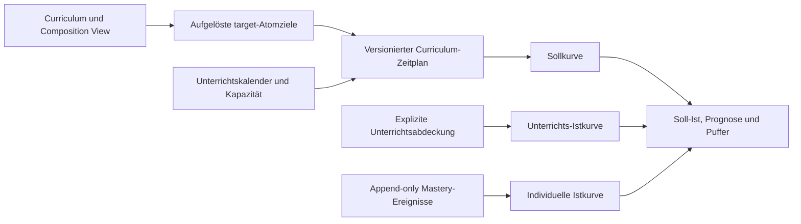

# Curriculum-Zeitachse, Pufferplanung und Soll-Ist-Lerntempo

**Status:** Zielkonzept; lokaler, rein browserbasierter Planungs-Pilot
implementiert. Die backend-autoritative Zielarchitektur ist noch offen.

**Geltungsbereich:** first-party SkillPilot WebGUI und Backend; keine Änderung
am eingefrorenen OpenAI-Coach-V1-Vertrag

## 1. Ziel

SkillPilot soll nicht nur beantworten, **was** gelernt werden soll und **was**
bereits beherrscht wird, sondern auch:

- wann ein fachlicher Abschnitt planmäßig beginnt und endet,
- wie viel reale Unterrichtskapazität in diesem Zeitraum verfügbar ist,
- welcher Puffer bewusst geschützt bleibt,
- welcher Fortschritt bis zu einem Datum erwartet wird,
- welche konkreten Lern- oder Prüfungsziele bis zu einem Meilensteindatum
  abgeschlossen sein sollen,
- wie schnell seit dem individuellen Lernstart tatsächlich neue Lernziele
  erreicht wurden,
- ob Unterrichtsabdeckung und individuelle Lernfortschritte zum Plan passen,
- wie eine Lehrkraft Plan und aktuelle Planlage gegenüber Fachbereichs- oder
  Schulleitung auf einer Seite nachvollziehbar darstellen kann,
- und welche transparente Planänderung bei Abweichungen sinnvoll wäre.

Das primäre Schulszenario ist ein von einer Lehrkraft geplanter Fachkurs. Das
gleiche Modell soll auch für einen persönlichen Lernplan ohne Klasse
funktionieren. Die Leitungsansicht ist dabei eine zugriffsgeschützte,
standardmäßig aggregierte Projektion desselben Kursplans, kein separates
Berichtssystem mit abweichenden Zahlen.

## 2. Kernentscheidung

Aus Nutzersicht liegt ein Cluster wie „Lineare Funktionen“ als Balken mit einem
konkreten Von-bis-Zeitraum auf der Zeitachse. Technisch erhält der kanonische
Cluster jedoch **keine Datumsfelder**.

Die Zeitachse ist eine eigene, versionierte Planungsebene:

- Ziele und Cluster sagen, **was** gelernt wird.
- `programUnits` und `goalPlacements` sagen, **wo** ein Ziel in einem Programm
  liegt.
- Die Composition View sagt, **welchen eindeutigen Baum** ein aufgelöster
  Scope sieht.
- Ein Curriculum-Zeitplan sagt, **wann und mit welcher Kapazität** eine Klasse
  oder Person diesen Stoff bearbeitet.
- Mastery sagt, **was eine Person nach vorliegender Evidenz beherrscht**.

Absolute Daten gehören weder auf kanonische Cluster noch auf `programUnits`,
`goalPlacements` oder Composition Views. Derselbe Cluster kann in verschiedenen
Klassen, Schuljahren, Bundesländern und individuellen Plänen zu anderen Zeiten
liegen.

Der Zeitplan ist damit eine orthogonale Ausführungsplanung zu den vier
Personalisierungsstufen. Er ist weder ein neues Lernziel noch ein Ersatz für
Personal Curriculum, Fokus, Frontier oder Mastery.



## 3. Drei Fortschrittsspuren statt einer vermischten Kennzahl

Lehrkräfte und Lernende brauchen drei getrennte Aussagen:

1. **Planfortschritt:** Was sollte laut Zeitplan bis heute erreicht sein?
2. **Unterrichtsabdeckung:** Was wurde im Kurs tatsächlich behandelt?
3. **Individuelle Mastery:** Welche Ziele beherrscht die lernende Person?

Diese Spuren dürfen nicht voneinander abgeleitet werden:

- „im Unterricht behandelt“ bedeutet nicht „von allen beherrscht“;
- eine hohe durchschnittliche Mastery beweist nicht, dass die Lehrkraft einen
  Planblock durchgeführt hat;
- eine Lehrkraft kann im Plan liegen, während mehrere Lernende fachlich noch
  Unterstützung benötigen;
- eine Person kann durch Vorwissen vor dem Unterrichtsplan liegen.

Gerade diese Trennung macht die Auswertung pädagogisch handlungsfähig.

| Unterrichtsabdeckung | Individuelle Mastery | Mögliche Interpretation |
| --- | --- | --- |
| im Plan | im Plan | Plan und Lernen entwickeln sich passend |
| im Plan | hinter Plan | Diagnose, Vertiefung oder Wiederholung prüfen |
| hinter Plan | im Plan | Vorwissen oder selbstständiges Lernen; nicht automatisch beschleunigen |
| hinter Plan | hinter Plan | Kapazität, Ausfälle, Stoffumfang und Puffer gemeinsam prüfen |

Die Tabelle ist eine Gesprächshilfe, keine automatische pädagogische
Entscheidung.

## 4. Fachliches Domänenmodell

### 4.1 `InstructionalCalendar` — Unterrichtskalender

Der Kalender beschreibt die für genau diesen Kurs oder persönlichen Plan
verfügbare Zeit:

- Schuljahr und IANA-Zeitzone, zum Beispiel `Europe/Berlin`,
- regelmäßige Fachtermine mit ihrer Dauer in Minuten,
- Ferien, Feiertage und fachfreie Wochen,
- Ausfälle, Klassenfahrten, Projekttage und andere Ausschlüsse,
- zusätzliche oder verschobene Unterrichtstermine.

Intern sollten Minuten die gemeinsame Kapazitätseinheit sein. Die UI kann sie
als Schulstunden, Doppelstunden oder Zeitstunden darstellen. So bleiben
45-, 60- und 90-Minuten-Modelle vergleichbar.

Kalenderdaten sind planlokal oder institutionell wiederverwendbar. Sie gehören
nicht in ein Curriculum-Paket, weil Ferien und Stundenpläne von Schuljahr,
Ort, Schule, Klasse und Fach abhängen.

Der Kalender liefert nur die verfügbare Fachkapazität. Ihre Verwendung für
Erarbeitung, Wiederholung, Prüfung, Remediation, Puffer oder noch ungebundene
Zeit gehört ausschließlich in den Zeitplan. Dadurch wird dieselbe Minute nicht
im Kalender abgezogen und anschließend im Plan ein zweites Mal belegt.

### 4.2 `PacingPlan` — Curriculum-Zeitplan

Ein Zeitplan ist ein stabil identifizierter Plan für eine Klasse oder eine
einzelne lernende Person. Er enthält mindestens:

- Eigentümertyp `class` oder `learner`,
- Titel, Fach und Schuljahr,
- den vollständigen Level-2-Fingerprint als Gültigkeitskontext,
- einen ausdrücklichen `planningScope`, zum Beispiel Fach plus Jahrgang,
  Programmeinheit oder Composition-Teilbaum,
- Referenz auf Curriculum, Composition View und Unterrichtskalender,
- `scheduleStartDate` und endgültiges Planende des gemeinsamen Zeitrasters,
- eine unveränderlich versionierte Mastery-Policy, zunächst
  `mastery-threshold-0.9-v1`,
- Status `draft`, `published` oder `retired`,
- eine Folge unveränderlicher Revisionen.

Ein Klassenplan ist die gemeinsame Sollplanung. Eine `PlanAssignment` bindet
eine lernende Person über zeitlich begrenzte Revisionsbindungen an den Plan und
hält deren Lernstart und Baseline fest. Ein persönlicher Plan kann ohne
Klassenplan existieren.

### 4.3 `PlanRevision` — unveränderliche veröffentlichte Fassung

Entwürfe dürfen bearbeitet werden. Eine veröffentlichte Revision wird nicht
überschrieben. Sie speichert:

- Revisionsnummer und `effectiveFrom`,
- Vorgängerrevision und Änderungsgrund,
- Scope- und Projektions-Digest,
- unveränderliche Kalenderrevision und Kalender-Digest,
- die materialisierte Tages- oder Wochenkapazität einschließlich aller
  Ausschlüsse und Overrides,
- die damals aufgelöste Zielmenge,
- die positive Referenzkapazität `referenceWeekMinutes` und den Wochenbeginn,
- Zeitblöcke, Meilensteine, Fixierungen und Puffer,
- eine versionierte Berechnungs- und Anzeige-Policy für Messfenster,
  Mindestbeobachtung und Tacho-Skalierung,
- Ersteller und Erstellungszeitpunkt,
- eine Versionsnummer für optimistisches Locking.

Bei einer Neuplanung bleibt der vergangene Teil der wirksamen Planung erhalten.
Nur der zukünftige Teil wird durch eine neue Revision ersetzt. Historische
Soll-Ist-Berichte können dadurch nicht nachträglich „grün geplant“ werden.
Jede Revision besitzt ein halboffenes Wirksamkeitsintervall. Planlokale
Einheiten bereits gebundener Ziele bleiben über Nachfolgerevisionen konstant;
die neue Sollkurve beginnt mit dem unveränderten Kontinuitätsoffset der alten
Kurve. Ohne neues Mastery- oder Coverage-Ereignis darf ein Revisionswechsel
keinen Sprung in Soll, Ist oder Abweichung erzeugen.

### 4.4 `TimelineBlock` — Zeitblock

Ein Zeitblock ist der sichtbare Balken auf der Zeitachse. Er enthält:

- eine stabile Block-ID und eine verständliche Beschriftung,
- eine explizite Referenz auf einen kanonischen Cluster oder einen stabilen
  Composition-View-Knoten,
- `startDate` und `endDateInclusive` als lokale Kalenderdaten,
- eine Rolle,
- `scheduledGoalIds` als materialisierte Menge aller in diesem Block
  bearbeiteten Ziele,
- `countedTargetGoalIds` als eindeutige Teilmenge, die in diesem Block erstmals
  zum Sollfortschritt zählt,
- getrennte Digests beider Zielmengen,
- explizit zugeteilte Minuten beziehungsweise Unterrichtsslots und ihre
  Verteilung innerhalb des Datumsbereichs,
- bei Meilensteinbindung stabile Kapazitätsscheiben mit ID, Quellslot,
  Minutenanteil und genau einer dadurch vorbereiteten `workItemGoalId`,
- planlokale Planungseinheiten und optionale Ziel-Overrides,
- optionale Fixierungen von Start, Ende oder Meilensteinen,
- den beim Veröffentlichen materialisierten Prognosehorizont `d_b`, abgeleitet
  aus dem frühesten bindenden Pin dieses Blocks oder seinem eigenen Ende.

Empfohlene Rollen für den ersten Vertrag:

- `primary`: erstmalige planmäßige Erarbeitung; zählt zum Sollfortschritt,
- `revisit`: Wiederholung; verbraucht Kapazität, zählt Ziele nicht erneut,
- `assessment`: Prüfung oder Lernstandserhebung; verbraucht Kapazität, stellt
  einen Assessment-Slot bereit und kann mit einem Meilenstein verknüpft sein,
  ist aber selbst weder Meilenstein noch stiller Mastery-Beweis,
- `remediation`: explizite Aufarbeitung von Voraussetzungen oder Lücken,
- `buffer`: geschützte Reserve ohne Lernzielpunkte.

Ein Block darf einen Strukturknoten referenzieren, aber seine planmäßige
Zielmenge wird beim Veröffentlichen deterministisch kompiliert. Historische
Auswertungen expandieren den Verweis nicht gegen einen später veränderten
Live-Baum neu.

Ein Datumsbereich allein reserviert noch keine Kapazität. Für jeden Block muss
deshalb feststehen, welche Minuten oder konkreten Fachslots er belegt. Eine
einfache erste Variante verteilt `allocatedMinutes` proportional auf die im
Blockzeitraum verfügbaren Slots; explizite Slotzuordnungen überschreiben diese
Verteilung. Nur damit sind Sollkurve und Überbuchungsprüfung deterministisch.
Eine Kapazitätsscheibe bleibt Eigentum genau dieses Blocks; Meilensteine
referenzieren sie lediglich und erzeugen keine zweite Zeitbuchung. Verbindet
eine Unterrichtsphase mehrere Ziele, teilt die Planung ihre Minuten
konservativ auf mehrere Scheiben auf. Das ist eine Planungsnäherung, keine
Behauptung über sekundengenaue Unterrichtswirkung.

Die Summe der Arbeitsscheiben darf die Inhaltsminuten des Blocks nicht
überschreiten. Nicht weiter zugeordnete Blockminuten bleiben für den groben
Blockplan sichtbar, dürfen aber keinen Meilenstein-Tachonenner vergrößern.

Ein Pufferblock materialisiert entsprechend `BufferCapacitySlice`s mit ID,
Quellslot und Minutenanteil, aber ohne Lernziel. Eine Prognosereferenz gibt
diesen Puffer noch nicht frei; erst eine neue wirksame Revision darf daraus
Inhaltskapazität machen.

Jede Pufferscheibe besitzt innerhalb einer Revision höchstens einen
`forecastReservationKey`. Dieser reserviert sie exklusiv für genau eine noch
offene Forecast-Verpflichtung — einen Block oder Meilenstein. Mehrere Anzeigen
dürfen dieselbe Reservierung nur dann referenzieren, wenn sie nach Zielmengen-
und Occurrence-Digest exakt denselben fachlichen Arbeitsumfang beschreiben;
die Kapazität wird auch dann kursweit nur einmal gezählt. Ein fachlich
abweichender Block, Meilenstein oder eine zweite Prognose darf dieselbe
Pufferscheibe nicht nochmals als Reserve beanspruchen.

`programUnits` dürfen in der ersten Version Zeilen oder Überschriften der
Zeitachse gruppieren, sind aber kein Blockziel: Eine Programmeinheit besitzt
selbst keine eindeutige atomare Zielmenge. Eine spätere Erweiterung bräuchte
eine eigene, scopegebundene Expansionsregel über `goalPlacements`.

### 4.5 `PlanMilestone` — konkrete Ziele bis zu einem Datum

Zusätzlich zu längeren Clusterblöcken kann ein Plan eine nach Fälligkeit
sortierte Liste konkreter Meilensteine enthalten, zum Beispiel:

> Abituraufgaben Mathematik bis 15. März 2027

Ein Meilenstein enthält:

- stabile ID, verständlichen Titel und `dueDate`,
- die fachliche Art `kind: learning | assessment | exam`,
- die Terminverbindlichkeit `deadlinePolicy: target | hard`,
- `workloadGoalIds`: die konkreten Lernziele, die als fachlich zulässiger
  Vorbereitungsumfang dieses Meilensteins geplant werden können,
- bei einer Clusterreferenz die materialisierte Zielmenge samt Digest,
- genau eine typisierte Erfüllungsregel:
  `allCurrentlyMastered(goalIds)`,
  `atLeastNCurrentlyMastered(goalIds, n)` oder
  `allAssessmentsPassed(assessmentIds)`,
- die fachlichen Referenzen der Erfüllungsregel getrennt vom
  Vorbereitungsumfang,
- konkrete `capacityAllocationIds`, die auf Kapazitätsscheiben mit
  genau einer Ziel-ID und einem Minutenanteil verweisen,
- optional `releasableBufferAllocationIds`, die spätestens am lokalen
  Fälligkeitstag liegen und für genau diese Prognose als freigebbarer Puffer
  ausgewiesen sind,
- sowie gegebenenfalls den vorgesehenen Assessment-Slot.

Die Trennung ist wichtig: Beim Beispiel „Abituraufgaben Mathematik bis
15. März 2027“ können die vorbereitenden Lernziele den allmählichen Fortschritt
und das nötige Tempo bestimmen, während konkrete freigegebene Abituraufgaben
über `AssessmentResultEvent`s den Abschluss des Meilensteins belegen.

Der erste Vertrag beschränkt die zulässigen Kombinationen bewusst:

- `kind: learning` verwendet eine Mastery-basierte Regel; deren Menge
  zulässiger Ziel-IDs ist im ersten Vertrag identisch mit
  `workloadGoalIds`.
- `kind: assessment | exam` verwendet `allAssessmentsPassed`; jede
  Assessment-ID ist versionsgebunden und über eine veröffentlichte
  `assessmentGoalMapping` fachlich mit dem Vorbereitungsumfang verbunden. Der
  Vorbereitungsumfang darf leer sein, dann existiert kein Tempo-Tacho.

Für die erste Zeitplan-Version ist `assessmentId` die stabile kanonische ID des
Exam-/Assessment-Ziels. `assessmentVersion` ist ein Digest seiner freigegebenen
`examData` einschließlich des gebundenen Bewertungsrasters. Der Meilenstein
bindet den akzeptierten Digest oder eine ausdrücklich veröffentlichte
Kompatibilitätsregel; ein Erfolg auf einer fachlich veränderten alten Fassung
erfüllt eine neue Fassung nicht automatisch.

Bei `atLeastNCurrentlyMastered` materialisiert jede `PlanAssignment` vor einer
Tachoanzeige zusätzlich `activeWorkloadGoalIds`. Zuerst werden **alle** aktuell
regelwirksam beherrschten Alternativen berücksichtigt — Baseline wie nach
Lernstart erreichte Ziele, auch wenn sie zuvor nicht ausgewählt waren. Ist ihre
Anzahl bereits mindestens `n`, ist die Regel erfüllt und es gibt keinen offenen
Tachoumfang. Andernfalls ergänzt die Zuordnung genau `n - q` konkrete noch
offene Alternativen, wobei `q` die Zahl dieser aktuell regelwirksamen Erfolge
ist.

Ein relevantes Mastery-Ereignis löst deshalb eine deterministische,
protokollierte Neumaterialisierung aus: bestehende noch offene Auswahlen bleiben
in stabiler Auswahlreihenfolge erhalten, nur überzählige letzte Einträge fallen
weg beziehungsweise fehlende Plätze werden ausdrücklich nachgewählt. So senkt
ein neu gemeistertes, zuvor unselektiertes Alternativziel den offenen Umfang
sofort korrekt. Solange die nötige offene Auswahl nicht feststeht, zeigt die UI
die Alternativengruppe, aber keinen einzelnen scheinpräzisen Zeiger. Eine freie
Änderung der Auswahl ist eine auditierte Assignment-Anpassung; die breitere
Menge fachlich zulässiger Alternativen bleibt unverändert sichtbar.

`target` bezeichnet einen planbaren Zieltermin. `hard` bezeichnet einen
externen oder bewusst fixierten Termin, den weder Toleranz noch automatische
Neuplanung verschieben dürfen. Eine Änderung braucht eine neue Revision, die
passende Capability sowie Akteur und Begründung; bei einem Klassenplan ist das
regelmäßig die autorisierte Lehrkraft, bei einem persönlichen Plan dessen
Eigentümer. Extern vorgegebene Prüfungstermine dürfen nur durch einen ebenfalls
autorisierten Ersatztermin abgelöst werden.

Meilensteine können aus dem veröffentlichten Klassenplan stammen oder
persönlich ergänzt werden. Ein persönlicher Eintrag verändert weder den
Klassenplan noch die Meilensteine anderer Lernender und muss innerhalb des
eigenen Personal Curriculum auflösbar bleiben.

Der Meilenstein selbst verbraucht keine Minuten und erzeugt keine Mastery. Die
zugehörigen `primary`, `revisit`-, `assessment`- oder `remediation`-Blöcke
tragen die Kapazität. Ein fester Meilenstein kann deren Endtermin pinnen und
bildet eine Grenze für Prognose und Neuplanung.

Für die Geschwindigkeitsrechnung zählt nur die bis zum Ende des lokalen
`dueDate` explizit diesem Vorbereitungsumfang zugeteilte Inhaltskapazität.
Eine zugrunde liegende Slotbelegung darf mehreren Meilensteinen als dieselbe
Arbeit dienen, wenn sie
dort über dieselbe Kapazitätsscheibe dieselbe `workItemGoalId` vorbereitet;
dadurch wird im Gesamtplan keine Minute doppelt belegt. Zwei fachlich disjunkte
Meilensteinumfänge dürfen denselben Kapazitätsanteil dagegen nicht jeweils für
sich beanspruchen. Bei nur teilweise
überlappenden Umfängen dürfen allein die Scheiben der tatsächlich gemeinsamen
Ziel-IDs mehrfach referenziert werden. Benötigte Voraussetzungen und
Assessment-Slots müssen ebenfalls spätestens zum Termin liegen.
Für Pufferscheiben gilt dabei revisionsweit die gemeinsame Exklusivitätsregel
aus Abschnitt 4.4. Nach tatsächlicher Freigabe erzeugt die neue Revision die
späteren Prognosen aus der verbleibenden Reserve neu.

Mastery-basierte Regeln beschreiben den aktuellen Zustand: Fällt ein Ziel
später wieder unter die gebundene Schwelle, kann ein zuvor erfüllter
Meilenstein wieder offen werden. Ein akzeptierter Assessment-Erfolg bleibt
dagegen bestehen, solange nach allen append-only Korrekturketten mindestens
ein gültiger bestandener Versuch der gebundenen Version übrig ist; ein späterer
nicht bestandener Versuch löscht ihn nicht stillschweigend.

Der Erfüllungsstatus wird pro `PlanAssignment` ausgewertet. Ein
Klassenmeilenstein ist daher nicht pauschal „für die Klasse erledigt“, nur weil
ein einzelner Lernender ihn erfüllt hat; die Kursabdeckung bleibt weiterhin
eine getrennte Spur.

Die Projektion materialisiert für jede Erfüllungsregel ihre zeitlich geordneten
Gültigkeitsepisoden, also jeden Übergang in und aus „Regel aktuell erfüllt“.
Sie unterscheidet vor Termin `openBeforeDue` und
`currentlyFulfilledBeforeDue`, danach `completedOnTime`, `completedLate`,
`overdueOpen` und `currentlyReopened`. Maßgeblich sind das Ende des lokalen
Fälligkeitstags in Zeitzone und Kalender der Planrevision, der Wahrheitswert
der Regel genau an dieser Grenze sowie die aktuelle Episode:

- Ist die Regel heute erfüllt und war sie am Terminende erfüllt, lautet der
  Status `completedOnTime`.
- Ist sie heute erfüllt, war am Terminende aber offen, lautet er
  `completedLate`; angezeigt wird der Beginn der aktuellen
  Wiedererfüllungsepisode, nicht ein irgendwann früherer Erfolg.
- Ist sie heute offen und gab es noch nie eine gültige Erfüllungsepisode,
  lautet er `overdueOpen`.
- Ist sie heute offen und gab es zuvor mindestens eine gültige
  Erfüllungsepisode, lautet er `currentlyReopened`; die Metadaten
  `fulfilledAtDue` und `reopenedAt` bewahren zusätzlich, ob die Regel am
  Terminende galt und wann die letzte Episode aufging.

Ein erster Erfolg vor dem Termin macht eine spätere Wiedererfüllung also nicht
rückwirkend pünktlich, wenn die Regel am Termin selbst offen war. Ein Verlust
erst nach dem Termin löscht dagegen nicht die historisch korrekte Aussage,
dass der Meilenstein am Termin erfüllt war. Append-only Korrekturketten können
die Episodenprojektion für einen neuen Snapshot nachvollziehbar neu bewerten;
der alte Snapshot bleibt über seinen Watermark stabil.

Aus Planrevision und Meilensteinen kompiliert die Runtime zunächst sortierte
`DatedGoalOccurrenceTemplate`s für die konkrete Zielliste. Jeder Eintrag hat
einen stabilen Occurrence-Schlüssel, eine fachliche Ziel- oder Assessment-ID,
eine Rolle, ein Datum, genau eine Datumsquelle und eine explizite
`dateSemantics`:

- `deadline` gilt nur für einen veröffentlichten Meilenstein, eine ausdrücklich
  geordnete oder terminierte Ziel-Occurrence beziehungsweise einen konkreten
  `assessment`-Slot;
- `contextEnd` ist der reine Anzeigefallback auf das Ende des eigenen
  `primary`-, `revisit`- oder `remediation`-Blocks.

Ein `contextEnd` sagt lediglich „dieses Ziel liegt in diesem Zeitabschnitt“.
Es ist kein eigener Solltermin und darf niemals `overdue`, `completedLate`
oder eine atomare Sollquote auslösen. Die Oberfläche kennzeichnet die
Semantik statt beide Daten gleich aussehen zu lassen.
Dasselbe Ziel darf dadurch etwa als „erarbeiten“, „wiederholen“ und „prüfen“
mehrere sichtbare Termine besitzen; zu den primären Planungseinheiten zählt es
trotzdem nur einmal. Eine Mindestanzahl wird als Gruppe „mindestens n aus m“
mit echten Alternativen angezeigt und nicht in m scheinbar verpflichtende
Einzelziele zerlegt.

Pro Zuordnung projiziert `DatedGoalOccurrenceStatus` keine überlappenden
Einzelwerte, sondern orthogonale Felder:

- `completionState: open | done`,
- `scheduleState: noDeadline | notDue | overdue | completedOnTime |
  completedLate`,
- `readinessState: ready | blocked` samt `blockedReasons`,
- Datenqualität und gegebenenfalls `attemptState: notAttempted | attempted |
  notPassed | passed`.

Für ein kompaktes Hauptlabel gilt deterministisch `done` vor `overdue` vor
`blocked` vor `open`; die anderen Felder bleiben daneben sichtbar. Ein nach
echter Deadline offenes und zugleich fachlich blockiertes Ziel heißt daher
primär „überfällig“ und erklärt zusätzlich seine Blocker. Ein aktuell
beherrschtes Ziel bleibt „erledigt“, auch wenn ein Voraussetzungsmangel separat
sichtbar wird. `contextEnd` erzwingt immer `scheduleState: noDeadline`.

Für primäre Lernziele folgen Completion und Readiness aus aktueller Mastery und
den wirksamen Voraussetzungen. Für Wiederholung oder Remediation ist ein
eigenes `PlanActivityEvent` nötig; bestehende Mastery und bloße Kursabdeckung
beweisen diese persönliche Aktivität nicht. Für Assessments stammen Completion
und Versuchszustand aus den occurrence-gebundenen `AssessmentResultEvent`s.

Freie Checklistenpunkte ohne stabile fachliche Referenz sind als organisatorische
Notizen möglich, zählen aber weder zur Sollkurve noch als erreichtes Lernziel.
„Aufgabe geöffnet“ oder „im Unterricht behandelt“ erfüllt einen fachlichen
Meilenstein nicht automatisch; maßgeblich bleibt seine veröffentlichte
Erfüllungsregel.

### 4.6 `PlanAssignment` — Zuordnung und Lernstart

Die Zuordnung zwischen Planlinie und lernender Person führt eine Folge
wirksamer `AssignmentRevisionBinding`s und hält außerdem fest:

- `assignedAt` und den fachlichen `learningStartedAt`,
- die beim Start bereits beherrschten Ziel-IDs als Baseline,
- den Baseline-Digest und die Baseline-Planungseinheiten,
- den Vergleichsmodus `classSchedule` oder `rebaseAtStart`,
- zuordnungsspezifische aktive Zielauswahlen für Alternativ-Meilensteine,
- optionale, autorisierte individuelle Kalenderanpassungen,
- Status und Ende der Zuordnung.

Der Lernstart ist nicht automatisch Kontoerstellung, erster Login oder erstes
Mastery-Update. Bei späterem Klasseneintritt beginnt die persönliche
Geschwindigkeitsmessung am tatsächlichen Einstieg.

`classSchedule` vergleicht einen späteren Einstieg weiterhin mit dem
veröffentlichten Klassenplan. `rebaseAtStart` verteilt dagegen nur den nach der
Baseline verbleibenden persönlichen Zielumfang ab dem individuellen Lernstart.
Der Modus wird ausdrücklich gewählt und nicht aus Daten erraten.

Im Modus `classSchedule` verändern individuelle Abwesenheiten die persönliche
Restkapazität und Prognose, nicht rückwirkend die gemeinsame Klassen-Sollkurve.
Soll auch die persönliche Sollkurve abweichen, braucht die Zuordnung
`rebaseAtStart` oder eine ausdrücklich veröffentlichte individuelle
Planrevision. Nachteilsausgleich wird damit als autorisierte Planung sichtbar
und nicht als stiller Rechentrick behandelt.

### 4.7 `MasteryEvent` und Achievement-Projektionen

Für Lerngeschwindigkeit reicht der aktuelle Mastery-Datensatz nicht aus. Ein
append-only `MasteryEvent` hält mindestens fest:

- Lernenden-ID und stabile Ziel-ID,
- vorherigen und neuen Mastery-Wert,
- Ereignistyp, Idempotenzschlüssel und gegebenenfalls Vorgängerereignis,
- `occurredAt` und getrennt davon `recordedAt`,
- Quelle, zum Beispiel first-party WebGUI, Import, Verified Recall oder eine
  ausdrücklich versionierte Provider-Integration,
- Import- und Vertrauenskennzeichnung,
- optional die State-Version, die zur Änderung führte.

Die Ereignisse speichern rohe Werte, nicht nur ein Ergebnis für eine gerade
aktive Schwelle. Die an die Planrevision gebundene Mastery-Policy leitet daraus
zwei verschiedene Zeitpunkte ab:

- `firstEverAchievedAt`: erste gültige Überschreitung der gebundenen Schwelle
  in der gesamten Historie;
- `firstQualifyingAtForAssignment`: erste gültige Überschreitung nach
  `learningStartedAt` für ein Ziel, das nicht zur Baseline gehörte.

War ein Ziel früher einmal erreicht, beim Planstart aber wieder offen, wird
eine spätere Überschreitung als `recovered` statt `new` klassifiziert. Sie kann
für diese Zuordnung einmal zum erreichten Planumfang zählen, wird aber in der
Anzeige getrennt ausgewiesen. Eine weitere Herabstufung und erneute
Überschreitung zählt nicht noch einmal. Der aktuelle Beherrschungsstand bleibt
daneben separat sichtbar.

Die erste Policy ist unveränderlich `mastery-threshold-0.9-v1`. Eine spätere
Schwellenänderung braucht eine neue Policy und Planrevision; dieselben rohen
Ereignisse werden nicht umgeschrieben, und historische Berichte verwenden
weiter ihre damals gebundene Policy.

Eine fachliche Herabstufung nach neuer Evidenz (`LOSS_REASSESSMENT`) lässt die
frühere Erreichung als historische Tatsache bestehen. Eine Datenkorrektur
(`DATA_CORRECTION_VOID`) erklärt dagegen einen fehlerhaften früheren Eintrag
append-only für ungültig und entfernt ihn aus den abgeleiteten
Achievement-Kurven. Alle künftig für Planungsmetriken zugelassenen Writer
müssen denselben zentralen, transaktionalen Mutation-/Eventpfad mit normierter
Quelle und Idempotenz verwenden, **sobald der jeweilige Writer für diese neue
Planungsfunktion ausdrücklich freigegeben ist**. Ein Quellenwert `coach` ist
nur Provenienz und keine Implementierungsfreigabe. Der eingefrorene
OpenAI-Coach V1 bleibt von dieser Migration ausgeschlossen; seine bestehenden
Writes werden weder still umgebaut noch rückwirkend als
`AssessmentResultEvent` umgedeutet. Solange keine autorisierte neue
Vertragsversion existiert, gelten daraus stammende Zeitpunkte für den Tacho nur
als entsprechend gekennzeichnete Legacy-Daten oder die belastbare
Geschwindigkeitsanzeige bleibt für diesen Datenanteil aus.

Importiertes Vorwissen ohne belastbaren Originalzeitpunkt wird als Baseline
behandelt und erzeugt keinen künstlichen Geschwindigkeitspeak am Importtag.
Erfolgt der Import erst nach Lernstart, bleibt die ursprüngliche Baseline
unverändert; ein auditiertes `BaselineAdjustment` erhöht aktuellen Iststand und
verkleinert Restarbeit, ohne rückwirkend die seit-Start-Geschwindigkeit zu
erhöhen.

### 4.8 `CoverageEvent` — tatsächliche Unterrichtsabdeckung

Die Lehrkraft bestätigt separat, wann ein Block oder konkrete Ziele im Kurs
tatsächlich behandelt wurden. Das Ereignis referenziert zwingend die
Planrevision, `timelineBlockId` und den stabilen Occurrence-Schlüssel. Die Rolle
wird aus dieser gebundenen Block-Occurrence übernommen und serverseitig gegen
die Revision geprüft, nicht als freie Client-Angabe vertraut. Innerhalb dieser
Occurrence referenziert das Ereignis entweder:

- explizite Ziel-IDs,
- oder den vollständigen, bereits kompilierten Zielumfang eines Blocks.

Es enthält mindestens Ereignis-ID, Idempotenzschlüssel, `coveredAt`, das davon
getrennte `recordedAt`, Quelle und bei einer Korrektur `supersedes`. Eine
zielbezogene Projektion zählt jedes
primäre Ziel aus einer `primary`-Occurrence höchstens einmal als aktuell
behandelt. `revisit`-, `remediation`- oder `assessment`-Coverage dokumentiert
die Durchführung genau dieser Kursaktivität, erhöht aber niemals die primäre
`D(t)`-Kurve. Umgekehrt erledigt eine frühere `primary`-Bestätigung keine
spätere Wiederholungs-Occurrence. Dadurch erzeugen Retry,
Blockbestätigung plus Einzelbestätigung oder spätere Korrektur keine doppelte
Unterrichtsabdeckung. Diese Information ist Kursabdeckung, keine
Mastery-Evidenz für einzelne Lernende.

Ein fehlendes `CoverageEvent` beweist für sich allein nicht, dass ein Ziel
nicht unterrichtet wurde. Für Prognosen gibt es deshalb zusätzlich eine
append-only `CoverageLedgerAttestation`: Kurs, Planrevision,
`completeThroughSlotId`, `attestedAt`, `recordedAt`, autorisierte Lehrkraft,
Idempotenzschlüssel und gegebenenfalls `supersedes`. Sie bestätigt nur, dass
alle bis zu diesem vollständig vergangenen Slot bekannten Coverage-Angaben
eingetragen oder ausdrücklich korrigiert sind. Ohne eine zum Snapshot passende
Attestierung ist `D_b` lediglich die bestätigte Untergrenze; eine
Coverage-Prognose oder Ampelfarbe bleibt `unavailable`.

Der Writer akzeptiert keine frei behauptete Zukunftsgrenze: Der referenzierte
Slot muss zur gebundenen Plan- und Kalenderrevision gehören und sein lokales
Ende muss bei dem serverseitig bestätigten `attestedAt` bereits vergangen sein.
Den Coverage-Stream-Watermark übernimmt der Server aus einer tatsächlich
existierenden, für den Writer zu diesem Zeitpunkt sichtbaren Streamposition;
ein Client kann ihn weder erfinden noch in die Zukunft setzen. Diese Prüfungen
sind harte Write-Invarianten, nicht nur UI-Hinweise.

„Zum Snapshot passend“ bedeutet: Die Attestierung deckt mindestens den letzten
für den Berichts-Cutoff vollständig vergangenen relevanten Fachslot ab und
bindet den Coverage-Stream-Watermark, bis zu dem die bestätigten und
korrigierten Ereignisse geprüft wurden. Neue Coverage-Ereignisse oder
Korrekturen nach diesem Watermark verlangen für eine wieder vollständige
Prognose eine neue Attestierung; ältere Snapshots bleiben unverändert.

### 4.9 `AssessmentResultEvent` — belastbarer Prüfungsnachweis

Eine Erfüllungsregel wie `allAssessmentsPassed` benötigt eine eigene
append-only Evidenzspur. Ein `AssessmentResultEvent` enthält mindestens:

- Ereignis-, Lernenden-, Assessment- und Versuchs-ID,
- bei jedem geplanten Versuch zwingend `assignmentId`, den gebundenen
  `assessmentOccurrenceKey` und `assessmentSlotId`; bei einem ausdrücklich
  ungeplanten Versuch keine Occurrence-Bindung und höchstens optionalen
  Kontext,
- Ergebnis `passed` beziehungsweise `notPassed` und optional die fachlich
  zulässige Rohbewertung,
- `occurredAt` und getrennt `recordedAt`,
- Quelle, Idempotenzschlüssel und die gebundene Assessment-Version,
- bei Korrektur oder Widerruf den ersetzten Nachweis und eine Begründung.

Der Writer prüft Occurrence und Slot gegen Assignment, Planrevision,
Assessment-ID und -Version. Ein ausdrücklich ungeplanter Versuch trägt keine
Occurrence-Bindung und darf keinen geplanten Slot still erledigen. Der Status
einer konkreten Assessment-Occurrence berücksichtigt ausschließlich ihre
gebundenen Versuche. Die übergreifende `passed`-Projektion für eine fachliche
Erfüllungsregel kann dagegen alle nach deren Vertrag kompatiblen Versuche
derselben gebundenen Assessment-Version berücksichtigen. Sie ist erfüllt,
sobald mindestens ein gültiger bestandener Versuch vorliegt, bleibt über
spätere nicht bestandene Versuche erhalten und wird erst wieder geöffnet, wenn
nach ausdrücklichen Korrekturen oder Widerrufen kein gültiger bestandener
Versuch der gebundenen Assessment-Version mehr übrig ist. Ein
Assessment-Ergebnis
verändert Mastery nicht automatisch; eine solche fachliche Wirkung bräuchte
einen eigenen, bereits autorisierten Bewertungsworkflow.

### 4.10 `PlanActivityEvent` — bestätigte Wiederholung oder Remediation

Eine geplante Wiederholung oder Aufarbeitung ist weder aus bestehender Mastery
noch aus einem Klassen-`CoverageEvent` ableitbar. Ein persönliches append-only
`PlanActivityEvent` hält deshalb mindestens fest:

- Lernenden-, Assignment- und Occurrence-Schlüssel,
- Aktivitätsart `revisit` oder `remediation`,
- `occurredAt`, `recordedAt`, Quelle und Idempotenzschlüssel,
- bei Korrektur das ersetzte Ereignis und eine Begründung.

Das Ereignis bestätigt nur die betreffende Planaktivität. Es verändert weder
Mastery noch Assessment-Ergebnisse und zählt keine primären Planungseinheiten
ein zweites Mal.

## 5. Auflösung von Clustern in planbare Arbeit

### 5.1 Bindung an den aufgelösten Scope

Ein Plan wird nicht gegen die ungefilterte Landschaft erstellt, sondern gegen
einen vollständig aufgelösten Scope mit:

- Root Curriculum,
- Jurisdiktion oder kanonischer Ansicht,
- Schulform, Stufe und G8/G9-Modell,
- Fach und Kursprofil,
- Composition View,
- Curriculum-Release beziehungsweise Projektions-Digest.

Dieser vollständige Level-2-Scope ist der Gültigkeitskontext. Der
`planningScope` grenzt darin den konkreten Planhorizont ein, etwa auf
Mathematik in Jahrgang 8. Andere Fächer, Jahre oder Stufen des Personal
Curriculum werden dadurch nicht entfernt; sie liegen ausdrücklich außerhalb
dieses Plans.

Für `primary`-Blöcke werden aus einem referenzierten Cluster oder
Strukturknoten nur sichtbare `target`-Atomziele als
`countedTargetGoalIds` übernommen. Ein `remediation`-Block darf daneben
explizite `prerequisiteOnly`-Ziele in `scheduledGoalIds` terminieren. Diese
verbrauchen Kapazität und können die Frontier weiter blockieren, zählen aber
nicht als zusätzlicher Zielumfang des Plans.

Jede Revision deklariert außerdem ihre `planTargetGoalIds`: den Teil des
Level-2-Zielraums, über den der konkrete Planhorizont Rechenschaft ablegt. Für
jedes sichtbare Level-2-Ziel wird ausdrücklich festgehalten, ob es in diesem
Horizont liegt oder mit Grund und Folgeplanung außerhalb liegt. Ein fehlender
Eintrag ist kein gültiger „später“-Status.

### 5.2 Eindeutige primäre Zuordnung

Weil kanonische Ziele in einer Polyhierarchie unter mehreren Clustern liegen
können, gilt pro veröffentlichter Planrevision:

- jedes `planTargetGoalId` innerhalb des Horizonts hat genau einen
  `primary`-Block;
- überlappende Blockreferenzen werden beim Kompilieren erkannt;
- `revisit`, `assessment` und `remediation` dürfen Ziele erneut referenzieren,
  erzeugen aber keine zusätzlichen Fortschrittspunkte;
- jedes Ziel außerhalb des Planhorizonts erhält eine explizite Disposition wie
  `deferred` mit Folgeplan oder `outsideHorizon` mit fachlicher Begründung.

### 5.3 Voraussetzungskanten bleiben maßgeblich

Der Zeitplan priorisiert innerhalb fachlich gültiger Möglichkeiten. Er darf
nie:

- ein datiertes, aber gesperrtes Ziel in die Frontier heben,
- `requires` umgehen oder umschreiben,
- Mastery aus einem erreichten Datum ableiten,
- den Level-3-Fokus oder das aktive Ziel ohne die dafür geltenden Regeln
  verändern.

Die klassenweite Planvalidierung prüft statisch, ob Voraussetzung und
abhängiges Ziel zeitlich plausibel angeordnet sind. Sie kennt keine
individuelle Mastery und behauptet daher nicht, eine Voraussetzung sei bereits
beherrscht. Überlappende Zeitblöcke können nach expliziter Prüfung zulässig
sein, wenn ihre interne Reihenfolge die Voraussetzung rechtzeitig behandelt.

Erst die `PlanAssignment` vergleicht diese Ordnung mit der aktuellen
individuellen Mastery. Offene Voraussetzungen werden dort als persönliche
Blocker beziehungsweise mögliche `remediation` ausgewiesen; sie machen die
veröffentlichte Klassenrevision nicht rückwirkend ungültig.

## 6. Planungseinheiten statt Zweckentfremdung von `weight`

Die bestehenden Zielgewichte drücken Anteil an Fortschritt und späterer
Bewertung aus. Sie sind keine Zeit- oder Aufwandsschätzung und dürfen dafür
nicht umgedeutet werden.

Für die erste Version gilt transparent:

- jedes geeignete `target`-Atomziel erhält planlokal eine Planungseinheit;
- Cluster zählen nie direkt, sondern über ihre eindeutigen Atomziele;
- eine Lehrkraft kann planlokal abweichende Einheiten für erkennbar
  unterschiedlich große Ziele vergeben;
- spätere Kalibrierung darf historische Planrevisionen nicht verändern.

Standardmäßig zählen normale fachliche Atomziele. Orientierungsknoten zählen
nicht als fachliche Mastery. Memorier-, Übungs- und Prüfungsknoten werden nur
mit einer expliziten Planrolle berücksichtigt, damit ihre besonderen
Abschlusssemantiken keine Lernfortschrittsspitzen erzeugen.

Die UI muss bei der Ein-Punkt-Näherung klar sagen, dass „Ziele pro Woche“ eine
grobe, vom Zuschnitt der Ziele abhängige Größe ist.

Im lokalen Direkt-ID-Piloten wird der Planungsraum gegen einen unveränderlichen
Schnappschuss aller projizierten `target`-Atomziele des vollständigen
personalisierten Fachumfangs (Level 2) gebildet; Cluster zählen nie. Der
veränderliche Cockpit-Fokus (Level 3) schränkt diesen Auswahlraum nicht ein.
Für einen konkreten Lernabschnitt zählen jedoch nur die Atomziele unter dem
tatsächlich ausgewählten Ziel oder Cluster. Dessen Kursplan-Todo ist
ausschließlich die beim Schnappschuss noch offene Teilmenge mit Mastery unter
`0.9`. Ein ausgewählter Sek-I-Abschnitt mit 259 Atomzielen und 206 gemeisterten
Zielen umfasst daher 53 planbare Ziele – auch wenn der personalisierte
Fachumfang zusätzlich Sek-II-Ziele enthält. Erst ein eigener Sek-II-Abschnitt
nimmt diese Ziele in den konkreten Plan auf. Spätere Lernfortschritte ändern
diese Planbasis nicht rückwirkend. Ausgegebene Soll-Zielzahlen werden auf ganze
Ziele gerundet; Raten wie das Wochenkontingent werden höchstens mit einer
Nachkommastelle dargestellt.

## 7. Kapazität, Unterrichtswochen und Puffer

### 7.1 Keine rohe Kalenderwochenrechnung

Eine Ferienwoche hat für ein Fach Kapazität null. Eine Woche mit einer
ausgefallenen Doppelstunde hat weniger Kapazität als eine normale Woche.
Darum basiert die Sollkurve auf verfügbarer Fachkapazität, nicht auf der Zahl
vergangener Montagswochen.

Für Woche `w`:

```text
Bruttokapazität(w)
  = reguläre und zusätzliche Fachminuten

VerfügbareKapazität(w)
  = Bruttokapazität(w)
  - Ausschlüsse(w)

VerfügbareKapazität(w)
  = primary(w)
  + revisit(w)
  + assessment(w)
  + remediation(w)
  + buffer(w)
  + unallocated(w)
```

Diese Gleichung ist eine Planinvariante: Kalenderausschlüsse werden genau
einmal berechnet, anschließend wird jede verbleibende Minute höchstens einer
Planrolle zugeteilt. `buffer` ist die geschützte Reserve; `unallocated` ist
noch ungeplante, aber nicht als Puffer zugesagte Zeit.

Die UI zeigt zwei verschiedene Wochenkontingente:

- **Kapazitätskontingent:** Fachstunden oder Minuten dieser Woche,
- **Sollfortschritt:** geplante Atomziele beziehungsweise Planungseinheiten in
  dieser effektiven Unterrichtswoche.

Eine effektive Unterrichtswoche kann als Kapazitätsanteil normalisiert werden.
Da `referenceWeekMinutes` je Revision wechseln darf, ist die normative
Intervallfunktion revisionsstückweise. Für die halboffenen wirksamen
Revisionsintervalle `I_k` gilt kennzahlspezifisch:

```text
W_X(a, b)
  = Summe über alle k:
      messbareMinuten_X((a, b) geschnitten mit I_k)
      / referenceWeekMinutes_k
```

Eine halbe Unterrichtswoche zählt damit als `0.5`; eine fachfreie Woche zählt
als `0` und senkt die ausgewiesene Lerngeschwindigkeit nicht.

`referenceWeekMinutes` ist pro Planrevision positiv und unveränderlich. So
bleibt die Anzeige auch bei Stundenplan- oder Halbjahreswechsel reproduzierbar.
Intern rechnet SkillPilot vollständig in Minuten; „effektive Wochen“ ist nur
eine verständliche Darstellung. Zeitzone und Wochenbeginn stammen aus der
Planrevision, nie aus dem zufälligen Browserstandort.

`X` bezeichnet den fachlichen Nenner der jeweiligen Kennzahl, zum Beispiel
alle primären Inhalte, einen Meilensteinumfang oder einen Block. Nur wenn die
gesamte betrachtete Kapazität innerhalb einer einzigen Revision liegt, darf
die vereinfachte Division durch deren einen `referenceWeekMinutes` verwendet
werden. Historische und gleitende Fenster über Revisionsgrenzen verwenden
immer `W_X`; ein Referenzwechsel allein darf keine Rate springen lassen.

„Messbar“ ist jeweils die Kapazität, in der für die betrachtete Kennzahl
Planfortschritt erwartet wird. Noch geschützter Puffer, Prüfungszeit und
Organisationszeit gehören nicht in den Geschwindigkeitsnenner. Wird Puffer
ausdrücklich für Inhalte freigegeben, zählt diese Kapazität ab der wirksamen
Planrevision dazu.

### 7.2 Sichtbarer Puffer

Puffer ist reservierte Kapazität und kein unsichtbares Strecken von
Themenblöcken. Sinnvoll kombinierbar sind:

- verteilter Mikro-Puffer für Ausfälle und Vertiefung,
- Abschluss-Puffer vor Klausur, Zeugnis oder Schuljahresende,
- getrennte Reserve für Diagnose und Wiederholung.

Der Plan weist aus:

- gesamte verfügbare Fachkapazität,
- für Inhalte gebundene Kapazität,
- geschützte Reserve,
- bereits explizit verbrauchten Puffer,
- verbleibenden Puffer in Minuten und effektiven Wochen.

Eine UI darf einen Startwert vorschlagen, aber keine Pufferquote als allgemein
gültige pädagogische Norm festschreiben. Null Puffer ist zulässig, muss aber als
bewusste, fragile Planung sichtbar sein.

## 8. Sollkurve und Wochenquote

Für einen primären Block `b` seien:

- `P_b` die Summe seiner Planungseinheiten,
- `C_b(t)` die bis Zeitpunkt `t` nutzbare Inhaltskapazität des Blocks,
- `C_b` die gesamte nutzbare Inhaltskapazität des Blocks.

Dann ist der erwartete kumulative Blockfortschritt:

```text
S_b(t) = P_b * clamp(C_b(t) / C_b, 0, 1)
```

Die gesamte Sollkurve ist die Summe aller wirksamen primären Blöcke. Die
Wochenquote ist die Differenz der Sollkurve zwischen Wochenanfang und
Wochenende. Ferien, Ausfälle und explizite Pufferblöcke reduzieren sie
automatisch.

Die lineare Verteilung innerhalb eines Blocks ist zunächst eine
Planungsnäherung. Später können Lehrkräfte explizite Zwischenmeilensteine oder
eine Reihenfolge für Zielgruppen hinterlegen. Ohne solche Daten darf die
Runtime keine verborgene Reihenfolge erfinden.

Ein Block mit positiver Zielmenge und null Inhaltskapazität ist ungültig.
Parallelblöcke sind nur zulässig, wenn ihre gemeinsame Kapazitätsbelegung nicht
überbucht ist.

## 9. Individuelle Istkurve und Lerngeschwindigkeit

### 9.1 Baseline und neu erreichte Ziele

Seien:

- `G` die eindeutigen gezählten Atomziele des Plans,
- `G_0` die beim persönlichen Lernstart bereits beherrschten Ziele,
- `p_g` die planlokalen Einheiten eines Ziels,
- `a_g` der Zeitpunkt seines ersten für diese Zuordnung qualifizierenden
  Abschlusses nach Lernstart, klassifiziert als `new` oder `recovered`.

Dann gilt:

```text
B = Summe p_g für g in G_0

A_qualifiziert(t)
  = Summe p_g für g in (G ohne G_0), deren a_g <= t

A(t)
  = B + A_qualifiziert(t)

Q(t)
  = Summe p_g für aktuell weiterhin beherrschte g in G
```

Die Baseline verkleinert die verbleibende Arbeit, erhöht aber nicht die seit
Lernstart ausgewiesene Geschwindigkeit.

Für den Vergleich wird außerdem eine zuordnungsspezifische Sollkurve
`S_zuordnung(t)` festgelegt:

- bei `classSchedule` ist sie die unveränderte veröffentlichte Klassenkurve;
- bei `rebaseAtStart` beginnt sie bei `B` und verteilt nur die verbleibenden
  Einheiten ab `learningStartedAt` über die persönliche Restkapazität.

Damit wird ein später Einstieg entweder bewusst gegen den laufenden
Klassenstand oder gegen einen neu gestarteten persönlichen Plan gemessen.

Zusätzlich wird der aktuelle Beherrschungsstand berechnet. Fällt ein früher
erreichtes Ziel später unter die Schwelle, bleibt das historische Achievement
erhalten, während die aktuelle Lücke sichtbar wird. Historischer Durchsatz und
heutige Bereitschaft sind zwei verschiedene Aussagen.

Die für eine Prognose noch offene Arbeit ist deshalb
`P_gesamt - Q(t)`, nicht `P_gesamt - A(t)`. Eine spätere Herabstufung erzeugt
kein zweites „neu erreichtes“ Ziel, macht aber den heute wieder offenen
Planumfang sichtbar.

### 9.2 Seit-Start- und jüngere Geschwindigkeit

Der Wunsch „seit Lernstart“ wird als stabile Hauptkennzahl erfüllt:

```text
v_ist_seit_start
  = A_qualifiziert(heute)
    / W_zuordnung(learningStartedAt, heute)
```

Für Prognosen ist zusätzlich ein geglättetes jüngeres Fenster nötig:

```text
v_ist_juengst
  = qualifizierende Abschluss-Einheiten im Fenster
    / W_zuordnung(Fensteranfang, Fensterende)
```

Die Anzeige weist davon `new` und `recovered` getrennt aus. Beide vermindern
den offenen Planumfang; nur `new` bezeichnet ein erstmals in der bekannten
Historie erreichtes Ziel.

Das Fenster wird in abgeschlossenen effektiven Unterrichtswochen definiert,
nicht als starre Zahl von Kalendertagen. Die Oberfläche zeigt bei zu wenig
Historie „noch keine belastbare Prognose“ statt eines instabilen Ampelurteils.

### 9.3 Soll-Ist-Abweichung und erforderliche Geschwindigkeit

```text
AktuellePlanabweichung(t) = Q(t) - S_zuordnung(t)

v_soll_bisher
  = (S_zuordnung(t) - S_zuordnung(learningStartedAt))
    / W_zuordnung(learningStartedAt, t)

v_erforderlich_ohne_puffer
  = (P_gesamt - Q(t))
    / W_zuordnung_reg(t, Planende)

v_erforderlich_mit_puffer
  = (P_gesamt - Q(t))
    / W_zuordnung_mit_puffer(t, Planende)
```

Ein Quotient allein ist schwer verständlich. Als Hauptsignal soll SkillPilot
deshalb die prognostizierte Fertigstellung gegen Inhaltsende und endgültiges
Planende zeigen:

- **im Plan:** Prognose vor Inhaltsende; Puffer bleibt geschützt,
- **Puffer nötig:** Ziel erreichbar, aber nur mit reservierter Kapazität,
- **Termin gefährdet:** Prognose liegt hinter dem endgültigen Planende,
- **noch keine Aussage:** Historie oder zukünftige Kapazität reicht nicht.

Die neutrale Toleranz sollte standardmäßig ungefähr einer regulären
Fachunterrichtswoche entsprechen und im Plan konfigurierbar sein. Die exakte
Abweichung in Einheiten und effektiven Wochen bleibt immer sichtbar.

`A(t)` beziehungsweise seine Aufteilung in `new` und `recovered` dient nur der
historischen Durchsatz- und Geschwindigkeitsanalyse. Aktueller Planstatus,
offene Arbeit und Terminprognose beruhen auf `Q(t)`. Dadurch bleibt ein später
wieder offenes Ziel nicht fälschlich dauerhaft „grün“.

### 9.4 Cockpit-Tacho

Eine kompakte Geschwindigkeitsanzeige ist als Cockpit-Schnellansicht sinnvoll,
wenn sie Tempo und Terminrisiko nicht verwechselt. Sie gehört immer zu einem
klar benannten Plan- oder Meilensteinumfang; ein fachübergreifender
„Gesamttacho“ wäre fachlich nicht interpretierbar.

Der nächste bindende Meilenstein wird deterministisch bestimmt:

1. zuerst offene, bereits überfällige Meilensteine, nach Fälligkeit sortiert;
2. sonst der früheste offene zukünftige Meilenstein;
3. bei gleichem Datum `hard` vor `target`, danach stabile Meilenstein-ID.

Erfüllte Meilensteine werden übersprungen. Fehlt ein offener Meilenstein, dient
der nächste offene primäre Blockabschluss als ausdrücklich gekennzeichneter
Fallback: frühestes `endDateInclusive`, bei Gleichstand stabile Block-ID.
Existiert auch dieser nicht, folgt das endgültige Planende. Die Runtime erzeugt
dafür
ein synthetisches `PacingTarget` mit derselben Rechenschnittstelle: Beim
Blockfallback werden `activeWorkloadGoalIds` aus dessen
`countedTargetGoalIds`, `dueDate` aus `endDateInclusive` und
`capacityAllocationIds` aus dessen passenden Arbeitsscheiben gebildet;
`releasableBufferAllocationIds` bleibt ohne ausdrückliche Blockbindung leer.
Beim letzten Planfallback sind es die noch offenen Plan-Ziel-IDs, das endgültige
Planende, deren verbleibende Arbeitsscheiben und die bis dahin noch ungebundene
Reserve. Anschließend gelten dieselben Formeln wie für einen Meilenstein. Bei
spätem Klasseneintritt bleibt ein überfälliger
Klassenmeilenstein im Modus `classSchedule` sichtbar und wird als
Aufholsituation behandelt. `rebaseAtStart` oder ein persönlicher Plan darf ihn
nur durch eine neu veröffentlichte, nachvollziehbare Zuordnung ersetzen.

Für den gewählten Meilenstein `m` seien:

- `G_m` dessen für diese Zuordnung materialisierte `activeWorkloadGoalIds`;
  ohne Alternativregel entspricht dies dem gebundenen Vorbereitungsumfang,
- `G_m_open(t)` die Teilmenge daraus, die nach der aktuell gebundenen
  Mastery-Policy noch nicht erfüllt ist,
- `P_m` die Summe der planlokalen Einheiten in `G_m`,
- `Q_m(t)` die Einheiten der aktuell gemäß gebundener Mastery-Policy erfüllten
  Ziele aus `G_m`,
- `C_m_rest(t, dueDate)` ausschließlich die noch bevorstehende
  Inhaltskapazität der verknüpften Kapazitätsscheiben, deren
  `workItemGoalId` in `G_m_open(t)` liegt und die bis zur Fälligkeit verfügbar
  sind,
- `C_m_buffer_rest(t, dueDate)` ausschließlich die bis zum Ende des lokalen
  Fälligkeitstags liegenden, für `m` ausdrücklich freigebbaren Pufferscheiben.

Dann gilt:

```text
R_m(t) = P_m - Q_m(t)

W_m_rest(t)
  = Summe über k:
      C_m_rest(t, dueDate, geschnitten mit I_k)
      / referenceWeekMinutes_k

W_m_mit_puffer(t)
  = Summe über k:
      (C_m_rest(t, dueDate, geschnitten mit I_k)
       + C_m_buffer_rest(t, dueDate, geschnitten mit I_k))
      / referenceWeekMinutes_k

v_soll_m_ohne_puffer(t)
  = R_m(t) / W_m_rest(t)

v_soll_m_mit_puffer(t)
  = R_m(t) / W_m_mit_puffer(t)

v_ist_m
  = qualifizierende Abschluss-Einheiten aus G_m im Beobachtungsfenster
    / W_G_m(Fensteranfang, Fensterende)
```

Minuten paralleler Fächer, späterer Blöcke oder anderer Meilensteinumfänge
gehen nicht in `W_m_rest` ein. Ein gemeinsam vorbereitetes identisches Ziel
darf dieselbe reale Slotbelegung für beide Meilensteinprognosen referenzieren;
sie wird deshalb im zugrunde liegenden Plan trotzdem nur einmal belegt. Ein
Assessment- oder Prüfungsmeilenstein ohne positiven `workloadGoalIds`-Umfang
hat einen Termin- und Erfüllungsstatus, aber keinen erfundenen Tempozeiger.

Empfohlene Darstellung:

- großer Zeiger: geglättete meilensteinbezogene Istgeschwindigkeit `v_ist_m`;
- kleiner Punkt oder dünner zweiter Zeiger: Wert der letzten vollständig
  abgeschlossenen lokalen Woche mit positiver `G_m`-Kapazität;
- klarer Sollstrich: `v_soll_m_ohne_puffer`, also das aktuell nötige Tempo bis
  zur Fälligkeit ohne Zugriff auf geschützten Puffer;
- Zahlenzeile: Ist, Soll und Einheit, zum Beispiel
  „2,1 / 2,5 Zieläquivalente je effektiver Woche“;
- Textstatus mit Prognosedatum und verbleibendem Puffer.

Der letzte Wochenwert wird nur aus der letzten abgeschlossenen lokalen Woche
mit positiver, `G_m` zugeteilter Inhaltskapazität berechnet. Eine laufende
Teilwoche, Ferienwoche oder reine Prüfungs-/Pufferwoche erzeugt keinen
scheinbaren Tempoeinbruch. Für den großen Zeiger läuft das Fenster über
abgeschlossene lokale Wochen rückwärts, bis standardmäßig vier effektive
Wochenäquivalente ausschließlich aus `G_m`-Kapazität erreicht sind. Die
Fensterlänge ist Teil der versionierten Anzeige-Policy. Die empfohlene erste
Policy verlangt diese vier Äquivalente zugleich als Mindestbeobachtung für ein
farbiges Geschwindigkeitsurteil. Vorher können Momentanwert und Rohdaten
sichtbar sein, der Tacho bleibt jedoch grau und ausdrücklich „vorläufig“.
Dadurch bleibt der von der letzten Woche gewünschte schnelle Hinweis erhalten,
ohne eine Einzelwoche zum roten Urteil zu machen.

Für eine fachunabhängig verständliche Skala kann der Tacho normalisieren:

```text
Tempoindex_m = 100 * v_ist_m / v_soll_m_ohne_puffer
```

Der Sollstrich liegt dann bei `100`; die Rohwerte bleiben daneben sichtbar.
Existiert keine reguläre Restkapazität, aber noch freigebbarer Puffer, wird
dieser Standardindex nicht berechnet; die UI zeigt stattdessen den ausdrücklich
beschrifteten absoluten Sollwert `v_soll_m_mit_puffer`.
Die versionierte Anzeige-Policy legt eine positive Untergrenze für einen
darstellbaren Sollwert und eine Obergrenze für die Skala fest, empfohlen
zunächst `maxTempoIndex = 200`. Werte darüber erscheinen als `> 200`, während
der unveränderte Rohwert für Diagnose und Tests erhalten bleibt. Liegt ein
positiver Sollwert unter der festgelegten Untergrenze, zeigt die UI die
absoluten Raten und „Soll nahezu null“ statt eines instabilen Quotienten.

Für Nullfälle gelten unterschiedliche Zustände:

- `R_m = 0`: Vorbereitungsumfang erreicht; ob der Meilenstein selbst erfüllt
  ist, entscheidet weiterhin ausschließlich seine getrennte Erfüllungsregel;
- `R_m > 0`, `W_m_rest = 0` und `W_m_mit_puffer > 0`: nur noch mit
  freigegebenem Puffer erreichbar; als Sollwert wird dann ausdrücklich
  `v_soll_m_mit_puffer` beschriftet;
- `R_m > 0` und `W_m_mit_puffer = 0`: mit dem veröffentlichten Plan nicht mehr
  erreichbar, nicht „aktuell kein Sollfortschritt“;
- keine zugeteilte Inhaltskapazität im Beobachtungsfenster: keine belastbare
  Istgeschwindigkeit;
- keine verwertbare Historie: Rohstatus und Termin bleiben sichtbar, aber kein
  scheinpräziser Zeiger.

Ist- und Sollwert verwenden damit immer dieselbe Zielmenge `G_m`. Erfolge in
anderen Fächern oder späteren Blöcken bleiben in ihren Ansichten sichtbar,
dürfen diesen Tacho aber nicht künstlich beschleunigen.

Die Farbzonen werden aus Termin- und Pufferprognose berechnet, nicht aus
willkürlichen Prozentgrenzen:

| Zone | Bedeutung |
| --- | --- |
| Grün | bei belastbaren Daten `v_ist_m >= v_soll_m_ohne_puffer`; Termin erreichbar und Puffer bleibt geschützt |
| Gelb | bei belastbaren Daten `v_soll_m_mit_puffer <= v_ist_m < v_soll_m_ohne_puffer`; Termin nur mit Puffer erreichbar |
| Rot | Termin bereits offen überschritten, selbst mit Puffer strukturell unerreichbar oder bei belastbaren Daten `v_ist_m < v_soll_m_mit_puffer` |
| Grau | kein positiver Tempo-Sollwert, Ziel bereits erreicht oder noch zu wenig belastbare Geschwindigkeitsdaten |

Die Zustandspriorität ist eindeutig: `overdueOpen` oder ein nach Fälligkeit
`currentlyReopened` ist immer Rot; strukturelle Unerreichbarkeit trotz Puffer
folgt danach. Erst bei einem noch zukünftigen, strukturell erreichbaren Termin
entscheiden Datenreife und Isttempo über Grau, Grün oder Gelb. Ein vollständig
vorbereiteter, aber nach Fälligkeit noch nicht bestandener
Assessment-Meilenstein zeigt deshalb Rot mit dem Text „Vorbereitung
abgeschlossen – Nachweis überfällig“, auch wenn der eigentliche Tempozeiger
wegen `R_m = 0` ruht.

Rot darf daher nicht allein aus einer schwachen Einzelwoche entstehen. Ist der
Zeiger deutlich über Soll, heißt das neutral „vor Plan“; der Tacho soll nicht
suggerieren, dass immer schneller immer besser sei. Es gibt keinen roten
Hochgeschwindigkeitsbereich wie bei einem Autotacho.

Die Prognose verwendet `Q_m(t)`, die exakt meilensteingebundene zukünftige
Kapazität einschließlich des exakt zugeordneten freigebbaren Puffers und
`v_ist_m`. Bei ausreichender Beobachtungsdauer und `v_ist_m = 0`
ist ein offener Restumfang nicht prognostisch erreichbar. Bei null zukünftiger
Kapazität gilt dies unabhängig von der Beobachtungsdauer. Eine Toleranz darf
die grün-gelbe Grenze glätten, aber niemals einen Termin mit
`deadlinePolicy: hard` oder das endgültige Planende verdecken.

Farbe ist nie das einzige Signal: Zone, Ist-/Sollwerte, Prognose und Begründung
stehen als Text sowie in zugänglichen Namen und Beschreibungen bereit.

## 10. Unterrichts-Istkurve und Planlage einer Klasse

### 10.1 Unterrichtsabdeckung

Die Unterrichtsabdeckung verwendet die gleichen planlokalen Einheiten, aber
ausschließlich explizite `CoverageEvent`s:

```text
D(t)
  = Summe der bis t ausdrücklich als behandelt bestätigten
    primären Planungseinheiten
```

Daraus folgen eine Unterrichtsabweichung `D(t) - S(t)` und eine eigene
Abdeckungsgeschwindigkeit. Für Klassenansichten werden individuelle
Mastery-Werte daneben als Verteilung gezeigt, nicht in `D(t)` eingerechnet.
Fehlt ein Coverage-Nachweis, lautet die Aussage „nicht bestätigt“, nicht
zwingend „nicht unterrichtet“; Datenvollständigkeit und letzter
Erfassungszeitpunkt bleiben sichtbar.

Für die berechtigte Leitungsfrage „Wie gut sind Sie im Plan?“ ist diese
Unterrichtsabdeckung die primäre operative IST-Spur: Sie beschreibt, welche
geplanten Ziele im Kurs tatsächlich behandelt wurden. Der Lernstand der Klasse
ist eine zweite, pädagogisch ebenso wichtige, aber nicht mit der
Unterrichtsabdeckung austauschbare Aussage.

### 10.2 Eine Soll-Ist-Zeile je Planabschnitt

Für jeden primären Zeitblock `b` seien:

- `G_b` seine eindeutigen `countedTargetGoalIds`,
- `P_b` die Summe ihrer planlokalen Einheiten,
- `S_b(t)` der nach Abschnitt 8 bis zum Berichtszeitpunkt erwartete
  Blockfortschritt,
- `D_b(t)` die Einheiten aus `G_b`, die bis dahin durch gültige
  `CoverageEvent`s als behandelt bestätigt sind,
- `Q_i,b(t)` bei vollständiger Evidenz die Einheiten aus `G_b`, die Lernender
  `i` zu diesem Zeitpunkt nach der gebundenen Mastery-Policy aktuell
  beherrscht; bei unvollständiger Evidenz gilt stattdessen das Intervall aus
  Abschnitt 10.3,
- `S_i,b(t)` der zuordnungsspezifische Sollwert derselben Zielmenge für diese
  Person.

Dann gelten:

```text
Unterrichtsabweichung_b(t) = D_b(t) - S_b(t)

Lernstandsabweichung_i,b(t) = Q_i,b(t) - S_i,b(t)
```

Die punktförmige Lernstandsabweichung ist nur bei vollständiger Evidenz
zulässig; andernfalls zeigt der Bericht eine untere und obere Abweichungsgrenze.

Ohne passende `CoverageLedgerAttestation` ist auch
`Unterrichtsabweichung_b` kein vollständiger Punktwert, sondern nur die
bestätigte Untergrenze der tatsächlichen Abweichung. Die Seite beschriftet
dann etwa „mindestens 7 von 12 bestätigt“ und darf `P_b - D_b` nicht als sicher
verbleibende Unterrichtsarbeit behandeln.

Nur mit passender Attestierung werden für eine Unterrichtsprognose die noch
nicht als behandelt bestätigten Ziele und deren zukünftige Kapazität
verwendet:

`d_b` ist dabei der veröffentlichte Prognosehorizont der Block-Occurrence:
der früheste diesen Block pinnende bindende Meilensteintermin, sonst das Ende
des lokalen `endDateInclusive`. Kapazität nach `d_b` darf die Blockprognose
nicht verbessern.

```text
R_U_b(t) = P_b - D_b(t)

W_U_reg_b(t)
  = Summe über k:
      C_U_b_rest(t, bis d_b, geschnitten mit I_k)
      / referenceWeekMinutes_k

W_U_mit_puffer_b(t)
  = Summe über k:
      (C_U_b_rest(t, bis d_b, geschnitten mit I_k)
       + C_U_buffer_b_rest(t, bis d_b, geschnitten mit I_k))
      / referenceWeekMinutes_k

v_U_soll_ohne_puffer_b(t)
  = R_U_b(t) / W_U_reg_b(t)

v_U_soll_mit_puffer_b(t)
  = R_U_b(t) / W_U_mit_puffer_b(t)

v_U_ist_b
  = neu bestätigte eindeutige Coverage-Einheiten aus G_b im Messfenster
    / W_b(Fensteranfang, Fensterende)
```

Die Quotienten werden nur bei positivem Nenner gebildet. Es gelten dieselben
expliziten Nullfälle wie beim persönlichen Tacho:

- `R_U_b = 0`: primäre Unterrichtsabdeckung des Blocks vollständig; keine
  erforderliche Rate;
- bei `coverageForecastQuality = exact`, `R_U_b > 0`, `W_U_reg_b = 0` und
  `W_U_mit_puffer_b > 0`: strukturell ist nur noch Pufferkapazität vorhanden;
  die Rate ohne Puffer bleibt undefiniert;
- bei `coverageForecastQuality = exact`, `R_U_b > 0` und
  `W_U_mit_puffer_b = 0`: strukturell gefährdet;
- keine positive Beobachtungskapazität: `v_U_ist_b` unbekannt.

Bei `coverageForecastQuality = exact`, ausreichender Mindestbeobachtung und
`W_U_reg_b > 0` wird die Zone deterministisch abgeleitet:

- `v_U_ist_b >= v_U_soll_ohne_puffer_b`: **im Plan**;
- `v_U_soll_mit_puffer_b <= v_U_ist_b < v_U_soll_ohne_puffer_b`:
  **Puffer nötig**;
- `v_U_ist_b < v_U_soll_mit_puffer_b`: **Termin gefährdet**.

Im Buffer-only-Fall `W_U_reg_b = 0 < W_U_mit_puffer_b` gilt bei belastbarem
`v_U_ist_b`: mindestens die definierte Rate `v_U_soll_mit_puffer_b` bedeutet
**Puffer nötig**, eine kleinere Rate **Termin gefährdet**. Fehlt eine
belastbare Ist-Rate, bleibt es bei der sachlichen Angabe „nur noch
Pufferkapazität“ ohne Prognosefarbe.

`C_U_b_rest` enthält ausschließlich künftige Arbeitsscheiben der noch nicht
bestätigten Ziele bis einschließlich `d_b`; `C_U_buffer_b_rest` ausschließlich
bis dahin liegende Pufferscheiben, deren
`forecastReservationKey` dieser Block-Occurrence beziehungsweise exakt
demselben fachlichen Forecast-Umfang gehört. Das Messfenster und seine
Mindestbeobachtung sind wie beim Lerntempo versioniert. Ohne ausreichende
Beobachtung zeigt die Seite nur Soll und bestätigtes IST beziehungsweise deren
attestierte Abweichung, aber keine scheinbar belastbare
Termin-/Pufferprognose. Nur bei passender Attestierung ist `R_U_b > 0` bei null
zukünftiger Kapazität einschließlich Puffer unabhängig vom Messfenster
strukturell gefährdet.

Ein einfacher gültiger Block kann zunächst nur `allocatedMinutes` besitzen,
ohne sie vollständig auf `workItemGoalId`-Scheiben zu verteilen. Das bedeutet
nicht `C_U_b_rest = 0`. Bei passender Attestierung, aber unvollständiger
Zielbindung lautet `coverageForecastQuality: coarse`; der Snapshot zeigt Soll
und bestätigtes IST, aber keine exakte zielbereinigte Rate oder Farbzone. Ohne
passende Attestierung lautet sie unabhängig von der Kapazitätsmodellierung
`unavailable`. `exact` ist erst zulässig, wenn sowohl die Coverage bis zum
Cutoff attestiert als auch alle für die Prognose verwendeten Inhaltsminuten
eindeutig Zielen zugeordnet sind. Pufferscheiben bleiben dagegen bewusst ohne
Lernziel; für `exact` müssen sie exklusiv und eindeutig diesem Block
beziehungsweise Forecast zugeordnet sein. Nur physisch fehlende zukünftige
Fachkapazität bei attestierter offener Arbeit begründet den strukturell
gefährdeten Nullfall.

Für einen linearen Block kann die Abweichung bei passender Attestierung
zusätzlich in verständliche effektive Wochen umgerechnet werden:

```text
W_b_gesamt
  = W_b(Blockanfang, d_b)

planRate_b
  = P_b / W_b_gesamt

UnterrichtsabweichungWochen_b(t)
  = (D_b(t) - S_b(t)) / planRate_b
```

Der Nenner ist durch die bereits verlangte positive Blockkapazität definiert
und über Revisionsgrenzen nach Abschnitt 7.1 zusammengesetzt; negative Werte
bedeuten einen Rückstand. Ohne passende Attestierung ist der rechnerische Wert
nur eine Untergrenze aus bestätigtem Coverage-Stand; die Planlage zeigt deshalb
keine punktgenaue Aussage „x Wochen vor/hinter Plan“.

Der Gesamtkopf addiert solche Blockwochen nicht. Er invertiert stattdessen die
monotone, über Revisionen kontinuierlich zusammengesetzte Gesamtsollkurve. Die
dafür verwendete effektive Inhaltswochenachse ist revisionsstückweise
definiert:

```text
E(t)
  = Summe über alle bis t wirksamen Revisionsintervalle k:
      primäre Inhaltsminuten_k(bis t) / referenceWeekMinutes_k

e_equivalent
  = inverse(S_gesamt_auf_E)(clamp(D(t), 0, P_gesamt))

UnterrichtsabweichungWochenGesamt(t)
  = e_equivalent - E(t)
```

`S_gesamt_auf_E` ist die kontinuierliche, stückweise lineare Interpolation
durch alle materialisierten kumulativen `(E, S)`-Anker an vollständig
vergangenen Primary-Slotenden und Revisionsgrenzen. Anker mit identischem `E`
werden zu einem identischen Punkt zusammengeführt; für jedes Segment mit
`Delta E > 0` verlangt die Veröffentlichung `Delta S > 0`. Damit ist die
Kurve auf ihrer Inhaltsachse streng steigend und die geklammerte Inverse
eindeutig. Ein Berichtszeitpunkt verwendet weiterhin nur seinen letzten
vollständig vergangenen Slotanker. Ferien, Puffer und andere fachfreie
Intervalle bewegen `E` nicht und erzeugen deshalb kein künstliches Plateau.
Insbesondere gilt bei `D(t) = S(t)` exakt `e_equivalent = E(t)`; ein Rückstand
`D(t) < S(t)` kann keine positive Wochenabweichung ergeben. So bleibt auch bei
wechselnden `referenceWeekMinutes`, Parallelblöcken und Revisionsgrenzen genau
eine reproduzierbare kursweite Aussage „x effektive Fachwochen vor
beziehungsweise hinter Plan“ erhalten.
Diese Punktaussage ist nur zulässig, wenn eine zum gesamten Kurs-Cutoff
passende Coverage-Attestierung vorliegt; andernfalls bleibt sie
`unavailable`, während der bestätigte Mindeststand weiterhin sichtbar ist.

Alle Werte einer Zeile verwenden dieselbe materialisierte Zielmenge, dieselben
planlokalen Einheiten und denselben Projektions-Digest. Ein Gesamtcluster-Soll
darf nicht mit dem IST einer still verkleinerten Teilmenge verglichen werden.
Die Zeile gehört einem primären **Planvorkommen**, nicht nur einer Cluster-ID:
Wird derselbe Cluster in zwei Blöcken eingeplant, entstehen zwei eindeutig
benannte Zeilen. Mehrfach referenzierte Ziele zählen nur über die
`countedTargetGoalIds` ihres primären Blocks; Child-Prozente werden niemals
addiert.

Der Blockstatus „im Plan“, „Puffer nötig“ oder „Termin gefährdet“ wird aus
Unterrichts-IST, verbleibender Blockkapazität, Fixterminen und dem diesem Block
zugeordneten Puffer prognostiziert. Er ist kein Urteil über die Lehrkraft und
wird nicht aus dem Klassen-Mastery-Mittelwert erzeugt.

Ein linearer Block-Sollwert beantwortet zuverlässig, wie viele Einheiten des
Clusters bis heute vorgesehen sind. Er legt ohne zusätzliche Autorendaten
nicht fest, **welche** einzelnen Atomziele bereits fällig sein müssten. Soll die
Seite dies auf Zielebene ausweisen, braucht das Ziel eine veröffentlichte
`DatedGoalOccurrenceTemplate` mit `dateSemantics: deadline`, eine explizite
Reihenfolge oder einen Zwischenmeilenstein. Ein bloß vom Blockende abgeleitetes
`dateSemantics: contextEnd` genügt nicht. Dann zeigt der Drilldown korrekt
„innerhalb dieses Blocks, kein eigener Solltermin“ und erfindet keine atomare
Reihenfolge.
Er darf für ein solches Ziel weiterhin binär zeigen, ob es durch Coverage als
behandelt bestätigt ist. Der zielbezogene Klassen-Lernstand verwendet dabei
einen eigenen Missingness-Vertrag: `n_goal_mastered / n_goal_evaluable`, dazu
`n_goal_evaluable / n_goal_in_scope / n_roster` sowie
`n_goal_unknown = n_goal_in_scope - n_goal_evaluable` und
`n_goal_excluded = n_roster - n_goal_in_scope`. Ein Anteil gegen das gesamte
Roster, der unbekannte oder ausgeschlossene Fälle wie „nicht beherrscht“
aussehen lässt, ist unzulässig. Eine atomare Sollzahl oder Überfällig-Ampel
bleibt ohne `deadline`-Semantik ebenfalls aus.

Die obigen Fortschrittsformeln gelten für `primary`-Zeilen. Andere Rollen
werden nicht künstlich in primäre Lernzielpunkte umgerechnet:

- `revisit` und `remediation` zeigen die kursseitige Durchführung über das
  referenzierte Block-/Coverage-Ereignis und die persönliche Teilnahme über
  `PlanActivityEvent`s;
- `assessment` zeigt geplanten Slot sowie zuordnungsspezifische
  `AssessmentResultEvent`s und deren Datenabdeckung;
- `buffer` zeigt reservierte, freigegebene und verbleibende Kapazität, aber
  weder Coverage-Punkte noch Mastery.

### 10.3 Statistischer Lernstands-IST der Klasse

Die statistische Klassenzeile wird aus den am Berichtszeitpunkt aktiven,
autorisierten `PlanAssignment`s gebildet. Ihr Zählervertrag lautet:

- `n_roster`: alle zum Stichtag aktiven Mitglieder der gebundenen
  Roster-Version;
- `n_in_scope`: davon die nach Einbeziehungs-Policy und Digests mit genau
  dieser Planzeile kompatiblen Zuordnungen;
- `n_excluded = n_roster - n_in_scope`: transparent ausgeschlossene Fälle,
  etwa wegen noch nicht abgeglichener Revision;
- `n_complete`: Fälle aus `n_in_scope` mit vollständiger verwertbarer Evidenz;
- `n_classified`: Fälle, deren Punkt oder gesamtes Evidenzintervall eindeutig
  `hinter`, `im Sollkorridor` oder `vor` liegt;
- `n_indeterminate = n_in_scope - n_classified`: fachlich nicht eindeutig
  klassifizierbare Fälle;
- `n_unplannable`: Teilmenge von `n_indeterminate`, für die keine gültige
  persönliche Sollkurve existiert, etwa Restarbeit ohne persönliche
  Kapazität bei `rebaseAtStart`.

`n_complete` und `n_classified` sind unterschiedliche Teilmengen von
`n_in_scope`; keine davon muss die andere enthalten. So kann ein Lernender
vollständige Mastery-Evidenz für die Klassenstatistik besitzen, aber wegen
einer fehlenden persönlichen Sollkurve nicht planbezogen klassifizierbar sein.
Median und Perzentile verwenden ausschließlich `n_complete`. Die drei
Statusanteile verwenden `n_classified` als Nenner; bei `n_classified = 0`
bleiben sie undefiniert. `n_indeterminate / n_in_scope`, darin
`n_unplannable`, und `n_excluded / n_roster` werden separat gezeigt. Jede
Darstellung nennt mindestens
`n_classified / n_in_scope / n_roster`, damit eine scheinbar klare Verteilung
nicht ihre Datenlücken verbirgt. Die Zeile zeigt mindestens:

- Median und 25.–75. Perzentil des beherrschten Anteils für Lernende mit
  vollständiger verwertbarer Evidenz,
- Verteilung `hinter Plan / im Sollkorridor / vor Plan / nicht eindeutig` nach
  einer versionierten Toleranz- und Evidenz-Policy,
- die vorgenannten Zähler und ihre festgelegten Nenner,
- Zahl vollständig fachlich blockierter Lernender, ohne daraus eine Rangliste
  zu machen.

Die Solltoleranz wird nicht als versteckte Punktzahl, sondern als positive,
versionierte Breite `h` auf der für die Zuordnung wirksamen
Fachkapazitätsachse definiert. Für `classSchedule` wird die gemeinsame
Klassenachse verwendet:

```text
lower_i,b(t) = S_b_auf_E_klasse(E_klasse(t) - h)
upper_i,b(t) = S_b_auf_E_klasse(E_klasse(t) + h)
```

Persönliche Abwesenheiten verschieben in diesem Modus weder Soll noch
Toleranzkorridor. Für `rebaseAtStart` oder eine veröffentlichte individuelle
Planrevision werden dagegen die entsprechende persönliche Sollkurve und ihre
persönliche Fachkapazitätsachse verwendet:

```text
lower_i,b(t) = S_i,b_auf_E_i(E_i(t) - h)
upper_i,b(t) = S_i,b_auf_E_i(E_i(t) + h)
```

Alle Achsenargumente werden an Blockanfang und -ende begrenzt. Bei
vollständiger Evidenz gilt:

```text
hinter Plan     genau wenn Q_i,b(t) < lower_i,b(t)
im Sollkorridor genau wenn lower_i,b(t) <= Q_i,b(t) <= upper_i,b(t)
vor Plan        genau wenn Q_i,b(t) > upper_i,b(t)
```

Die drei Klassen sind disjunkt; `nicht eindeutig` bleibt ein eigener
Datenqualitätszustand. Jede Klasse weist ihren Zähler und Nenner aus.

Im Modus `classSchedule` bleibt `S_i,b(t) = S_b(t)`: Baseline und bereits
beherrschte Ziele erscheinen in `Q_i,b(t)`, während individuelle Abwesenheiten
nur Restkapazität und Prognose verändern. Für `rebaseAtStart` gilt mit der
Block-Baseline `B_i,b` und der persönlichen Inhaltskapazität `C_i,b`:

```text
S_i,b(t)
  = B_i,b
    + (P_b - B_i,b) * clamp(C_i,b(t) / C_i,b, 0, 1)
```

Für `B_i,b = P_b` gilt direkt `S_i,b(t) = P_b`; es wird kein Quotient
berechnet. Gilt dagegen `B_i,b < P_b` und `C_i,b = 0`, ist die Zuordnung für
diesen Block ohne zusätzliche Kapazität `unplannable` und erhält keine
erfundene Sollkurve.

Eine ausdrücklich veröffentlichte individuelle Planrevision darf eine weitere
abweichende persönliche Sollkurve erzeugen, etwa für einen autorisierten
Nachteilsausgleich. Der Klassenplan wird dabei nicht rückwirkend geändert. Der
Bericht zeigt die Fallzahlen je Assignment-Modus sowie Roster- und
Evidenz-Policy.

Fehlende oder veraltete Evidenz ist `unknown`, nicht automatisch Mastery `0`.
Eine versionierte Evidenz-Policy definiert je Lernendem und Block die Menge
`K_i,b(t)` der Ziele mit verwertbarer aktueller Evidenz: akzeptierte Quellen,
Höchstalter und zulässige State-Versionen. Daraus folgen ehrliche Grenzen:

```text
Q_minus_i,b(t)
  = Summe p_g für bekannte, aktuell beherrschte g

Q_plus_i,b(t)
  = Q_minus_i,b(t) + Summe p_g für unbekannte g
```

Nur wenn `K_i,b = G_b`, geht der Punktwert in Median und Perzentile ein. Bei
teilweiser Evidenz wird eine Sollklasse nur dann vergeben, wenn das gesamte
Intervall eindeutig in ihr liegt: `Q_plus < lower` bedeutet „hinter“,
`Q_minus > upper` „vor“, und `lower <= Q_minus <= Q_plus <= upper` „im
Korridor“. Alle anderen Fälle bleiben `nicht eindeutig`. So wird unbekannter
Lernstand niemals als `0` imputiert.

`fullyBlocked_i,b` gilt nur bei hinreichender Evidenz, offenem Blockumfang und
wenn kein einziges aktuell offenes Ziel aus `G_b` nach den wirksamen
Voraussetzungen frontier-fähig ist. Einzelne Blocker werden separat erklärt,
aber nicht mit vollständiger Blockade gleichgesetzt. Neben der robusten
Verteilung bleibt bei berechtigtem Zugriff ein Einzeldrilldown mit persönlichem
Soll, IST-Intervall, Assignment-Modus, Prognose, Blockern und Datenqualität.

### 10.4 `CoursePlanStatusSnapshot` — reproduzierbares Read Model

Die Ein-Seiten-Ansicht ist ein abgeleitetes Read Model und keine neue Quelle
für Plan, Coverage oder Mastery. Ein reproduzierbarer Snapshot bindet:

- Kurs und Fach, Planrevision sowie ursprüngliche Planlinie,
- `asOfInstant`, lokale Berichtszeit, Zeitzone und die Regel „nur vollständig
  vergangene Fachslots“ oder ausdrücklich „Prognose bis Tagesende“,
- Curriculum-, Projektions-, Kalender- und Zielmengen-Digests,
- Roster-Version sowie Digests der Einbeziehungs-, Evidenz-, Toleranz- und
  Quantil-Policy,
- die zum Stichtag wirksamen `AssignmentRevisionBinding`s und einen
  Assignment-State-Watermark; für jede einbezogene Zuordnung mindestens
  Baseline-Digest, Vergleichsmodus, aktive Alternativauswahl sowie Digests der
  persönlichen Kalenderanpassung und einer individuellen Planrevision,
- ID, Digest, `completeThroughSlotId` und Coverage-Stream-Watermark der
  verwendeten `CoverageLedgerAttestation` oder ausdrücklich deren Fehlen,
- die verarbeiteten Event-Store-Watermarks für Mastery, Coverage,
  Coverage-Attestierungen, Assessment und Planaktivitäten,
- vollständige Scope-Disposition sowie aktuelle Block- und Meilensteinzeilen,
- verbleibenden Puffer und die unveränderte Revisionshistorie,
- Erzeuger, Erzeugungszeitpunkt, Berichtsvertrag und Sichtbarkeitsprofil.

Die interaktive Standardansicht verwendet „Stand jetzt“ und zählt eine später
am selben Tag liegende Unterrichtsstunde noch nicht als Soll. Eine
Tagesend-Prognose muss sichtbar anders beschriftet sein. Gespeicherte oder
exportierte Berichte bleiben an ihren Snapshot-Digest gebunden, damit eine
spätere Neuplanung den früher beantworteten Planstand nicht umschreibt.
Die Watermarks halten zusätzlich fest, welche bis dahin aufgezeichneten
Ereignisse der Snapshot kannte. Ein später erfasster Backfill mit altem
`occurredAt` verändert den gespeicherten Bericht daher nicht rückwirkend,
sondern erscheint erst in einem neuen Snapshot mit sichtbarer Datenkorrektur.
Auch eine spätere Roster-, Baseline-, Assignment-Modus-, Kalender- oder
Policy-Änderung erzeugt einen neuen Snapshot; ein Leitungsaggregat bindet die
dafür verwendeten Digests, ohne dadurch personenbezogene Eingangsdaten
offenzulegen.

## 11. Beispielrechnung

Ein persönlicher Plan im Modus `rebaseAtStart` enthält zwölf eindeutige
Atomziele mit je einer Planungseinheit. Sie bilden die
`activeWorkloadGoalIds` eines Lernmeilensteins „Planstoff abschließen“ mit
`allCurrentlyMastered`, fällig am endgültigen Planende. Zwei Ziele sind beim
Einstieg bereits beherrscht.

- verfügbare Zeit: fünf reguläre Fachwochen,
- davon eine Woche geschützter Abschluss-Puffer und vier Inhaltswochen,
- verbleibende Arbeit: zehn Einheiten,
- reguläre Inhaltszeit: vier Wochen,
- Sollgeschwindigkeit ohne Puffer: `10 / 4 = 2,5` Einheiten pro Woche.

Nach zwei Inhaltswochen wurden vier neue Einheiten erreicht:

- Soll bis dahin: fünf,
- Ist: vier,
- Abweichung: minus eine Einheit,
- für die restlichen zwei Inhaltswochen nötig: `6 / 2 = 3` Einheiten pro
  Woche,
- unter Einbezug der Pufferwoche nötig: `6 / 3 = 2` Einheiten pro Woche.

Die sichere aktuelle Aussage lautet zunächst **„eine Einheit hinter dem
Soll“**. Rechnerisch liegt der meilensteinbezogene Rohwert bei `2`, der zum
Erhalt des Puffers nötige Wert bei `3`. Hielte der bisherige Rohwert an, wäre
das Planende nur unter Nutzung des Puffers erreichbar; das ist ausdrücklich
eine Szenariorechnung, noch keine gelbe Prognosezone.

Nach erst zwei Wochen unterschreitet der Tacho nämlich die empfohlene
Mindestbeobachtung von vier effektiven Wochen: Er zeigt beide Rohwerte, bleibt
als Geschwindigkeitsurteil aber grau und lautet „noch keine belastbare
Prognose“. Auch Rot wäre hier unzulässig. Erst nach hinreichender Beobachtung
darf derselbe Zahlenvertrag deterministisch eine grüne, gelbe oder rote Zone
erzeugen. Ein separater dünner Marker kann zusätzlich den Wert der letzten
abgeschlossenen Woche zeigen.

## 12. Zusammenspiel mit Personal Curriculum, Fokus und Frontier

### Level 2 — Personal Curriculum

Der veröffentlichte Plan bindet sich an einen aufgelösten Level-2-Scope. Eine
Level-2-Änderung macht die Planbindung prüfbedürftig. Ziel-IDs, die weiterhin
gültig sind, bleiben erhalten; neue, entfernte oder anders projizierte Ziele
werden in einer expliziten Reconciliation angezeigt.

Der deklarierte `planningScope` ist eine sichtbare Teilmenge des Personal
Curriculum. Ein Zeitplan darf weder diesen Planungsumfang noch das Personal
Curriculum stillschweigend verkleinern; Ziele außerhalb des konkreten Plans
bleiben ausdrücklich Bestandteil anderer Planhorizonte.

### Level 3a — Fokus

Ein aktueller Zeitblock kann passende Fokusoptionen priorisieren oder auf der
Zeitachse hervorheben. Er setzt den Fokus nicht automatisch um und ersetzt
nicht die bestehenden Fokusregeln. Ein persönlicher Fokus darf begründet vom
Klassenblock abweichen.

Das heutige Backend-Modell `planned_goal` bleibt Level-3-Fokus. Es wird nicht
um Datumsfelder erweitert und nicht als Curriculum-Zeitplan umgedeutet.

### Level 3b — aktives Ziel und Frontier

Innerhalb des aktuellen Planblocks werden nur tatsächlich offene
Frontier-Ziele priorisiert. Ein zukünftiges Datum schaltet kein Ziel frei. Ist
ein geplanter Block wegen offener Voraussetzungen nicht erreichbar, zeigt das
System die Blocker und schlägt einen geprüften Remediation- oder
Replanning-Schritt vor.

### Level 4 — Mastery

Mastery bleibt global auf stabilen Ziel-IDs. Planfortschritt wird aus Mastery
und dem gebundenen Planumfang abgeleitet; der Plan besitzt keine zweite
Mastery-Kopie.

## 13. Neuplanung

Replanning erzeugt zunächst einen Vorschlag und nach Bestätigung eine neue
Planrevision. Empfohlene Reihenfolge:

1. noch ungebundene reguläre Kapazität nutzen,
2. nach der freigegebenen Regel Puffer einsetzen,
3. zukünftige Blöcke verschieben, ohne Fixtermine und DAG-Abhängigkeiten zu
   verletzen,
4. zusätzliche Fachkapazität nur explizit eintragen,
5. fachlichen Zielumfang nur durch eine ausdrücklich autorisierte Änderung des
   Personal Curriculum anpassen.

Nie automatisch:

- Pflichtziele oder andere `target`-Ziele entfernen,
- `requires` umgehen,
- Personal Curriculum, Fokus, aktives Ziel oder Mastery verändern,
- den alten Sollplan überschreiben,
- bindende Meilensteine ohne ausdrückliche neue Entscheidung verschieben,
- Leistung oder Fähigkeit aus Tempo ableiten.

Die Vorschau zeigt Vorher/Nachher, verschobene Blöcke, Pufferverbrauch und die
neue erforderliche Geschwindigkeit.

## 14. Curriculum- und Projektionsänderungen

Jede veröffentlichte Planrevision ist an Curriculum- und Projektions-Digests
gebunden. Ändert sich das Curriculum, wird der alte Plan nicht live neu
expandiert.

Stattdessen gilt:

- unveränderte stabile Ziel-IDs können übernommen werden,
- neue und entfernte Ziel-IDs werden aufgelistet,
- Splits und Merges benötigen eine explizite Zuordnungsentscheidung,
- betroffene Blöcke erhalten `needsReconciliation`,
- historische Soll- und Istkurven bleiben auf der alten Revision
  reproduzierbar.

## 15. Nutzeroberflächen

### 15.1 Lehrkraft: Plan und Planlage auf einer Seite

Die Lehrkraft soll auf genau einer Seite zwei Fragen beantworten können:

1. **Wie sieht der Plan aus?**
2. **Wie gut ist der Kurs aktuell im Plan?**

Der obere Kopf nennt Kurs, Fach, Kursprofil, Schuljahr, Planrevision,
Berichtszeitpunkt, nächste bindende Deadline und verfügbaren Puffer. Er zeigt
außerdem den aufgelösten `planningScope` samt Digest und dessen vollständige
Disposition, zum Beispiel „42/42 anwendbare LK-Ziele verplant; 0 autorisiert
außerhalb des Horizonts; 0 ungeklärt“. Ein Scope mit ungeklärten oder
`needsReconciliation`-Zielen kann keinen grünen Gesamtstatus erhalten. Direkt
darunter steht der Plan als bewusst einfache, aus derselben Revision erzeugte
Textliste, zum Beispiel:

```text
18.08.–12.09.  Cluster XYZ                  12 Planungseinheiten
15.09.–10.10.  Cluster ABC                   9 Planungseinheiten
13.10.–17.10.  Wiederholung und Diagnose     4 Fachstunden
20.10.         Klausur 1                     harter Termin
21.10.–31.10.  geschützter Puffer            6 Fachstunden
```

Diese Liste ist keine zweite manuell gepflegte Planung. Sie wird aus
`TimelineBlock`s, Meilensteinen und Puffer der gebundenen Planrevision
formuliert und kann zu den fachlichen Ziel-IDs aufgeklappt werden.

Darunter steht dieselbe Planung zeilenweise als Planlage. Eine rein
illustrative Zeile sieht so aus:

| Zeitraum | Abschnitt | Unterrichts-Soll heute | bestätigtes Unterrichts-IST | Lernstands-Planlage Klasse | Unterrichtsabweichung und Prognose | Datenstand |
| --- | --- | ---: | ---: | --- | --- | --- |
| 18.08.–12.09. | Cluster XYZ | 8 / 12 | 7 / 12 | 4 hinter; 8 im Korridor; 3 vor; 1 unklar. Median 6,5; P25–P75: 5–8; vollständig 14, klassifiziert 15 / im Scope 16 / Roster 16 | −1 Einheit; Puffer nötig, Termin erreichbar | Coverage bis 10.09. attestiert; `exact`; Mindestfenster erfüllt |

Die Zahlen sind anklickbar:

- **Unterrichts-Soll heute** erklärt die bis zum Berichtszeitpunkt vergangenen
  Fachslots und die daraus entstandene gemeinsame Sollquote.
- **Unterrichts-IST** öffnet die bestätigten und noch offenen Ziele sowie die
  zugehörigen `CoverageEvent`s.
- **Lernstands-Planlage Klasse** zeigt die gegen die jeweils wirksamen
  persönlichen Sollkurven gebildete robuste Verteilung, Evidenzabdeckung und
  fachliche Blocker. Ihr Median wird nicht direkt mit dem danebenstehenden
  gemeinsamen Unterrichts-Soll verrechnet.
- Der autorisierte **Einzeldrilldown** zeigt je Lernendem persönliches Soll,
  aktuelles IST, Differenz, Datenqualität und offene Voraussetzungen.

Der Einzeldrilldown bleibt als Detailbereich auf derselben Lehrkraftseite und
kann für den gewählten Planabschnitt alle berechtigten Kursmitglieder in
Roster-Reihenfolge zeigen, zum Beispiel:

| Lernende Person | Planmodus | Soll heute | IST | Abweichung | Einordnung und Evidenz |
| --- | --- | ---: | ---: | ---: | --- |
| Person A | Klassenplan | 8 / 12 | 7 / 12 | −1 | im Korridor; 12/12 Ziele aktuell belegt |
| Person B | individuell revidiert | 6 / 12 | 4–7 / 12 | −2 bis +1 | nicht eindeutig; 3 Ziele ohne aktuelle Evidenz |

Bei `classSchedule` wird das gemeinsame Soll angezeigt; bei
`rebaseAtStart` oder individueller Revision das gebundene persönliche Soll.
Die Tabelle lässt sich fachlich filtern, aber nicht als Leistungs- oder
Geschwindigkeitsrangliste sortieren. Die Leitungsansicht erhält diese
personenbezogene Tabelle standardmäßig nicht.

Die kompakte Kopfzeile beantwortet „im Plan?“ mit Unterrichtsabweichung in
Planungseinheiten und effektiven Wochen, Prognose für den nächsten Fixtermin
und verbleibendem Puffer. Die Klassenlernstände stehen bewusst daneben und
werden nicht in diese eine Planampel eingemischt.

Jede Planzeile nennt ihren Datenstand. Nur bei erfülltem Attestierungs-,
Kapazitäts- und Messfenstervertrag darf dort „im Plan“, „Puffer nötig“ oder
„Termin gefährdet“ stehen; andernfalls lautet der Prognosewert ausdrücklich
„keine belastbare Prognose“ mit dem fehlenden Grund.

Der davon getrennte Planungsmodus zeigt:

- eine horizontale Schuljahresachse mit Ferien und Fachkapazität,
- verschiebbare Clusterblöcke und klar erkennbare Pufferblöcke,
- eine editierbare Liste konkreter Meilensteine wie „Abituraufgaben
  Mathematik bis 15. März“ mit fachlichen Referenzen, Erfüllungsregel und
  Kennzeichnung als verschiebbarer Ziel- oder harter Fixtermin,
- Zielumfang, Planungseinheiten und Voraussetzungen pro Block,
- Fixtermine für Klausuren oder andere Meilensteine,
- Warnungen bei Überbuchung, Lücken, Doppelzählung und Konflikten mit
  `requires`,
- Sollkurve, tatsächliche Unterrichtsabdeckung und die autorisierte Verteilung
  individueller Mastery,
- eine Replanning-Vorschau mit ausgewiesenem Pufferverbrauch.

„Auf einer Seite“ bezeichnet den versionierten Berichtsvertrag
`course-plan-overview-v1`: eine einzige Route mit festem Kopf, vollständiger
Textliste und vollständiger Planlagetabelle; lange Jahrespläne dürfen scrollen,
werden aber nicht still gekürzt. Editor, Replanning und Einzeldetails sind dort
geschlossen aufklappbar und gehören nicht zur kompakten Leitungsprojektion.
Ein Druckexport besitzt eine feste erste Zusammenfassungsseite mit Scope,
Vollständigkeit, Gesamtstatus, aktuellem beziehungsweise überfälligem und
nächstem Abschnitt. Passt die vollständige Planliste nicht darauf, folgt sie
deterministisch als gekennzeichneter Anhang; Seiten- und Zeilenzahl stehen auf
Seite eins. „Einseitig“ darf nie durch das Weglassen ungünstiger Planzeilen
erzwungen werden.

Klassenwerte werden als Median, robuste Bandbreite und die drei disjunkten
Anteile `hinter / im Sollkorridor / vor Plan` mit `n_classified` als Nenner
gezeigt. Daneben stehen immer `n_complete`, `n_indeterminate` mit der Teilmenge
`n_unplannable`, `n_excluded` und die Kette
`n_classified / n_in_scope / n_roster`. Eine Rangliste nach
Lerngeschwindigkeit ist ausgeschlossen.
Zukünftige Abschnitte heißen „noch nicht fällig“ statt irreführend „grün“;
fehlende Evidenz erscheint als Datenlücke statt als fachlicher Misserfolg.

Eine sichtbare Revisionszeile nennt, wann und warum der Plan geändert wurde,
welcher zukünftige Umfang betroffen ist und wie viel Puffer verbraucht wurde.
Vergangene Sollwerte bleiben unverändert. Dadurch kann eine neue realistische
Planung nicht wie ein nachträgliches Schönrechnen aussehen.

Für ein Gespräch mit Fachbereichs- oder Schulleitung kann die Lehrkraft einen
digestgebundenen `leadership-summary-v1`-Snapshot derselben Seite zeigen oder
exportieren. Dieser enthält standardmäßig Plan, Unterrichts-IST und nur
aggregierte Lernstandswerte. Der operative Lehrkraftmodus behält den
Einzeldrilldown. Beide nutzen denselben Kennzahlvertrag, aber getrennte
serverseitige Response- und Capability-Profile; personenbezogene Felder werden
nicht erst im Browser aus einer vollständig geladenen Kursantwort ausgeblendet.

### 15.2 Lernende Person

Die persönliche Ansicht zeigt knapp:

- aktueller Themenblock und nächster Meilenstein,
- realistisches Wochenkontingent,
- eigener Ist- gegenüber Sollfortschritt,
- jüngste und seit-Start-Lernfortschrittsrate,
- den zugänglichen Ist-/Soll-Tacho aus Abschnitt 9.4,
- eine nach Datum sortierte Liste der nächsten konkreten Ziele mit Status und
  Fälligkeit; abgeleitete Blockenddaten und echte Alternativgruppen werden
  ausdrücklich gekennzeichnet,
- verbleibender Puffer und Prognose,
- eine verständliche Begründung, zum Beispiel:
  „Eine Planungseinheit hinter dem Soll; der reservierte Puffer reicht nach
  aktueller Prognose aus.“

Die Darstellung soll Orientierung geben, nicht Druck erzeugen. Tempo ist weder
Note noch feste Eigenschaft einer Person.

## 16. Datenschutz, Fairness und Aussagegrenzen

- Verglichen wird eine Person mit ihrem autorisierten Plan, nicht mit anderen
  Lernenden.
- Individuelle Abwesenheiten und Nachteilsausgleiche dürfen über private
  Plan- oder Kalenderanpassungen berücksichtigt werden.
- Klarname und Lernenden-ID bleiben getrennt. Das heutige Trainer-Frontend
  speichert Klarnamen nur lokal; eine Server-Klassenplanung darf diese Grenze
  nicht beiläufig aufheben.
- Die Rolle „Schulleitung“ begründet nicht automatisch Zugriff auf benannte
  Einzeldaten. `leadership-summary-v1` ist standardmäßig aggregiert und enthält
  weder Namen noch individuelle Abwesenheits-, Nachteilsausgleichs- oder
  Blockergründe. Ein benannter Einzeldrilldown benötigt eine eigene
  zweckgebundene Capability und wird auditiert.
- Aggregation ist bei kleinen Kursen keine garantierte Anonymisierung. Auch die
  aggregierte Leitungsansicht bleibt zugriffsgeschützt und folgt einer
  institutionell festgelegten Unterdrückungs- beziehungsweise Freigabepolicy.
  Fehlt eine gültige Policy oder ist ihre Mindestzellengröße nicht erfüllt,
  scheitern Anzeige und Export fail-closed. Die Standard-Leitungsantwort
  enthält weder Assignment-Modi noch `n_unplannable`; sensible Teilzähler
  werden höchstens policykonform in `n_indeterminate` zusammengefasst.
  Rückrechenbare Zeit-, Ziel- oder Untergruppenfilter sind dort nicht frei
  kombinierbar, sondern auf die vorab freigegebenen Planzeilen beschränkt.
- Eigene Zuordnung, Achievement-, Assessment- und Planaktivitätshistorie sowie
  individuelle Anpassungen müssen in einen versionierten Lernendenexport,
  Rückwärtsimport, Aufbewahrung und Löschung einbezogen werden. Ein
  Lernendenexport enthält weder den
  fremdbesessenen Klassenplan noch Kurs-Coverage oder Werte anderer Lernender;
  er referenziert deren freigegebene Revision nur über ID und Digest oder einen
  ausdrücklich portablen, personenbezugsfreien Snapshot.
- Datenqualität wird sichtbar: importierte Zeitpunkte, fehlende Historie und
  zu kurze Messfenster dürfen nicht wie sichere Messungen erscheinen.
- Das System spricht von Lernfortschrittsrate oder Planabweichung, nicht von
  Begabung, Fleiß oder Prognosen über Noten.

## 17. Validierungsregeln

Eine veröffentlichte Planrevision ist nur gültig, wenn:

1. Level-2-Kontext, `planningScope`, Curriculum und Composition View
   vollständig und digestgebunden sind;
2. Kalenderrevision, materialisierte Kapazität, Zeitzone, Wochenbeginn und
   positive `referenceWeekMinutes` gebunden sind;
3. alle Block- und Meilensteinreferenzen im gebundenen Release auflösbar sind;
4. jedes `planTargetGoalId` innerhalb des Horizonts genau einem
   `primary`-Block und jedes andere Scope-Ziel einer expliziten Disposition
   zugeordnet ist;
5. `prerequisiteOnly` nur als geplantes Supportziel, nie als zusätzlicher
   Zielumfang zählt;
6. Blockdaten gültig sind, Startdatum nicht nach Enddatum liegt und jeder
   Block eine deterministische Minuten-/Slotbelegung besitzt;
7. die Summe aus `primary`, `revisit`, `assessment`, `remediation`, `buffer`
   und `unallocated` je Slot die verfügbare Kapazität exakt aufteilt;
8. jeder primäre Block mit Zielumfang positive Inhaltskapazität besitzt;
9. Ferien, Ausschlüsse und Puffer nicht doppelt abgezogen werden;
10. jeder Meilenstein Art und Terminverbindlichkeit trennt, eine dafür
    zulässige Erfüllungsregel besitzt, Assessments samt Version und fachlicher
    Zuordnung bindet und `deadlinePolicy: hard` nicht durch Toleranz verdeckt
    wird;
11. Meilensteinumfang, verknüpfte Kapazitätsscheiben, Voraussetzungen und
    Assessment-Slots spätestens bis `dueDate` zusammenpassen und disjunkte
    Umfänge keine Kapazität doppelt beanspruchen; jede Arbeitsscheibe gehört
    dabei genau einer `workItemGoalId`, ihre Summe überschreitet den Block nicht
    und jede Pufferscheibe besitzt höchstens einen revisionsweit exklusiven
    `forecastReservationKey`; Co-Referenzen sind nur für exakt denselben
    fachlichen Forecast-Umfang zulässig und zählen die Reserve nur einmal;
12. jeder Eintrag der konkreten Zielliste einen stabilen Occurrence-Schlüssel
    sowie `dateSemantics: deadline | contextEnd` und eine rollengerechte
    Datumsquelle besitzt, ein `contextEnd` nie Überfälligkeit erzeugt,
    Mindestanzahl-Gruppen als Alternativen erhalten bleiben und vor einem
    einzelnen Tacho alle aktuell regelwirksamen Erfolge sowie eine konkrete
    zuordnungsbezogene Auswahl der verbleibenden Alternativen materialisiert
    sind; Completion, Schedule, Readiness und Attempt bleiben orthogonale
    Statusfelder mit deterministischer Hauptlabel-Priorität;
13. die statische Planordnung `requires` respektiert und individuelle
    Mastery-Blocker getrennt auf Assignment-Ebene geprüft werden;
14. Fixtermine und bestätigte vergangene Abdeckung nicht still verschoben
    werden;
15. die Auswahl des nächsten bindenden Meilensteins auch bei überfälligen und
    gleich datierten Einträgen deterministisch ist;
16. Division durch null, nahezu null Sollrate, null Restkapazität, `v = 0`,
    Tacho-Überlauf, abgelaufene Pläne und fehlende Messdaten einen definierten
    Zustand ergeben;
17. pünktliche, verspätete, überfällige und später wieder geöffnete
    Meilensteinzustände aus disjunkten Erfüllungsepisoden, dem Wahrheitswert am
    Terminende und dem aktuellen Zustand in der gebundenen Planzeitzone
    eindeutig sind;
18. Mastery-, Assessment-, Planaktivitäts-, Coverage- und
    Coverage-Attestierungsereignisse idempotent sind und Korrekturen ihre
    Vorgänger append-only ersetzen; jedes Coverage-Ereignis eine gültige
    Block-Occurrence seiner Revision und deren serverseitig abgeleitete Rolle
    bindet; jeder geplante Assessment-Versuch Assignment, Occurrence und Slot
    passend zu Assessment-ID und -Version bindet; jede Attestierung referenziert
    einen Slot ihrer gebundenen Plan-/Kalenderrevision, dessen Ende bei
    serverbestätigtem `attestedAt` vergangen ist, sowie einen serverseitig
    existierenden und zu diesem Zeitpunkt beobachtbaren Coverage-Watermark;
19. eine neue Revision die alte unverändert referenziert und ihre Kurven am
    Wirksamkeitsdatum ohne künstlichen Sprung fortsetzt;
20. jede Planlage-Zeile Soll, Coverage und Lernstand aus derselben
    materialisierten Zielmenge und demselben Digest ableitet;
21. `asOfInstant`, Zeitzone, Slot-Cutoff, Event-Store- und
    Assignment-State-Watermarks sowie die verwendete Coverage-Attestierung
    eindeutig festlegen, ob „Stand jetzt“ oder eine Tagesend-Prognose gemeint
    ist und welche Backfills und Zuordnungsstände bereits bekannt waren;
22. Roster-, Einbeziehungs-, Quantil- und Evidenz-Policy fehlende Daten als
    `unknown`-Intervall erhält, Punktstatistiken nur bei vollständiger Evidenz
    bildet und den Vertrag für `n_roster`, `n_in_scope`, `n_excluded`,
    `n_complete`, `n_classified`, `n_indeterminate` und `n_unplannable` samt
    Nennern einhält; ein zielbezogener Drilldown weist analog
    `n_goal_mastered`, `n_goal_evaluable`, `n_goal_unknown` und
    `n_goal_excluded` getrennt aus;
23. ein Atomziel ohne `deadline`-Occurrence, explizite Reihenfolge oder
    Zwischenmeilenstein nicht als individuell überfällig bezeichnet wird und
    ein abgeleitetes `contextEnd` nur Orientierung gibt;
24. nicht primäre Zeilen ausschließlich ihre rollengerechte Ereignis- oder
    Kapazitätssemantik verwenden und ihr Coverage die primäre `D(t)`-Kurve
    weder erhöht noch aus einer früheren Primary-Occurrence erbt;
25. Unterrichts-Planstatus und statistischer Lernstands-IST getrennt berechnet
    und beschriftet bleiben und Prognosen die Mindestbeobachtung beachten;
26. eine exakte Coverage-Prognose sowohl eine zum Cutoff und Coverage-Watermark
    passende `CoverageLedgerAttestation` als auch vollständige zielgebundene
    Arbeitsscheiben und exklusiv block-/forecastgebundene Pufferscheiben
    ausschließlich bis zum veröffentlichten Prognosehorizont `d_b` verlangt,
    während fehlende Attestierung und grobe Blockminuten weder als null
    Abdeckung oder Kapazität noch als scheinpräzise Prognose erscheinen;
27. `rebaseAtStart` die Fälle vollständiger Baseline und positiver Restarbeit
    ohne persönliche Kapazität ohne Division durch null behandelt;
28. jeder Geschwindigkeits- und Kapazitätsnenner über Revisionsgrenzen die
    revisionsstückweise Funktion `W_X` verwendet und die
    Gesamt-Wochenabweichung nicht aus Blockwerten addiert, sondern über die
    ebenso zusammengesetzte Inhaltswochenachse und deren festgelegte
    streng steigende stückweise lineare Sollkurve und eindeutige Inverse
    berechnet wird;
29. Snapshot und Einzeldrilldown das Sichtbarkeitsprofil und die dafür
    erforderlichen Capabilities fail-closed erzwingen;
30. ein Snapshot alle wirksamen Assignment-Revisionen, Baseline-, Modus-,
    Kalender- und Policy-Digests bindet, aus denen seine persönlichen und
    aggregierten Kennzahlen entstanden sind;
31. der Bericht die vollständige Disposition des gebundenen `planningScope`
    ausweist und bei ungeklärten oder reconciliationspflichtigen Zielen keinen
    grünen Gesamtstatus erzeugt;
32. der `course-plan-overview-v1` keine Planzeile still kürzt und ein
    Druckexport jeden Anhang samt Zeilen- und Seitenzahl auf der ersten Seite
    offenlegt;
33. eine Leitungsprojektion ohne gültige Freigabe-/Unterdrückungspolicy oder
    bei unterschrittener Mindestzellengröße fail-closed bleibt und weder
    Assignment-Modi noch sensible Teilzähler oder frei kombinierbare
    rückrechenbare Filter ausliefert.

## 18. Prüffähige Akzeptanzkriterien

- Zwei Kurse terminieren denselben kanonischen Cluster unterschiedlich, ohne
  Curriculumdaten gegenseitig zu verändern.
- Ferien und Ausfälle reduzieren Wochenkapazität und Sollquote korrekt.
- Parallelblöcke erhalten nur ihre explizit zugeteilten Slots und können die
  verfügbare Fachkapazität nicht doppelt nutzen.
- Vorwissen zählt zur Baseline, aber nicht zur seit-Start-Geschwindigkeit.
- Ein später Einstieg liefert in `classSchedule` und `rebaseAtStart` die zwei
  ausdrücklich unterschiedlichen Sollkurven.
- Eine individuelle Abwesenheit verändert im Modus `classSchedule` die
  Prognose, aber weder den Klassensollwert noch dessen Toleranzkorridor.
- Ein späteres Mastery-Update verschiebt `firstEverAchievedAt` nicht; eine
  `DATA_CORRECTION_VOID` korrigiert die Projektion nachvollziehbar.
- Ein Import ohne belastbaren Originalzeitpunkt erzeugt keinen Erfolgspeak;
  nach Lernstart erscheint er als `BaselineAdjustment`.
- Unterrichtsabdeckung und individuelle Mastery liefern getrennte Werte.
- Die textuelle Planliste und die Planlagetabelle eines Snapshots stammen aus
  derselben Revision und enthalten dieselben Blöcke, Termine und Zielmengen.
- Der Kopf weist den vollständigen gebundenen Scope als verplant, autorisiert
  außerhalb des Horizonts oder ungeklärt aus; bereits ein ungeklärtes Ziel
  verhindert einen grünen Gesamtstatus.
- Eine später am heutigen Tag liegende Fachstunde erhöht „Stand jetzt“ noch
  nicht; dieselbe Kapazität erscheint nur in der ausdrücklich beschrifteten
  Tagesend-Prognose.
- Der Unterrichtsstatus eines Blocks ändert sich nicht allein dadurch, dass
  sich die statistische Mastery-Verteilung der Klasse verändert.
- Fehlende Lernstandsevidenz wird als `[Q_minus, Q_plus]` gezeigt und weder als
  Mastery `0` noch als bestandene Kompetenz imputiert; Median und Perzentile
  verwenden nur `n_complete`, Statusanteile `n_classified`, und die Anzeige
  nennt `n_classified / n_in_scope / n_roster` sowie `n_indeterminate` und
  `n_excluded`.
- Ein zielbezogener Klassenanteil verwendet
  `n_goal_mastered / n_goal_evaluable` und weist `n_goal_unknown` sowie
  `n_goal_excluded` sichtbar aus; er teilt nicht ungeprüft durch das gesamte
  Roster.
- Ein zukünftiger Block heißt „noch nicht fällig“ und ein Atomziel ohne
  eigenen Solltermin wird trotz eines linearen Cluster-Solls nicht als
  überfällig markiert; sein abgeleitetes Blockenddatum trägt
  `dateSemantics: contextEnd` statt `deadline`.
- Zwei Lernende im selben Kurs können nur durch `rebaseAtStart` oder eine
  autorisierte individuelle Revision verschiedene persönliche Sollwerte haben;
  eine Baseline allein schreibt den Sollwert im Modus `classSchedule` nicht um.
- Der Bericht weist die Fallzahlen je Assignment-Modus aus; `fullyBlocked`
  wird nur gemeldet, wenn bei offenem Umfang kein einziges Ziel frontier-fähig
  ist.
- Bei attestierter Coverage, aber ohne ausreichendes Messfenster zeigt ein
  Block nur Soll, bestätigtes IST und erforderliche Raten, aber keine
  Pufferprognose; attestierte offene Arbeit ohne jede zukünftige Kapazität
  bleibt sofort strukturell gefährdet.
- Ohne eine bis zum Berichts-Cutoff passende `CoverageLedgerAttestation` zeigt
  ein Block `D_b` nur als bestätigte Untergrenze und weder sichere Restarbeit
  noch Rate, Pufferampel oder Terminprognose. Eine spätere Attestierung erzeugt
  einen neuen Snapshot und verändert den alten nicht.
- Eine Attestierung auf einen fremden oder noch nicht vollständig vergangenen
  Slot sowie auf einen erfundenen oder damals nicht beobachtbaren
  Coverage-Watermark wird serverseitig verworfen und kann später keine exakte
  Ampel freischalten.
- Ein Block mit groben `allocatedMinutes`, aber ohne vollständige
  Ziel-Arbeitsscheiben zeigt bei passender Attestierung
  `coverageForecastQuality: coarse`, sonst `unavailable`, statt fälschlich
  null Restkapazität oder eine exakte Farbzone.
- Bei `rebaseAtStart` bleibt eine vollständige Baseline auch ohne weitere
  Kapazität vollständig; positive Restarbeit ohne persönliche Kapazität wird
  als `unplannable`, `n_indeterminate` und nicht als planbezogen klassifiziert
  ausgewiesen. Vollständige Mastery-Evidenz darf dennoch in die getrennte
  Lernstandsstatistik eingehen.
- Ist reguläre Restkapazität null, aber exklusiv reservierter Puffer vorhanden,
  lautet der Kapazitätsstatus „nur noch Puffer“. Mit belastbarer Ist-Rate wird
  daraus deterministisch `Puffer nötig` oder `Termin gefährdet`; ohne Ist-Rate
  entsteht keine Prognosefarbe.
- Die kursweite Abweichung in effektiven Wochen stammt aus der invertierten
  Gesamtsollkurve und nicht aus der Summe paralleler Blockabweichungen; ein
  Wechsel der revisionsgebundenen Referenzwochen bleibt reproduzierbar.
- Auf der Gesamtachse ergibt `D(t) = S(t)` immer exakt null Wochenabweichung;
  `D(t) < S(t)` wird nie positiv. Fixtures für ersten Slot, fachfreie Plateaus
  und Revisionsgrenzen erfüllen dieselbe Invariante.
- Bei identischer Ereignis- und Kapazitätsspur verändert ein Wechsel von
  `referenceWeekMinutes` nur den zu seiner neuen Revision gehörenden
  Kapazitätsanteil; seit-Start-, Fenster-, Meilenstein- und Coverage-Raten über
  die Revisionsgrenze springen nicht rückwirkend.
- Wiederholungs-, Remediation-, Assessment- und Pufferzeilen zeigen jeweils
  ihre eigenen Ereignisse beziehungsweise Kapazität und erzeugen keine
  zusätzlichen primären Fortschrittspunkte.
- Ein Coverage-Ereignis für eine `revisit`-Occurrence desselben Ziels erhöht
  die primäre Unterrichts-Istkurve nicht; die frühere `primary`-Bestätigung
  markiert umgekehrt die spätere Wiederholung nicht als durchgeführt.
- Ein alter `CoursePlanStatusSnapshot` bleibt nach Replanning reproduzierbar;
  der aktuelle Bericht zeigt Revision und Änderungsgrund sichtbar. Ein später
  eingespielter Backfill mit altem fachlichem Datum ändert den alten Snapshot
  wegen seiner Event-Watermarks nicht.
- Eine spätere Baseline-, Assignment-Modus-, individuelle Kalender-,
  Roster- oder Toleranz-Policy-Änderung verändert einen gespeicherten Snapshot
  nicht; ein neuer Snapshot bindet die neue Assignment-Revision und deren
  Digests sichtbar.
- `leadership-summary-v1` enthält standardmäßig nur aggregierte Lernstandswerte;
  der benannte Einzeldrilldown scheitert ohne zweckgebundene Capability, und
  kleine oder rückrechenbare Gruppen werden nach der Freigabepolicy geschützt.
- Fehlt diese Freigabepolicy, scheitert auch das Aggregat fail-closed;
  Assignment-Modi und `n_unplannable` werden standardmäßig nicht ausgeliefert,
  und unzulässige Filterkombinationen können kleine Zellen nicht rekonstruieren.
- Die digitale Ein-Seiten-Ansicht enthält ohne Navigation alle Planzeilen. Ein
  längerer Druckexport weist auf Seite eins Umfang und gekennzeichneten Anhang
  aus, statt Zeilen unbemerkt zu unterdrücken.
- API-Retry, Block- plus Einzelbestätigung und Coverage-Korrektur zählen ein
  behandeltes Ziel nicht doppelt.
- Mehrfach referenzierte Ziele werden genau einmal primär gezählt;
  `prerequisiteOnly` darf in Remediation erscheinen, aber nicht im Zielzähler.
- Jedes Ziel des `planningScope` besitzt eine primäre oder ausdrücklich
  außerhalb des Horizonts liegende Disposition.
- Ein datiertes, aber fachlich gesperrtes Ziel bleibt außerhalb der Frontier.
- „Abituraufgaben Mathematik bis Datum“ verweist auf konkrete freigegebene
  Ziele oder Assessments und wird nur nach seiner Erfüllungsregel abgeschlossen.
- Verliert ein Ziel seine aktuelle Mastery, öffnet sich ein
  Mastery-basierter Meilenstein wieder, ohne den historischen Durchsatz zu
  löschen.
- Ein bestandener Assessment-Versuch erfüllt den zugehörigen Nachweis dauerhaft;
  ein späterer Fehlversuch ändert das nicht. Eine Korrektur öffnet ihn erst,
  wenn kein weiterer gültiger bestandener Versuch der gebundenen Version
  übrig bleibt.
- Bei derselben Assessment-ID und -Version in Erst- und Nachtermin markiert ein
  `notPassed` am gebundenen Ersttermin nur diese Occurrence als „versucht, noch
  nicht bestanden“; ein späteres `passed` am Nachtermin erledigt nur die zweite
  Occurrence und kann zugleich die kompatible übergreifende Erfüllungsregel
  erfüllen.
- Dasselbe Ziel kann mehrere datierte Occurrences mit verschiedenen Rollen
  besitzen, zählt aber nur einmal primär; „mindestens n aus m“ bleibt in der
  Anzeige eine Alternativengruppe.
- Bei „mindestens 3 aus 10“ rechnet ein einzelner Tacho erst nach einer
  konkreten aktiven Dreierauswahl; zwei bereits passende Baseline-Ziele und ein
  offenes ausgewähltes Ziel ergeben genau eine offene Einheit, nicht acht.
- Sind zunächst A, B und C ausgewählt und wird nach Lernstart die zuvor
  unselektierte Alternative D gemeistert, materialisiert die Projektion D plus
  zwei offene Auswahlen neu; der Tacho zeigt zwei statt drei offene Einheiten.
- Eine Kapazitätsscheibe darf zwei Meilensteine nur über dieselbe gemeinsam
  vorbereitete Zielarbeit stützen; bei disjunkten Umfängen scheitert die
  Veröffentlichung.
- Bei teilweise überlappenden Umfängen wird nur die Scheibe der gemeinsamen
  Ziel-ID geteilt; die übrigen Minuten bleiben dem jeweiligen Ziel zugeordnet.
- Dieselbe Pufferscheibe kann nicht zwei fachlich verschiedene Block- oder
  Meilensteinprognosen verbessern; zulässige Co-Referenzen tragen denselben
  `forecastReservationKey` und erhöhen die kursweite Reserve nur einmal.
- Reguläre oder reservierte Pufferkapazität nach dem gepinnten Fixtermin
  beziehungsweise Blockende `d_b` verbessert die zugehörige Blockprognose
  nicht.
- Offene Arbeit ohne zugeteilte Kapazität vor Fälligkeit erscheint als „nicht
  erreichbar“; parallele, aber unverbundene Fachkapazität senkt die Sollrate
  nicht.
- Ein erst nach Ende des lokalen Fälligkeitstags erfülltes Ziel erscheint als
  `completedLate`; ein späterer Mastery-Verlust als `currentlyReopened`.
- Ein offenes Ziel nach echter Deadline mit zugleich offener Voraussetzung hat
  das Hauptlabel `overdue` und zusätzlich `readinessState: blocked`; ein
  beherrschtes Ziel mit später verlorenem Prerequisite bleibt primär `done` und
  zeigt den Blocker separat. Ein `contextEnd` wird in keinem Fall `overdue`.
- Ein Erfolg vor Fälligkeit, Verlust noch vor Fälligkeit und weiterhin offener
  Zustand ergibt `currentlyReopened` mit `fulfilledAtDue: false`; eine
  Wiedererfüllung nach Fälligkeit ergibt `completedLate`. Erfolgt der Verlust
  erst nach einem erfüllten Termin, bewahrt `currentlyReopened`
  `fulfilledAtDue: true`.
- Wiederholungen werden nur durch `PlanActivityEvent`, Assessments nur durch
  `AssessmentResultEvent` als persönlich erledigt markiert; Mastery oder
  Kursabdeckung werden dafür nicht umgedeutet.
- Ein offener überfälliger Meilenstein bleibt vor einem späteren Termin der
  bindende Bezugspunkt; Gleichstände werden reproduzierbar aufgelöst.
- Puffer ist als geplante, verbrauchte und verbleibende Kapazität sichtbar.
- Replanning respektiert `requires`, Fixtermine, Meilensteine, Planende und
  alte Revision. Ohne Ereignis springen Soll, Ist und Abweichung beim
  Revisionswechsel nicht.
- Ein Curriculum-Digest-Wechsel führt zu sichtbarem Migrationsbedarf statt zu
  stiller Planänderung.
- Eine Ferien- oder laufende Teilwoche bewegt den Wochenzeiger nicht künstlich.
- Zu wenig Historie **allein** führt im persönlichen wie im Kurs-Tacho zu „noch
  keine belastbare Prognose“ und zu keiner tempobasierten grünen, gelben oder
  roten Zone. Prioritär sichtbar bleiben jedoch ein bereits überfälliger
  Termin sowie positive Restarbeit bei null künftiger Kapazität einschließlich
  Puffer; für die Kursaussage muss diese Restarbeit attestiert sein. Eine
  Deadline mit `deadlinePolicy: hard` wird durch keine Toleranz grün
  dargestellt.
- Grün, Gelb und Rot verwenden ausschließlich den vor Termin zugeordneten
  meilensteinbezogenen Inhalt beziehungsweise Puffer; nicht verbundener Puffer
  verbessert die Zone nicht.
- Ein nahezu null liegender Sollwert erzeugt keinen explodierenden Zeiger;
  Werte oberhalb der Anzeigeskala erhalten ein Überlauf-Label, während die
  Rohwerte unverändert bleiben.
- Eine fremde Lehrkraft kann Plan und Coverage weder lesen noch ändern;
  Lernende sehen keine Mitschülerwerte, und Rollenentzug beendet den Zugriff.
- Bereits in Stufe 1 scheitern anonyme sowie fremde Lernenden-, History-,
  Assessment-, Import- und Exportzugriffe trotz der heutigen allgemeinen
  `permitAll`-Fallbackregel; positive Tests allein genügen nicht.
- Veraltete Revisionswrites scheitern, Event-Retries bleiben idempotent, und
  Export sowie Löschung respektieren die Eigentumsgrenzen von Lernenden- und
  Klassenplan.

## 19. Bestehender Stand und technische Lücken

Das vorhandene [Learning-Velocity-Konzept](learning-velocity.md) und die
aktuelle Oberfläche sind eine sinnvolle Vorstufe, aber noch keine belastbare
Zeitplanung:

- `ProgressPopover.tsx` ordnet die von der History-Route gelieferten Einträge
  für ein Balkendiagramm acht lokalen, montagsbeginnenden Wochen-Buckets zu und
  zeigt zusätzlich fünf zuletzt datierte Einträge;
- `LearnerService.getHistory()` liest nur die aktuellen Mastery-Zeilen ab
  `0.9`;
- `Mastery.updatedAt` wird beim Anlegen und bei jedem tatsächlichen
  Entity-Update neu gesetzt und ist deshalb kein unveränderlicher Zeitpunkt
  der ersten Schwellenüberschreitung;
- die History-Route prüft nicht selbst, ob ein historischer Eintrag ein
  planfähiges Atomziel ist;
- `planned_goal` speichert den Level-3-Fokus, keinen Kalenderplan;
- es gibt noch kein persistentes `CoverageEvent`, keine gemeinsame
  Klassenplanrevision und folglich keinen reproduzierbaren
  `CoursePlanStatusSnapshot`;
- die heutige `__ALL__`-Ansicht im `TrainerView` bildet ein arithmetisches
  Mastery-Mittel und behandelt fehlende Zielwerte dabei wie `0`. Sie liefert
  weder robuste Verteilung noch Evidenzquote, zuordnungsspezifisches Soll oder
  eine für Leitungsberichte belastbare Datenqualitätsaussage; ihr nur nach
  Ziel-ID indizierter Mastery-Cache ist zudem kein reproduzierbares
  Kurs-Snapshot-Modell;
- es gibt derzeit keine persistente Assessment-Versuchs- und Ergebnisspur:
  weder nicht bestandene Exam-Versuche noch Versuchs-ID, Rohbewertung oder
  Assessment-Version werden dauerhaft gespeichert; ein bestandener
  OpenAI-V1-Exam-Workflow persistiert lediglich Mastery. Damit sind
  `allAssessmentsPassed` und historische Prüfungsnachweise neue Infrastruktur,
  keine Projektion vorhandener Daten;
- Trainerklassendefinitionen einschließlich Klarnamen und Schülerzuordnung sind
  derzeit browserlokal; Mastery und Level-3-Fokus der verknüpften Lernenden
  liegen backendseitig pro Person. Es gibt noch kein Backend-Eigentums- und
  Berechtigungsmodell für gemeinsame Klassenpläne;
- die allgemeine first-party `SecurityConfig` schützt derzeit nur ausgewählte
  Pfade ausdrücklich und lässt sonst `anyRequest().permitAll()` zu. Neue
  personenbezogene Ereignis-, History-, Plan- oder Berichtswege dürfen diese
  Fallbackregel nicht erben, sondern brauchen vor Aktivierung ihre eigene
  fail-closed Eigentums- und Capability-Prüfung.

Die produktive Planlageseite darf daher nicht wie die heutige Traineransicht
beliebige Lernenden-IDs im Browser einzeln abfragen und dort aggregieren.
Kursmitgliedschaft, Sichtbarkeitsprofil und Kennzahlenprojektion werden pro
Anfrage serverseitig autorisiert; die Antwort enthält nur die für die konkrete
Capability freigegebenen Aggregate beziehungsweise Einzeldaten.

Ein dauerhaft geräteübergreifender Klassenplan benötigt daher vor seiner
Produktivsetzung eine echte Lehrkraft-/Klassen-Eigentümerschaft und
Autorisierung. Ein begrenzter Pilot kann eine lokale, exportierbare
Planvorlage ohne Schülerliste und Klarnamen verwenden und versionierte Kopien
ausdrücklich einzelnen Lernenden zuordnen. Der bestehende vollständige
Klassenexport ist dafür nicht geeignet; der Pilot braucht ein eigenes,
schema-validiertes Format. Auch das bleibt eine Zwischenstufe, nicht die
Zielarchitektur.

### 19.1 Lokaler Lehrkraft-Pilot

Seit dem 31. August 2026 besitzt die first-party Traineransicht den getrennten
Arbeitsbereich `?view=plan` als bewusst begrenzten Stufe-0-Pilot:

- Die Lehrkraft legt Lernabschnitte, geschützte Puffer und Termine selbst an;
  ein Termin kann optional auf ein konkretes Curriculumziel oder einen
  Cluster verweisen.
- Cluster werden gegen die sichtbare Composition-Projektion in eindeutige
  Atomziele aufgelöst. Überschneidungen zählen nur im chronologisch ersten
  Lernabschnitt zum Soll.
- Das lokale Soll verteilt diese Ziele zunächst gleichmäßig auf Werktage
  Montag bis Freitag. Ferien, Feiertage, Ausfälle und reale Stundenkapazität
  werden deutlich als noch fehlende Planungsgrundlage ausgewiesen.
- Der Unterrichtsstand ist ein eigener append-only Bestätigungsstrom. Erst
  eine ausdrückliche Vollständigkeitsbestätigung macht aus der bestätigten
  Untergrenze eine heutige Kursaussage; Unterrichtsabdeckung wird nie als
  Mastery ausgegeben.
- Jede Planänderung erzeugt eine Revision. Rückgängig macht nichts unsichtbar,
  sondern schreibt eine neue Undo-Revision. Auch die Planbezeichnung wird nur
  über einen sichtbaren Speichern-Schritt übernommen.
- Der Sieben-Tage-Tacho zeigt im Pilot höchstens einen grauen, vorläufigen
  Rohvergleich von IST und SOLL. Er aktiviert noch keine grüne oder rote
  Geschwindigkeitsbewertung.
- Bei einem nicht mehr auflösbaren Lernzielbezug zeigt die Oberfläche
  fail-closed „nicht berechenbar“ statt plausibler Nullwerte.
- Der eigene JSON-Export enthält Plan und Unterrichtsdokumentation, aber keine
  Klassen-ID, Namen, Lernenden-IDs oder Mastery-Werte.
- Im Planarbeitsbereich wird keine Schülerliste gerendert. Direkte
  Lernenden-Abfragen werden nicht gestartet; beim Wechsel aus der
  Lernzielansicht noch laufende Abfragen werden abgebrochen und dürfen den
  geleerten Zustand nicht nachträglich wieder befüllen.

Der Pilot speichert unter `skillpilot_teacher_course_plans_v1` ausschließlich
im jeweiligen Browser. Er ist ausdrücklich kein geräteübergreifender,
revisionsfester Leitungsnachweis. Klassenstatistik, Einzeldrilldown und
Leitungssicht bleiben bis zur serverseitigen Kurszuordnung, Zweckbindung und
Capability-Prüfung gesperrt.

## 20. Umsetzung in Stufen

Vor jeder Runtime-Stufe steht eine eigene Wirkungs- und Freeze-Prüfung. Schon
ein zusätzliches Event im gemeinsamen Mastery-Schreibpfad kann Fehler-,
Latenz-, Export-, Lösch- oder Zustandsverhalten des eingefrorenen OpenAI V1
beeinflussen. Wenn vollständige V1-Neutralität nicht belegt werden kann, ist
vor der Änderung eine ausdrückliche Product-Owner-Ausnahme, ein Unfreeze oder
eine neue Vertragsversion erforderlich. Keine der folgenden Stufen hebt den
Review-Freeze von selbst auf.

### Stufe 0 — Vertrag und Rechenmodell

- Datentypen, Invarianten und JSON-Beispiele festlegen,
- Eigentümerschaft, Read-/Write-Capabilities, Rollenentzug und Threat Model
  festlegen; persönliche Plandaten dürfen nicht über ungeschützte öffentliche
  Mutationsrouten produktiv gehen,
- deterministische Clusterauflösung und Überlappungsprüfung bauen,
- Kalender-, Sollkurven- und Pufferberechnung als reine Funktionen testen,
- Meilenstein-, Occurrence-, Auswahl- und Tacho-Policies als versionierte reine
  Funktionen spezifizieren,
- Blockzeilen, Zählervertrag, Roster-/Evidenz-/Toleranz-Policy,
  Coverage-Attestierung, Assignment-Bindungen und `CoursePlanStatusSnapshot`
  als reine Read-Model-Projektionen mit festen `asOf`-Fixtures spezifizieren,
- die Beispielrechnung aus Abschnitt 11 als Referenzfixture verwenden.

### Stufe 1 — belastbare Ereignisse

- vor Aktivierung irgendeiner neuen Ereignis-, History-, Import- oder
  Exportroute die in Stufe 0 definierte Eigentums-, Read-/Write-Capability- und
  Rollenentzugsgrenze technisch fail-closed durchsetzen und mit negativen
  Autorisierungstests belegen; eine globale `permitAll`-Fallbackregel ist für
  diese personenbezogenen Pfade unzulässig,
- append-only `MasteryEvent`, eine stabile globale `firstEverAchievedAt`-
  Projektion und die reine Funktion für spätere zuordnungsbezogene
  Achievement-Projektionen ergänzen,
- append-only `AssessmentResultEvent` und die korrigierbare, aber ansonsten
  dauerhafte Passed-Projektion in einem neuen first-party Workflow ergänzen;
  heutige Exam-Mastery wird nicht rückwirkend als Prüfungsnachweis behandelt,
- first-party Writer und nur ausdrücklich freigegebene, versionierte
  Provider-Writer über einen zentralen Pfad transaktional und idempotent
  protokollieren; der eingefrorene OpenAI V1 ist ausdrücklich ausgeschlossen,
- Import/Baseline/Korrektur unterscheiden,
- `/history` und `ProgressPopover` von der heutigen Snapshot-Näherung auf die
  atomare Ereignisprojektion umstellen,
- den serverseitigen Exportvertrag versionieren, Rückwärtsimport und
  Eigentumsgrenzen festlegen sowie Löschung und Retention erweitern,
- bestehende `updatedAt`-Werte nur als unsichere Altdaten kennzeichnen.

### Stufe 2 — persönlicher Zeitplan

- Kalender, Plan, Revision, Blöcke, Meilensteine, Zuordnung und expliziten
  Puffer backend-authoritativ einführen,
- `firstQualifyingAtForAssignment`, `BaselineAdjustment`, aktive
  Alternativauswahlen und `PlanActivityEvent` auf der nun vorhandenen
  Zuordnung materialisieren,
- erst hinter der in Stufe 0 festgelegten Eigentums- und Capability-Grenze
  aktivieren,
- first-party Planansicht mit datierter Zielliste aus
  `DatedGoalOccurrenceTemplate` und zuordnungsspezifischem Status,
- Soll-Ist, Datenqualitätsstatus, meilensteinbezogenen Tacho und einfache
  Prognose,
- keine automatische Neuplanung.

### Stufe 3a — Lehrkraft und Kurs

- Lehrkraft-/Klassen-Eigentümerschaft und Autorisierung schaffen,
- versioniertes Kurs-Roster, gemeinsame Klassenplanrevisionen und
  `CoverageEvent`s samt autorisiertem Attestierungs-Writer und append-only
  Korrekturspur für `CoverageLedgerAttestation`,
- wirksame Assignment-Revisionen, Baseline-, Modus- und persönliche
  Kalender-Digests sowie deren Stream-Watermark zusammen mit Coverage- und
  Attestierungs-Watermarks reproduzierbar im Snapshot binden,
- lokale Klarnamengrenze erhalten,
- den Lehrkraft-Response- und View-Vertrag `course-plan-overview-v1` aus
  vollständigem Textplan und blockbezogener Planlage mit Evidenzqualität
  bereitstellen,
- den benannten Einzeldrilldown nur capability- und auditgebunden
  bereitstellen.

### Stufe 3b — Fachbereichs- und Schulleitungsansicht

- Organisations-/Schulscope und zweckgebundene Leitungs-Capabilities schaffen,
- `leadership-summary-v1` über einen eigenen serverseitigen Aggregatvertrag
  bereitstellen, nicht durch clientseitiges Verbergen von Einzeldaten,
- Namen, Lernenden-IDs, individuelle Verläufe, Abwesenheiten,
  Nachteilsausgleiche und persönliche Blocker ausschließen,
- kleine Zellen und rückrechenbare Filterkombinationen nach einer
  institutionellen Freigabepolicy schützen; ohne gültige Policy fail-closed,
- sensible Assignment-Modi und Teilzähler standardmäßig unterdrücken,
- darauf aufbauend `leadership-summary-v1` samt gekennzeichnetem
  Leitungs-/Druckanhang ohne stille Zeilenkürzung implementieren,
- Erzeugung, Anzeige und Export des Snapshots auditieren.

### Stufe 4 — assistierte Neuplanung

- Vorschläge unter Kapazitäts-, Puffer-, Fixtermin- und DAG-Nebenbedingungen,
- transparente Vorher/Nachher-Simulation,
- Veröffentlichung nur nach Bestätigung,
- fachliche Umfangsänderung weiterhin separat autorisieren.

### Stufe 5 — optionale Coach-Integration

Erst nach einer eigenen Produkt- und Versionsentscheidung können zukünftige
Coach-Verträge planbezogene, read-only Hinweise erhalten. Der aktuelle
OpenAI-Coach V1, seine Tools, Schemas, Session- und Zustandssemantik bleiben
unverändert.

## 21. Bewusste Nicht-Ziele der ersten Version

- keine automatische Stoffverteilungsplanung durch KI,
- keine automatische Benotung aus Tempo oder Planabweichung,
- kein klassenübergreifendes Ranking,
- keine Termine direkt in kanonischen Curriculumdateien,
- keine Umdeutung von `weight` zu Lernzeit,
- keine automatische Kürzung des Personal Curriculum,
- keine Gleichsetzung von Unterrichtsabdeckung und Mastery,
- keine Vorhersage bei unzureichender oder zweifelhafter Historie.
