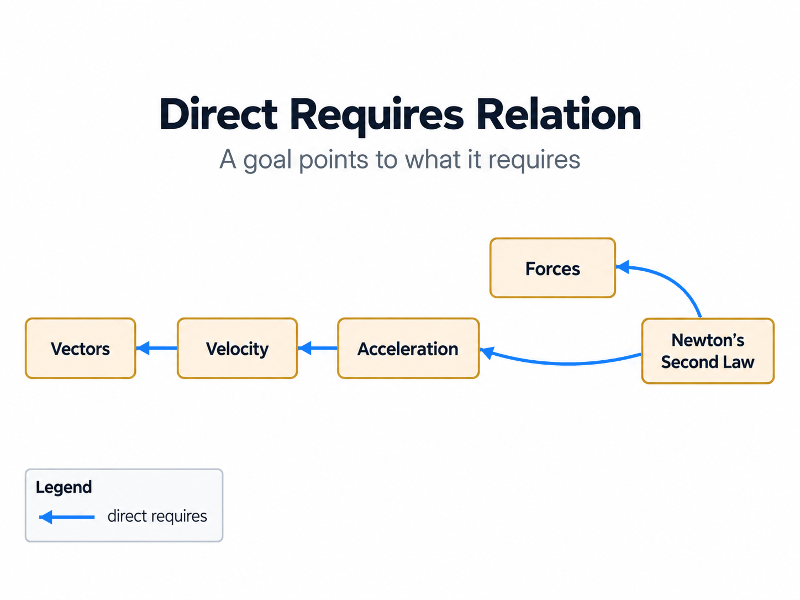
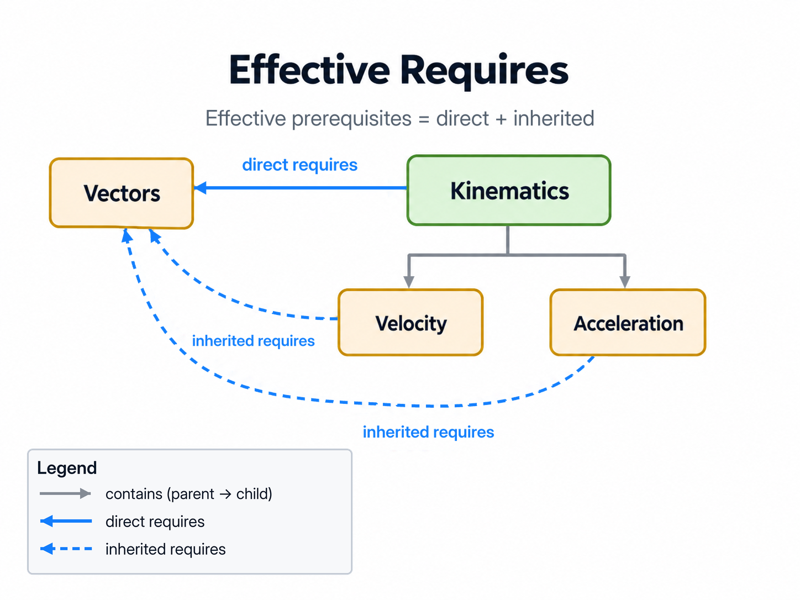

# SkillPilot Skill Graph Specification

SkillPilot models learning goals and their relationships as a graph. **Contains** describes how goals are grouped into a hierarchy. **Direct Requires** identifies the prerequisites that must be satisfied before a goal can be attempted. Grouping alone does not establish a prerequisite.

This specification defines goal attributes, both relations, their derived semantics—including inherited prerequisites—and the conditions for graph validity. It provides a common mathematical foundation so that independent implementations interpret and validate the same graph consistently.

This specification covers the skill graph itself. Projection contracts for user-facing trees that additionally involve `programUnits`, `goalPlacements`, or competency catalogs are specified separately in [View Projection and Goal Placement](view-projection-and-goal-placement.md).

Layering, migration strategy, and canonical rollout policy are specified separately in [General Goal System and Migration](general-goal-system-and-migration.md) and [Canonical Gymnasium Rollout Policy](canonical-gymnasium-rollout.md).

> **Normative definition.** This document defines the skill graph’s semantics and validity requirements.
>
> **Implementation checks.** The currently enforced CI validator profile—including rollout severity levels and runtime rule identifiers—is documented in [Graph Validation Rules](../../qa-ci/graph-validation-rules.md). Legacy metadata such as `phase` may still exist in repositories, but it is not part of the canonical graph semantics unless explicitly specified below.
>
> **Outside this specification.** Cross-landscape `requires` contracts, learner-facing curriculum bundles, and scope-specific composition-view files belong to higher-level composition contracts outside the single-landscape skill graph.

<!-- BEGIN SKILLPILOT-ILLUSTRATION: review-status -->

> **Illustrations.** The figures are explanatory examples, not a curriculum or additional requirements. The formal definitions and normative statements remain authoritative.
>
> **Reading key.** Read each relation arrow as “source — relation → target”. A `contains` arrow points from parent to child; a `requires` arrow points from a goal to its prerequisite. Solid prerequisite arrows are direct; dashed prerequisite arrows are inherited from contains ancestors. Colour distinguishes the relation or its evaluation status, as specified in each figure’s legend. A learning-flow view uses the inverse of `requires` and explicitly labels that inverse direction.

<!-- END SKILLPILOT-ILLUSTRATION: review-status -->

<!-- BEGIN SKILLPILOT-ILLUSTRATION: fig-01 -->

**Figure 1. Skill graph overview — non-normative example.**

**How to read it:** Grey arrows group Vectors, Velocity and Acceleration under Kinematics. The blue arrow Velocity → Vectors means that Velocity directly requires Vectors. Newton’s Second Law requires **both** Forces and Acceleration; its two outgoing requires arrows do not represent alternatives. All four blue arrows are direct requirements. Goals without contains children are atomic; the other goals are clusters.

**Scope note:** The physics labels are abbreviated examples, not a complete, reviewed curriculum. Node colours in this structural overview distinguish hierarchy levels, not learner achievement. The illustrated tree is only one possible hierarchy; §4.2 also allows multiple parents.

<!-- END SKILLPILOT-ILLUSTRATION: fig-01 -->

---

## 1. Notation and conventions

- $G$ is a finite set of **goals** (also called skills or nodes).
- A **binary relation** $X \subseteq G \times G$ is a set of ordered pairs $(a,b)$. A relation arrow $a \to b$ represents the ordered pair $(a,b)$ in the named relation.
- The **inverse relation** is $X^{-1}=\{\,(b,a)\mid(a,b)\in X\,\}$. An inverse view reverses the direction of each relation arrow; it does not introduce independently authored facts.
- For any relation $X$, $X^+$ denotes its **transitive closure**. A pair $(a,b)$ belongs to $X^+$ iff there is a directed path from $a$ to $b$ consisting of **one or more edges in $X$**. In particular, $X \subseteq X^+$. Paths of length zero do not count.
- A directed graph $(G,X)$ is **acyclic** iff there is no $g \in G$ such that $(g,g)\in X^+$.
- A **total mapping** $f:S\to T$ assigns exactly one value in $T$ to every element of $S$. A **partial mapping** $f:S\rightharpoonup T$ may be undefined for some elements of $S$; $dom(f)\subseteq S$ denotes the set of elements for which it is defined.

---

## 2. Goals and attributes

Each goal $g \in G$ is a distinct entity.

### 2.1 Attribute domains

- $\text{UUID}$: the set of UUID values.
- $\Sigma^*$: the set of finite strings over an alphabet $\Sigma$.
- $\mathbb{R}_{>0}$: strictly positive real numbers.
- $P_{compat}$: a set of legacy compatibility labels that may be serialized in repository-specific metadata fields such as `phase`.

### 2.2 Attribute mappings

Each goal $g\in G$ has the following attributes:

- $Id: G \to \text{UUID}$
- $Title: G \to \Sigma^*$
- $Weight: G \to \mathbb{R}_{>0}$

Implementations MAY additionally expose an optional stable cross-layer reference:

- $ShortKey: G \rightharpoonup \Sigma^*$

Interpretation:

- `ShortKey` is an optional stable ASCII-style identifier for cross-layer references, exports, APIs, and similar non-graph-facing integration points
- `ShortKey` does not replace `Id`; `Id` remains the canonical identity of a goal

Implementations MAY additionally expose optional compatibility/view metadata:

- $PhaseCompat: G \rightharpoonup P_{compat}$

Interpretation:

- current repositories may still serialize this metadata under the field name `phase`
- this metadata is optional and semantically unstable across domains
- it may support display badges, coarse filtering, migration compatibility, or legacy tooling
- it is not part of the canonical goal-graph semantics
- it does not participate in the required validity conditions of this specification
- phase-based validator checks, if a repository still uses them, belong to the validator profile and not to the normative graph definition

Implementations MAY additionally expose optional cross-cutting metadata for scoped learner views.

One preferred structured form is a partial applicability mapping:

$$
Applicability: G \rightharpoonup \bigl(D \rightharpoonup \mathcal{P}(V_d)\bigr)
$$

Interpretation:

- `Applicability` is optional and may be absent on goals or even on whole landscapes
- $D$ is a set of filter dimensions
- $V_d$ is the value vocabulary for dimension $d$
- this mapping is intended for node-local view projection and view validation, not as the primary authored source of truth

The normative filter semantics for such scoped views are defined in §11.

### 2.3 Identifier uniqueness

Identifiers MUST be unique:

$$
\forall g,h\in G:\ g\neq h \Rightarrow Id(g)\neq Id(h)
$$

### 2.3.1 Optional `ShortKey` uniqueness

If `ShortKey` is exposed, it MUST be unique within the logical landscape:

$$
\forall g,h\in G:\ g\neq h \land g,h\in dom(ShortKey) \Rightarrow ShortKey(g)\neq ShortKey(h)
$$

Interpretation:

- `ShortKey` is optional, but if present it is a secondary stable key and therefore must not collide between different goals of the same landscape
- in repositories that serialize the same logical landscape into multiple locale files sharing one `landscapeId`, this uniqueness requirement applies to the shared logical landscape, not merely to one file serialization
- repeated `(goalId, ShortKey)` pairs across locale serializations of the same landscape are therefore acceptable; collisions where the same `ShortKey` names different goal IDs are not

### 2.4 Atomic and cluster goals (canonical semantic classification)

Once the direct containment relation $C$ from §4 is fixed, the atomic/cluster split is defined canonically by the graph structure:

$$
A = \{\, g\in G \mid \neg \exists c\in G:\ (g,c)\in C \,\}
$$

$$
K = G \setminus A
$$

Interpretation:

- $A$: the set of **atomic goals**  
  Assessable leaf goals with no direct `contains` children.
- $K$: the set of **cluster goals**  
  Structural aggregation goals with at least one direct `contains` child.

Implementations MAY store explicit atomic/cluster classification metadata, but if they do, it MUST agree with this derived classification.  
This makes all later references to “atomic” and “cluster” portable across implementations.

---

## 3. Relations

The skill graph is defined using two primary relations on $G$:

- a hierarchy relation called **Contains**, directed from parent to child
- a dependency relation called **Direct Requires**, directed from a goal to its prerequisite

---

## 4. Contains relation

### 4.1 Definition

The **Contains** relation is a binary relation:

$$
C \subseteq G \times G
$$

$(p,c)\in C$ means **parent** $p$ directly contains **child** $c$. A contains arrow points from $p$ to $c$. Containment groups goals; it does not establish a prerequisite or a learning order.

**Note:** $C$ is the *direct* containment relation (“direct contains”).  
Indirect containment (ancestor/descendant) is derived via the transitive closure $C^+$.

Edges in $C$ are interpreted as hierarchical grouping (e.g., topic cluster contains atomic goal).

### 4.2 Containment constraint (polyhierarchy)

$(G,C)$ MUST be acyclic (containment cannot contain cycles):

$$
\neg \exists g\in G:\ (g,g)\in C^+
$$

This allows **multiple parents** per node (a polyhierarchy).  
If you want a strict tree/forest, see the recommended rule in §8.3.

### 4.3 Ancestors and descendants

Define:

$$
Ancestors(g) = \{\, a\in G \mid (a,g)\in C^+ \,\}
$$

$$
Descendants(g) = \{\, d\in G \mid (g,d)\in C^+ \,\}
$$

For later progression semantics, define the **atomic basis** of a goal:

$$
Atoms(g)=
\begin{cases}
\{g\} & \text{if } g\in A\\
Descendants(g)\cap A & \text{if } g\in K
\end{cases}
$$

Interpretation:

- for an atomic goal, its basis is itself,
- for a cluster goal, its basis is the set of atomic descendants whose mastery witnesses satisfaction of that cluster in set-based progression semantics.

Clusters with $Atoms(g)=\varnothing$ are structurally allowed, but they SHOULD NOT participate in prerequisite authoring or learner progression semantics.

<!-- BEGIN SKILLPILOT-ILLUSTRATION: fig-02 -->

**Figure 2. Direct and indirect containment — non-normative example.**

**How to read it:** Every hierarchy arrow is one direct edge in $C$, pointing from parent to child. Mechanics directly contains Kinematics and Dynamics; Kinematics contains Vectors, Velocity and Acceleration; Dynamics contains Forces and Newton’s Second Law. The teal path Mechanics → Kinematics → Velocity consists of two $C$ edges, so Mechanics is an ancestor of Velocity although no direct contains edge joins them. The highlight follows the existing edges; it is not an additional relation.

**Scope note:** $C^+$ relates the endpoints of paths consisting of one or more $C$ edges, including single direct edges. Goals without contains children are atomic and the others are clusters (§2.4). The atomic basis of a cluster is the set of its atomic descendants. The figure uses the same small hierarchy as Figure 1; it is not a complete curriculum subtree.

<!-- END SKILLPILOT-ILLUSTRATION: fig-02 -->

---

## 5. Direct Requires relation

### 5.1 Definition

The **Direct Requires** relation is a binary relation:

$$
R_d \subseteq G \times G
$$

$(g,p)\in R_d$ means **goal $g$ directly requires prerequisite $p$**.
Equivalently, $p$ is a direct prerequisite of $g$. A `requires` arrow points **from $g$ to $p$** and is read “$g$ requires $p$”. In a serialized goal record, `requires` lists the referenced goals that the record’s goal directly requires.

Multiple outgoing requires edges are conjunctive: a goal requires **all** the prerequisites to which it points, not a choice among them. Satisfaction and scoped availability are defined in §9 and §11.

A **learning-flow view** depicts the inverse relation $R_d^{-1}$: an arrow $p\to g$ is read “$p$ is a direct prerequisite for $g$”. Such a view explicitly identifies itself as **inverse of requires** and does not label its arrows simply `requires`. It is derived from the same prerequisite facts, not authored as a separate dependency relation. An individual prerequisite-for arrow does not imply that satisfying its source alone makes the target available.

<!-- BEGIN SKILLPILOT-ILLUSTRATION: fig-03 -->

**Figure 3. Direct prerequisites — non-normative example.**

**How to read it:** Read each blue arrow from its source to its arrowhead: “this goal requires that prerequisite”. Velocity requires Vectors; Acceleration requires Velocity; Newton’s Second Law requires both Forces and Acceleration. The curved arrow to Acceleration is a direct requirement, just like the straight arrows.

**Scope note:** A chain of requires edges expresses transitive prerequisite reachability without an additional direct edge. It is not contains-based inheritance. The position of a box does not change the relation’s direction: these arrows point to prerequisites, not along learning flow.

<!-- END SKILLPILOT-ILLUSTRATION: fig-03 -->

### 5.2 Canonical modeling target (recommended)

The formal model allows direct prerequisite edges between arbitrary goals in $G$.  
However, for high-quality and mature curricula, the **canonical prerequisite layer** SHOULD primarily live between atomic goals:

$$
R_d \subseteq A \times A
$$

Interpretation:

- atomic goals carry the precise didactic sequencing logic,
- cluster goals remain useful for navigation, filtering, and aggregation,
- cluster-level `requires` edges are best treated as a transitional authoring aid or as an intentionally strong universal statement.

If a direct prerequisite is authored on a cluster goal, it is stronger than a mere summary: under the semantics in §6 it constrains descendants via inheritance.

### 5.3 DAG constraint

$(G,R_d)$ MUST be acyclic:

$$
\neg \exists g\in G:\ (g,g)\in R_d^+
$$

---

## 6. Effective Requires semantics

A goal’s requirements include its own direct prerequisites and the direct prerequisites declared by its contains ancestors. The **Effective Requires** relation records all these applicable requirements in the direction **goal → prerequisite**.

Cluster-level prerequisite authoring is permitted by the formal model. For precise didactic sequencing, §5.2 recommends atomic-to-atomic authoring.

### 6.1 Effective Requires relation

Define $R_{eff}\subseteq G\times G$ by:

$$
(g,p)\in R_{eff}
\iff
\big((g,p)\in R_d\big)
\ \lor\
\big(\exists a\in Ancestors(g): (a,p)\in R_d\big)
$$

Interpretation:

- $g$ requires $p$ effectively when $g$ declares that prerequisite itself or inherits it from a contains ancestor.
- Every direct requirement is also effective: $R_d\subseteq R_{eff}$. The same ordered pair occurs only once in a relation, even when there are several inheritance paths.
- Inheritance follows the contains hierarchy. It copies direct requirements declared by ancestors to their descendants; it does not copy requirements from prerequisite goals.
- $R_{eff}$ is computed by the inheritance rule, not by taking a transitive closure. Chains of requirements are evaluated using $R_{eff}^+$; this is distinct from contains-based inheritance.

**Note (with multiple parents):** A goal inherits direct requirements from all its contains ancestors, across every parent path. The additional inherited pairs are $R_{eff}\setminus R_d$; the figures distinguish them with dashed arrows.

### 6.2 Effective prerequisite set

For convenience, define the set of effective prerequisites of a node:

$$
Pre_{eff}(g) = \{\, p\in G \mid (g,p)\in R_{eff} \,\}
$$

<!-- BEGIN SKILLPILOT-ILLUSTRATION: fig-04 -->

**Figure 4. Prerequisites inherited from a cluster — non-normative example.**

**How to read it:** Kinematics directly requires Vectors. Because Kinematics contains Velocity and Acceleration, both children inherit that requirement. All three prerequisite arrows point to Vectors. The solid arrow is directly authored; the two dashed arrows are derived from containment. All three pairs belong to $R_{eff}$.

**Scope note:** This is a separate example from Figure 1: Vectors is not contained in Kinematics here. Adding that contains edge would make Vectors inherit a requirement for itself. For precise atomic-to-atomic authoring, see §5.2. Inherited requirements are distinct from prerequisite chains.

<!-- END SKILLPILOT-ILLUSTRATION: fig-04 -->

### 6.3 Relation to the canonical atomic model

When none of a goal’s contains ancestors declares an outgoing direct requires edge, the goal inherits no additional prerequisites. Its effective prerequisite set equals its directly authored prerequisite set:

$$
\left(\forall a\in Ancestors(g):\ \neg\exists p\in G:\ (a,p)\in R_d\right)
\Rightarrow
Pre_{eff}(g)=\{\,p\in G\mid(g,p)\in R_d\,\}.
$$

In particular, if $R_d\subseteq A\times A$, contains ancestors are clusters and cannot be the source of a direct requires edge. In that atomic-authored model, $R_{eff}=R_d$. Longer prerequisite chains are still represented by the transitive closure.

---

## 7. Validity constraints

A SkillPilot skill graph is **valid** iff all constraints in this section hold.

### 7.1 Effective Requires must be acyclic

The dependency graph induced by effective prerequisites MUST be acyclic:

$$
\neg \exists g\in G:\ (g,g)\in R_{eff}^+
$$

This constraint is stricter than acyclicity of $R_d$ alone because inheritance via $C$ can introduce cycles.

**Non-normative example (illustrative):**  
Let $(A,B)\in C$ (i.e., $A$ contains $B$). Suppose $(A,X)\in R_d$ and $(X,B)\in R_d$: $A$ directly requires $X$, and $X$ directly requires $B$.  
The direct requires graph contains the acyclic chain $A \to X \to B$. Since $A$ is a contains ancestor of $B$, inheritance adds $(B,X)\in R_{eff}$. This creates the cycle $B \to X \to B$ in $R_{eff}$.

<!-- BEGIN SKILLPILOT-ILLUSTRATION: fig-05 -->

**Figure 5. Why inheritance can create a cycle — non-normative example.**

**How to read it:** In both panels, $A$ contains $B$ and directly requires $X$, so $B$ inherits the requirement for $X$. On the left there is no effective cycle. On the right, $X$ additionally requires $B$ directly. The direct edge $X\to B$ and inherited edge $B\to X$ form the cycle. Check for cycles using both direct and inherited prerequisites.

**Scope note:** The panels compare acyclicity, not compliance with every validity requirement. Acyclicity is one validity condition; full validity also requires the other conditions in this specification.

<!-- END SKILLPILOT-ILLUSTRATION: fig-05 -->

### 7.2 Local minimality

A direct prerequisite MUST NOT be redundantly stated on a node if it is already inherited from an ancestor.

$$
\forall g,p\in G:
(g,p)\in R_d \Rightarrow
\neg \exists a\in Ancestors(g): (a,p)\in R_d
$$

### 7.3 Transitive minimality

A direct prerequisite edge MUST NOT be present if the prerequisite relationship already follows from other effective prerequisite paths.

Formally, for each $(g,p)\in R_d$, remove that single direct edge and recompute effective requirements; the prerequisite must no longer be implied transitively.

Let:

$$
R_d' = R_d \setminus \{(g,p)\}
$$

and let $R_{eff}'$ be the effective relation computed from $R_d'$ using the definition in §6.1.

Then the constraint is:

$$
\forall (g,p)\in R_d:\ (g,p)\notin (R_{eff}')^+
$$

Interpretation: every edge in $R_d$ is necessary to preserve prerequisite reachability under the inheritance rules.

---

## 8. Recommended structural rules

The following are common modeling rules that typically improve graph quality. They may be treated as warnings or enforced as hard constraints depending on the product needs.

### 8.1 Avoid requiring descendants

A goal SHOULD NOT require its own descendant:

$$
(g,p)\in R_d \Rightarrow p \notin Descendants(g)
$$

This prevents “inside-out” prerequisite definitions that often indicate a modeling error (e.g., a parent depending on one of its parts).

### 8.2 Avoid prerequisites along containment edges

Often, prerequisites SHOULD be modeled between peer concepts rather than between ancestors/descendants in the hierarchy. Common guidance:

- For $(g,p)\in R_d$: $p \notin Ancestors(g)$ and $p \notin Descendants(g)$

If your product needs exceptions, treat this as a heuristic.

In the current validator profile, the ancestor cases are covered by rollout rules `GVR-001` and `GVR-003` (see `docs/qa-ci/graph-validation-rules.md`).

### 8.3 Optional: At most one parent per node (tree/forest mode)

If you want a strict tree/forest hierarchy, enforce:

$$
\forall c\in G:\ \left|\{\,p\in G \mid (p,c)\in C\,\}\right| \le 1
$$

### 8.4 Prefer atomic prerequisite authoring

For mature landscapes, the actual didactic sequencing SHOULD be authored on atomic goals first.

Practical guidance:

- Prefer adding `requires` edges between atomic goals instead of between clusters.
- Use cluster-level `requires` only temporarily during early modeling, or when the prerequisite claim truly applies to all relevant descendants.
- When refining a curriculum over time, move broad cluster dependencies downward into the relevant atomic goals and let higher-level dependency views be derived from that atomic layer.

This keeps frontier logic precise and avoids over-blocking learners with coarse prerequisites.

### 8.5 Didactic route coverage: motivation to autonomy

SkillPilot landscapes SHOULD expose one or more didactic routes through the atomic prerequisite graph. A reviewed validator profile MAY promote this to a release-blocking MUST for an explicitly named scope.

Let:

- $M \subseteq A$ be the set of **motivation anchors**  
  (for example, atomic goals such as "Warum Physik?" / "Why Physics?")
- $T \subseteq A$ be the set of **terminal autonomy goals**  
  (for example, independent exam-task solving or other authentic capstone performances)
- $E_{route} \subseteq A$ be an optional set of **explicitly excluded support-only atomic goals**  
  (for example, memorization-only nodes or other operational helper nodes)

Default:

$$
E_{route}=\varnothing
$$

If a profile uses a non-empty $E_{route}$, the identifying predicate MUST be machine-readable and documented by that profile.

A didactic route is read in **learning-flow direction**, from prerequisite to dependent goal, using the inverse relation $R_d^{-1}$. Its arrows express “is a direct prerequisite for”, not `requires`.

An atomic goal $a\in A\setminus E_{route}$ is **route-covered** iff:

$$
\exists m\in M,\ \exists t\in T:
\big(a=m \lor (m,a)\in (R_d^{-1})^+\big)
\ \land\
\big(a=t \lor (a,t)\in (R_d^{-1})^+\big)
$$

Interpretation: every route-relevant atomic goal should lie on at least one didactic path that starts with motivation and ends in autonomous performance.

This means the atomic `requires` graph should not be a loose bag of local dependencies.  
Its inverse learning-flow view should form teachable routes whose overall direction is:

- motivation,
- understanding / guided learning,
- memorization where needed,
- independent application / exam-level performance.

In the current validator rollout, `GVR-012` promotes this definition to a hard release invariant for canonical DE Gymnasium mathematics, independently for Sek I and Sek II:

- `M` consists of the stage-specific goals authoritatively classified as `orientation`;
- ordinary route goals are the stage-specific goals classified as `curricularAtomic`;
- `T` consists of the configured atomic goals classified as `practiceAssessment`;
- reachability is proved only through direct atomic-to-atomic `requires` facts, traversed in inverse direction for learning-flow routes;
- every profile supplies an explicit stage-local proof-node predicate, so a route for one stage cannot be proved through nodes of another stage;
- only `orientation`, `curricularAtomic`, optional `memory`, and `practiceAssessment` nodes may contribute to that proof;
- every node that participates in the proof may not carry direct prerequisites outside those route kinds; inherited cluster prerequisites do not count;
- route order is semantic: assessment cannot be a prerequisite before curricular learning, every terminal route passes through at least one ordinary curricular atom, and a memory node can participate only after curricular learning has begun;
- semantic kind and graph shape must agree; in particular a `curricularAtomic` decision cannot silently stop being checked merely because the node acquired children;
- the authoritative semantic-kind ledger must classify the complete canonical graph, so a newly added or stale unclassified goal cannot silently escape the rule;
- every `curricularAtomic` goal must be assigned to at least one of the independently checked stage profiles;
- the rule remains an error even when legacy graph rules are temporarily run in warning mode.

An `orientation` node is a didactic entry marker, not an assessable subject
competency. Its purpose is to make the following material attractive and
meaningful by showing concrete possibilities and honest positive perspectives.
The learner may respond with an interest, preference, own connection, or a wish
to continue; no response must demonstrate correct terminology, calculation,
detail knowledge, transfer, recall, or exam performance. Runtime may store the
existing numeric value `1` as a binary completion marker after such visible
engagement, but must never present that marker as proven fachliche Mastery.

Memory goals are optional support, not mandatory checkpoints. They are selected through the separate memory-review contract and may support a route where justified, but the hard route profile must not make every terminal performance depend on an SRS deck. In this rule, `curricularAtomic` denotes the ordinary reviewed subject goals: understanding, explaining, reasoning, applying, problem solving, and construction as appropriate. It does not claim that each route needs an additional node with a separately inferred "understanding" type. Such a type would require its own authored and reviewed semantic role rather than title-based inference. The runtime corollary is separate but consistent: at a genuine zero-progress entry into a projected scope, unresolved `orientation` goals are the only selectable frontier goals; existing learners with established subject progress are not reset to that entry gate.

The canonical inventory rule and a learner-facing projection rule are both
necessary. `GVR-012` proves that the authored canonical graph has complete
routes; it cannot prove that a narrower composition view retained every direct
prerequisite. A reviewed view therefore has to include each direct prerequisite
of every visible target either as another `target` or explicitly as
`prerequisiteOnly`. Projection roles remain authored decisions and are never
inferred from stage or graph position. At runtime, a missing direct canonical
prerequisite fails closed and blocks the target; only omitted prerequisites
inherited from transitional legacy clusters retain the compatibility behavior.
The Hessen Sek-II mathematics LK regression additionally proves complete direct
prerequisite closure for that reviewed view.

### 8.5.1 Reference example: Physics E-phase subtree

A concrete reference implementation for this target state exists in the retained Hessen Physics source snapshot:

- file: `curricula/DE/Gymnasium/input/HE/upper-secondary/source-json/DE_HES_S_GYM_2_PHYSIK.de.json.snapshot`
- subtree root: `Einführungsphase: Mechanik, Gravitation, Thermodynamik und Drehbewegungen`

The snapshot is retained authoring evidence, not a runtime landscape. The live subject landscape is `curricula/DE/Gymnasium/canonical/DE_DEU_S_GYM_CANONICAL_PHYSIK.de.json`.

In its curated state, this subtree is intended as a model example for mature prerequisite authoring:

- normal learning goals in the subtree use atomic `requires` as their canonical didactic layer,
- cluster goals inside the subtree do not carry direct `requires`,
- all non-memory atomic goals in the subtree lie on atomic routes from the global motivation anchor `Warum Physik? – Weltverständnis & Zukunft` to one or more terminal autonomy goals in `Übungen E-Phase`,
- the memorization node `Lernkarten - E-Phase` is explicitly modeled as a memory node and should be treated separately from normal route-coverage judgments.

This example is useful because it shows that the target semantics in §5.2 and §8.5 are not merely aspirational; they can be implemented in a real curriculum subtree without relying on inherited cluster prerequisites.

### 8.5.2 Reference example: Mathematics upper-secondary landscape

A second concrete reference implementation exists in the retained Hessen Mathematics source snapshot:

- file: `curricula/DE/Gymnasium/input/HE/upper-secondary/source-json/DE_HES_S_GYM_2_MATHEMATIK.de.json.snapshot`
- scope: the ordinary curriculum phases `E`, `Q1`, `Q2`, `Q3`, `Q4` plus the global process-competency exercise branch

The snapshot is retained authoring evidence, not a runtime landscape. The live subject landscape is `curricula/DE/Gymnasium/canonical/DE_DEU_S_GYM_CANONICAL_MATHEMATIK.de.json`.

In its curated state, this landscape is intended as a whole-landscape reference for mature route coverage:

- normal learning goals use atomic `requires` as their canonical didactic layer,
- the phase-local autonomy targets are modeled explicitly via `Übungen E-Phase`, `Übungen Q1`, `Übungen Q2`, `Übungen Q3`, `Übungen Q4` and `Übungen Prozesskompetenzen`,
- each of these exercise branches contains atomic exam-mode-capable goals with concrete `examData`,
- outside the intentionally separate global Abitur containers, the landscape no longer relies on cluster-level `requires` for ordinary didactic sequencing,
- the global Abitur containers remain a distinct assessment layer and should not be confused with the local terminal autonomy goals that close the ordinary phase routes.

This example is useful because it demonstrates the target semantics not only for a subtree, but for an entire subject landscape with multiple phases and an additional cross-phase process-competency branch.

### 8.6 Derive cluster-level dependency views from atomic routes

For cluster goals $k_1,k_2\in K$, higher-level dependency views SHOULD normally be derived from atomic descendants rather than authored as standalone prerequisite facts.

Typical summary semantics include:

- **existential summary:** some atomic descendant of $k_2$ depends on some atomic descendant of $k_1$,
- **coverage summary:** a defined share of atomic descendants of $k_2$ depends on descendants of $k_1$.

If a UI, report, or API exposes cluster-level dependencies, it SHOULD document which summary semantics it uses.  
A raw boolean cluster edge is often too coarse for mature curricula. A dependency summary from $k_2$ to $k_1$ means that descendants of $k_2$ depend on descendants of $k_1$ under the documented summary semantics. A learning-flow summary uses the inverse direction and labels it explicitly; neither summary creates a new authored requires fact.

---

## 9. Learning availability and progression

The primitive learner state for progression semantics is an **atomic mastered set**:

$$
M_A \subseteq A
$$

This reflects the intended authoring model: atomic goals are mastered directly, while cluster satisfaction is derived from atomic mastery.

### 9.1 Available next goals

Define the global **satisfaction predicate**:

$$
Sat(g,M_A)
\iff
\big(Atoms(g)\neq\varnothing\big)\ \land\ \big(Atoms(g)\subseteq M_A\big)
$$

Interpretation:

- an atomic goal is satisfied iff it is in $M_A$,
- a cluster goal is satisfied iff all of its atomic descendants are in $M_A$.

The normative learner frontier is defined on atomic goals:

$$
Frontier(M_A) =
\left\{
g \in A\setminus M_A \ \middle|\ 
\forall p\in G:\ (g,p)\in R_{eff}^+ \Rightarrow Sat(p,M_A)
\right\}
$$

Interpretation: an unmastered atomic goal is available if every prerequisite reachable by following one or more outgoing effective requires edges is satisfied. This includes longer prerequisite chains. Cluster prerequisites are evaluated through their atomic descendants using $Sat$.

If a product also exposes **cluster availability** for navigation purposes, it SHOULD derive it from the same satisfaction predicate:

$$
Frontier_K(M_A)=
\left\{
k\in K \mid Atoms(k)\neq\varnothing\ \land\ \neg Sat(k,M_A)\ \land\ \forall p\in G:\ (k,p)\in R_{eff}^+ \Rightarrow Sat(p,M_A)
\right\}
$$

Availability is evaluated through reachability in $R_{eff}^+$. If prerequisites are authored only between atomic goals, $R_{eff}=R_d$ (§6.3), so this is reachability in $R_d^+$. Where cluster-level requirements are present, inherited requirements participate in the same check.

<!-- BEGIN SKILLPILOT-ILLUSTRATION: fig-06 -->

**Figure 6. Which goal is available next? — non-normative example.**

**How to read it:** Let $M_A=\{Vectors,Forces\}$. Velocity directly requires the mastered Vectors goal and is available next. Acceleration requires the unmastered Velocity goal and is blocked. Newton’s Second Law requires both Forces and Acceleration; Acceleration and the prerequisite chain through Velocity are not yet satisfied. Follow the blue arrows from each goal to what it requires. No cluster is satisfied because each has unmastered atomic descendants.

**Scope note:** Only atomic goals belong to the learner frontier in §9.1. Cluster navigation is a separately derived view. Once Velocity is mastered, Acceleration becomes available; this requires an update to $M_A$ based on mastery evidence. Arrow direction does not represent a change in learner state.

<!-- END SKILLPILOT-ILLUSTRATION: fig-06 -->

---

## 10. Summary of required validity conditions

A skill graph $(G,C,R_d)$ is valid iff:

1. $Id$ is injective on $G$
2. $(G,C)$ is acyclic (containment DAG / polyhierarchy; multiple parents allowed)
3. $(G,R_d)$ is a DAG
4. $R_{eff}$ (computed from $C$ and $R_d$) is acyclic
5. $R_d$ satisfies local minimality
6. $R_d$ satisfies transitive minimality

Everything else in this specification is either derived (definitions) or recommended modeling guidance.

Important scope note:

- these are the validity conditions of the **full authored graph**
- scoped learner views may impose additional validity expectations on projected filtered graphs as defined in §11
- such projected-view validity is an additional property of a chosen filter realization, not part of base full-graph validity by default

---

## 11. Filters and scoped evaluation (Optimistic vs. Pessimistic)

A **filter** restricts the global skill graph to a subset of nodes (e.g., *Grade 12* AND *Subject: Mathematics* AND *Track: Advanced*).

### 11.1 Filter representation and applicability-backed projection

Normatively, a filter is still just a predicate on goals.

However, implementations MAY realize parts of that predicate via structured, goal-local metadata such as a generic compiled applicability field:

$$
Applicability: G \rightharpoonup \bigl(D \rightharpoonup \mathcal{P}(V_d)\bigr)
$$

where:

- $D$ is a set of filter dimensions (for example `jurisdiction`, `schoolForm`, `stage`, `durationModel`, `courseProfile`, ...)
- $V_d$ is the value vocabulary for dimension $d$
- $\mathcal{P}(V_d)$ is the set of allowed value sets for that dimension

Interpretation:

- the graph definition does **not** hardcode any one application-specific dimension such as German Bundeslaender
- the same mechanism can be used for jurisdiction, school form, stage, duration model, course profile, or similar scoped views
- if `Applicability` is absent on a goal, or a dimension is absent within `Applicability(g)`, the goal is treated as unrestricted on that dimension
- `ALL` is a query sentinel only; it MUST NOT be serialized as an applicability or placement value
- `tags` remain semantically weaker and less structured than compiled applicability metadata

For an active filter selection $Q$ over such dimensions, a goal-local applicability-backed predicate can be written as:

$$
F_Q(g)=1
\iff
\forall d\in D_{active}:
\bigl(Q(d)=ALL\bigr)\ \lor\ \bigl(g\notin dom(Applicability)\bigr)\ \lor\ \bigl(g\in dom(Applicability)\land d\notin dom(Applicability(g))\bigr)\ \lor\ \bigl(g\in dom(Applicability)\land d\in dom(Applicability(g))\land Q(d)\in Applicability(g)(d)\bigr)
$$

This is only one possible realization of a filter, but it is the preferred one for derived, prevalidated scoped views.

### 11.1.1 Repository convention: explicit applicability overrides

The normative filter semantics in this document depend on the effective applicability predicate only.  
Some repositories MAY additionally maintain an explicit auxiliary metadata field such as:

$$
ApplicabilityOverrides: G \rightharpoonup \bigl(D \rightharpoonup \mathcal{P}(V_d)\bigr)
$$

Interpretation:

- `ApplicabilityOverrides` is **not** a second filter system beside `Applicability`
- it is review and migration metadata that marks which in-force applicability values were added through an explicit, documented override decision
- runtime view projection should still evaluate the compiled `Applicability` field, not the override field by itself

Typical use case:

- a canonical goal is already didactically needed in a scoped view such as `jurisdiction = DE-HE`
- but the retained source landscape for that scope does not expose a clean one-to-one source atom for the same competence
- the repository therefore widens `Applicability(g)` deliberately and records the exceptional part again in `ApplicabilityOverrides(g)` so the widening remains auditable

This convention is useful because it keeps three facts separate:

- where the goal is currently visible: `Applicability`
- where the currently strongest direct source evidence comes from: provenance and mapping layers
- which visibility values were added by an explicit reviewed exception instead of by ordinary source alignment: `ApplicabilityOverrides`

Practical guidance:

- if a value is present only because of such an explicit closure decision, keep it in both places:
  - in `Applicability`, so filtered views work correctly
  - in `ApplicabilityOverrides`, so validators and maintainers can see that the value is override-backed
- if cleaner exact evidence becomes available later, the override marker should be removed while the ordinary applicability value may remain

In the current repository validator profile, explicit use of such an override path is tracked by rule `APV-201`.

### 11.2 Filter predicate and induced subgraph

A filter is modeled as a predicate:

$$
F: G \to \{0,1\}.
$$

It selects the filtered node set:

$$
G_F = \{\, g \in G \mid F(g)=1 \,\}.
$$

The induced (restricted) relations are:

$$
C_F = C \cap (G_F \times G_F),
\qquad
R_{d,F} = R_d \cap (G_F \times G_F).
$$

For scoped learner evaluation, the normative filtered effective relation is the **restriction of the global effective relation**:

$$
R_{eff}|_F = R_{eff} \cap (G_F \times G_F)
$$

This means:

- effective requires facts are computed on the full graph before restriction,
- a pair $(g,p)$ is retained in $R_{eff}|_F$ only when both the dependent goal $g$ and its prerequisite $p$ belong to $G_F$,
- a retained pair may have been inherited through a contains ancestor outside $G_F$; its origin does not remove it from the restricted relation.

Optimistic evaluation uses the restricted relation (§11.3). Strict evaluation uses the full relation (§11.4). Filtering changes the evaluation scope, not the stored mastery set.

This avoids making scoped availability depend on whether a prerequisite was authored directly on a child or inherited from a filtered-out ancestor.

For any concrete filter realization, the induced graph

$$
(G_F, C_F, R_{d,F}, R_{eff}|_F)
$$

is the **projected filtered graph** for that view.

If an implementation claims that a filtered learner view is structurally valid, then that claim MUST be evaluated on the projected filtered graph, not merely on raw metadata fields attached to nodes.

If an implementation additionally claims a **default learner-facing tree** for a resolved scope, that is a stronger projection claim than filtered-graph validity alone.

Such a default tree MUST ensure:

- each visible goal occurs at most once
- each visible goal has at most one visible parent in that tree
- additional references such as `secondary` placements or overlays do not create additional node occurrences

This single-occurrence tree property is a scoped-view projection validity condition, not a base validity condition of the authored full graph.

One reviewed way to satisfy this stronger claim is to compile the default tree from a separate scope-specific composition view whose structure nodes reference canonical subtree roots of the authored skill graph.

Where an authoritative semantic-kind review is available, a composition view
MUST NOT reference a `curricularArea` cluster through a direct `goalEntry`.
That representation would discard its `contains` structure and turn a
navigation area into an opaque atomic-looking runtime target. Use a
`canonicalSubtree` to retain the reviewed canonical descendants, or author an
explicit learner-facing structure that references the intended atomic goals.
This is a representation constraint; it does not infer a projection role from
the cluster, its stage, or its position.

Such composition-view artifacts remain outside the formal graph object defined in this specification.

### 11.3 Optimistic mode

In **optimistic mode**, first compute $R_{eff}$ on the full graph, then restrict it to $R_{eff}|_F$ (§11.2). Availability uses paths in this restricted relation and scope-relative satisfaction. Prerequisites that lie outside the scope do not block this evaluation; those goals are not thereby marked as mastered.

Define the filtered atomic set:

$$
A_F = A \cap G_F
$$

Define the scope-relative atomic basis:

$$
Atoms_F(g)=Atoms(g)\cap G_F
$$

and the corresponding scope-relative satisfaction predicate:

$$
Sat_F(g,M_A)
\iff
\big(Atoms_F(g)\neq\varnothing\big)\ \land\ \big(Atoms_F(g)\subseteq M_A\big)
$$

Then the optimistic frontier is:

$$
Frontier_{opt}(M_A,F) =
\left\{
g \in A_F \setminus M_A \ \middle|\ 
\forall p\in G_F:\ (g,p)\in (R_{eff}|_F)^+ \Rightarrow Sat_F(p,M_A)
\right\}.
$$

### 11.4 Pessimistic mode or strict mode

In **pessimistic mode** or **strict mode**, candidate goals are still restricted to the filtered set, but prerequisites are enforced **globally** (including nodes outside the filter).

Let $R_{eff}$ be computed on the full graph $(G,C,R_d)$. Then:

$$
Frontier_{pess}(M_A,F) =
\left\{
g \in A_F \setminus M_A \ \middle|\ 
\forall p\in G:\ (g,p)\in R_{eff}^+ \Rightarrow Sat(p,M_A)
\right\}.
$$

<!-- BEGIN SKILLPILOT-ILLUSTRATION: fig-07 -->

**Figure 7. Same scope, different prerequisite checks — non-normative example.**

![Identical graph, filter scope and empty mastered set in two panels. Kinematics contains Velocity and Acceleration and directly requires the outside-scope Vectors goal. Velocity and Acceleration inherit the requirement for Vectors; Acceleration also directly requires Velocity. Requires arrows point to prerequisites. Orange arrows mark ignored outside-scope requirements in optimistic mode; blue arrows mark checked requirements. Grey arrows denote contains. Velocity alone is available optimistically; neither atomic goal is available in strict mode.](assets/graph-definition/07-filter-modes.png)

**How to read it:** Both panels use $M_A=\varnothing$. Kinematics, Velocity and Acceleration are in scope; Vectors is outside. Kinematics directly requires Vectors, and Acceleration directly requires Velocity. Through containment, Velocity and Acceleration inherit Kinematics’ requirement for Vectors. Every requires arrow points from a goal to what it requires. Solid requires arrows are direct and dashed requires arrows are inherited, regardless of colour. In the optimistic panel, the three orange arrows to Vectors are excluded from the scoped prerequisite check: Velocity is available, but Acceleration still requires Velocity. In the strict panel, these requirements are checked as well: neither atomic goal is available.

**Scope note:** Neither mode changes stored mastery. Effective requirements are derived on the full graph before restriction (§11.2). This is an example of the abstract filter modes with a cluster-authored requirement. It does not override the separate reviewed composition-view contract in §8.5, which enforces missing direct canonical prerequisites.

<!-- END SKILLPILOT-ILLUSTRATION: fig-07 -->

### 11.5 Diagnostic: missing prerequisites

For diagnosis, define the set of missing prerequisites of a goal $g$:

$$
Missing(g,M_A) =
\{\, p \in G \mid (g,p)\in R_{eff}^+ \land \neg Sat(p,M_A) \,\}.
$$

To distinguish gaps inside vs. outside the filter:

$$
\begin{aligned}
Missing_{in}(g,M_A,F)  &= Missing(g,M_A)\cap G_F,\\
Missing_{out}(g,M_A,F) &= Missing(g,M_A)\setminus G_F.
\end{aligned}
$$

Operationally, one can start with optimistic mode for efficiency and exploration; if a learner struggles with a goal, switch to pessimistic mode (or compute $Missing_{out}$) to identify prerequisite gaps outside the current filter.

### 11.6 Optional: relaxed pessimism via a prerequisite scope

A “weakened” pessimistic approach can be modeled by choosing a **scope** set $S \subseteq G$ of prerequisites that must be enforced (e.g., only prerequisites from the last one or two phases, or only prerequisites up to a bounded depth).

Define:

$$
Frontier_{scope}(M_A,F,S) =
\left\{
g \in A_F \setminus M_A \ \middle|\ 
\forall p\in S:\ (g,p)\in R_{eff}^+ \Rightarrow Sat(p,M_A)
\right\}.
$$

Special cases:

- $S = G$ gives the fully pessimistic mode.
- Choosing $S$ smaller than $G$ yields a relaxed pessimistic check that can be widened iteratively if needed.
