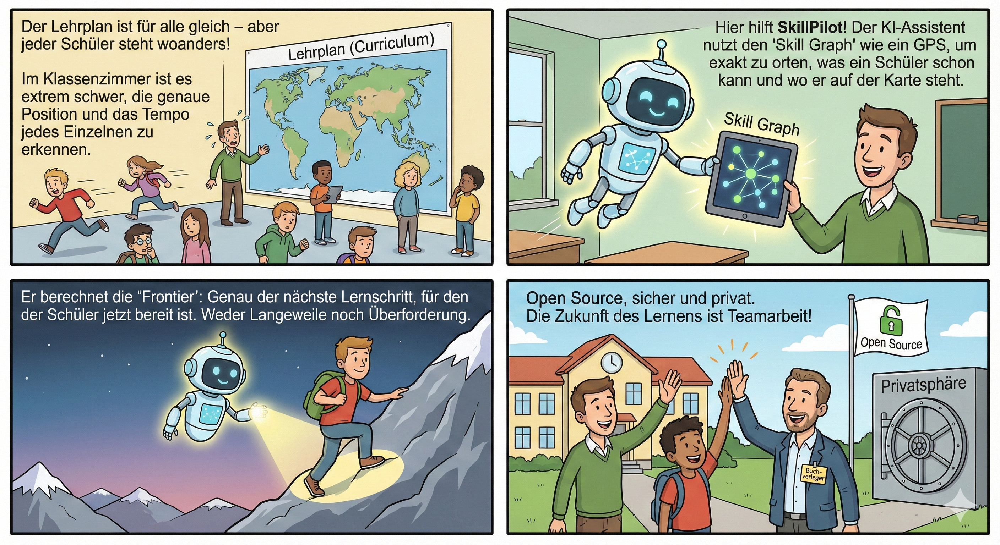
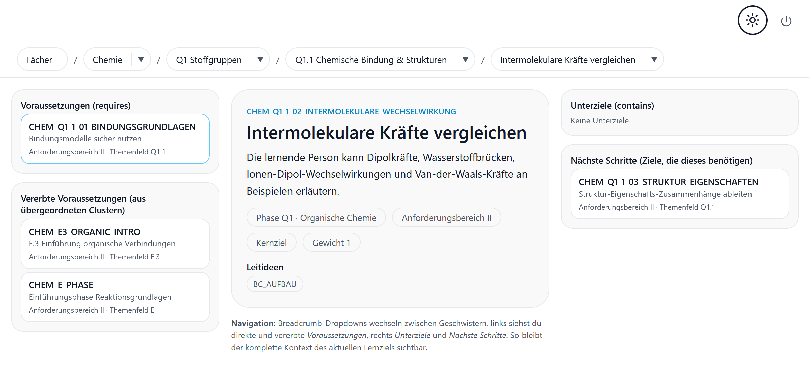
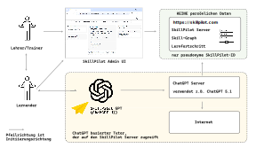

# SkillPilot Whitepaper (DE)

**Version:** 1.0.1
**Datum:** Dezember 2025
**Projekt:** SkillPilot

---

## Zusammenfassung

SkillPilot modelliert Lehrpläne (**Curricula**) als **Skill-Graph**. Lernende, Lehrkräfte und KI-Agenten nutzen diesen als maschinenlesbare Landkarte. So kann der Lernende von seinem aktuellen **Skill-Stand** sicher zu seinen **Skill-Zielen** navigieren. Ein KI-Agent führt ihn dabei durch **personalisierte Curricula**. Dazu erfasst das System Lernerfolge auf atomaren Skill-Zielen und leitet daraus den **Beherrschungsgrad** für übergeordnete Themen ab. Auf dieser Basis führt der Weg über die **nächsten erreichbaren Skill-Ziele** systematisch hin zu den individuellen Bildungszielen.

---

## 1. Die Herausforderung: Individuelle Skill-Navigation

Klassische Bildung basiert auf Curricula, die staatlich herausgegeben oder im Rahmen von **Akkreditierungsprozessen** festgelegt werden. Für Lehrer oder Professoren ist es jedoch eine immense **buchhalterische** Herausforderung, für jeden einzelnen Schüler oder Studenten feingranular zu erfassen, wo er in der Skill-Landschaft steht und wie er sich bewegt. Dies wird besonders deutlich bei Einführungsvorlesungen mit über tausend Studierenden. Diese „Tool-Lücke“ will SkillPilot schließen.

---

## 2. Der Umbruch: Möglichkeiten moderner KI-Agenten nutzen

In den drei Jahren, seit ChatGPT im November 2022 online ging, hat sich die Welt der sprachbasierten KI rasant entwickelt. Ein Gefühl für dieses Tempo vermittelt der Blick auf *Humanity's Last Exam*, den bisher härtesten KI-Benchmark. Dieser wurde Anfang 2025 eingeführt, um KIs mit tausenden extremen Expertenfragen auf echtes logisches Denken statt bloßes Wissen zu prüfen. Während Spitzenmodelle zu Jahresbeginn noch fast völlig versagten (unter 10 % Erfolg), konnten führende KIs diese Leistung bis zum Jahresende auf etwa 50 % verfünffachen.

Stand Ende 2025 sind KIs damit fachlich und sprachlich vielen Themen gewachsen, die an Schulen und Universitäten gelehrt werden. Doch sie haben Grenzen: Sie sind keine ausgebildeten Pädagogen und arbeiten nicht wie algorithmisch exakte Buchhaltungsprogramme, die fehlerfrei rechnen und verwalten.

Um die für **SkillPilot** benötigte algorithmische **Präzision** bei der Navigation auf den Lernzielen zu sichern, kommt uns ein weiterer Trend zugute: Die Kopplung von Sprach-KIs an klassische Software. Es etablieren sich Standards, die es KIs wie ChatGPT ermöglichen, gezielt Schnittstellen (APIs) klassischer Programme aufzurufen.

Daraus ergibt sich der Ansatz für **SkillPilot** fast von selbst: Es entsteht als hybride Anwendung. Eine klassische, exakte Software übernimmt im Hintergrund die präzise „Buchführung“ und Navigation der Skill-Ziele. Führende Sprach-KIs werden so instruiert (als SkillPilot GPT), dass sie als einfühlsame Trainer mit den Lernenden sprechen, für den Lernfortschritt aber die exakte Logik der Software im Hintergrund nutzen.

---

## 3. Die Technologie: Der Skill-Graph

Das Herzstück von SkillPilot ist die Abkehr von linearen Listen hin zu einem vernetzten Graphen.

* **Die Landkarte (Knoten & Verbindungen):** Lernziele sind Knoten in einem Netzwerk. Verbindungen definieren Abhängigkeiten ("Du musst A können, bevor du B lernst") oder Hierarchien ("Themenfeld X beinhaltet die Skills Y und Z").
* **Die Frontier (Die Lerngrenze):** Das System berechnet für jeden Lernenden dynamisch die sogenannte „Frontier“. Das ist die Menge aller Skills, für die der Lernende *jetzt gerade* bereit ist – also Skills, deren Voraussetzungen er bereits erfüllt hat, die er aber selbst noch nicht beherrscht.

Dies verhindert Überforderung und stellt sicher, dass der KI-Tutor keine willkürlichen Sprünge macht, sondern pädagogisch sinnvoll im Bereich der nächsten Entwicklung (Zone of Proximal Development) agiert.

---

## 4. Der Datenansatz: Sicherheit & Privacy

Ein zentraler Pfeiler von SkillPilot ist „Privacy by Design“ durch eine strikte Datentrennung.

Die klassische algorithmische Komponente – der **SkillPilot Server** – kennt den Lernenden ausschließlich als Pseudonym (`skillpilotId`). Auf diesem Server werden lediglich technisch notwendige Metadaten gespeichert: der erreichte Lernfortschritt im Graphen.

Der eigentliche Dialoginhalt ist vom Server entkoppelt. Welche Informationen der Lernende der Sprach-KI im Gespräch preisgibt, liegt in seiner eigenen Verantwortung. Die Brücke zur realen Welt schlägt allein der Lehrende. Die Zuordnungstabelle („Wer ist welches Pseudonym?“) wird ausschließlich lokal auf dem Rechner des Lehrenden oder in dessen geschützter Ablage gespeichert, niemals zentral.

---

## 5. Status Quo: Verfügbare Inhalte

SkillPilot ist keine theoretische Übung. Das System ist bereits mit umfangreichen Curricula ausgestattet, die offizielle Bildungsstandards abbilden:

* **Schule (Hessen Sek I & II):** Vollständige Abdeckung der Fächer Mathematik, Physik, Chemie, Biologie, Informatik, Geschichte sowie Sprachen (Deutsch, Englisch, Französisch, Latein).
* **Sprachen (GER):** Europäischer Referenzrahmen für Englisch und Französisch (A1–C2).
* **Universität:** Exemplarische Module (z. B. TUM Physik).

Diese Inhalte dienen als Startpunkt und können von der Community erweitert werden.

---

## 6. Der offene Ansatz: Geschäftsmodell & Einladung

Um eine breite Akzeptanz und nachhaltige Weiterentwicklung zu sichern, wird SkillPilot als **Open Source Software unter der Apache-2.0-Lizenz** veröffentlicht. Dies ist eine bewusste Einladung an die klassischen Akteure des Bildungswesens.

Ziel ist es, etablierte Player ins Boot zu holen, statt sie zu verdrängen. Herausgeber von Lehrmaterialien, Lehrer, Professoren und Bildungseinrichtungen behalten ihre Souveränität. Sie können ihre bewährten Inhalte und Curricula über die SkillPilot-Technologie modernisieren und zugänglich machen, ohne die Kontrolle an eine geschlossene Plattform zu verlieren.

**Initiator:**
Juristischer Träger ist die **enpasos GmbH**, ein Familienunternehmen, das auf zwei Jahrzehnte Beratungserfahrung im Bereich klassischer Softwarearchitekturen zurückblickt. Die Motivation für SkillPilot speist sich aus der persönlichen Erfahrung der Familienmitglieder, die das klassische deutsche Schul- und Universitätssystem durchlaufen haben und dessen Herausforderungen kennen. Wir würden uns freuen, dieses Fundament gemeinsam zu nutzen, um uns für die Bildung der nächsten Generation besser aufzustellen.

---
