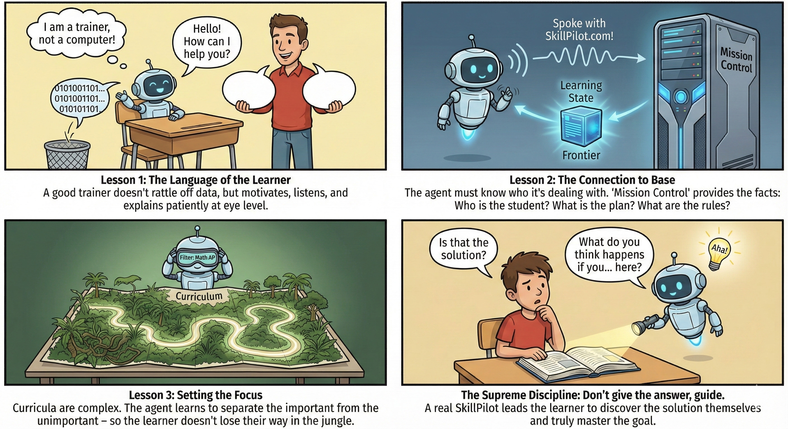
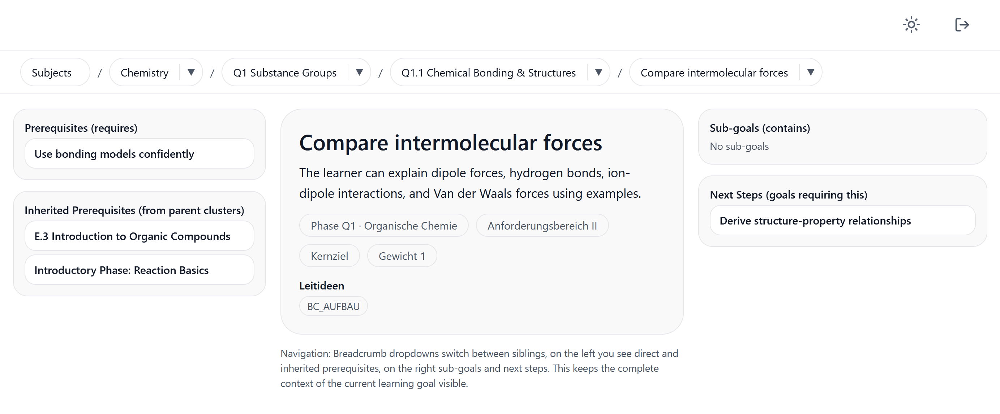

# SkillPilot Whitepaper (EN)

**Version:** 1.0.1
**Date:** December 2025  
**Project:** SkillPilot

---

## Summary

SkillPilot models curricula as a **skill graph**. Learners, teachers, and AI agents use this as a machine-readable map. This allows the learner to safely navigate from their current **skill state** to their **skill goals**. An AI agent guides them through **personalized curricula**. To do this, the system records learning achievements on atomic skill goals and derives the **mastery level** for higher-level topics from them. On this basis, the path via the **next attainable skill goals** leads systematically to individual educational objectives.

---

## 1. The Challenge: Individual Skill Navigation

Traditional education is based on curricula that are issued by the state or defined as part of **accreditation processes**. For teachers or professors, however, it is an immense **bookkeeping** challenge to record in a fine-grained way where each individual pupil or student stands in the skill landscape and how they are moving through it. This becomes particularly evident in introductory lectures with more than a thousand students. SkillPilot aims to close this “tool gap”.

---

## 2. The Shift: Leveraging Modern AI Agents

In the three years since ChatGPT went online in November 2022, the world of language-based AI has evolved rapidly. A sense of this pace can be gained from *Humanity's Last Exam*, the toughest AI benchmark to date. It was introduced in early 2025 to test AIs with thousands of extremely difficult expert questions for genuine logical reasoning rather than mere knowledge. While top models almost completely failed at the beginning of the year (below 10% success), leading AIs were able to increase this performance to around 50% by the end of the year.

As of the end of 2025, AIs are thus up to many of the subject-matter and language demands of what is taught in schools and universities. But they have limitations: they are not trained educators and they do not act like algorithmically exact bookkeeping programs that calculate and manage without error.

To ensure the algorithmic **precision** needed for **SkillPilot** when navigating learning objectives, a further trend works in our favor: the coupling of language AIs with classical software. Standards are emerging that allow AIs like ChatGPT to call the interfaces (APIs) of traditional programs in a targeted way.

From this, the approach for **SkillPilot** almost suggests itself: it is created as a hybrid application. A classical, exact piece of software takes over the precise “bookkeeping” and navigation of skill goals in the background. Leading language AIs are instructed (as SkillPilot GPT) to act as empathetic trainers in conversation with learners, but to rely on the exact logic of the software in the background for learning progress.

---

## 3. The Learning Agent: An Agent in Training

We do not view the SkillPilot AI Agent as a finished software product, but as an **apprentice**. It is currently learning its job as a trainer. We are currently working on teaching it four essential skills:

1.  **The Right Tone (Chat Persona):** A good trainer doesn't rattle off data. It must learn to speak the learner's language, motivate, and communicate at eye level.
2.  **The Wire to the Base (Backend Interaction):** The agent must not hallucinate who it is talking to. It needs to sync perfectly with "Mission Control". This is a two-way street: the backend communication must also work seamlessly to support the AI.
3.  **Navigating the Jungle (Curriculum):** Curricula are complex. The agent learns to use filters (e.g., "Math Advanced Course") to show a clear path. Simultaneously, we need to adjust the curriculum models to meet the agent's needs.
4.  **The Pedagogical Spark (Didactics):** The supreme discipline. The agent should not give away the answer, but guide. It learns to ask smart counter-questions so that the learner has an "Aha!" moment themselves.

---

## 4. The Technology: The Skill Graph

At the heart of SkillPilot lies the departure from linear lists towards a connected graph.

* **The Map (Nodes & Connections):** Learning objectives are nodes in a network. Connections define dependencies (“You must be able to do A before you learn B”) or hierarchies (“Topic area X includes skills Y and Z”).
* **The Frontier (Learning Boundary):** The system dynamically calculates the so-called “frontier” for each learner. This is the set of all skills for which the learner is *right now* ready—i.e. skills whose prerequisites they already fulfill but which they themselves do not yet master.

This prevents overload and ensures that the AI tutor does not make arbitrary jumps, but instead operates pedagogically sensibly within the next zone of development (zone of proximal development).

---

## 5. The Data Approach: Security & Privacy

A central pillar of SkillPilot is “privacy by design” through strict separation of data.

The classical algorithmic component—the **SkillPilot server**—knows the learner solely as a pseudonym (`skillpilotId`). Only technically necessary metadata are stored on this server: the learning progress achieved in the graph.

The actual dialog content is decoupled from the server. What information the learner discloses to the language AI in the conversation is their own responsibility. The only bridge to the real world is the teacher. The mapping table (“Who is which pseudonym?”) is stored exclusively locally on the teacher’s computer or in their protected storage, never centrally.

---

## 6. Almost like Blockchain: Chain of Custody
 
SkillPilot implements a **Chain of Custody** pattern to make learning achievements tamper-proof and traceable.
 
Since the AI Agent (SkillPilot GPT), in the currently implemented pattern, is the only actor evaluating learning success, it authenticates itself against the SkillPilot Backend. Only it has write access for learning achievements.
 
Learners can export their data (profile + progress) from the server at any time. These exports are **cryptographically signed** by the server. This ensures that data cannot be manipulated ("optimized") offline.
 
The approach becomes particularly powerful when exchanging data: When importing into another account (e.g., changing schools or restoring a backup), the complete **chain of data origin** (Data Provenance) is stored. A teacher can thus view the complete history in a homework assignment based on a template. Was the solution created by the student themselves? Or was a classmate's status imported and continued? The Chain of Custody makes this transparent without preventing the exchange.
 
---
 
## 7. Status Quo: Available Content
 
SkillPilot is not a theoretical exercise. The system already comes with extensive curricula that reflect official educational standards:

* **Schools (Hesse, Germany, Secondary I & II):**
    *   Gymnasiale Oberstufe (DE, Hessen, G9, Secondary II)
    *   Gymnasiale Mittelstufe (DE, Hessen, G9, Secondary I)
*   **University:**
    *   **Uni Mannheim:** Bachelor Business Administration (BWL), Bachelor Law, Master Law.
    *   **TUM:** Bachelor Physics, Master Theoretical and Mathematical Physics.
*   **Languages (CEFR):**
    *   English (CEFR A1-C2)
    *   French (CEFR A1-C2)

This content serves as a starting point and can be expanded by the community.

---

## 8. The Open Approach: Business Model & Invitation

To ensure broad acceptance and sustainable further development, SkillPilot is released as **open source software under the Apache-2.0 license**. This is a deliberate invitation to the traditional players in the education system.

The goal is to bring established stakeholders on board rather than displace them. Publishers of educational materials, teachers, professors, and educational institutions retain their sovereignty. They can modernize and make their proven content and curricula accessible via the SkillPilot technology without losing control to a closed platform.

**Initiator:**  
The legal entity behind SkillPilot is **enpasos GmbH**, a family-owned company that draws on two decades of consulting experience in classical software architectures. The motivation for SkillPilot stems from the personal experience of the family members, who have passed through the traditional German school and university system and know its challenges first-hand. We would be delighted to use this foundation together to better position ourselves for the education of the next generation.

---

