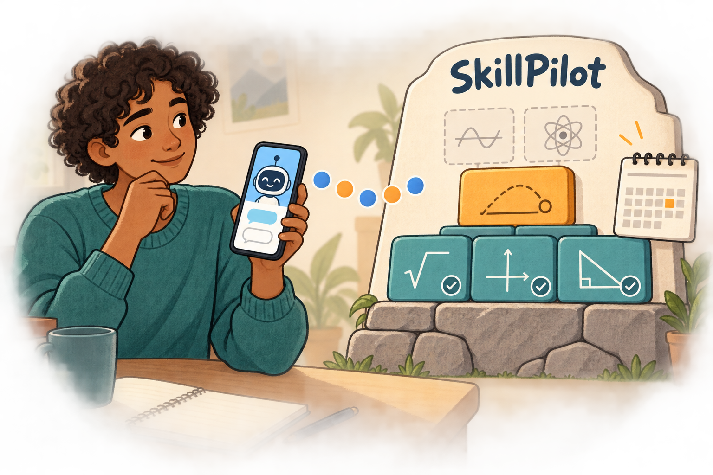
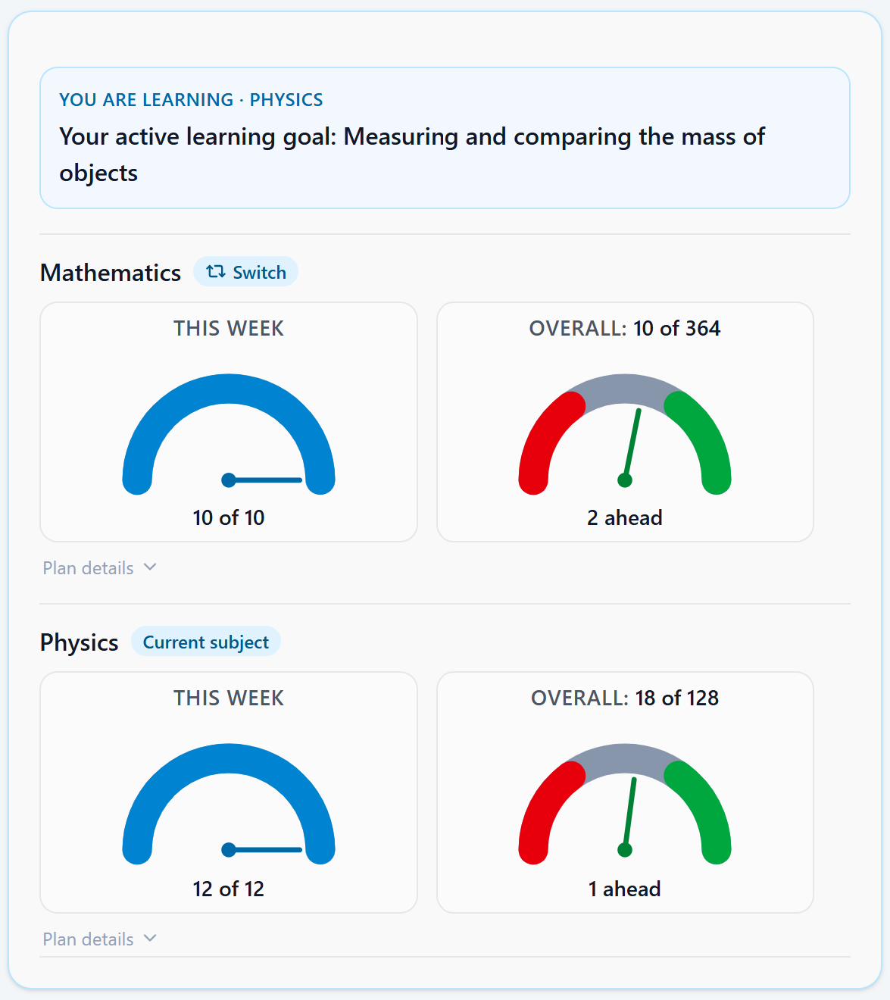

# SkillPilot Whitepaper (EN)

**Version:** 1.0.25 · **Project:** SkillPilot · *Some illustrations are AI-generated.*

---

**Knowledge you can build on. One learning goal at a time.**

Mathematics and Physics across the full upper-secondary stage of Germany’s Gymnasium – guided learning is already available with the Claude-based SkillPilot coach, including on your phone. After setup, SkillPilot automatically guides you through your Personal Curriculum, based on the selected official curriculum. Each learning goal builds on the foundations it requires.

Like a well-built house, each building block you understand supports what comes next. The coach guides you – the learning achievements are your own.

## Summary

**High educational expectations and individual support belong together.** SkillPilot aims to help learners actually achieve curricular goals: with solid foundations, an understanding of connections, and independent application. To do this, it turns existing curricula into a personal learning map. An AI learning coach explains, practices with learners, and discusses their solutions; SkillPilot manages learning progress and checks which state changes are permitted.

The foundation remains the **applicable curricula**, such as state curricula, module handbooks, or language standards. These are translated into a versioned **skill graph**: specific learning goals with subject-specific prerequisites. Progress is stored for individual goals and aggregated for broader topics. The current focus is on **Gymnasium in Germany**.

**Learning plans add a time frame to this navigation:** Which parts of the Personal Curriculum should be achieved by when? SkillPilot shows the **daily or weekly workload**, backlog, and work ahead for all planned subjects. Each subject is evaluated independently. The coach reports the status in chat and guides the learner to the next learnable goal, without requiring learners to manage plan sections or learning goals themselves (see section 3.4).

**Find the right material for the next learning step:** We are working to connect books, YouTube videos, and other learning materials to learning goals and plans. Teachers and learners should be able to choose suitable resources themselves. We are starting with Physik Libre (section 5.2).

Quality assurance combines traceable **automated checks** with **separately reported human trials** by Curriculum Champions. Changes and findings are handled through the **open-source workflow** (Issues/Pull Requests).

### From Curriculum to Personal Learning Map

In the web interface, learners select their educational context and subjects. This creates their Personal Curriculum. Their current learning focus can later change without losing progress already recorded.

### Join the Beta: SkillPilot Is Free, with Claude as Your Coach

**The beta is open to anyone interested aged 18 or over. SkillPilot itself is free; the AI learning coach requires your own Claude Pro account.** That subscription is purchased separately from Anthropic. The age limit comes from the [requirements for personal Claude accounts](https://support.claude.com/en/articles/8114491-get-started-with-claude).

**Learning in Claude chat already works on your phone — including Voice Mode.** After working independently with pen and paper, you can photograph your solution with your phone, share it with the SkillPilot coach in chat, and discuss it. Typing, speaking, and showing your own work complement each other.

Access is through the SkillPilot marketplace; the [5-minute Quickstart](https://skillpilot.com/quickstart/en) explains the setup. In SkillPilot’s responsive web interface, you select your Personal Curriculum, view your progress, and start the learning session. **[Try it now](https://skillpilot.com/quickstart/en)** and help shape the beta.

**SkillPilot is not tied to one particular AI.** Plugins and dedicated provider adapters connect the independent subject-matter core to each AI chat. Work on the ChatGPT integration is underway; it is not yet publicly available for learning. Further integrations depend on suitable interfaces and reliably supported capabilities at the provider. Stabilizing the ongoing Claude service takes priority.

---

## 1. The Challenge: From a Shared Curriculum to an Individual Learning Path

Education follows curricula defined by the state or through **accreditation**. In practice, however, there is a gap between the curriculum and learners’ actual starting points:

- Learners **do not start at the same point** (prior knowledge, pace, gaps).
- Teachers still have to guide **many people in parallel**, often in large cohorts.
- Learning goals usually exist **as text**, but not as a **navigable structure** with dependencies and sensible next steps.

This leaves some learners overwhelmed and others bored, while making it laborious to track learning progress and next steps accurately.

**A shared curriculum. Your own learning path.**

The goals remain ambitious; the support adapts to each learner’s starting point.

**When learners struggle, the guiding principle is to improve support rather than lower expectations prematurely.** SkillPilot connects the shared curriculum to individual learning progress: instead of “Calculus is still difficult,” it becomes clear which specific abilities are documented, which foundations are missing, and which step is available next. Teachers retain responsibility for teaching and assessment.

---

## 2. The Division of Responsibilities: AI Explains, SkillPilot Manages Learning State

**Shared preparation, individual learning support.** The skill landscape is built before learners use it, reviewed under the defined quality procedures, and then maintained continuously (section 5.1). Particularly capable AI systems can be used for the demanding work of analyzing and structuring curricula. This reusable groundwork benefits all learners. It does not have to be repeated for each person or in every learning session.

The AI that supports learners during learning is a separate choice. It must meet SkillPilot’s subject-matter, pedagogical, and technical requirements for learning guidance. It does not have to be the same system used to develop the skill landscape. The quality requirements for learning support apply regardless of that choice.

Language-based AI can explain concepts, formulate tasks, discuss solutions, and respond to questions in natural language. In a learning dialogue, it offers different approaches to a topic and adapts explanations to the learner’s responses.

Reliable learning guidance also needs an authoritative foundation: which goals belong to the curriculum, which prerequisites are met, and which progress has been recorded? SkillPilot manages these facts and rules in the backend.

The learning coach accesses these **authoritative backend rules** through defined tools. SkillPilot calculates reachable learning goals and plan status, checks permitted state changes, and stores confirmed progress. Subject-specific assessment in the dialogue remains an AI judgment and can contain errors; technical validation of a state change is not independent proof that a solution is correct.

The **plugin and adapter architecture decouples the subject-matter core from any particular AI provider**. Provider adapters expose tools through the **Model Context Protocol (MCP)**. A new AI integration must, among other things, load coach instructions, call tools reliably, handle authentication and learning sessions securely, and display the required images and learning cards. MCP standardizes tool access but does not guarantee these capabilities. Authoritative decisions about learning state, permissions, and navigation remain in the shared SkillPilot core; each specific integration is tested separately.

**The goal is freedom to choose among suitable AI environments.** In the future, this could include AI running locally on a learner’s own device, provided it has the required capabilities and a validated integration. Today’s Claude access is a concrete starting point, not a permanent architectural commitment to that provider. This does not imply that a local learning-coach integration is already available.

**SkillPilot is therefore a hybrid application:** The AI learning coach handles language understanding, explanations, and subject-specific feedback. Conventional software is responsible for learning state, permissions, navigation, and progress management.

---

## 3. The Product: How SkillPilot Works

The learning map becomes tangible when someone works on a goal, attempts their own solution, and discusses it. SkillPilot records which progress has been confirmed and which next steps are possible. This is how the graph, coach, and learning plan work together.

### 3.1 From Curriculum to the Next Learning Goal

SkillPilot replaces linear lists with a connected graph.

The separation of layers matters: the official curriculum remains the **normative source**. The versioned **skill graph** is the derived **operational model**. At runtime, the **backend state** is authoritative for current learning progress, the Personal Curriculum, current focus, active goal, and permitted transitions.

*From the application: the Cockpit shows the learning map alongside the current goal. A large task becomes a concrete next step. German curriculum shown.*

#### Four Levels of Personalization

SkillPilot separates the lasting learning scope from the current step:

1. **Base Curriculum (Level 1):** The selected base curriculum, such as “Gymnasium (DE),” provides the available set of goals.
2. **Personal Curriculum (Level 2):** Federal state, school stage, subjects, and, where applicable, duration and course model determine the personal learning scope. This selection is made in the SkillPilot web app, not in the coach chat.
3. **Learning Focus and Active Goal (Level 3):** A temporarily selected subset and exactly one current learning goal guide the ongoing work. The coach uses the options offered by the backend. Widening the focus requires consent; within confirmed plan-guided or autopilot learning, the next permitted goal can be selected automatically.
4. **Learning Progress / Mastery (Level 4):** Progress is stored against stable learning-goal IDs and is retained when the view or focus changes.

A subject-specific **composition view** arranges the canonical goals for the selected educational context. It distinguishes **learning goals within the personal scope (`target`)** from **prerequisites only (`prerequisiteOnly`)**. Only the former count toward the visible learning tree, goal selection, progress, and completion. Prerequisite-only goals retain their global mastery for prerequisite checks without becoming additional learning goals in that scope. For example, lower-secondary foundations can serve as prerequisites in an upper-secondary view where that role is explicitly modeled. Moving to a new school stage does not automatically certify these foundations; including them as learning goals in their own right requires an appropriately selected personal scope.

#### Connecting to Existing Curricula (Raw Input & Traceability)

SkillPilot does not “invent” curricula: curricula, module handbooks, or standards serve as **raw input** and are translated into a skill graph.

A formal mathematical specification and associated checks safeguard the structure, for example against cycles and contradictory dependencies. Whether a learning goal is correct in its subject and a prerequisite makes educational sense also requires content quality assurance (section 5.1).

This involves:

- **Operationalization:** Curricular requirements are translated into clearly defined subject-specific learning goals. The curriculum remains the standard, rather than automatically lowering expectations to match progress so far.
- **Source references:** Curricular goals are mapped to their sources, sections, and versions; the quality status reports the coverage achieved.
- **Navigability:** Prerequisites and hierarchies are modeled explicitly so that paths can be planned. The **overall graph** allows multiple educationally meaningful routes. Within a **selected scope** or a **modeled target route**, SkillPilot narrows the next steps to the appropriate subset. Explicitly modeled `prerequisiteOnly` foundations remain effective outside the learning focus as well. Optional **Strict Mode** additionally checks prerequisites globally.
- **Governance:** Changes currently flow through GitHub (Issues/PRs), with versioning through GitHub history (see section 6).

#### The Map: Nodes & Edges

- **Nodes:** Atomic skills (“can explain/apply X”) and clusters (topics/modules).
- **Edges:**
  - **Prerequisites:** “A before B”
  - **Contains/Part-of:** “X includes Y and Z”

#### Learning Modes: What Is Learned at a Node

Content learning goals, memorization nodes, and practice or assessment nodes place different demands on learners:

- **Understanding:** Ordinary content learning goals are explained and practiced with the AI learning coach.
- **Memorization:** Individual facts are memorized selectively using a modern flashcard approach.
- **Independent problem solving:** Practice and assessment tasks require independent work, for example on paper followed by a photo upload. In lower-secondary mathematics, year-level exams are organized under “Exams for Year …”; upper-secondary education adds appropriate course and Abitur exam tasks. The learning coach discusses solutions and assesses them according to the requirements of each task.

The graph can also include **orientation nodes for motivation and relevance**. These show concrete possibilities offered by the next topic and invite a personal response; they do not test subject knowledge. Their completion marker represents engagement with the orientation or an explicit wish to continue, not subject mastery. Merely selecting a suggested interest first starts the corresponding follow-up.

The **didactic route** in section 3.3 connects these nodes into a learning path. It describes how they work together, not an additional node type.

**Formal specification:** The mathematical definition of the graph, including acyclicity and Effective Requires, is publicly documented:
[Graph definition](https://enpasos.github.io/skillpilot/concept/skill-graph/graph-definition/)

#### Frontier: Next Reachable Steps

The **frontier** is calculated by the backend, not proposed by the AI: it comprises goals within the active learning scope that are not yet mastered and whose effective prerequisites are met. Prerequisite checks also include foundations explicitly modeled as `prerequisiteOnly` outside the visible learning scope. This computational unlocking of goals is not a psychological assessment of an individual’s learning potential.

### 3.2 Learning Through Dialogue and Recording Progress

**Think for yourself. Get support. Explain it yourself.**

The moment of understanding belongs to the learner.

The **SkillPilot Learning Coach** turns the selected goal into a concrete learning task. It explains, offers hints, asks follow-up questions, and discusses solution methods. It receives the current learning scope, frontier, and permitted transitions from the backend. **Learners still do their own thinking**: for example, solving a task with paper and pencil, photographing their solution, and then discussing the feedback. AI should support the necessary effort effectively, not replace it.

#### Making Understanding Visible

For subject-specific understanding goals, the coach asks for reasoning and explanations in the learner’s own words rather than only correct final answers. Drawing on Socratic dialogue and the **Feynman technique**, this approach aims to reveal gaps in understanding and support targeted further practice. It is a teaching approach, not evidence of the effectiveness of the overall system. This knowledge assessment explicitly does not apply to orientation nodes.

#### Mastery: Progress as an Evidence Model

The current Cockpit view separates ordinary flashcard practice from evidence-bearing **Verified Recall**.

**Mastery** is the backend-owned learning state for atomic goals, not a chat log. For ordinary learning goals, the coach reports a completion decision under the applicable evidence rules; the backend checks and stores the permitted state change. The Cockpit shows the recorded state. Orientation nodes use only a completion marker and do not certify subject mastery. For memorization nodes, mastery is derived from server-side card state and **Verified Recall**; ordinary flashcard practice changes only the repetition schedule. Cluster progress is a weighted aggregate of the contained goals.

The central state remains separate from complete dialogues and additional artifacts. Institutions can supplement it with further evidence through artifacts or references.

> SkillPilot makes progress visible — the institution decides which evidence has which consequences.

#### A Short Path from Feedback to Improvement

Does an explanation miss the point, is an exercise unclear, or does the coach behave differently than expected? **For supported subject-matter learning goals, you can give feedback directly in the Cockpit; the current goal is already linked to the feedback.** The feedback is critically reviewed during the next revision and considered for appropriate corrections. Learning experiences reach the place where the content and coaching can be improved. You do not need to be a Curriculum Champion to contribute. Please describe the specific problem without including private details or the full learning chat.

#### Learning Velocity

Learning Velocity shows how many **atomic goals** are newly recorded as mastered per week. It is an indicator of progress over time, not a measure of intelligence or a fixed trait of a child; learning goals can also require different amounts of effort. When new abilities become apparent after a longer initial learning phase, further steps can become available. **Recorded learning progress determines the next step — it is not a judgment of a child’s potential.** An earlier pace does not limit subsequent learning.

### 3.3 The Hybrid Learning Loop: Understanding + Memorizing + Practice

Not every learning goal is learned in the same way: concepts need understanding and application, facts need repetition, and many skills require **active work**, such as programming, calculating, or writing. Exams require precisely this kind of independent problem solving.

Within a context such as “Mathematics, Year 7” or “Advanced Physics Course, Hesse, Abitur Preparation,” **modeled learning routes** connect foundations to increasingly independent application. They are paths within the larger graph, not its only possible route.

One possible route leads from **orientation** through **guided understanding** to **independent application**. Necessary memorization can run in parallel; not every topic needs flashcards or its own orientation node. The prerequisites in the graph and the current learning state determine the next permitted step, not a rigid four-step sequence.

The schematic example in the appendix shows such a route from orientation through understanding to application, with memorization running in parallel, as it can be modeled in SkillPilot and exported as a PDF.

For content that needs to be recalled reliably — such as vocabulary, notation, or selected formulas — **spaced repetition** complements work with explanations and tasks. It replaces neither subject understanding nor independent application.

SkillPilot integrates a **flashcard drill engine** (SRS) for this purpose:

- **Competence loop:** The skill graph defines *what* comes next.
- **Memorization loop:** The drill engine controls *when* cards are reviewed (intervals, prioritization; for example, SuperMemo-2).

SkillPilot already includes practice and assessment nodes for suitable scopes. Their review status is part of the respective curriculum’s quality assurance. Further task formats, for example for programming, writing, or speaking, can be added.

### 3.4 From Curriculum to Everyday Learning: Learning Plans and Coach Guidance

**Your progress stays connected.**

The coach explains through conversation; SkillPilot keeps the curriculum, confirmed learning progress, and planning connected. It stores learning state, not the conversation.

A navigable curriculum does not yet answer the everyday question: **“What do I need to learn today or this week, and how far have I got?”** A learning plan connects progress already made, goals still open, and time remaining. It makes deviations from the planned pace visible and provides a basis for agreeing on more learning time, additional support, or a different rhythm. Individual learning therefore does not mean learning without commitments to a time frame. **The plan guides learning, but must not prevent it.**

#### The Teacher Plans the Framework

The **Personal Curriculum** defines which competencies belong to the selected educational context. The **learning plan** specifies which topics or groups of learning goals should be addressed within which periods. It complements the skill graph without replacing its goals or prerequisites. To work through an entire curriculum, the plan must cover its intended scope; completing a partial plan does not automatically mean completing the curriculum.

Under **“Course planning”**, teachers prepare learning sections, date ranges, buffer time, and milestones. Subject plans, for example for mathematics and physics, apply **together** but are evaluated **per subject**: each subject has its own daily or weekly target, and work ahead in one subject does not offset backlog in another. Switching the current subject does not deactivate another subject plan or impose an order such as “finish all of mathematics before physics.” Several plans of the same subject are merged; overlapping sections do not count the same goal twice. The learner chooses the time resolution in the Personal Curriculum learning configuration in the Cockpit.

The **learner preview** shows each subject’s daily or weekly target and an outlook over the next seven calendar days before changes are applied; in weekly mode, entries are grouped by calendar week. It uses the same calculation as the Cockpit and chat. Dates are scheduled on weekdays from Monday to Friday. Goal counts describe the workload, not learning minutes. The teacher reviews scope and workload and adjusts the plan when necessary.

Drafts initially remain on the planning device. Only explicit joint confirmation makes them effective for the learner; later draft edits do not silently alter ongoing learning. **Teaching coverage is not learner mastery:** recording “covered in class” does not establish individual competence.

#### Daily and Weekly Resolution

Learners choose between **1 day** and **1 week**. This setting applies consistently to the Cockpit, chat, learner-specific planning, and selection of the next planned goal:

- **Daily resolution:** The workload covers the current calendar day.
- **Weekly resolution:** The workload covers the current calendar week from Monday to Sunday. Learners can complete it at the start of the week, over the weekend, or spread it out. Earlier days within the same week do not create additional backlog.

The choice is saved for the SkillPilot ID; weekly resolution is the default. Switching changes the time frame of the evaluation while preserving plan dates and achieved learning progress. **Period workload and backlog are separate statements:** A daily or weekly target can be reached while backlog remains. Work ahead is taken into account within the same subject.

#### Plan Status in the Cockpit: Workload, Overall Progress, and Plan Balance

In plan mode, the Cockpit displays **two gauges with needles** for each subject. The left gauge shows the completed daily or weekly workload. Above the right gauge is the number of goals achieved across that subject's Personal Curriculum; its needle separately shows progress against the subject plan.

*Weekly Cockpit view with example data: both weekly workloads are complete. The numbers above the right gauges show overall progress; the needles and short labels below them show work ahead. Physics is the current subject.*

- **“Today” or “This week”:** The left gauge shows the fulfilled share of the daily or weekly workload as “x of y.” Blue represents the fulfilled share, grey the remaining share. Work completed ahead of time is credited, so the display does not count only goals newly completed during the current period.
- **“Overall: x of y”:** The number above the right gauge counts achieved atomic goals in the subject's current Personal Curriculum. Goals achieved before the learning plan began are included; each goal is counted only once within the subject. The needle below shows the **plan balance**: backlog on the left, “on track” in the neutral centre, and work ahead on the right. Its scale runs from red through grey to green and takes the subject's typical daily or weekly workload into account. The short label below the gauge gives the actual backlog or work ahead, even when the needle reaches either end of the scale. Missing source data is never presented as zero overall progress.

**Meeting the period workload does not automatically mean an older backlog has been cleared.** Likewise, a workload still open today or this week does not by itself create cumulative backlog. Each subject keeps its own balance. The active learning goal remains separately visible; an offered subject switch and expandable **“Plan details”** provide further orientation. The displays and status texts use the values calculated by SkillPilot that also inform the coach.

#### The Learner Works in Chat

With plan mode enabled and a valid learning session, SkillPilot handles the organization in the background:

1. **Orient:** The coach quotes the plan status formulated by SkillPilot verbatim: for each subject, the daily or weekly target and any backlog or work ahead. The Cockpit shows a short form of the plan balance beside the gauge; the coach does no arithmetic of its own. It announces the active learning goal separately, once, when the learning task begins.
2. **Resume automatically:** A valid ongoing goal is continued; otherwise, while the daily or weekly workload remains open, a due goal whose prerequisites permit learning is selected, if one is available. Joint activation can already select this first goal. No extra “Continue learning” click or manual goal search is needed.
3. **Learn and check progress:** The coach explains, sets tasks, and supports the work. Only progress recorded under the applicable evidence rules changes the learning state and thus the plan status. The plan-guided flow then leads to the next permitted step.
4. **Switch subjects or finish:** A request such as “Physics now” switches within the available subject options; other requirements remain in place. Once the period targets are reached, the coach acknowledges this and does not start another goal on its own. Reaching a daily or weekly target does not mean there is no backlog; in that case, the coach invites the learner to catch up without pressure. Further learning remains available on request, and future goals do not automatically become extra duties for the current period. The plan status explicitly identifies plans that cannot be evaluated instead of presenting them as complete.

A status-only question does not start a new task; a requested pause remains a pause. If prerequisites or invalid planning block open goals, the coach reports the blockage instead of inventing a completed daily or weekly workload or a replacement duty. Plan corrections remain on the planning side. An expired learning session still requires a fresh start through SkillPilot; chat guidance does not extend the session.

#### Example: Mathematics and Physics on the Same Day

An **illustrative daily example**, not live data: in mathematics, 13 plan goals are scheduled through today and 9 progress-effective plan goals have been achieved; in physics, 10 are scheduled and 11 have been achieved. The **plan balance** also counts plan goals scheduled for later, but excludes goals already mastered when the plan was created. By contrast, “Overall: x of y” in the Cockpit covers all current atomic goals in the Personal Curriculum, including earlier achievements.

| Subject | Daily workload | Additional plan status |
|---|---|---|
| Mathematics | 1 of 3 | 2 learning goals behind |
| Physics | 2 of 2 | 1 learning goal ahead |

The two mathematics goals still open today and the additional backlog are shown separately. Work ahead in physics does **not** offset the mathematics backlog. “Ahead” describes the amount of progress, not mastery of every item scheduled earlier; earlier open goals remain available for goal selection.

On a weekly basis, the same rule applies to the amount due by the end of the current week, the weekly workload, and completions during that week, so the figures may differ. The coach names the active goal separately from plan status: **“Your active learning goal: …”**. Completing a daily or weekly workload does not prevent further learning.

This turns the curriculum into a guided learning path: **The teacher is responsible for scope and timing, SkillPilot calculates the next permitted steps, the coach leads the dialogue, and the learner concentrates on learning.**

---

## 4. Trust Architecture: Security & Integrity

Anyone who entrusts their learning journey to a digital system should know which data goes where — and what the recorded evidence actually shows.

### 4.1 Data Approach: Security, Privacy & Sovereignty by Design

The data used in the learning process serve different purposes and require different protections. SkillPilot separates **permanent pseudonymous identity**, the **short-lived learning session**, **authorization of the AI integration**, and **authoritative learning state**. The chat service receives the learning context it needs, not the permanent SkillPilot ID.

#### Pseudonym Instead of Identity

Learning progress is managed under a permanent **pseudonymous SkillPilot ID**. This does not require registering a name or email address with SkillPilot. The ID also serves as a secret access key to the learning profile: it should be backed up as a protected ID file and must not be shared in chats or public feedback. The coach integration does not send it to the AI provider. The chat service requires its own account, and its access conditions also apply.

#### Session Shielding Toward the AI Frontend

Starting the **SkillPilot Learning Coach** from the SkillPilot web app creates a new random `learningSessionId` with an absolute lifetime of 24 hours. It connects the prepared chat to the confirmed learning context without exposing the permanent SkillPilot ID. The learner does not need to copy or manage any technical value. Its lifetime is extended neither by use nor by an OAuth refresh. The session uses the German or English communication language set in the confirmed context. OAuth authorizes the integration; the learning session determines the learning context.

Learner-specific access **through the coach integration** requires both an admitted, authenticated integration and a valid learning session. App authorization alone does not grant access to learning progress; a learning session alone does not authorize the app to access it. The SkillPilot web app has separate access paths for configuration, navigation, and data management.

#### Dialogue Content Is Decoupled

The learning-coach dialogue stays with the respective AI provider. Answers, solution steps, and free-text assessment explanations are not sent to the SkillPilot backend through the coach tools. To track learning progress, SkillPilot processes structured completion decisions and, where applicable, authorized numerical exam scores.

Conversely, the provider receives the learning context it needs, such as the current goal, relevant progress, and tool results. **Separating the ID does not mean that no learning data reaches the AI provider.** Its terms govern chat and context processing. Explicitly submitted learning-goal feedback is a separate process, not an automatic import of chat content.

**Recommendation for educational institutions:**
Set clear guidelines on which data should not be shared in learning-coach chats (sensitive personal information) and how to support learners safely.

#### Mapping Inside the Institution (Local)

The mapping “who is which pseudonym?” stays with the institution or teacher and is stored **locally**, for example in protected storage — not centrally.

#### AI Frontend / Provider Boundary

Claude and ChatGPT have separate adapters with their own authentication and session boundaries. Each provider is responsible for operating the chat and processing the dialogue. The shared SkillPilot core remains responsible for the curriculum, learning state, and learning rules.

Separating the domain core from provider integrations keeps learning state and rules independent of the chat provider. Other hosts can build on this core but require their own validated integration. MCP alone guarantees neither compatible behavior nor suitability in terms of data protection or institutional requirements. Every integration must meet the requirements for tool use, privacy, session separation, and reliable learning guidance.

### 4.2 Backing Up Learning Progress: Integrity and Provenance Information

Learners can export their profile, including learning progress and learning plans. The server protects the export against modification using **HMAC-SHA256** and verifies this protection on import. This is server-verifiable integrity protection, not a signature that can be independently verified using a public key.

On import, existing source profiles and import timestamps can be retained as **provenance information**. This is not a complete history of every assessment or state change, and it does not include the underlying learning dialogues.

**An unchanged export does not prove that every recorded assessment is correct in its subject.** It supports backup, transfer, and traceability; institutional recognition requires its own rules and, where appropriate, additional evidence.

---

## 5. The Ecosystem: Content & Standards

### 5.1 Current Focus: Gymnasium in Germany

SkillPilot’s current development and content focus is **Gymnasium, Germany’s academic secondary school track, across all 16 federal states**. The shared “Gymnasium (DE)” entry provides access to subject-level skill graphs through state-specific mappings and views. Shared competencies are grouped by subject, while differences between state curricula, school stages, and course profiles remain represented. Shared learning goals are therefore maintained once rather than separately for every federal state; subject-specific improvements can benefit all state views built on those goals.

The extent of development varies by subject:

- **Mathematics and Physics** are the most advanced. They are the main focus of development across lower and upper secondary education.
- **Chemistry and Biology** are the next priorities. They also have shared subject curricula with state-specific mappings, but their development is not yet as broad.
- **Other Gymnasium subjects** are present at varying stages of development and are being expanded gradually.

Coverage and quality are reported by subject, year group, and federal state. The current subject coverage and quality evidence for the specific area selected are reported in the [Curriculum Directory](https://skillpilot.com/curricula) and the generated quality status.

The machine-readable maturity levels **M0 to M7** assess, among other things, graph integrity, federal-state coverage, route coverage, assessment-ready tasks, and memory-card traceability. A maturity level always applies only to the precisely named scope and content version. Equal maturity levels can therefore coexist with different breadths of subject development.

**M7 means fully completed machine quality assurance, not human approval.** In addition to continuing to meet M6, every current individual content goal (`curricularAtomic`) must satisfy all five gates:

- **D — Descriptions:** Two independent reviews with resolved decisions.
- **P — Understanding profiles:** Reviewed requirements for what demonstrates understanding of a goal. This is curriculum QA, not a retrospective review of individual chat answers.
- **A — Atomicity:** A subject-specific justification for treating the competence as a single learning goal.
- **M — Memory:** A justified decision on whether any content needs to be memorized and, if so, which content.
- **V — Visualizations:** A subject-specific AI image review of the current image with valid content bindings, or an explicitly permitted subject-specific exception.

What counts is the **intersection of all five gates across the current goal set**, together with passed final validation checks and no open M7 blockers. Evidence is bound to the reviewed content and context; changes may require targeted re-review. **Physics (Gymnasium, Germany) has reached M7.** The currently valid status remains verifiable in the [quality report](https://enpasos.github.io/skillpilot/qa-ci/status/curriculum-quality-status/).

100% means complete coverage by this QA process, not guaranteed freedom from errors or demonstrated classroom effectiveness. The [quality and human-trial concept](https://enpasos.github.io/skillpilot/concept/curriculum-quality-and-human-trial/) explains the binding rules.

The repository also contains content for other school types, higher education, and CEFR-based language learning. These illustrate how the approach transfers to other settings, but they are not the current development focus.

**Curriculum Champions (a link to practice):**

- Champions take responsibility for a curriculum or a **clearly scoped topic area**.
- They **work through learning goals themselves** and report errors or unclear content directly on the relevant goal wherever a feedback entry is available.
- Larger, cross-cutting or technical topics, and feedback on other curricula, are collected on GitHub.
- The Champion role is voluntary. Public goal feedback does not require Champion registration or a GitHub account.
- Champion profiles show learning progress and available quality status, not rankings by feedback volume or Issues/PRs.

**Human trials are a separate attribute, not M8.** They can start at the core QA level M5 and do not have to wait for M7. Existing learning progress by an active Champion in the assigned scope, or an explicitly confirmed start, counts as “Human QA in progress,” provided the trial is not paused; the registration date is irrelevant. “Human-tested,” by contrast, requires evidence of a complete run-through, no open blocking findings, and explicit confirmation of completion. M7 alone does not meet these conditions.

The QA process covers more than curricula: the SkillPilot AI learning coach is continuously evaluated and improved in ongoing use to keep learning reliable and educationally meaningful across real curricula.

> A clearer learning route can begin with your feedback. Choose a manageable topic area, work through the goals yourself, and report where questions remain. **[Become a Curriculum Champion](https://skillpilot.com/curricula)** and contribute your subject expertise to our shared development work.

### 5.2 One Goal, Different Approaches: Finding Suitable Materials

**One learning goal. Different ways to understand.**

*Vision · in development*

**External learning materials are connected to the curriculum, not built into it.** A separate mapping layer connects explanations, tasks, books, videos, and interactive resources to suitable learning goals and, through them, to learning plans. Materials can remain where they are already published. The shared competence structure remains independent of individual providers and resources.

**Teachers and learners should be able to select, combine, and switch suitable materials.** Teachers can contribute their subject expertise and pedagogical experience by selecting resources that fit their lessons and the needs of their learning group. At the same time, learners retain room for their own approaches and material choices. Teachers’ pedagogical design and learners’ independence complement each other.

Selecting materials or switching providers changes neither curricular learning goals nor progress already recorded. The integration is optional; opening a resource is not evidence of competence. Free and paid resources use the same architectural framework. Selecting a resource grants neither additional usage rights nor automatic access to its contents by the AI.

**SkillPilot aims to support the purposeful use of existing educational resources, not take them over.** OER initiatives, publishers, educational portals, and other contributors with relevant expertise should be able to map their materials to suitable learning goals without providing a complete progress-management system themselves. Making open educational resources accessible and helping people actually build skills belong together.

The architectural framework is defined. The details of mappings and exchange formats are being explored with real resources and are intended to be developed together with the people who create and use those materials. We are starting with [**Physik Libre**](https://physikbuch.schule/). This starting point requires neither complete resource coverage nor an agreed partnership with the provider.

*Further reading: [Content integration architecture](https://github.com/enpasos/skillpilot/blob/main/docs/concept/skill-graph/content-integration.md).*

### 5.3 SkillPilot in the Bologna/EHEA Context (Short Overview)

Beyond the current Gymnasium focus, the model can also be applied to higher education. Bologna/EHEA sets the framework for **outcomes, transparency, recognition, and quality** in higher education. SkillPilot can support these goals, but it does not replace institutional decisions.

- **Learning outcomes / competencies:** Contribution: Make outcomes navigable as a skill graph and progress visible. Limits/prerequisites: Sound modeling, source references, and versioning.
- **Credits/workload (ECTS logic):** Contribution: Support paths, prerequisites, and workload transparency. Limits/prerequisites: **No credit awarding**; rules remain institutional.
- **Recognition/mobility:** Integrity-protected exports support the transfer of documented learning progress. They are not publicly verifiable achievement certificates; recognition remains an institutional process with its own evidence requirements (section 4.2).
- **Quality assurance:** Contribution: Signals about obstacles and paths to inform teaching development. Limits/prerequisites: QA processes and transparent AI rules are required.

## 6. Governance & Community: Open Source & Invitation

**Better together. Join in.**

Try it yourself, find the stumbling blocks, improve it together: feedback in the Cockpit is linked to the learning goal and reviewed during the next revision. Learners and Curriculum Champions bring the learning map into practice.

**An idea rooted in the open education movement.** SkillPilot’s original idea was presented and discussed at the OER conference in Berlin in 2013 under the theme “Education in a Landscape of Skills” (German: “Bildung in einer Landschaft aus Fähigkeiten”). Individual goals, existing knowledge, and skills that build on one another were already central to that approach. Today’s project revisits the idea using modern AI: connecting a shared knowledge foundation with individual learning support. The [2013 presentation](https://de.slideshare.net/slideshow/oer-2013-skillpilot/26948355) documents the original approach.

Openness extends beyond software: it and the technical infrastructure are available under **[Apache 2.0](https://github.com/enpasos/skillpilot/blob/main/LICENSE)**. We release our own skill landscapes, tasks, learning cards, curated link descriptions, educational media, and this whitepaper under **[CC BY 4.0](https://github.com/enpasos/skillpilot/blob/main/LICENSES/CC-BY-4.0.txt)**, to the extent the relevant rights exist and we can grant them. Third-party content and private user data are not covered by these grants; the [licensing scope](https://github.com/enpasos/skillpilot/blob/main/LICENSING.md) explains the boundaries. The aim is an openly inspectable educational infrastructure that can be developed collaboratively and that schools, specialists, and public institutions can build on.

- Institutions retain **sovereignty** over curricula and content.
- Reviewed visualizations, tasks, and memory decks can already be linked directly to learning goals; further content formats can be added.
- Open interfaces enable contributions and integration.

Changes to curricula and software are versioned and reviewed through **GitHub and pull requests**. The quality evidence and practical feedback described in section 5.1 provide the basis; additional institutional subject reviews can build on them.

Good individual learning support should not depend on how much help parents can provide themselves or afford privately. **SkillPilot itself is free.** Current Claude access lets adults aged 18 or over try the approach today; the required Claude Pro subscription is paid for separately.

**The long-term goal is age-appropriate learning support that is free for school students, including the AI it requires.** This needs suitable access arrangements and sustainable funding that does not depend on payments from families. The current trial access does not yet achieve that goal. Paid supplementary resources can remain an optional choice but must not become a prerequisite for a learning path that can be used free of charge.

**The next step is practical exploration together with learners, teachers, and educational partners.** It can begin with interested adults using the current access and develop through collaboration with OER initiatives, out-of-school education providers, and learning mentors. Research partners can support the study of educational effectiveness; companies and foundations can contribute as development or funding partners. These possibilities do not imply any partnerships have already been agreed.

School-led use remains an important application and requires suitable access, including age-appropriate arrangements. Across the different learning settings, evaluation must establish whether SkillPilot improves understanding, independent problem solving, and lasting learning, and whether it effectively supports learners whose potential has previously been underestimated. Technical functionality, initial user experiences, and completed curriculum QA do not establish that evidence in advance.

**Initiator:**
The organization behind SkillPilot is **enpasos GmbH**. We invite partners to develop SkillPilot further together — in subject content, teaching, and technology.

**Try it and help shape it:** The [Quickstart](https://skillpilot.com/quickstart/en) guides you through the open Claude beta. Create or load your SkillPilot ID, back it up as a protected ID file, and select your Personal Curriculum. No additional registration with a name or email address is required at SkillPilot.

**Keep your ID file safe:** The ID grants access to the learning profile and must not be shared publicly.

**More transparency:**
[GitHub](https://github.com/enpasos/skillpilot)
[Documentation](https://enpasos.github.io/skillpilot/)
[Graph definition](https://enpasos.github.io/skillpilot/concept/skill-graph/graph-definition/)

---

## Appendix: A Modeled Learning Route

*A schematic detail for section 3.3: orientation, understanding, and independent application are connected by prerequisites; necessary memorization runs in parallel. The graph and current learning state determine the next permitted step, not a rigid sequence.*
