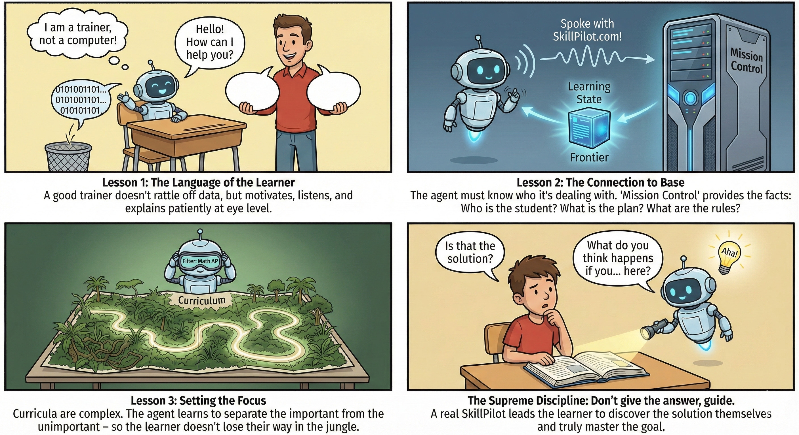

# SkillPilot Whitepaper (EN)

**Version:** 1.0.7
**Date:** January 2026
**Project:** SkillPilot

---

## Summary

SkillPilot connects to **existing curricula** and uses them as the **source of truth** (e.g., state curricula, module handbooks, standards like CEFR). SkillPilot does not replace these standards; it translates them into a machine-readable **skill graph**. Learners, teachers, and an AI tutor use this as a map. This allows the learner to move safely from their current **skill state** to their **skill goals**. The AI tutor guides the dialog and relies on the **exact backend logic** for learning status, rules, and next steps.

To achieve this, the system records learning achievements on atomic skill goals and derives the **mastery level** for higher-level topics. On this basis, the path via the **next attainable skill goals** leads systematically to individual educational objectives.

---

## 1. The Challenge: Individual Skill Navigation Does Not Scale

Education follows curricula that are defined by the state or through **accreditation**. In practice, there is a gap between curriculum and learning reality:

* Learners do not start at the same point (prior knowledge, pace, gaps).
* Teachers still have to guide **many people in parallel**, often in large cohorts.
* Learning goals usually exist **as text**, but not as a **navigable structure** with dependencies and sensible next steps.

This leads to overload for some, boredom for others, and high effort to track learning states and next steps.

SkillPilot closes this **tool gap**: outcome-oriented navigation in the curriculum without turning teachers into "bookkeepers." SkillPilot builds on the **existing curriculum** - it does not create new standards, it makes existing standards operational and navigable.

---

## 2. The Shift: Leveraging Modern AI Agents

In the three years since ChatGPT went online in November 2022, the world of language-based AI has evolved rapidly. A sense of this pace can be gained from *Humanity's Last Exam*, the toughest AI benchmark to date. It was introduced in early 2025 to test AIs with thousands of extremely difficult expert questions for genuine logical reasoning rather than mere knowledge. While top models almost completely failed at the beginning of the year (below 10% success), leading AIs were able to increase this performance to around 50% by the end of the year.

As of the end of 2025, AIs are thus up to many of the subject-matter and language demands of what is taught in schools and universities. But they have limitations: they are not trained educators and they do not act like algorithmically exact bookkeeping programs that calculate and manage without error.

To ensure the algorithmic **precision** needed for **SkillPilot** when navigating learning objectives, a further trend works in our favor: the coupling of language AIs with classical software. Standards are emerging that allow AIs like ChatGPT to call the interfaces (APIs) of traditional programs in a targeted way.

From this, the approach for **SkillPilot** almost suggests itself: it is created as a hybrid application. A classical, exact piece of software takes over the precise "bookkeeping" and navigation of skill goals in the background. Leading language AIs are instructed (as SkillPilot GPT) to act as empathetic trainers in conversation with learners, but to rely on the exact logic of the software in the background for learning progress.

---

## 3. The AI Tutor: An Agent "In Training"

The SkillPilot AI tutor is not a finished product but a **trainer in training**. Four abilities are central:

1. **Tone (Chat Persona)**  
   Motivate, explain clearly, meet learners at eye level.

2. **Mission Control (Backend Interaction)**  
   Learning state, rules, and next steps are **not guessed** but pulled from the backend.

3. **Curriculum Navigation**  
   Complex curricula are reduced to meaningful paths via filters (e.g., track, level). The curriculum remains the reference; only the **machine-readable mapping** is improved (granularity, references, dependencies).

4. **Didactics**  
   Do not spoon-feed, but guide: good questions, make errors visible, foster transfer - until the "aha" moment.

**Quality principle:** SkillPilot is primarily **formative** (feedback/practice/orientation). For **high-stakes** (grades, recognition), institutional rules and possibly human-in-the-loop are required.

---

---

## 4. The Technology: The Skill Graph

SkillPilot replaces linear lists with a connected graph.

### 4.1 Plugging into Existing Curricula (Raw Input & Traceability)

SkillPilot does not "invent" curricula: curricula, module handbooks, or standards serve as **raw input** and are translated into a skill graph.

This is about:

* **Operationalization:** learning outcomes are broken down into atomic skill goals (without changing the standard).
* **Traceability:** each skill remains traceable to source/section/version.
* **Navigability:** prerequisites and hierarchies are modeled explicitly so paths are plannable (didactic prereqs possibly as **overlays**).
* **Governance:** changes currently run via GitHub (Issues/PRs), versioning via GitHub history (see section 10).

### 4.2 Map: Nodes & Edges

* **Nodes:** atomic skills ("can explain/apply X") and clusters (topics/modules).
* **Edges:**
  * **Prerequisites:** "A before B"
  * **Contains/Part-of:** "X includes Y and Z"

### 4.3 Frontier: Next Reachable Steps

SkillPilot computes the **frontier**: skills whose prerequisites are met but not yet mastered.  
This avoids jumps and keeps learning in the zone of sensible next steps.

### 4.4 Focus Instead of Distraction

The graph acts as a **focus filter**: from the total set, only the content that fits the goal and current state is shown - the **next feasible step** instead of "everything at once".

### 4.5 Mastery: Progress as an Evidence Model

**Mastery** is not a logbook but a derived status from learning interactions. For interoperability, a simple evidence model helps:

* **Formative:** tutor dialogs, in-chat tasks, quick checks.
* **Optional stronger:** quizzes, task series, artifacts (solution steps/code/short text), oral checks.
* **Optional review:** skills can later require a re-check.

> SkillPilot makes progress visible - the institution decides which evidence has which consequences.

### 4.6 Learning Velocity

Learning velocity shows how many **atomic goals** are newly mastered per week - a simple indicator of rhythm and continuity.

  

---

## 5. The Hybrid Learning Loop: Understanding + Memorizing + Practice

Not every learning goal is learned the same way: concepts need understanding and application, facts need repetition - and many skills need **active doing** (e.g., programming, calculating, writing).

The skill graph models understanding and dependencies. For pure memorization (vocabulary, formulas, facts), **spaced repetition** is more efficient.

  

SkillPilot integrates a **flashcard drill engine** (SRS):

* **Competence loop:** the skill graph defines *what* comes next.
* **Memorization loop:** the drill engine optimizes *how* to repeat (intervals, prioritization; e.g., SuperMemo-2).

In addition, other learning modes are needed for "doing" skills: the tutor should send learners into suitable **practice formats** (e.g., problem sets, programming tasks, writing/speaking exercises) and then guide them back in chat for evaluation, feedback, and transfer.

---
## 6. Data Approach: Security & Privacy by Design

A central pillar of SkillPilot is **data separation**.

### 6.1 Pseudonym Instead of Identity

The **SkillPilot server** knows learners only as a pseudonym (`skillpilotId`).  
On the server, only technically necessary metadata are stored, e.g., learning progress in the graph.

### 6.2 Dialog Content Is Decoupled

The dialog content (tutor conversations) is decoupled from the SkillPilot server, keeping the central data store minimal.

**Recommendation for educational institutions:**  
Clear guidelines on which data should not be shared in tutor chats (sensitive personal data) and how learners are supported safely.

### 6.3 Mapping Inside the Institution (Local)

The mapping "who is which pseudonym?" stays with the institution/teacher and is stored **locally** (e.g., in protected storage) - not centrally.

### 6.4 AI Frontend / Provider Choice (Sovereignty)

The tutor dialog happens in the respective AI frontend (currently: ChatGPT as the reference integration) and is subject to its operational and privacy framework.  
For contexts with higher sovereignty requirements, alternative AI backends up to local models are planned. They must reliably meet the required properties (tool use, stability, structure, didactics).

---

## 7. Chain of Custody: Integrity & Traceability

To keep learning states **portable** and **verifiable**, SkillPilot uses a **chain-of-custody** pattern.

* Tutor instances authenticate to the backend.
* Write access for progress updates is granted only to **authorized actors** (current pattern: the tutor as the writing actor).

### 7.1 Signed Exports

Learners can export profile + progress.  
The server **cryptographically signs** these exports so offline manipulation is detectable.

### 7.2 Data Provenance on Import

On import (e.g., transfer, backup), the full **provenance chain** can be carried along. This makes it visible whether a state was continued or taken from elsewhere.

**Important:** Chain of custody protects integrity and provenance - it is a **transparency tool**, not a complete fraud-prevention system.

---

## 8. Status Quo: Available Content (Examples)

SkillPilot is not just a concept: it already contains curricula/standards as starting points that reflect **official requirements**.

### Schools (Hesse, Germany, Secondary I & II)
* Gymnasiale Oberstufe (DE, Hessen, G9, Secondary II)
* Gymnasiale Mittelstufe (DE, Hessen, G9, Secondary I)

### Higher Education (Bologna-relevant)
* Uni Heidelberg: Bachelor Biosciences, Master Molecular BioSciences
* Uni Mannheim: Bachelor Business Administration (BWL), Bachelor Law, Master Law
* TU Darmstadt: Bachelor Computer Science
* TU Munich: Bachelor Mathematics, Bachelor Physics, Master Theoretical and Mathematical Physics

### Languages (CEFR A1-C2)
* English (A1-C2)
* French (A1-C2)

The content is extensible and versioned; source references are documented, and changes currently flow through GitHub (Issues/PRs).

---

## 9. SkillPilot in the Bologna/EHEA Context (Short Overview)

Bologna/EHEA sets the framework for **outcomes, transparency, recognition, and quality** in higher education. SkillPilot can support these goals, but it does not replace institutional decisions.

| Bologna/EHEA building block | SkillPilot contribution | Limit / prerequisite |
| --------------------------- | ----------------------- | -------------------- |
| Learning outcomes / competencies | Make outcomes navigable as a skill graph; progress visible. | Clean modeling, source references, versioning. |
| Credits/workload (ECTS logic) | Support paths/prereqs and workload transparency. | **No credit awarding**; rules remain institutional. |
| Recognition/mobility | Evidence + signed exports as preparation/support. | Recognition remains a formal process. |
| Quality assurance | Signals about hurdles/paths for curriculum development. | QA processes + transparent AI rules required. |

---

## 10. Open Approach: Open Source, Governance & Invitation

SkillPilot is released as **open source** under the **Apache-2.0 license** - an invitation to include established stakeholders rather than displace them:

* Institutions retain **sovereignty** over curricula and content.
* Coupling content to skill goals is possible in the future.
* Open interfaces enable contributions and integration.

**Governance (currently via GitHub):**
* Discussion/feedback runs through **GitHub Issues**.
* Changes to the curriculum/graph run through **pull requests** (review on GitHub).
* **Versioning** follows GitHub history; **curriculum sources** are referenced.
* More advanced governance mechanisms (e.g., expert review boards, QA processes, overlays) are possible in the future.

**Initiator:**  
The legal entity behind SkillPilot is **enpasos GmbH**. We invite partners to develop SkillPilot further together - in content, didactics, and technology.

---
