# SkillPilot Whitepaper (EN)

**Version:** 1.0.18
**Date:** April 2026
**Project:** SkillPilot

---

## Summary

SkillPilot connects to **existing curricula** and uses them as the **normative source of truth** (e.g., state curricula, module handbooks, standards like CEFR). SkillPilot does not replace these standards; it translates them into a versioned, machine-readable **skill graph** as an operational model. Learners, teachers, and an AI learning coach use this graph as a machine-readable map. This allows the learner to move safely from their current **skill state** to their **skill goals**. Runtime authority for learning state, active filters, rules, and next steps sits in the backend state; the AI learning coach leads the dialogue by relying on this **exact backend logic**.

To achieve this, the system records learning achievements on atomic skill goals and derives the **mastery level** for higher-level topics. On this basis, the path via the **next attainable skill goals** leads systematically to individual educational objectives.

Quality assurance is anchored in a practice-driven **Champion program** and the **open-source workflow** (Issues/PRs).

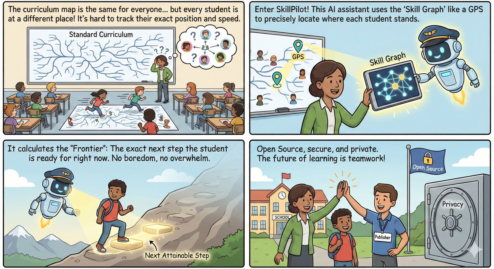

### SkillGraph Processing

SkillGraph Processing structures curricula and competence models into dependency-aware learning landscapes that can be validated, explored, and used by humans or AI agents.

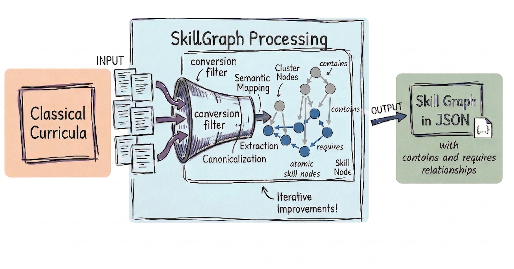

### SkillPilot Learning Coach

SkillPilot Learning Coach guides learners through those landscapes with frontier-based next steps, mastery tracking, and contextual learning-coach support.

**How to read this whitepaper:** Unless stated otherwise, the text describes the current state. Phrases such as *planned*, *in the roadmap*, or *in later stages* mark forward-looking items.

---

## 1. The Challenge: Individual Skill Navigation Does Not Scale

Education follows curricula that are defined by the state or through **accreditation**. In practice, there is a gap between curriculum and learning reality:

- Learners do not start at the same point (prior knowledge, pace, gaps).
- Teachers still have to guide **many people in parallel**, often in large cohorts.
- Learning goals usually exist **as text**, but not as a **navigable structure** with dependencies and sensible next steps.

This leads to overload for some, boredom for others, and high effort to track learning states and next steps.

SkillPilot closes this **tool gap**: outcome-oriented navigation in the curriculum without turning teachers into "bookkeepers." SkillPilot builds on the **existing curriculum** - it does not create new standards, it makes existing standards operational and navigable.

---

## 2. The Shift: Why Hybrid AI Systems Are the Right Approach

Since late 2022, the world of language-based AI has developed rapidly. A sense of this pace is provided by a look at *Humanity's Last Exam*, the toughest AI benchmark to date. Introduced in early 2025 to test AI systems with thousands of extreme expert questions for true logical reasoning rather than mere knowledge, leading models were still failing almost completely at the beginning of the year (under 10% success), but were able to quintuple this performance to about 50% by year-end.

As of **December 2025**, leading AI systems are thus professionally and linguistically up to many topics taught at schools and universities. But they have limits: They are not trained pedagogues and do not work like algorithmically exact bookkeeping programs that calculate and manage without error.

To ensure the algorithmic **precision** required for **SkillPilot** in navigating learning goals, another trend benefits us: coupling language models to classical software. Standards are being established that allow systems like ChatGPT to specifically call interfaces (APIs) of classical programs.

The approach for **SkillPilot** follows almost automatically: it emerges as a hybrid application. Classical, exact software handles the precise "bookkeeping" and navigation of skill goals in the background. Leading language models are instructed (as SkillPilot GPT) to speak with learners as empathetic learning coaches, but use the software's exact logic in the background for learning progress.

---

## 3. The Product: How SkillPilot Works

### 3.1 The Technology: The Skill Graph (Operational Model & Frontier)

SkillPilot replaces linear lists with a connected graph.

The separation of layers matters: the official curriculum remains the **normative source**. The versioned **skill graph** is the derived **operational model**. At runtime, the **backend state** is the authoritative source for current learning state, active filters, and allowed transitions.

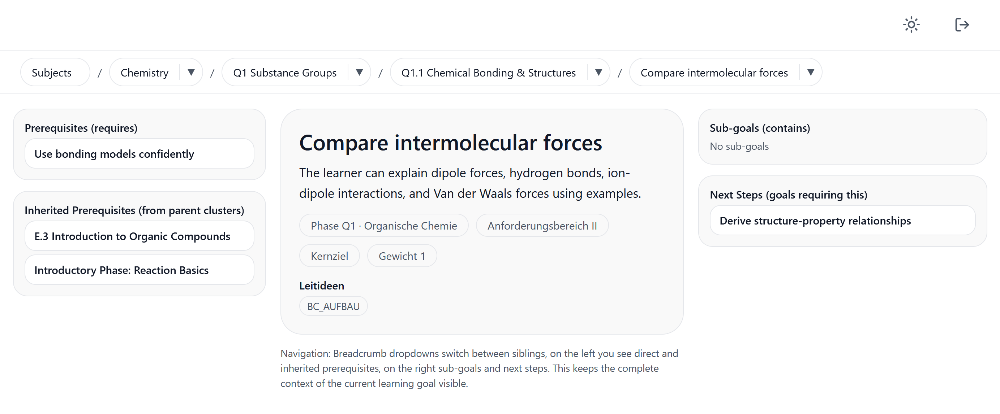

#### Plugging into Existing Curricula (Raw Input & Traceability)

SkillPilot does not "invent" curricula: curricula, module handbooks, or standards serve as **raw input** and are translated into a skill graph.

The integrity of the graph is ensured by a formal mathematical specification (Acyclicity, Effective Requires, Transitive Minimality), which prevents circular references and logically validates dependencies.

This is about:

- **Operationalization:** learning outcomes are broken down into atomic skill goals (without changing the standard).
- **Traceability:** each skill remains traceable to source/section/version.
- **Navigability:** prerequisites and hierarchies are modeled explicitly so paths are plannable (didactic prereqs possibly as **overlay**). The **overall graph** does not enforce a single teaching path; it allows multiple didactically meaningful routes. Inside a **selected scope** or an **explicitly modeled target route**, SkillPilot then deliberately narrows the next steps to the relevant subset. In **Optimistic Mode**, prerequisites are checked only **inside the selected filter** (e.g., grade level), so learners can start directly in the selected year without being blocked by gaps from earlier years. If learners struggle, the learning coach switches to diagnostic **Pessimistic Mode** to find the missing foundation.
- **Governance:** changes currently run via GitHub (Issues/PRs), with versioning through GitHub history (see section 6).

#### Map: Nodes & Edges

- **Nodes:** atomic skills ("can explain/apply X") and clusters (topics/modules).
- **Edges:**
  - **Prerequisites:** "A before B"
  - **Contains/Part-of:** "X includes Y and Z"

#### Three Learning Modes / Node Types in Practice

SkillPilot distinguishes three **node types** that reflect different learning modes:

- **Understanding:** Subject topics are explained and practiced with the AI learning coach.
- **Memorization:** Individual facts are memorized in a targeted way (modern flashcard principle).
- **Independent problem solving:** Final-exam tasks are solved independently (e.g., on paper, photographed, and uploaded), immediately graded (points, pass/fail, errors), and then explained.

These three types describe **learning modes**. The didactic route described in section 3.3 is a separate layer: it arranges steps such as motivation, understanding, memorization, and application along a path. **Motivation** is therefore a didactic phase; when modeled explicitly in a curriculum, it appears as a route node, not as a fourth base type.

In **mathematics** within the Gymnasium landscapes, **all three node types** are used.

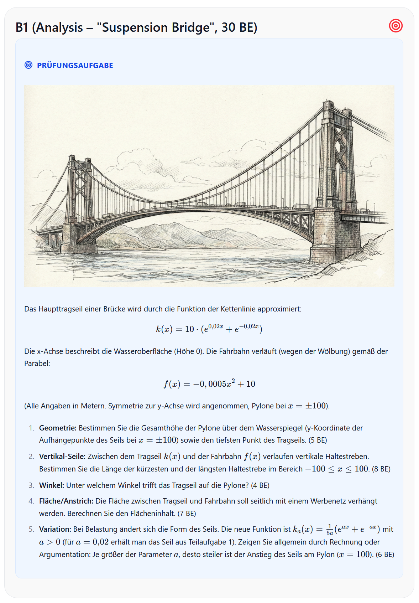

**Formal specification:** The mathematical definition of the graph (e.g., acyclicity, Effective Requires) is publicly documented:
[Graph definition](https://enpasos.github.io/skillpilot/concept/curriculum-graph/graph-definition/)

#### Frontier: Next Reachable Steps

SkillPilot computes the **frontier** relative to the **active scope or filter**: skills whose prerequisites are met inside that active graph slice but are not yet mastered.
This avoids jumps and keeps learning in the zone of sensible next steps. We call this boundary of current knowledge the **Frontier** (didactically: Zone of Proximal Development according to Vygotsky). It marks exactly the skills that are learnable next **within the current filter**.
The **frontier is not an AI recommendation**, but the mathematically computed set of logically unlocked learning goals in the active graph slice. For diagnosis, the scope can be widened deliberately (e.g., in **Pessimistic Mode**).

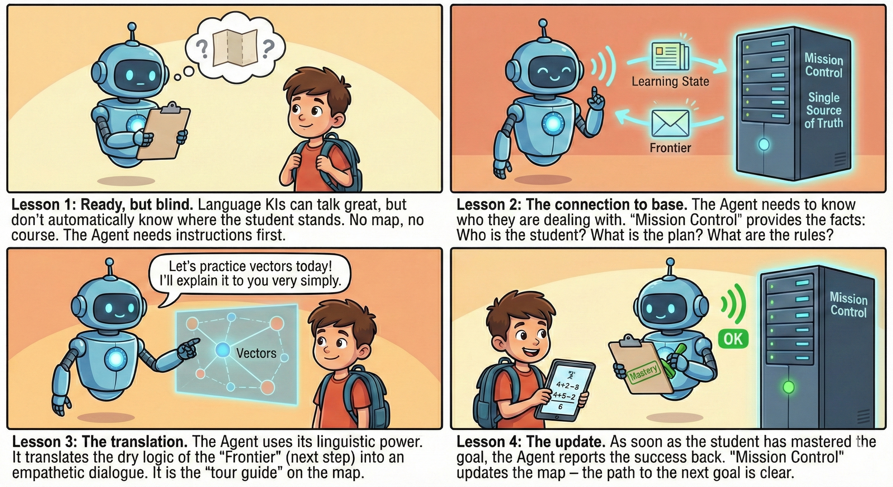

### 3.2 The Interaction Layer: The AI learning coach

The skill graph provides the route, but learners do not interact with datasets; they need a guide. This role is taken by the **AI learning coach** (SkillPilot GPT). It serves as an intuitive interface that translates the abstract instructions of the graph into natural, motivating language.

The learning coach is not a "black box" but acts strictly based on backend logic: it receives the active scope, frontier, next goal, and allowed transitions from the backend, and turns them into a didactically meaningful dialogue. This turns "exact bookkeeping" into a personal learning experience.

#### Focus Instead of Distraction

The **frontier** calculated in chapter 3.1 for the **active scope** serves as a **focus filter** for the learning coach: from the full set, only content that fits the goal and current state is shown - the **next feasible step** instead of "everything at once".

#### Mastery: Progress as an Evidence Model

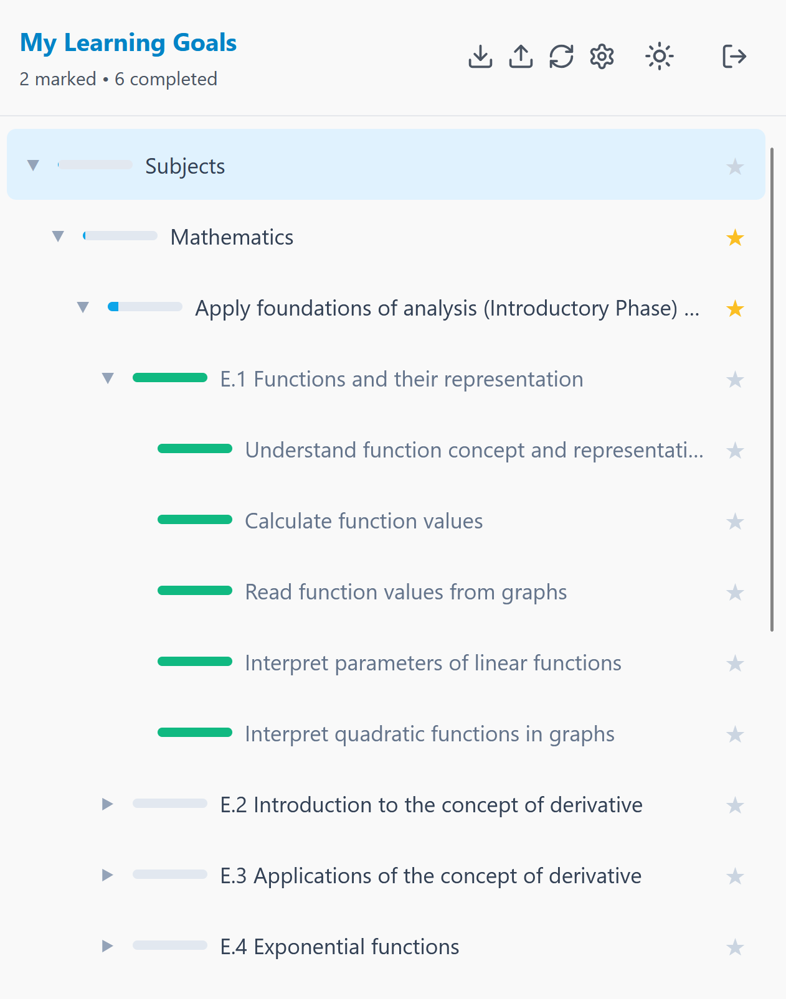

**Mastery** is not a logbook but a derived status from learning interactions. For interoperability, a simple evidence model helps:

- **Formative:** learning-coach dialogs, in-chat tasks, quick checks.
- **Optional stronger:** quizzes, task series, artifacts (solution steps/code/short text), oral checks.
- **Optional review:** skills can later require a re-check.

In the current system, this evidence remains separated from the central state: the SkillPilot server primarily stores the derived status. Stronger evidence can be added institutionally via extra artifacts or references.

> SkillPilot makes progress visible - the institution decides which evidence has which consequences.

#### Learning Velocity

Learning velocity shows how many **atomic goals** are newly mastered per week - a simple indicator of rhythm and continuity.

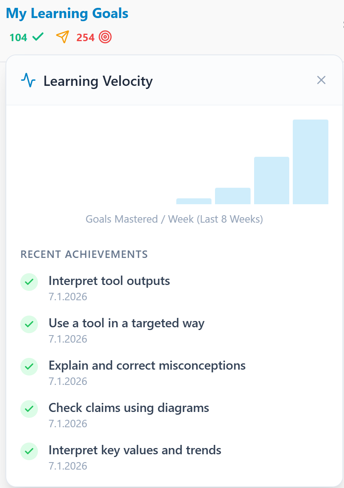

### 3.3 The Hybrid Learning Loop: Understanding + Memorizing + Practice

Not every learning goal is learned the same way: concepts need understanding and application, facts need repetition, and many skills require **active doing** (e.g., programming, calculating, writing). In assessments, this kind of independent problem solving is exactly what counts.

**The Path to Exam Readiness ("Get me ready for finals")**
In practice, students rarely learn isolated topics. They usually pursue an overarching end goal. The typical approach is to define a fixed context - for example, "Advanced Physics Course, Hesse, Final Exam Preparation."
As soon as this context is defined in SkillPilot, the system bundles all relevant learning routes from the full landscape that lead to the required exam competencies. Learners are then guided by the learning coach systematically along these routes.
This target route is therefore a selection **inside the larger graph**, not the graph's only possible path.

**The System of Learning Paths (The didactic route)**
Within this curriculum, the path is not left to chance. Each individual topic route follows a clear didactic structure. The final goal of each route is always the ability to independently solve complex tasks and solutions. All prior goals systematically build up the capabilities required for that.

A typical route consistently goes through the following phases:
1. **Motivation ("Why are we learning this?")**: Each route starts with framing why the topic is relevant at all.
2. **Understanding (Guided Learning):** In Socratic dialogue with the AI learning coach, the new concept is introduced with guidance and understanding is built step by step.
3. **Memorization (Drill):** In parallel with understanding, required facts and formulas are reinforced through the integrated flashcard system.
4. **Application (Mastery):** At the end of the route, learners independently solve complex exam-level problems (e.g., photographed handwritten steps), while the learning coach only evaluates and provides feedback.

These four phases describe **didactic roles along a route**. They do not replace the three learning modes introduced above; they arrange those modes, together with optional motivation nodes, into a learnable sequence.

Short form of the route:
**Understand why this is relevant for me** -> **build understanding through guided familiarization** -> **memorize in parallel** -> **independently develop solutions**.

Here is one example for motivation/understanding/application, as visualized in SkillPilot and exportable as PDF.

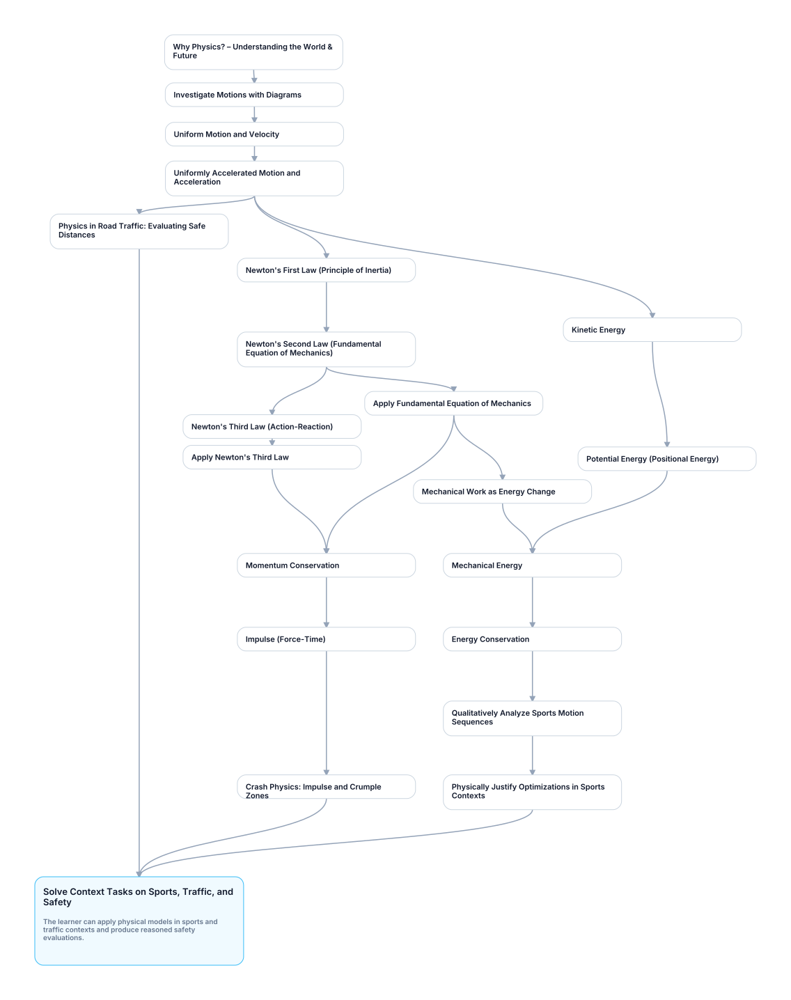

While learning coach interaction is valuable for understanding and for evaluating/explaining exam solutions, pure memorization (vocabulary, formulas, facts) is more efficient with **spaced repetition**.

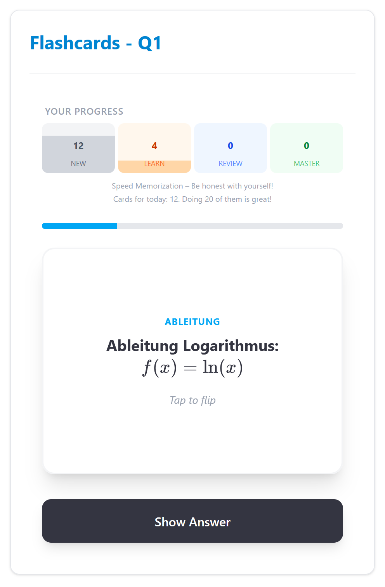

SkillPilot integrates a **flashcard drill engine** (SRS):

- **Competence loop:** the skill graph defines *what* comes next.
- **Memorization loop:** the drill engine optimizes *how* to repeat (intervals, prioritization; e.g., SuperMemo-2).

In addition, other learning modes are needed for "doing" skills. **In later stages**, the learning coach should send learners into suitable **practice formats** (e.g., problem sets, programming tasks, writing/speaking exercises) and then guide them back in chat for evaluation, feedback, and transfer.

#### Technical Implications: Target Route in Backend, UI, and learning coach

- **Backend (didactic route logic):** The target route is not a free AI computation. It is a **modeled sub-route inside the larger graph** under DAG constraints. This means human curriculum authors (champions) retain full pedagogical control. The AI is not allowed to leave the **selected route** on its own as long as scope and mode stay unchanged; a scope change or a diagnostic escalation into **Pessimistic Mode** are explicit system transitions. In route-oriented curricula, the upstream steps (motivation, understanding, memorization, application) can be modeled as explicit `requires` nodes or tightly guided route segments.
- **UI/UX (route visualization):** Learners select their target context (e.g., advanced physics) and a long-term goal. The interface fades irrelevant areas and clearly highlights the didactic route toward the goal.
- **AI learning coach (didactic context):** The learning coach operates strictly on this selected route and active mode and explains transparently why the current step is the logical next stop on the way to exam readiness.

---

## 4. Trust Architecture: Security & Integrity

### 4.1 Data Approach: Security & Privacy by Design

A central pillar of SkillPilot is **data separation**.

#### Pseudonym Instead of Identity

The **SkillPilot server** knows learners only as a pseudonym (`skillpilotId`).
On the server, only technically necessary metadata are stored, e.g., learning progress in the graph.

#### Session Shielding Toward the AI Frontend

When **SkillPilot GPT** is started, the permanent SkillPilot ID is no longer passed to ChatGPT. The browser asks the SkillPilot backend for a short-lived, one-time **start code**. After redeeming it, the learning coach works only with a temporary **chat session token**.

The mapping `chatSessionToken -> skillpilotId` happens exclusively in the SkillPilot backend; the active SkillPilot ID stays in the browser and in the backend. This means the AI frontend can no longer associate learning-coach dialogs and tool results with the permanent SkillPilot ID. It still receives the didactically required state for the current session, but not the learner's stable key.

#### Dialog Content Is Decoupled

The dialog content (learning-coach conversations) is decoupled from the SkillPilot server, keeping the central data store minimal.

**Recommendation for educational institutions:**
Clear guidelines on which data should not be shared in learning-coach chats (sensitive personal data) and how learners are supported safely.

#### Mapping Inside the Institution (Local)

The mapping "who is which pseudonym?" stays with the institution/teacher and is stored **locally** (e.g., in protected storage) - not centrally.

#### AI Frontend / Provider Choice (Sovereignty)

The learning coach dialog happens in the respective AI frontend (currently: ChatGPT as the reference integration) and is subject to its operational and privacy framework.
For contexts with higher sovereignty requirements, alternative AI backends up to local models are planned. They must reliably meet the required properties (tool use, stability, structure, didactics).

### 4.2 Chain of Custody: Integrity & Traceability

To keep learning states **portable** and **verifiable**, SkillPilot uses a **chain-of-custody** pattern.

- Learning-coach instances authenticate to the backend.
- Write access for progress updates is granted only to **authorized actors** (current pattern: the learning coach as the writing actor through a temporary chat session token).
- The permanent SkillPilot ID is not returned in AI session responses; existing response fields are blanked or set to `null` there.

#### Signed Exports

Learners can export profile + progress.
The server **cryptographically signs** these exports so offline manipulation is detectable. Today, the export primarily signs state data (mastery/status), scope information, timestamps, and provenance/integrity metadata. It is therefore **not a substitute** for a full archive of all underlying dialogs or artifacts.

#### Data Provenance on Import

On import (e.g., transfer, backup), the full **provenance chain** can be carried along. This makes it visible whether a state was continued or taken from elsewhere.

**Important:** Chain of custody protects integrity and provenance - it is a **transparency tool**, not a complete fraud-prevention system.

---

## 5. The Ecosystem: Content & Standards

### 5.1 Status Quo: Available Content (Examples)

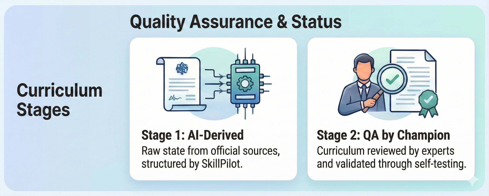

SkillPilot is not just a concept: it already contains curricula/standards as starting points. The key is the **quality stage**:

1. **Stage 1 – AI-derived draft**
   Learning goals in SkillPilot are derived from publicly accessible, official curricula/regulations. We cite the sources; SkillPilot provides its own structuring and summary – not official wording.
   Outcome: The curriculum exists and is visible in the UI.
2. **Stage 2 – QA by Curriculum Champion**
   A Curriculum Champion has worked through an **explicitly named scope** inside SkillPilot, cleaned errors in the curriculum and in SkillPilot, and awarded a **QA checkmark**. That scope can be an entire subject, a module, or a clearly bounded topic area. A curriculum can collect multiple QA checkmarks.

**Current status:** The earlier, narrower scope **Mathematics in Upper Secondary School Hesse (G9, Secondary II)** had already reached **Stage 2**. With the canonical expansion to the broader scope **Gymnasium Mathematics (nationwide, Secondary I + II)**, the object under review became much wider: first from Hesse to all 16 federal states, and second from upper secondary only to the full Gymnasium years. For this broadened scope, the certificate is currently **not yet** reached; until practice coverage catches up, it should be read as **Stage 1** again. The champion profile shown below therefore illustrates progress and engagement, not automatically a Stage-2 release for the full current scope. The current status is visible in the [Curriculum Directory](https://skillpilot.com/curricula).
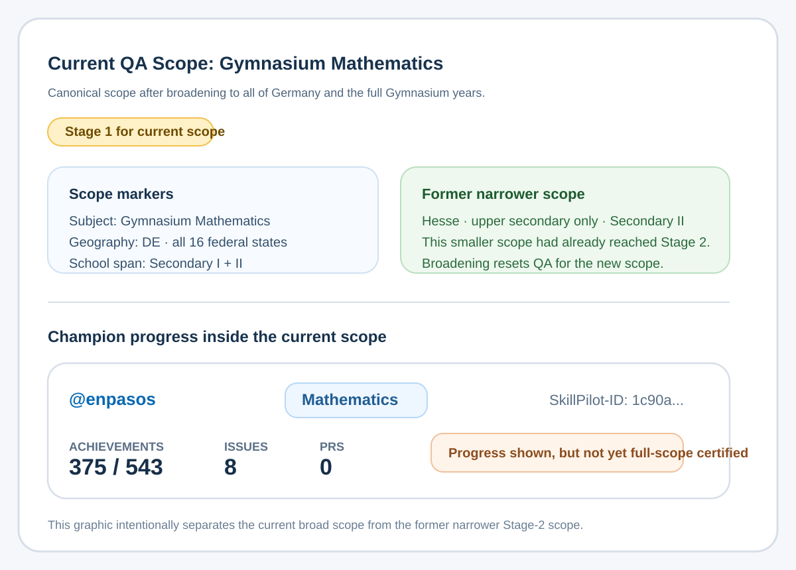

**Curriculum Champions (practice anchor):**

- Champions take responsibility for a curriculum or a **clearly scoped topic area**.
- They work through the curriculum, gather practice feedback, and channel it into Issues/PRs.
- Visibility creates accountability: Champion profiles show engagement (e.g., Issues/PRs) and progress.

The QA process does not only cover curricula: the SkillPilot AI learning coach is continuously qualified in real-world use so that the experience remains reliable and didactically sound across curricula.

#### Schools (Bavaria & Hesse, Germany)
**Bavaria:**
- Grundschule (Primary School, complete: Grades 1–4)
- Mittelschule (Middle School, complete: Grades 5–10)
- Realschule (Secondary School, complete: Grades 5–10)
- Gymnasium (Academic High School, complete: Grades 5–13)
- Fachoberschule & Berufsoberschule (Vocational High School)
- Wirtschaftsschule (Business School)

**Hesse:**
- Gymnasiale Oberstufe (G9, Secondary II)
- Gymnasiale Mittelstufe (G9, Secondary I)

#### Higher Education (Bologna-relevant)
- Uni Heidelberg: Bachelor Biosciences, Master Molecular BioSciences, Physikum (Medicine)
- Uni Mannheim: Bachelor Business Administration (BWL), Bachelor Law, Master Law
- TU Darmstadt: Bachelor Computer Science
- TU Munich: Bachelor Computer Science (Informatics), Bachelor Mathematics, Bachelor Physics, Master Quantum Science and Technology, Master Theoretical and Mathematical Physics, Executive Master of Business Administration (MBA)

#### Languages (CEFR A1-C2)
- English (A1-C2)
- French (A1-C2)

The listed curricula should therefore first be read as **available content**, not automatically as **Stage-2-certified**. Whether a scope has reached **Stage 2** must always be read for the exact displayed scope in the [Curriculum Directory](https://skillpilot.com/curricula). The process to move a scope into **Stage 2** runs via the **Curriculum Champion process**.

> [!IMPORTANT]
> We invite you to actively shape this process: **[Become a Curriculum Champion](https://skillpilot.com/curricula)** and help ensure the quality and practical relevance of your subject area.

The content is extensible and versioned; source references are documented, and changes currently flow through GitHub (Issues/PRs).

### 5.2 SkillPilot in the Bologna/EHEA Context (Short Overview)

Bologna/EHEA sets the framework for **outcomes, transparency, recognition, and quality** in higher education. SkillPilot can support these goals, but it does not replace institutional decisions.

- **Learning outcomes / competencies:** Contribution: Make outcomes navigable as a skill graph; progress visible. Limit/prerequisite: Clean modeling, source references, versioning.
- **Credits/workload (ECTS logic):** Contribution: Support paths/prereqs and workload transparency. Limit/prerequisite: **No credit awarding**; rules remain institutional.
- **Recognition/mobility:** Contribution: Evidence + signed exports as preparation/support. As described in Chapter 4.2, signed exports primarily secure state data and provenance; stronger recognition processes may require additional institutional evidence. Limit/prerequisite: Recognition remains a formal process.
- **Quality assurance:** Contribution: Signals about hurdles/paths for curriculum development. Limit/prerequisite: QA processes + transparent AI rules required.

---

## 6. Governance & Community: Open Source & Invitation

SkillPilot is released as **open source** under the **Apache-2.0 license** - an invitation to include established stakeholders rather than displace them:

- Institutions retain **sovereignty** over curricula and content.
- Coupling content to skill goals is **in the roadmap**.
- Open interfaces enable contributions and integration.

**Governance & quality assurance (currently via GitHub + Champion program):**
- Feedback flows through **GitHub Issues**, often initiated by champions.
- Changes to the curriculum/graph run through **pull requests** (review on GitHub).
- **Versioning** follows GitHub history; **curriculum sources** are referenced.
- More advanced governance mechanisms (e.g., expert review boards, QA processes, overlays) are possible in the future.

**Initiator:**
The legal entity behind SkillPilot is **enpasos GmbH**. We invite partners to develop SkillPilot further together - in content, didactics, and technology.

Start your pilot immediately and without registration **(ID-based)**: A guide for the 5-minute start can be found in the [Quickstart](https://skillpilot.com/quickstart/en).
Note: Your **ID is the only key** to your data - store it safely.

**More transparency:**
[GitHub](https://github.com/enpasos/skillpilot)
[Documentation](https://enpasos.github.io/skillpilot/)
[Graph definition](https://enpasos.github.io/skillpilot/concept/curriculum-graph/graph-definition/)

---
